# GraphGPT — LLM Service
## High-Level Design (HLD) — Agentic AI Orchestrator
### Version 1.0 | Classification: Internal Engineering | Author: Principal Staff Engineer

---

> **Document Purpose**
> This document describes the production-grade High-Level Design of the LLM Service — the AI orchestration backbone of GraphGPT. It is intended for engineering leads, system architects, and senior engineers involved in designing, building, reviewing, or operating this service. It follows the architectural review format used by Staff/Principal Engineers at large-scale distributed systems organizations.

---

## Table of Contents

1. [Service Overview](#1-service-overview)
2. [Responsibilities](#2-responsibilities)
3. [Non-Responsibilities](#3-non-responsibilities)
4. [High-Level Architecture](#4-high-level-architecture)
5. [Complete Request Flow](#5-complete-request-flow)
6. [Internal Architecture](#6-internal-architecture)
7. [Component Responsibilities](#7-component-responsibilities)
8. [Agentic Workflow](#8-agentic-workflow)
9. [Context Collector](#9-context-collector)
10. [Request Analyzer](#10-request-analyzer)
11. [Tool Dispatcher](#11-tool-dispatcher)
12. [Prompt Builder](#12-prompt-builder)
13. [Context Window Manager](#13-context-window-manager)
14. [Generation Router](#14-generation-router)
15. [Provider Adapters](#15-provider-adapters)
16. [Streaming Engine](#16-streaming-engine)
17. [Retry Manager](#17-retry-manager)
18. [Circuit Breaker](#18-circuit-breaker)
19. [Observability](#19-observability)
20. [Prompt Management](#20-prompt-management)
21. [Communication with Other Services](#21-communication-with-other-services)
22. [gRPC APIs](#22-grpc-apis)
23. [Kafka Topics](#23-kafka-topics)
24. [External APIs](#24-external-apis)
25. [Technology Stack](#25-technology-stack)
26. [Scalability](#26-scalability)
27. [High Availability](#27-high-availability)
28. [Failure Handling](#28-failure-handling)
29. [Security](#29-security)
30. [Future Extensibility](#30-future-extensibility)
31. [Design Patterns](#31-design-patterns)
32. [Folder Structure](#32-folder-structure)
33. [Deployment Architecture](#33-deployment-architecture)
34. [Sequence Diagrams](#34-sequence-diagrams)
35. [Architecture Diagrams](#35-architecture-diagrams)

---

## 1. Service Overview

### What It Is

The **LLM Service** is the Agentic AI Orchestrator of GraphGPT — the cognitive core of the platform. It is responsible for understanding what the user wants, deciding how to fulfill the request using the best available tools and context, constructing an optimized prompt, routing the request to the best-fit language model, and streaming back an intelligent response.

This service is NOT a thin wrapper around an LLM API. It is a full-featured AI execution engine that embodies **planning, tool use, context assembly, and multi-provider routing** — designed to support 100M+ users with sub-second response initiation latency.

### Why It Exists

Modern LLM applications are complex multi-step pipelines. A naive approach of forwarding user messages directly to OpenAI or Claude fails at production scale because:

- Raw LLM responses lack context-awareness without memory and graph integration
- Single-provider dependency creates reliability and cost risks
- Prompt engineering is non-trivial and differs per use case / mode
- Agentic behaviors (planning, tool use, multi-step reasoning) require orchestration infrastructure
- Token budget management is critical for cost control at scale
- Streaming must be coordinated between the LLM provider and downstream consumers

The LLM Service solves all of these problems by providing a **centralized, reusable, observable, and extensible AI orchestration layer** that every conversational flow in GraphGPT flows through.

### Position in the GraphGPT Architecture

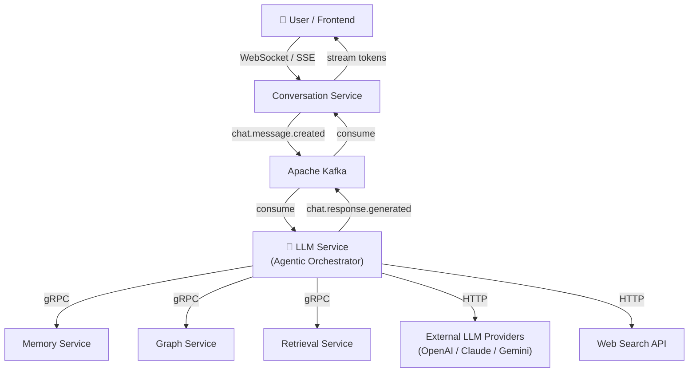

### Key Design Principles

| Principle | Application |
|---|---|
| **Single Responsibility** | LLM Service only orchestrates — it does not persist, summarize, or store |
| **Stateless Processing** | Every request is self-contained; no local state between requests |
| **Context-First Planning** | Context is always collected before analysis — planner sees full context before deciding |
| **Unified Request Analysis** | A single Groq call performs intent classification, mode validation, skill selection, and execution planning |
| **Exactly 2 LLM Calls** | Groq for Request Analysis; NVIDIA NIM for Response Generation; Gemini as fallback |
| **Always-Fetch Context** | Memory + Graph + Retrieval are fetched on every request via `asyncio.gather()` |
| **Async-First** | All I/O is async (asyncio + aiogrpc + aiokafka) |
| **Observability by Default** | Every operation is traced, metered, and logged |
| **Failure Isolation** | Tool failures are isolated and gracefully degraded |
| **Horizontally Scalable** | Stateless design enables arbitrary horizontal scaling |

---

## 2. Responsibilities

The LLM Service owns the following responsibilities exclusively:

### 2.1 Request Ingestion
- Consume `chat.message.created` events from Kafka
- Deserialize and validate message payloads using Pydantic models
- Correlate requests with trace IDs for distributed tracing

### 2.2 Context Collection (Always First)
- **Always** fetch from all three sources on every request — no mode-gating
- Fetch short-term memory and long-term facts from Memory Service (gRPC)
- Fetch entity nodes and relationships from Graph Service (gRPC)
- Fetch relevant document chunks from Retrieval Service (gRPC)
- All three calls execute in parallel using `asyncio.gather()` for sub-100ms collection
- Context services themselves determine relevance and scope of returned data

### 2.3 Request Analysis (Groq — Call 1 of 2)
- A single Groq LLM call receives the full context bundle and user message
- Performs all of the following in one inference:
  - **Intent Classification**: categorize the user's goal
  - **Mode Validation**: confirm or override the user-selected mode
  - **Skill Selection**: map intent to an internal execution skill
  - **Tool Selection**: determine which tools to invoke and in what order
  - **Reasoning Strategy**: decide DIRECT, CoT, or ReAct
  - **Execution Plan Generation**: produce a structured `ExecutionPlan` JSON
- Replaces the old multi-step Intent Analyzer + Mode Manager + Skill Manager + Planner pipeline

### 2.4 Tool Execution
- Execute only the tools declared in the Execution Plan returned by Request Analyzer
- Dispatch to registered tools via Tool Dispatcher
- Collect tool outputs and aggregate results
- Handle tool failures gracefully (non-fatal unless tool is `required=true`)

### 2.5 Prompt Construction
- Assemble the final prompt using context bundle + tool results
- Apply skill-specific prompt templates from Prompt Registry
- Inject retrieved context, graph nodes, memory facts, and tool results
- Ensure prompt fits within token budget using tiktoken

### 2.6 Token Management
- Count tokens using tiktoken with per-provider multipliers
- Prioritize and trim prompt sections based on importance
- Enforce per-provider token limits with 5% safety margin

### 2.7 Provider Routing
- Route request to correct provider via Generation Router:
  - **Groq**: Request Analysis (Call 1)
  - **NVIDIA NIM**: Final Response Generation (Call 2)
  - **Gemini**: Fallback when NVIDIA is unavailable
- Maintain per-provider circuit breakers and health probes

### 2.8 Response Generation (NVIDIA NIM — Call 2 of 2)
- Invoke NVIDIA NIM adapter for response generation
- Support streaming mode (token-by-token)
- Handle provider-specific request/response formats via Provider Adapters

### 2.9 Response Streaming
- Stream tokens from NVIDIA NIM to Conversation Service
- Publish `chat.response.chunk` tokens to Kafka sequentially

### 2.10 Event Publishing (Publish Node)
- Publish the final `chat.response.generated` event to Kafka upon stream completion
- Publish the `memory.update.requested` trigger to trigger user memory background updates

### 2.11 Retry and Failover
- Retry failed requests using exponential backoff
- Fail over to alternative providers when primary provider is unavailable
- Apply circuit breakers per provider to prevent cascade failures

### 2.12 Observability
- Emit Prometheus metrics: token counts, latency, cost, error rates
- Emit OpenTelemetry traces for every request
- Emit structured logs using Structlog

---

## 3. Non-Responsibilities

The following concerns are **explicitly out of scope** for the LLM Service. Violating this boundary would introduce tight coupling and undermine the service's stateless, scalable design.

| Concern | Owned By |
|---|---|
| Conversation storage | Conversation Service |
| Short-term memory storage | Memory Service |
| Summary generation | Memory Service |
| Long-term fact extraction | Memory Service |
| Embedding generation | Memory Service / Embedding Service |
| Vector similarity search | Retrieval Service |
| Knowledge graph storage | Graph Service |
| File storage / parsing | File Service |
| User authentication | Auth Service |
| Search indexing | Search Service |
| Analytics aggregation | Analytics Service |
| Push notifications | Notification Service |

### Why This Boundary Matters

Tight coupling between AI orchestration and data persistence is a common anti-pattern in LLM applications. By enforcing strict service boundaries:

- Memory Service can evolve its storage strategy independently (e.g., switching from Redis to a custom memory store)
- Graph Service can evolve its graph model independently
- LLM Service can be scaled to thousands of replicas without worrying about data consistency
- Testing becomes trivial — mock gRPC stubs replace all data dependencies

---

## 4. High-Level Architecture

### Overview

The LLM Service follows a **context-first, single-analysis pipeline** architecture. Every request passes through exactly the same stages in the same order. Context is collected unconditionally before any analysis occurs, and exactly **two LLM calls** are made per request: one to **Groq** (Request Analysis + Planning) and one to **NVIDIA NIM** (Response Generation). The Generation Router replaces the old Generation Router gateway with purpose-built adapters.

### Architecture Diagram

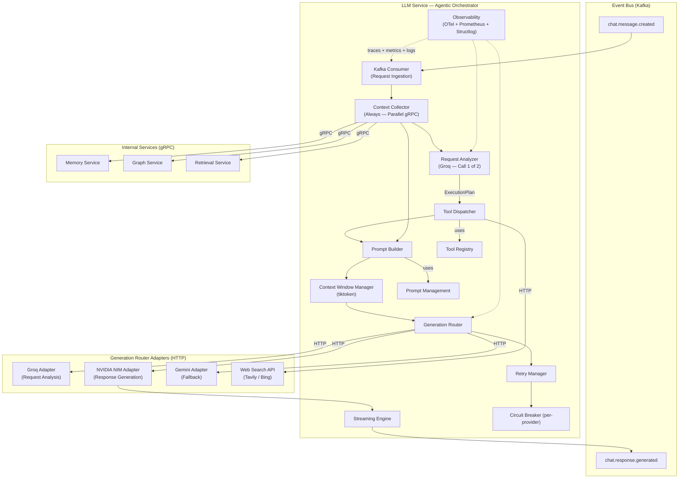

---

## 5. Complete Request Flow

### Narrative Description

This section describes the complete end-to-end lifecycle of a single user message. The architecture is **context-first**: Memory, Graph, and Retrieval are collected before any analysis occurs. Exactly two LLM calls are made per request.

### Step-by-Step Flow

```
Step 1:  User sends message via WebSocket/SSE to Conversation Service
Step 2:  Conversation Service persists the message and publishes chat.message.created to Kafka
Step 3:  LLM Service Kafka Consumer receives the event

Step 4:  Context Collector executes parallel gRPC calls (asyncio.gather):
         ├── Memory Service  → short-term messages + long-term facts
         ├── Graph Service   → entity nodes + relationships
         └── Retrieval Service → document chunks (knowledge base or uploaded files)
         (All three always fetched; services decide relevance internally)

Step 5:  Request Analyzer receives: [user_message + full context bundle]
         Single Groq LLM call performs ALL of the following:
         ├── Intent Classification
         ├── Mode Validation
         ├── Skill Selection
         ├── Tool Selection
         ├── Reasoning Strategy
         └── ExecutionPlan JSON generation
         (This is Call 1 of 2)

Step 6:  Tool Dispatcher executes only the tools declared in the ExecutionPlan
         (e.g., Web Search for Deep Research mode; none for Default mode)

Step 7:  Prompt Builder assembles the final prompt:
         system + memory + graph + retrieval + tool results + conversation history + user query

Step 8:  Context Window Manager trims prompt to fit the NVIDIA NIM model's token budget

Step 9:  Generation Router routes to NVIDIA NIM Adapter for response generation (Call 2 of 2)
         Falls back to Gemini Adapter if NVIDIA circuit breaker is OPEN

Step 10: NVIDIA NIM streams response tokens
Step 11: Streaming Engine batches tokens into chunks and publishes to Kafka:
         ├── chat.response.chunk (per batch of 6 tokens)
         └── chat.response.generated (on completion)
Step 12: Conversation Service consumes chunk events and streams tokens to the user
Step 13: LLM Service publishes memory.update.requested to Kafka (async — no blocking)
Step 14: Memory Service asynchronously updates short-term memory and triggers summary pipeline
Step 15: Observability layer records metrics, traces, and logs throughout all steps
```

### Provider Routing Table (Frozen)

| Task | Provider | Call # |
|---|---|---|
| Request Analysis | Groq | 1 |
| Intent Classification | Groq | 1 (included) |
| Planning + Tool Selection | Groq | 1 (included) |
| Response Generation | NVIDIA NIM | 2 |
| Fallback (NVIDIA unavailable) | Gemini | 2 |

### Mode Context Table (Frozen)

All modes fetch all three context sources. Tool selection is determined by the Request Analyzer.

| Mode | Memory | Graph | Retrieval | Typical Tools | Reasoning |
|---|---|---|---|---|---|
| Default | ✅ | ✅ | ✅ | ❌ | Direct |
| Smart | ✅ | ✅ | ✅ | Dynamic | ReAct |
| Tutor | ✅ | ✅ | ✅ | ❌ | CoT |
| Web Search | ✅ | ✅ | ✅ | Web Search | Direct |
| Deep Research | ✅ | ✅ | ✅ | Web Search + Multi-step | ReAct |
| Code | ✅ | ✅ | ✅ | ❌ | CoT |
| Ask Files | ✅ | ✅ | ✅ | ❌ | Direct |

### End-to-End Latency Budget (Target)

| Stage | Target Latency |
|---|---|
| Kafka event ingestion | < 5ms |
| Context collection (parallel gRPC, always) | < 100ms |
| Request Analysis via Groq (Call 1) | < 150ms |
| Tool execution (if needed) | < 500ms |
| Prompt construction + token counting | < 20ms |
| Provider routing decision | < 2ms |
| NVIDIA NIM TTFT (Time to First Token) | < 400ms |
| First token published to Kafka | < 680ms total |

---

## 6. Internal Architecture

### Layered Component Map

The LLM Service is organized into five conceptual layers. **Context Collection precedes Analysis** — this is the defining architectural decision.

```
┌─────────────────────────────────────────────────────────────┐
│  INGESTION LAYER                                            │
│  Kafka Consumer · Request Validator · Trace Propagation    │
├─────────────────────────────────────────────────────────────┤
│  CONTEXT LAYER  (always executes first)                     │
│  Context Collector (asyncio.gather)                        │
│  Memory gRPC · Graph gRPC · Retrieval gRPC                 │
├─────────────────────────────────────────────────────────────┤
│  ANALYSIS LAYER  (Groq — Call 1 of 2)                       │
│  Request Analyzer · Intent · Mode · Skill · Plan           │
├─────────────────────────────────────────────────────────────┤
│  EXECUTION LAYER                                            │
│  Tool Dispatcher · Tool Registry                           │
│  Prompt Builder · Context Window Manager                   │
├─────────────────────────────────────────────────────────────┤
│  INFERENCE LAYER  (NVIDIA NIM — Call 2 of 2)                │
│  Generation Router · NVIDIA Adapter · Gemini Adapter         │
│  Groq Adapter · Streaming Engine                           │
│  Retry Manager · Circuit Breaker (per-provider)            │
├─────────────────────────────────────────────────────────────┤
│  CROSS-CUTTING CONCERNS                                     │
│  Observability · Prompt Management · Security Middleware   │
└─────────────────────────────────────────────────────────────┘
```

### LangGraph State Machine

All orchestration logic flows through a LangGraph state machine. The state object is passed through every node in the graph, accumulating data as execution progresses.

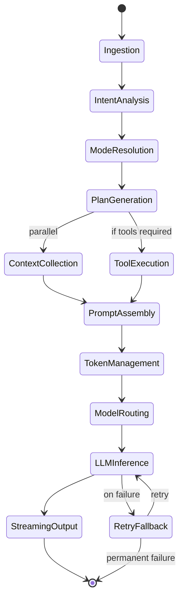

---

## 7. Component Responsibilities

### 7.1 Kafka Consumer (Request Ingestion)

**What it is:** An async Kafka consumer (using aiokafka) that subscribes to `chat.message.created` and transforms raw Kafka messages into typed internal request objects.

**Why it exists:** Decouples LLM Service from Conversation Service. Kafka acts as a buffer during traffic spikes, preventing the LLM Service from being overwhelmed by direct HTTP calls.

**Responsibilities:**
- Subscribe to `chat.message.created` topic with dedicated consumer group `llm-service-group`
- Deserialize JSON payloads into `ChatMessageCreatedEvent` Pydantic models
- Extract and propagate distributed trace headers (W3C TraceContext)
- Commit offsets only after successful processing (at-least-once delivery)
- Handle deserialization errors with dead-letter queue (DLQ) routing

**Data Flow:**
```
Kafka → aiokafka Consumer → Pydantic Validation → Internal Request Object → Intent Analyzer
```

**Trade-offs:**
- At-least-once delivery means idempotency must be handled at the processing layer
- Consumer group rebalancing introduces brief processing delays

### 7.2 Request Validator

**What it is:** A Pydantic-based validation layer that enforces schema contracts on incoming events.

**Why it exists:** Prevents malformed events from propagating through the pipeline and causing downstream failures.

**Responsibilities:**
- Validate required fields: `conversation_id`, `user_id`, `message_id`, `content`, `mode`, `timestamp`
- Validate content length limits
- Route invalid messages to the DLQ topic (`chat.message.dlq`)

---

## 8. Agentic Workflow

### What It Is

The Agentic Workflow is the core of the LLM Service — a LangGraph-powered directed execution graph that dynamically adapts based on user intent, selected mode, and available tools. Unlike a simple request-response pipeline, the agentic workflow supports **multi-step reasoning, conditional branching, tool invocation loops, and parallel execution**.

### Why It Exists

Simple LLM wrappers fail at complex tasks:
- A "Deep Research" query cannot be answered in a single LLM call
- A "Tutor" mode requires understanding the learner's history before generating pedagogically appropriate content
- A "Smart" mode must dynamically decide which tools are necessary

LangGraph provides a principled way to express these complex execution flows as a **state machine with typed nodes and conditional edges**, making the orchestration logic transparent, testable, and extensible.

### Agentic Loop (ReAct Pattern for Smart Mode)

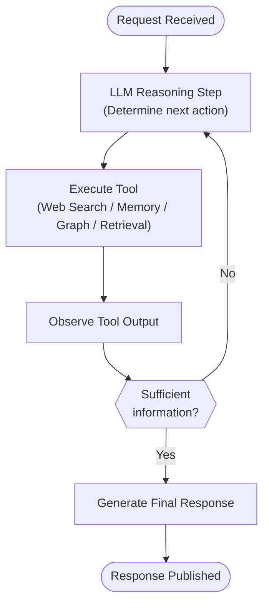

### State Object

The LangGraph state object that flows through all nodes:

```
AgentState:
  - conversation_id: str
  - user_id: str
  - message_id: str
  - user_message: str
  - intent: IntentClassification
  - mode: UserMode
  - skill: Skill
  - plan: ExecutionPlan
  - memory_context: MemoryContext
  - graph_context: GraphContext
  - retrieval_context: RetrievalContext
  - tool_results: List[ToolResult]
  - prompt: ComposedPrompt
  - token_count: int
  - selected_provider: ModelSelection
  - response_chunks: List[str]
  - trace_id: str
  - span_id: str
  - error: Optional[str]
```

### Graph Node Types

| Node Type | Description | Examples |
|---|---|---|
| **Analyzer** | Reads state, produces classification | IntentAnalyzer, ModeManager |
| **Planner** | Reads intent + mode, produces plan | Planner |
| **Fetcher** | Fetches external data, writes to state | ContextCollector, ToolDispatcher |
| **Builder** | Assembles prompt from state | PromptBuilder, ContextWindowManager |
| **Router** | Selects execution path | GenerationRouter |
| **Executor** | Calls LLM, writes response to state | Generation RouterGateway |
| **Publisher** | Publishes result to Kafka | StreamingEngine |

### Conditional Edges

LangGraph conditional edges enable dynamic routing:

```
After Planner:
  → If plan.requires_tools == True: route to ToolDispatcher
  → If plan.requires_tools == False: route directly to ContextCollector

After ContextCollector:
  → Always route to PromptBuilder

After LLMInference:
  → If response.finish_reason == "tool_calls": route back to ToolDispatcher (agentic loop)
  → If response.finish_reason == "stop": route to StreamingEngine
  → If error: route to RetryManager
```

---

## 9. Context Collector

### What It Is

The **Context Collector** is the entry point of the reasoning pipeline. To minimize latency, it is responsible for fetching all relevant context sources — **Memory**, **Graph**, and **Retrieval** — in parallel before any request analysis occurs.

### Architecture

- **Parallelism**: Uses Python's native `asyncio.gather()` to fetch context from Memory, Graph, and Retrieval services concurrently.
- **Graceful Degradation**: If any of the services (Memory, Graph, or Retrieval) are down or experience high latencies, the Context Collector captures the error, marks the context as *degraded*, and passes whatever context was successfully fetched downstream. The request is never aborted due to context retrieval failures.
- **Deduplication & Ranking**: Merges entity descriptions overlapping with document chunks and ranks them based on composite relevance scores.

---

## 10. Request Analyzer

### What It Is

The **Request Analyzer** is the primary planning and reasoning engine of the LLM Service, executing as **Call 1 of 2** in the lifecycle of a request. It replaces the old multi-step cascading analyzer pipeline with a single, highly optimized call to **Groq** (`llama-3.3-70b-versatile`).

### Responsibilities

- **Intent Classification**: Identifies the user's primary intent (e.g. coding, tutor, search).
- **Mode Validation**: Confirms the active user mode and overrides it if requirements are not met (e.g., reverting `ASK_FILES` to `DEFAULT` if no files are uploaded).
- **Skill Selection**: Maps the request to a specific prompt template and routing profile.
- **Tool Selection & Planning**: Produces a structured `ExecutionPlan` detailing which tools must be executed, in what order, and with what parameters.
- **Safe Default Fallback**: If the Groq API fails or is rate-limited, the Request Analyzer returns a static safe default plan (`reasoning = ReasoningMode.DIRECT`, `tools = []`, `provider = "nvidia"`) to ensure the request is still served.

---

## 11. Tool Dispatcher

### What It Is

The **Tool Dispatcher** is responsible for executing the actions planned by the Request Analyzer. It retrieves tools from the **Tool Registry** and manages their execution lifecycles.

### Architecture

- **Selective Execution**: Executes only the tools explicitly requested in the `ExecutionPlan`.
- **Parallel Dispatch**: Tools marked as parallel are executed concurrently using `asyncio.gather()`.
- **Isolation**: Tool failures are caught and returned as `ToolResult(success=False, error=...)` rather than crashing the pipeline.
- **MCP & Web Search Support**: Integrates external capabilities such as Tavily/Bing search and Model Context Protocol (MCP) dynamic proxies.

---

## 12. Prompt Builder

### What It Is

The **Prompt Builder** assembles the final prompt template for response generation. 

### Integration

It compiles and merges:
1. The static context bundle (Memory + Graph + Retrieval contexts) fetched by the Context Collector.
2. The dynamic tool results generated by the Tool Dispatcher.
3. The conversation history and the raw user message.

It then formats these sections according to the YAML templates defined in the Prompt Registry.

---

## 13. Context Window Manager

### What It Is

The **Context Window Manager** handles token accounting and window limits before the prompt is forwarded for response generation.

### Key Mechanisms

- **Token Budget Allocation**: Allocates specific context window percentages to prompt sections (e.g. system instructions, memory, retrieved documents, tool results).
- **Priority Trimmer**: If the prompt exceeds the model's context window, it trims sections in reverse-priority order (e.g. trimming search snippets before trimming short-term conversation history).
- **Tiktoken Counting**: Uses the `cl100k_base` encoding with provider-specific multipliers to estimate prompt token usage accurately and prevent context overflow errors.

---

## 14. Generation Router

### What It Is

The **Generation Router** is responsible for routing the final response generation request (**Call 2 of 2**) to the optimal inference target.

### Routing Table

| Task | Provider | Model |
|---|---|---|
| Request Analysis | Groq | `llama-3.3-70b-versatile` |
| Response Generation | NVIDIA NIM | `meta/llama-3.1-70b-instruct` |
| Fallback | Gemini | `gemini-1.5-pro` |

- **Outage Fallback**: If the primary NVIDIA NIM service is unreachable or its circuit breaker is open, the Generation Router transparently redirects the generation request to Google Gemini.

---

## 15. Provider Adapters

### What It Is

The **Provider Adapters** isolate the downstream APIs, replacing model gateways with lightweight client wrappers.

### Adapters

- **Groq Adapter**: Manages non-streaming requests with JSON-mode enforcement for Request Analysis.
- **NVIDIA NIM Adapter**: Connects using standard HTTP/2 keep-alive connection pooling for fast streaming token delivery.
- **Gemini Adapter**: Wraps the `google-genai` SDK for fallback execution.

---

## 16. Streaming Engine

### What It Is

The **Streaming Engine** receives the token stream from the Generation Router, groups tokens into chunks, and publishes events to Apache Kafka.

### Features

- **Chunk Sequence Number**: Each `chat.response.chunk` event contains a sequential `chunk_sequence_number` to guarantee ordered client-side reconstruction.
- **Adaptive Chunk Size**: Varies chunk sizes (e.g. 1 token for the first chunk to minimize TTFT, 6 tokens for subsequent chunks to balance Kafka throughput).
- **Response Compilation**: Accumulates chunks and returns the unified `full_response` string downstream.
- **Graceful Cancellation**: Closes connections and publishes `chat.response.cancelled` events if the client disconnects.

---

## 17. Retry Manager

### What It Is

The **Retry Manager** manages application-level retry policies for inference calls using tenacity. It applies exponential backoff with jitter and coordinates fallbacks with the Generation Router.

---

## 18. Circuit Breaker

### What It Is

The **Circuit Breaker** isolates inference endpoints per provider. If a provider exceeds the failure threshold (e.g. five consecutive rate-limit or timeout errors), the circuit opens, and the Generation Router immediately routes traffic to the fallback provider without hitting the failing API.

---

## 19. Observability

### What It Is

The Observability layer provides full visibility into the LLM Service through three pillars: **metrics** (Prometheus), **traces** (OpenTelemetry), and **structured logs** (Structlog).

### Why It Exists

LLM services have unique observability needs:
- Token cost must be tracked per request, user, and model
- Latency must be tracked at each pipeline stage
- Provider error rates must be monitored for circuit breaker tuning
- Agentic workflow steps must be traceable end-to-end

### Metrics (Prometheus)

```
# Request metrics
llm_requests_total{mode, skill, model, provider, status}
llm_request_duration_seconds{mode, skill, model, provider, quantile}

# Token metrics
llm_tokens_prompt_total{model, provider, mode}
llm_tokens_completion_total{model, provider, mode}
llm_tokens_total{model, provider, mode}

# Cost metrics
llm_cost_usd_total{model, provider, user_tier, mode}
llm_cost_per_request_usd{model, provider, user_tier, mode}

# Provider health
llm_provider_errors_total{provider, error_type}
llm_provider_circuit_breaker_state{provider}  # 0=closed, 1=half-open, 2=open

# Streaming metrics
llm_ttft_seconds{model, provider, mode}       # time to first token
llm_streaming_chunks_total{conversation_id}

# Tool metrics
llm_tool_calls_total{tool_name, status}
llm_tool_duration_seconds{tool_name, quantile}

# Context metrics
llm_context_tokens_by_section{section, mode}
llm_context_trimmed_total{section, reason}
```

### Traces (OpenTelemetry)

Every request generates a distributed trace that spans across services:

```
Trace: chat.message.created → chat.response.generated
  Span: kafka_consume
  Span: intent_analysis
  Span: mode_resolution
  Span: planning
  Span: context_collection
    Span: memory_grpc_call
    Span: graph_grpc_call
    Span: retrieval_grpc_call
  Span: tool_dispatch
    Span: web_search_http
  Span: prompt_building
  Span: token_counting
  Span: model_routing
  Span: llm_inference
    Span: http_request → openai
  Span: streaming_output
  Span: kafka_publish
```

All spans include:
- `conversation_id`, `message_id`, `user_id` as span attributes
- `model`, `provider`, `mode`, `skill` as span attributes
- Token counts and cost as span events

### Structured Logging (Structlog)

Every log line is structured JSON with consistent fields:

```json
{
  "timestamp": "2026-08-06T14:47:51.123Z",
  "level": "info",
  "service": "llm-service",
  "trace_id": "abc123",
  "span_id": "def456",
  "conversation_id": "conv_xyz",
  "user_id": "user_abc",
  "event": "llm_inference_complete",
  "model": "meta/llama-3.1-70b-instruct",
  "provider": "openai",
  "tokens_used": 1350,
  "latency_ms": 1240,
  "mode": "smart"
}
```

### Alerting Rules

| Alert | Condition | Severity |
|---|---|---|
| High error rate | `error_rate > 5%` for 2 min | Critical |
| Provider circuit open | `circuit_breaker_state == 2` | Warning |
| High TTFT | `p95(ttft) > 2s` | Warning |
| Cost spike | `cost_per_hour > threshold` | Warning |
| Consumer lag | `kafka_lag > 1000` | Critical |
| Tool failure surge | `tool_error_rate > 20%` | Warning |

---

## 20. Prompt Management

### What It Is

Prompt Management is the system for storing, versioning, and retrieving prompt templates used by the Prompt Builder. It treats prompts as first-class engineering artifacts — version-controlled, tested, and deployed independently from code.

### Why It Exists

Prompts are the primary interface between the LLM Service and the language model. Poorly managed prompts lead to:
- Inconsistent AI behavior across deployments
- Inability to A/B test prompt variations
- No audit trail for prompt changes
- Prompt regression with model updates

### Prompt Template Format

Prompts are stored as YAML files with LangChain Core compatible template syntax:

```yaml
# general_chat_v2.yaml
name: general_chat
version: "2.0"
skill: general_chat
variables:
  - user_name
  - long_term_facts
  - graph_context
  - conversation_history
  - user_query

system: |
  You are GraphGPT, an AI-native knowledge assistant.
  You have access to the user's knowledge graph and memory.
  
  User Profile:
  - Name: {user_name}
  - Key Facts: {long_term_facts}
  
  Knowledge Graph Context:
  {graph_context}
  
  Respond conversationally, accurately, and helpfully.

### Prompt Versioning and Deployment

Prompts are stored as files in a `prompts/` directory, version-controlled in Git. Deployment of new prompts follows the same CI/CD pipeline as code, enabling:
- Rollback of bad prompt changes
- A/B testing by assigning traffic splits to prompt versions
- Canary promotion of new prompt versions

### Prompt A/B Testing

The Prompt Management system supports A/B testing via a routing config:

```yaml
ab_test:
  name: general_chat_cot_experiment
  variants:
    - name: control
      prompt: general_chat_v2.yaml
      weight: 80
    - name: treatment
      prompt: general_chat_cot_v1.yaml
      weight: 20
  metric: user_satisfaction_score
  duration_days: 14
```

---

## 21. Communication with Other Services

### Overview

The LLM Service communicates with other services using a strict protocol hierarchy:
- **Kafka** for all asynchronous, event-driven communication
- **gRPC** for all synchronous, internal service-to-service calls
- **HTTP** for all external third-party API calls

This protocol discipline ensures that:
- Synchronous gRPC calls remain low-latency within the cluster
- Asynchronous Kafka events provide natural backpressure and decoupling
- External API dependencies are isolated behind the Generation Router and Tool Dispatcher

### Communication Matrix

| Direction | Source | Destination | Protocol | Purpose |
|---|---|---|---|---|
| Inbound | Conversation Service | LLM Service | Kafka | `chat.message.created` event |
| Outbound | LLM Service | Memory Service | gRPC | Fetch memory context |
| Outbound | LLM Service | Graph Service | gRPC | Fetch graph context |
| Outbound | LLM Service | Retrieval Service | gRPC | Fetch document chunks |
| Outbound | LLM Service | OpenAI | HTTP | LLM inference |
| Outbound | LLM Service | Anthropic | HTTP | LLM inference |
| Outbound | LLM Service | Google Gemini | HTTP | LLM inference |
| Outbound | LLM Service | Tavily | HTTP | Web search |
| Outbound | LLM Service | Conversation Service | Kafka | `chat.response.generated` event |
| Outbound | LLM Service | Memory Service | Kafka | `memory.update.requested` event |

### Service Communication Diagram

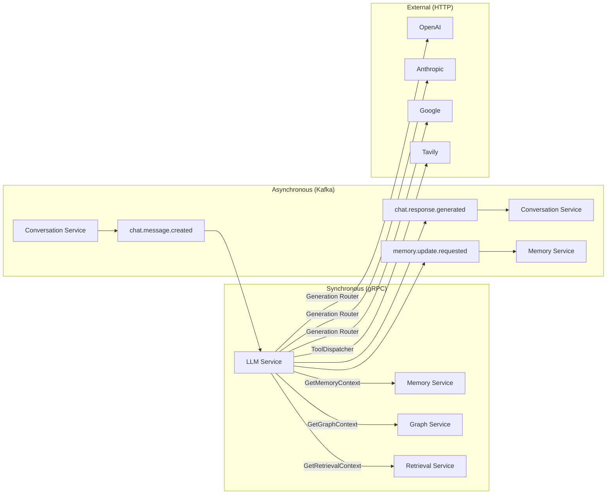

### gRPC Connection Management

All gRPC connections to internal services are managed through a connection pool:
- **Connection Pool Size:** 10–50 connections per service (configurable)
- **Keep-alive:** gRPC HTTP/2 keep-alive pings every 30s
- **Load Balancing:** Client-side round-robin across service pod IPs (via Kubernetes DNS)
- **TLS:** mTLS enforced for all internal gRPC connections (using Istio service mesh)
- **Deadlines:** All gRPC calls include a deadline (default: 2000ms)

---

## 22. gRPC APIs

### Overview

This section defines the gRPC service contracts that the LLM Service uses to communicate with internal services. These are **consumer-perspective** definitions — the LLM Service is the client for all of these APIs.

### 22.1 Memory Service gRPC API

```protobuf
service MemoryService {
  // Fetch all relevant memory context for a conversation
  rpc GetMemoryContext(GetMemoryContextRequest) returns (GetMemoryContextResponse);
  
  // Fetch only short-term conversation history (for Default mode)
  rpc GetShortTermMemory(GetShortTermMemoryRequest) returns (GetShortTermMemoryResponse);
}

message GetMemoryContextRequest {
  string conversation_id = 1;
  string user_id = 2;
  string query = 3;           // for semantic memory retrieval
  MemoryScope scope = 4;      // SHORT_TERM | MEDIUM | LONG_TERM | SEMANTIC | ALL
  int32 max_tokens = 5;       // token budget for memory section
  string trace_id = 6;
}

message MemoryScope {
  enum Value {
    SHORT_TERM = 0;
    MEDIUM = 1;
    LONG_TERM = 2;
    SEMANTIC = 3;
    ALL = 4;
  }
}

message GetMemoryContextResponse {
  repeated Message short_term_messages = 1;
  string medium_summary = 2;
  repeated Fact long_term_facts = 3;
  repeated SemanticSnippet semantic_snippets = 4;
  int32 total_tokens = 5;
  string request_id = 6;
}

message Message {
  string role = 1;            // "user" | "assistant"
  string content = 2;
  int64 timestamp = 3;
  string message_id = 4;
}

message Fact {
  string content = 1;
  float confidence = 2;
  string category = 3;
  int64 last_updated = 4;
}

message SemanticSnippet {
  string content = 1;
  float relevance_score = 2;
  string source_message_id = 3;
}
```

### 22.2 Graph Service gRPC API

```protobuf
service GraphService {
  // Fetch relevant graph context for a query
  rpc GetGraphContext(GetGraphContextRequest) returns (GetGraphContextResponse);
  
  // Fetch specific nodes by ID
  rpc GetNodesByIds(GetNodesByIdsRequest) returns (GetNodesByIdsResponse);
}

message GetGraphContextRequest {
  string user_id = 1;
  string conversation_id = 2;
  string query = 3;           // for semantic node retrieval
  int32 max_nodes = 4;        // limit on returned nodes
  int32 max_depth = 5;        // graph traversal depth
  int32 max_tokens = 6;       // token budget for graph section
  string trace_id = 7;
}

message GetGraphContextResponse {
  repeated GraphNode nodes = 1;
  repeated GraphRelationship relationships = 2;
  string subgraph_summary = 3;    // LLM-friendly text summary
  int32 total_tokens = 4;
  string request_id = 5;
}

message GraphNode {
  string node_id = 1;
  string label = 2;
  string node_type = 3;
  map<string, string> properties = 4;
  float relevance_score = 5;
}

message GraphRelationship {
  string from_node_id = 1;
  string to_node_id = 2;
  string relationship_type = 3;
  map<string, string> properties = 4;
}
```

### 22.3 Retrieval Service gRPC API

```protobuf
service RetrievalService {
  // Retrieve top-k relevant document chunks
  rpc GetRelevantChunks(GetRelevantChunksRequest) returns (GetRelevantChunksResponse);
}

message GetRelevantChunksRequest {
  string user_id = 1;
  string conversation_id = 2;
  string query = 3;
  int32 top_k = 4;
  RetrievalScope scope = 5;   // FILES | KNOWLEDGE_BASE | ALL
  repeated string file_ids = 6;   // for Ask Files mode
  float min_relevance_score = 7;
  int32 max_tokens = 8;
  string trace_id = 9;
}

message GetRelevantChunksResponse {
  repeated DocumentChunk chunks = 1;
  int32 total_tokens = 2;
  string request_id = 3;
}

message DocumentChunk {
  string chunk_id = 1;
  string content = 2;
  string source_file_id = 3;
  string source_name = 4;
  float relevance_score = 5;
  map<string, string> metadata = 6;
}
```

### 22.4 LLM Service Exposed gRPC API

The LLM Service also exposes its own gRPC API for potential future direct integrations (e.g., internal admin tools, health probes):

```protobuf
service LLMService {
  // Health check
  rpc HealthCheck(HealthCheckRequest) returns (HealthCheckResponse);
  
  // Get current provider health status
  rpc GetProviderHealth(ProviderHealthRequest) returns (ProviderHealthResponse);
  
  // Trigger a direct (non-Kafka) completion for internal tools (admin only)
  rpc DirectComplete(DirectCompleteRequest) returns (stream DirectCompleteResponse);
}
```

---

## 23. Kafka Topics

### Overview

The LLM Service participates in the following Kafka topics. Topic design follows the **event-first principle**: events are the source of truth for inter-service communication.

### 23.1 Consumed Topics

#### `chat.message.created`
- **Produced by:** Conversation Service
- **Consumed by:** LLM Service (consumer group: `llm-service-group`)
- **Partitioning Key:** `conversation_id`
- **Retention:** 7 days
- **Replication Factor:** 3
- **Partitions:** 64 (supports 64× parallel consumption)

**Schema:**
```json
{
  "event_type": "chat.message.created",
  "schema_version": "1.0",
  "message_id": "msg_abc123",
  "conversation_id": "conv_xyz789",
  "user_id": "user_def456",
  "content": "Explain quantum entanglement",
  "mode": "TUTOR",
  "model_preference": null,
  "file_ids": [],
  "metadata": {
    "client_timestamp": "2026-08-06T14:47:51Z",
    "client_version": "3.2.1"
  },
  "trace_context": {
    "traceparent": "00-abc123-def456-01",
    "tracestate": ""
  },
  "timestamp": "2026-08-06T14:47:51.234Z"
}
```

### 23.2 Produced Topics

#### `chat.response.chunk`
- **Produced by:** LLM Service
- **Consumed by:** Conversation Service
- **Purpose:** Streaming token delivery
- **Partitioning Key:** `conversation_id`

#### `chat.response.generated`
- **Produced by:** LLM Service
- **Consumed by:** Conversation Service, Memory Service, Analytics Service
- **Purpose:** Final response with full metadata for downstream processing
- **Partitioning Key:** `conversation_id`

**Schema:**
```json
{
  "event_type": "chat.response.generated",
  "schema_version": "1.0",
  "response_id": "resp_ghi789",
  "conversation_id": "conv_xyz789",
  "user_id": "user_def456",
  "request_message_id": "msg_abc123",
  "full_content": "Quantum entanglement is...",
  "model": "meta/llama-3.1-70b-instruct",
  "provider": "openai",
  "mode": "TUTOR",
  "skill": "TUTOR",
  "usage": {
    "prompt_tokens": 1200,
    "completion_tokens": 320,
    "total_tokens": 1520
  },
  "cost_usd": 0.0076,
  "latency_ms": 1840,
  "ttft_ms": 520,
  "finish_reason": "stop",
  "tools_used": ["memory", "graph"],
  "context_sources": ["short_term", "long_term", "graph"],
  "trace_context": {
    "traceparent": "00-abc123-def456-01"
  },
  "timestamp": "2026-08-06T14:47:53.074Z"
}
```

#### `memory.update.requested`
- **Produced by:** LLM Service
- **Consumed by:** Memory Service
- **Purpose:** Signal Memory Service to asynchronously update memory after a response
- **Partitioning Key:** `conversation_id`

**Schema:**
```json
{
  "event_type": "memory.update.requested",
  "conversation_id": "conv_xyz789",
  "user_id": "user_def456",
  "user_message": "Explain quantum entanglement",
  "assistant_response": "Quantum entanglement is...",
  "mode": "TUTOR",
  "timestamp": "2026-08-06T14:47:53.100Z"
}
```

#### `chat.message.dlq` (Dead Letter Queue)
- **Produced by:** LLM Service (on deserialization failures or permanent processing errors)
- **Consumed by:** Operations team / monitoring
- **Purpose:** Capture and alert on unprocessable messages

### 23.3 Kafka Configuration

| Parameter | Value | Rationale |
|---|---|---|
| `acks` | all | Strongest durability guarantee |
| `compression.type` | lz4 | Fast compression for high throughput |
| `max.message.bytes` | 2MB | LLM responses can be large |
| `retention.ms` | 7 days | Allow replay for debugging |
| `min.insync.replicas` | 2 | Tolerate one broker failure |
| Consumer `enable.auto.commit` | false | Manual commit for at-least-once |
| Consumer `max.poll.interval.ms` | 300000 | Allow 5 min for slow LLM calls |

---

## 24. External APIs

### Overview

The LLM Service interacts with the following external APIs. All external calls go through the Generation Router (for LLM providers) or Tool Dispatcher (for tool providers).

### 24.1 LLM Provider APIs

| Provider | API Base URL | Auth Method | Rate Limit Strategy |
|---|---|---|---|
| OpenAI | `https://api.openai.com/v1` | Bearer token | Exponential backoff + quota monitoring |
| Anthropic | `https://api.anthropic.com/v1` | x-api-key header | Exponential backoff + quota monitoring |
| Google Gemini | `https://generativelanguage.googleapis.com/v1beta` | API key / OAuth | Exponential backoff + quota monitoring |
| Azure OpenAI | `https://{instance}.openai.azure.com` | API key + deployment | Per-deployment quota management |
| Groq | `https://api.groq.com/openai/v1` | Bearer token | Exponential backoff |

### 24.2 Web Search APIs

| Provider | Primary Use | Fallback |
|---|---|---|
| **Tavily API** | Primary web search (optimized for LLM use) | Bing Search API |
| **Bing Search API** | Fallback web search | None |

**Tavily Integration:**
```
POST https://api.tavily.com/search
{
  "query": "string",
  "search_depth": "advanced",
  "max_results": 10,
  "include_answer": true,
  "include_raw_content": false
}
```

### 24.3 API Key Management

All external API keys are managed through:
- **Kubernetes Secrets** for deployment-level key storage
- **HashiCorp Vault** (planned) for production-grade secret rotation
- **Environment variable injection** at container startup
- **No hardcoded secrets** in source code or container images

### 24.4 Rate Limiting and Quota Management

The LLM Service maintains per-provider rate limit state using Redis:
- Tracks requests per minute and tokens per minute per provider
- Proactively switches to fallback providers before hitting hard limits
- Emits `provider_quota_usage_pct` metric for capacity planning

---

## 25. Technology Stack

### Core Framework

| Component | Technology | Version | Rationale |
|---|---|---|---|
| Web Framework | FastAPI | ≥0.111 | High-performance async Python API framework |
| ASGI Server | Uvicorn + Gunicorn | ≥0.30 | Production-grade ASGI server with multi-worker support |
| Data Validation | Pydantic v2 | ≥2.7 | Fast, type-safe data validation and serialization |

### AI Orchestration

| Component | Technology | Version | Rationale |
|---|---|---|---|
| Agentic Workflow | LangGraph | ≥0.2 | State-machine-based agentic orchestration |
| Prompt Templates | LangChain Core | ≥0.3 | Prompt template management only (no chains) |
| LLM Gateway | Generation Router | ≥1.40 | Unified multi-provider LLM abstraction |
| Token Counting | tiktoken | ≥0.7 | Accurate OpenAI tokenizer, used for all models |

### Communication

| Component | Technology | Rationale |
|---|---|---|
| gRPC Client | grpcio + grpcio-tools | Standard Python gRPC library |
| Async gRPC | grpcio-asyncio | Async support for non-blocking gRPC calls |
| Kafka Consumer/Producer | aiokafka | Async Kafka client for Python |
| HTTP Client | httpx (async) | Async HTTP for external API calls |

### Reliability

| Component | Technology | Rationale |
|---|---|---|
| Retry Logic | Tenacity | Flexible retry with backoff, jitter, and conditions |
| Circuit Breaker | PyBreaker | Python circuit breaker implementation |
| Rate Limiting | slowapi | FastAPI-compatible rate limiting |

### Observability

| Component | Technology | Rationale |
|---|---|---|
| Distributed Tracing | OpenTelemetry SDK (Python) | Industry-standard distributed tracing |
| Metrics | Prometheus Client (prometheus-client) | Standard metrics exposition |
| Logging | Structlog | Structured JSON logging for log aggregation |
| Trace Exporter | OTLP → Jaeger / Tempo | Flexible trace backend |

### Infrastructure

| Component | Technology | Rationale |
|---|---|---|
| Containerization | Docker | Standard container runtime |
| Orchestration | Kubernetes (K8s) | Production-grade container orchestration |
| Service Mesh | Istio | mTLS, traffic management, circuit breaking at infra level |
| Cache | Redis (optional) | Rate limit state, token budget caching |
| Secret Management | Kubernetes Secrets + Vault | Secure API key management |

### Full Technology Stack Diagram

```mermaid
graph TD
    subgraph "Application Layer"
        FastAPI["FastAPI + Uvicorn"]
        Pydantic["Pydantic v2"]
        LangGraph["LangGraph"]
        Generation Router["Generation Router"]
        tiktoken["tiktoken"]
    end

    subgraph "Communication Layer"
        aiokafka["aiokafka"]
        grpcio["grpcio-asyncio"]
        httpx["httpx (async)"]
    end

    subgraph "Reliability Layer"
        Tenacity["Tenacity (retry)"]
        PyBreaker["PyBreaker (circuit)"]
    end

    subgraph "Observability Layer"
        OTel["OpenTelemetry"]
        Prometheus["Prometheus Client"]
        Structlog["Structlog"]
    end

    subgraph "Infrastructure Layer"
        Docker["Docker"]
        K8s["Kubernetes"]
        Istio["Istio Service Mesh"]
        Redis["Redis (rate limits)"]
    end
```

---

## 26. Scalability

### Design Principles for 100M+ Users

#### Stateless Architecture
The LLM Service is completely stateless. No request state is stored in the service process. All state flows through:
- Kafka events (request/response)
- gRPC calls to stateful services (Memory, Graph, Retrieval)
- The LangGraph state object (ephemeral, per-request)

This enables **unlimited horizontal scaling** — adding more pods immediately adds proportional capacity.

#### Kafka-Based Backpressure
Consumer throughput is controlled by Kafka consumer group configuration:
- **Partition count (64)** determines maximum parallelism
- **max.poll.records** limits batch size per consumer iteration
- **Consumer group rebalancing** automatically redistributes partitions across new pods

#### Parallel Context Collection
By fetching Memory, Graph, and Retrieval context in parallel (asyncio.gather), the pipeline latency is bounded by the slowest service — not the sum of all service latencies.

#### Async Processing Throughout
All I/O operations (Kafka, gRPC, HTTP) are fully async using Python asyncio:
- A single pod can handle hundreds of concurrent requests
- No thread-per-request overhead
- Backpressure naturally propagates through async queues

### Horizontal Scaling Strategy

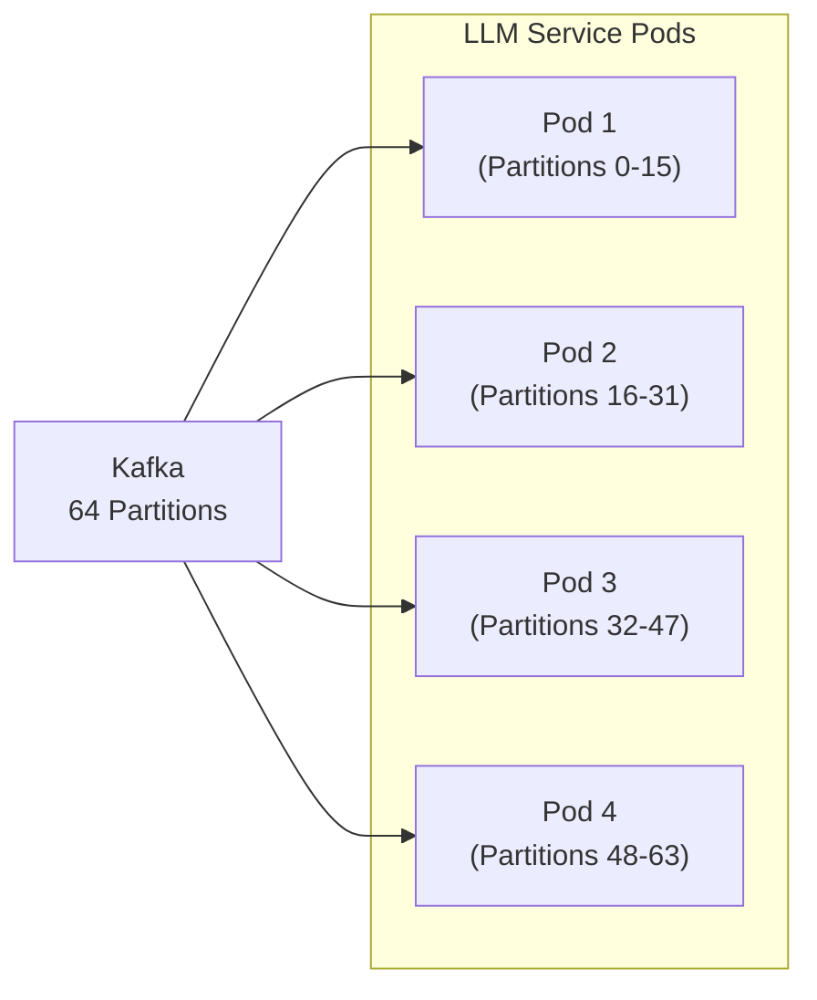

**Scaling Trigger (HPA):**
- Scale up: Kafka consumer lag > 500 messages OR CPU > 70%
- Scale down: Kafka consumer lag < 50 messages AND CPU < 30%
- Min replicas: 4 (one per AZ for HA)
- Max replicas: 64 (matches Kafka partition count)

### Token Throughput Targets

| Scale | Requests/sec | Pods Required | Tokens/min |
|---|---|---|---|
| 10K users | 500 req/s | 4 | 60M |
| 100K users | 5,000 req/s | 40 | 600M |
| 1M users | 50,000 req/s | 64 (+ multi-cluster) | 6B |
| 100M users | 500,000 req/s | Multi-region, 640+ | 60B |

At 100M users, a multi-region deployment with regional Kafka clusters and regional LLM Service fleets is required.

---

## 27. High Availability

### HA Architecture

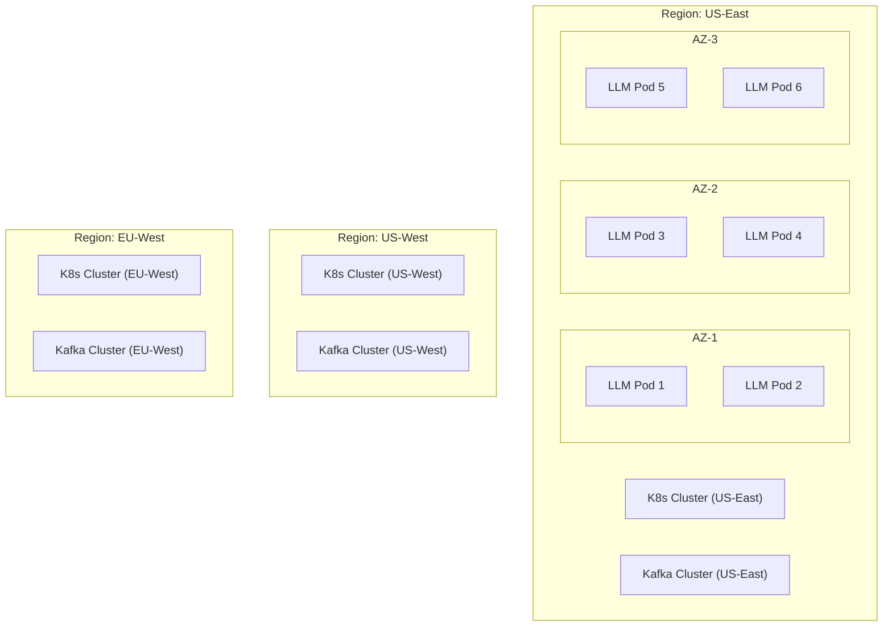

### HA Mechanisms

| Mechanism | Description |
|---|---|
| **Multi-AZ Deployment** | Pods spread across ≥3 AZs using Pod Anti-Affinity rules |
| **Kafka Replication** | Replication factor 3, min ISR 2 — tolerates one broker failure |
| **Provider Failover** | Circuit breakers + fallback routing ensures provider failures are transparent |
| **gRPC Retries** | All gRPC calls have retries + deadline propagation |
| **Health Probes** | Kubernetes liveness (process health) and readiness (can serve traffic) probes |
| **Rolling Updates** | Zero-downtime deployments via Kubernetes RollingUpdate strategy |
| **PodDisruptionBudget** | Ensures ≥50% of pods remain available during node maintenance |

### Recovery Time Objectives

| Failure Scenario | RTO | RPO |
|---|---|---|
| Single pod failure | < 30s (K8s restarts) | 0 (Kafka redelivers) |
| Single AZ failure | < 60s (pods reschedule) | 0 (Kafka redelivers) |
| Provider outage | < 5s (circuit breaker + fallback) | 0 |
| Kafka broker failure | < 10s (partition leader election) | 0 |
| Full region failure | < 5min (global DNS failover) | Last checkpoint |

---

## 28. Failure Handling

### Failure Taxonomy

The LLM Service can experience failures in three categories:

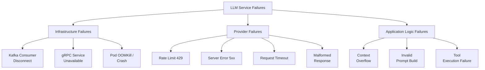

### Failure Responses

#### Kafka Consumer Disconnect
- **Detection:** aiokafka connection error callback
- **Response:** Exponential reconnect with jitter; pod restarts if reconnect fails 5× in a row
- **User Impact:** Delayed response (messages queued in Kafka during disconnect)

#### gRPC Service Unavailable
- **Detection:** gRPC status code UNAVAILABLE
- **Response:**
  - Non-critical context (Graph, Retrieval): Proceed without that context; log degraded mode
  - Critical service (Memory): Retry 3× with 100ms backoff; proceed with empty memory on exhaustion
- **User Impact:** Degraded response quality (no memory/graph context) rather than failure

#### Provider Rate Limit (429)
- **Detection:** HTTP 429 response from provider
- **Response:** Respect `Retry-After` header; switch to fallback provider immediately
- **User Impact:** Transparent to user; response from fallback model

#### Provider Server Error (5xx)
- **Detection:** HTTP 5xx response from provider
- **Response:** Retry 3× with exponential backoff; fail over to fallback on exhaustion; open circuit breaker after threshold
- **User Impact:** Potential delay of 300-600ms; transparent if fallback succeeds

#### Context Window Overflow
- **Detection:** tiktoken count exceeds model limit after trimming
- **Response:** Hard trim to absolute minimum context (system + query only); log warning
- **User Impact:** Response may lack context; acceptable degradation

#### Tool Execution Failure
- **Detection:** Tool raises exception or timeout exceeded
- **Response:** Mark tool result as failed; include graceful error note in prompt
- **User Impact:** Response may acknowledge inability to perform tool-dependent action

### Graceful Degradation Hierarchy

```
Full response with all context (ideal path)
  ↓ Memory Service unavailable
Response without memory context (degraded)
  ↓ Graph Service also unavailable
Response without graph + memory (more degraded)
  ↓ Primary LLM provider unavailable
Response from fallback provider (transparent to user)
  ↓ All providers unavailable
Structured error response via Kafka
```

### Dead Letter Queue (DLQ)

Messages that fail all retry attempts are published to `chat.message.dlq`:
- Operations team is alerted via PagerDuty
- DLQ messages can be replayed after the root cause is resolved
- DLQ retention: 30 days

---

## 29. Security

### Threat Model

The LLM Service faces unique security threats specific to AI systems:

| Threat | Category | Mitigation |
|---|---|---|
| Prompt Injection | AI-specific | Input sanitization, system prompt hardening |
| Jailbreaking | AI-specific | Safety classifier before LLM call |
| PII leakage in prompts | Data privacy | PII detection + masking in Prompt Builder |
| API key exposure | Secrets management | Kubernetes Secrets + Vault |
| Unauthorized access to user data | Access control | User-scoped gRPC calls (user_id in all requests) |
| Provider API abuse | Cost control | Rate limiting + quota monitoring |
| Man-in-the-middle | Network | mTLS for all internal communication |
| Excessive token consumption | Cost/DoS | Token budget enforcement + per-user rate limits |

### Authentication and Authorization

**Internal gRPC Calls:**
- mTLS enforced via Istio service mesh (certificate-based service identity)
- Service account authorization: LLM Service can only call specific gRPC methods

**Kafka:**
- SASL/SCRAM authentication for Kafka producers and consumers
- ACLs: LLM Service can only produce to whitelisted topics

**External API calls:**
- API keys stored in Kubernetes Secrets, injected at runtime
- Never logged or exposed in traces (keys masked in Structlog)

### Prompt Injection Defense

User input passes through an input sanitization layer before being included in any prompt:
1. **Delimiter injection prevention:** System prompt delimiters are escaped in user input
2. **Instruction override detection:** Patterns like "Ignore previous instructions" are flagged and logged
3. **Content policy enforcement:** Safety classifier (using a lightweight model) gates every user message

### PII Protection

The Prompt Builder applies PII detection before assembling prompts:
- Detect common PII patterns: email, phone, SSN, credit card numbers
- Mask detected PII in prompts sent to external providers
- Log PII detection events (without the PII itself) for compliance monitoring

### Rate Limiting

Per-user rate limiting enforced at the Kafka consumer level:
- **Free tier:** 20 requests/minute
- **Pro tier:** 100 requests/minute
- **Enterprise:** Custom limits

Requests exceeding limits are dropped with an error event published to Kafka for the Conversation Service to surface to the user.

### Audit Logging

Every LLM inference event is logged for compliance:
```json
{
  "audit_event": "llm_inference",
  "user_id": "user_abc",
  "conversation_id": "conv_xyz",
  "mode": "TUTOR",
  "model": "meta/llama-3.1-70b-instruct",
  "provider": "openai",
  "tokens_used": 1520,
  "timestamp": "2026-08-06T14:47:53Z",
  "pii_detected": false,
  "safety_check_passed": true
}
```

---

## 30. Future Extensibility

### Extension Points

The LLM Service is designed for extensibility at four key points:

#### 1. New Mode Registration
Adding a new mode requires:
- Register `ModeDefinition` in the Mode Registry (config file, no code change)
- Optionally create a new `Skill` if the mode requires unique prompting behavior
- Optionally register new `ToolDefinitions` if the mode needs new tools

#### 2. New Tool Registration
Adding a new tool requires:
- Implement `BaseTool` interface
- Register in `ToolRegistry`
- Add tool capability to the planner's tool knowledge base

No changes to the Planner, Context Collector, or Prompt Builder are needed.

#### 3. New LLM Provider
Generation Router already supports 100+ providers. Adding a new provider requires:
- Add provider credentials to Kubernetes Secrets
- Add model config to the Model Router's routing table
- Zero code changes to the Generation Router

#### 4. New Skill / Prompt Template
- Add a new YAML prompt template to the `prompts/` directory
- Register the skill in `SkillRegistry`
- Deploy via CI/CD

### Future Mode Roadmap

```mermaid
gantt
    title Future Mode Rollout
    dateFormat YYYY-Q
    axisFormat %Y Q%q

    section Phase 1 (Current)
    Default Mode           :done, 2026-Q1, 2026-Q2
    Smart Mode             :done, 2026-Q1, 2026-Q2
    Tutor Mode             :done, 2026-Q2, 2026-Q3
    Web Search Mode        :done, 2026-Q2, 2026-Q3
    Deep Research Mode     :done, 2026-Q3, 2026-Q4
    Code Mode              :done, 2026-Q3, 2026-Q4
    Ask Files Mode         :done, 2026-Q3, 2026-Q4

    section Phase 2 (Planned)
    Vision Mode            :active, 2026-Q4, 2027-Q1
    Browser Mode           :2026-Q4, 2027-Q1
    GitHub Mode            :2027-Q1, 2027-Q2

    section Phase 3 (Future)
    SQL Mode               :2027-Q2, 2027-Q3
    MCP Protocol           :2027-Q2, 2027-Q3
    Slack Mode             :2027-Q3, 2027-Q4
    Gmail Mode             :2027-Q3, 2027-Q4
    Calendar Mode          :2027-Q3, 2027-Q4
    Jira Mode              :2027-Q4, 2028-Q1
```

---

## 31. Design Patterns

### Patterns Applied in LLM Service

| Pattern | Where Applied | Rationale |
|---|---|---|
| **Event-Driven Architecture** | Kafka consumption and publishing | Decoupling, backpressure, replay |
| **Strategy Pattern** | Mode-specific plan generation | Extensible mode behavior without if-else chains |
| **Registry Pattern** | Tool Registry, Skill Registry, Mode Registry | Dynamic discovery and extensibility |
| **Chain of Responsibility** | Pipeline stages (Intent → Mode → Plan → Execute) | Composable, testable pipeline stages |
| **State Machine** | LangGraph agentic workflow | Formal, inspectable execution graphs |
| **Circuit Breaker** | Per-provider HTTP calls | Prevent cascade failures |
| **Bulkhead Pattern** | Separate asyncio task groups per provider | Isolate provider failures |
| **Saga Pattern** | Multi-step agentic workflow with compensation | Maintain consistency across distributed steps |
| **Adapter Pattern** | Generation Router | Provider-agnostic LLM calls |
| **Observer Pattern** | Observability layer | Decouple metrics/tracing from business logic |
| **Factory Pattern** | Tool instantiation from registry | Decouple tool creation from usage |
| **Template Method Pattern** | Prompt templates per skill | Consistent prompt structure with skill-specific customization |
| **Retry Pattern** | Provider API calls | Handle transient failures gracefully |
| **Parallel Scatter-Gather** | Context collection | Minimize latency for multi-source data fetching |

### Anti-Patterns Explicitly Avoided

| Anti-Pattern | Why Avoided |
|---|---|
| **God Object** | Each component has a single, well-defined responsibility |
| **Tight Coupling to SDK** | All provider calls go through Generation Router; no direct SDK imports |
| **Synchronous blocking** | All I/O is async throughout |
| **Shared mutable state** | LangGraph state is immutable between nodes; new state objects created |
| **Magic configuration** | All routing decisions are explicit and logged |
| **Hardcoded prompts in code** | All prompts in versioned YAML files |

---

## 32. Folder Structure

### High-Level Service Layout

```
llm-service/
├── src/
│   ├── llm_service/
│   │   ├── __init__.py
│   │   ├── main.py                     # FastAPI application entrypoint
│   │   ├── config.py                   # Configuration (Pydantic Settings)
│   │   │
│   │   ├── api/                        # FastAPI routes (health, admin)
│   │   │   ├── __init__.py
│   │   │   ├── health.py
│   │   │   └── admin.py
│   │   │
│   │   ├── consumer/                   # Kafka consumer layer
│   │   │   ├── __init__.py
│   │   │   ├── kafka_consumer.py       # aiokafka consumer
│   │   │   ├── event_dispatcher.py     # Routes events to handlers
│   │   │   └── schemas.py             # Pydantic event schemas
│   │   │
│   │   ├── orchestration/              # Core agentic orchestration
│   │   │   ├── __init__.py
│   │   │   ├── agent.py               # LangGraph agent definition
│   │   │   ├── state.py               # AgentState Pydantic model
│   │   │   ├── graph_builder.py       # LangGraph graph construction
│   │   │   │
│   │   │   ├── intent/
│   │   │   │   ├── __init__.py
│   │   │   │   ├── intent_analyzer.py
│   │   │   │   └── schemas.py
│   │   │   │
│   │   │   ├── mode/
│   │   │   │   ├── __init__.py
│   │   │   │   ├── mode_manager.py
│   │   │   │   ├── mode_registry.py
│   │   │   │   └── definitions.py
│   │   │   │
│   │   │   ├── skill/
│   │   │   │   ├── __init__.py
│   │   │   │   ├── skill_manager.py
│   │   │   │   ├── skill_registry.py
│   │   │   │   └── definitions.py
│   │   │   │
│   │   │   └── planner/
│   │   │       ├── __init__.py
│   │   │       ├── planner.py
│   │   │       ├── rule_based_planner.py
│   │   │       ├── llm_assisted_planner.py
│   │   │       └── schemas.py
│   │   │
│   │   ├── tools/                      # Tool architecture
│   │   │   ├── __init__.py
│   │   │   ├── base_tool.py           # BaseTool abstract class
│   │   │   ├── tool_registry.py       # Tool registration and discovery
│   │   │   ├── tool_dispatcher.py     # Tool execution and aggregation
│   │   │   │
│   │   │   ├── memory_tool.py
│   │   │   ├── graph_tool.py
│   │   │   ├── retrieval_tool.py
│   │   │   └── web_search_tool.py
│   │   │
│   │   ├── context/                   # Context collection
│   │   │   ├── __init__.py
│   │   │   ├── context_collector.py   # Parallel gRPC context fetching
│   │   │   └── schemas.py
│   │   │
│   │   ├── prompt/                    # Prompt engineering
│   │   │   ├── __init__.py
│   │   │   ├── prompt_builder.py      # Assembles final prompt
│   │   │   ├── prompt_manager.py      # Template loading and versioning
│   │   │   ├── context_window_manager.py  # Token counting and trimming
│   │   │   └── schemas.py
│   │   │
│   │   ├── inference/                 # LLM inference layer
│   │   │   ├── __init__.py
│   │   │   ├── model_router.py        # Provider and model selection
│   │   │   ├── generation_router.py   # Generation Router implementation
│   │   │   ├── streaming_engine.py    # Token streaming to Kafka
│   │   │   ├── retry_manager.py       # Exponential backoff retry
│   │   │   └── circuit_breaker.py     # Per-provider circuit breakers
│   │   │
│   │   ├── publisher/                 # Kafka event publishing
│   │   │   ├── __init__.py
│   │   │   ├── kafka_publisher.py
│   │   │   └── schemas.py
│   │   │
│   │   ├── clients/                   # gRPC client stubs
│   │   │   ├── __init__.py
│   │   │   ├── memory_client.py
│   │   │   ├── graph_client.py
│   │   │   └── retrieval_client.py
│   │   │
│   │   └── observability/             # Cross-cutting observability
│   │       ├── __init__.py
│   │       ├── tracing.py             # OpenTelemetry setup
│   │       ├── metrics.py             # Prometheus metrics registry
│   │       └── logging.py             # Structlog configuration
│   │
├── prompts/                           # Versioned prompt templates
│   ├── general_chat_v2.yaml
│   ├── tutor_v1.yaml
│   ├── coding_v3.yaml
│   ├── research_v2.yaml
│   └── reasoning_v1.yaml
│
├── proto/                             # gRPC protobuf definitions
│   ├── memory_service.proto
│   ├── graph_service.proto
│   └── retrieval_service.proto
│
├── docs/                              # Architecture documentation
│   ├── hld.md                         # This document
│   └── adr/                           # Architecture Decision Records
│
├── tests/
│   ├── unit/
│   ├── integration/
│   └── e2e/
│
├── k8s/                               # Kubernetes manifests
│   ├── deployment.yaml
│   ├── service.yaml
│   ├── hpa.yaml
│   ├── pdb.yaml
│   └── configmap.yaml
│
├── Dockerfile
├── docker-compose.yaml
├── pyproject.toml
└── README.md
```

---

## 33. Deployment Architecture

### Kubernetes Deployment

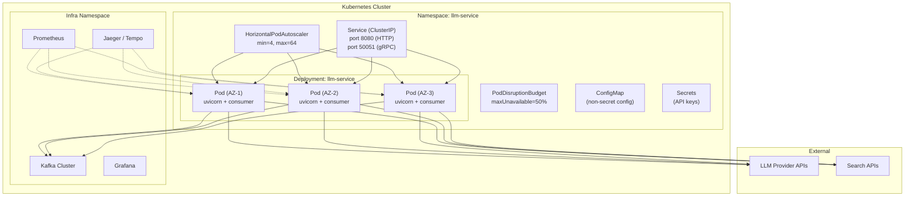

### Kubernetes Resource Specifications

```yaml
# Resource Requests and Limits
resources:
  requests:
    cpu: "2"
    memory: "4Gi"
  limits:
    cpu: "4"
    memory: "8Gi"

# HPA Configuration
metrics:
  - type: External
    external:
      metric:
        name: kafka_consumer_lag
        selector:
          matchLabels:
            topic: chat.message.created
      target:
        type: AverageValue
        averageValue: "50"
  - type: Resource
    resource:
      name: cpu
      target:
        type: Utilization
        averageUtilization: 70
```

### CI/CD Pipeline

```mermaid
flowchart LR
    Commit["Git Commit"]
    Lint["Lint + Type Check\n(ruff + mypy)"]
    UnitTest["Unit Tests\n(pytest)"]
    Build["Docker Build"]
    IntTest["Integration Tests\n(testcontainers)"]
    ScanSec["Security Scan\n(trivy + bandit)"]
    Push["Push to Registry"]
    DeployDev["Deploy to Dev"]
    DeployStaging["Deploy to Staging"]
    DeployProd["Deploy to Prod\n(canary 5% → 100%)"]

    Commit --> Lint --> UnitTest --> Build --> IntTest --> ScanSec --> Push --> DeployDev --> DeployStaging --> DeployProd
```

---

## 34. Sequence Diagrams

### 34.1 Default Mode — Complete Request Flow

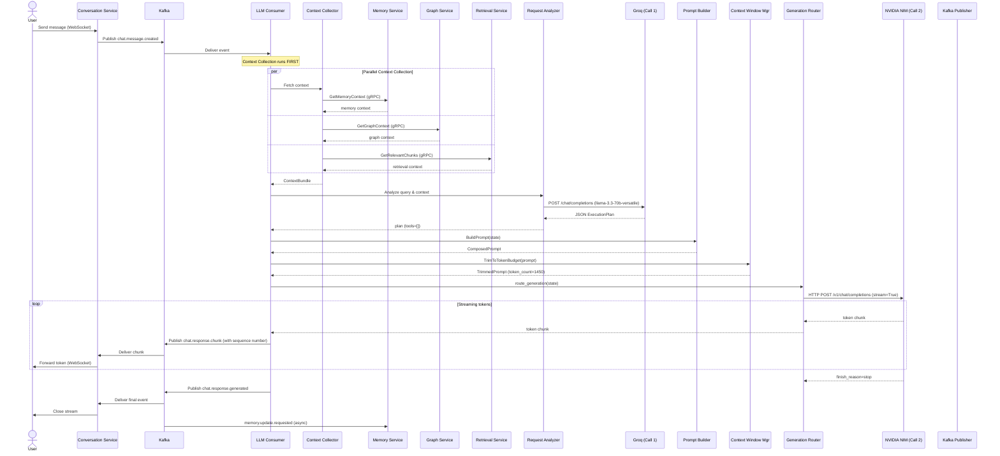

### 34.2 Smart Mode — Request Analysis and Tool Dispatch Flow

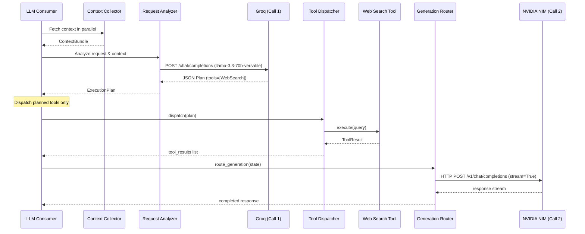

---

## 35. Architecture Diagrams

### 35.1 Complete System Context Diagram

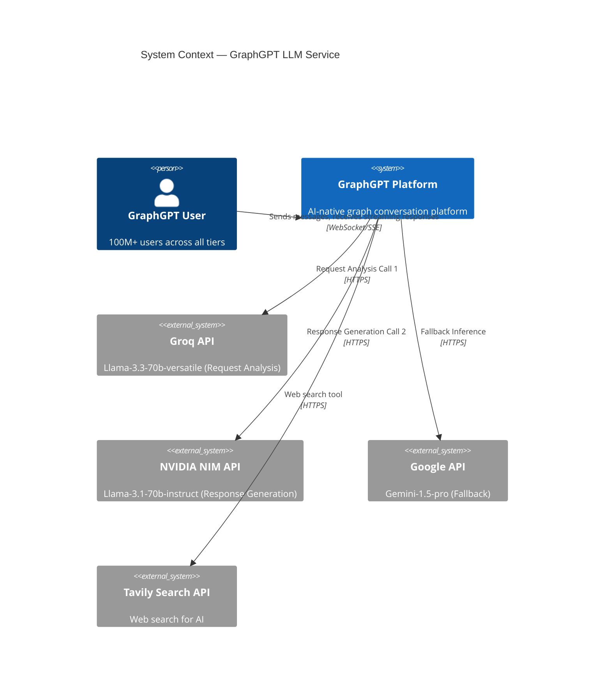

### 35.2 Data Flow Diagram

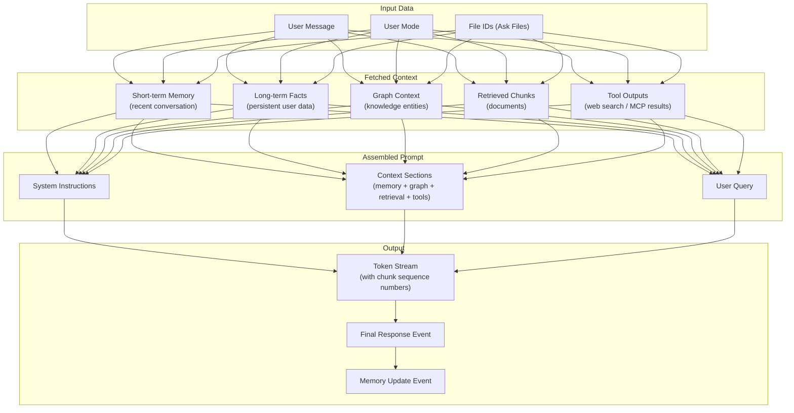

### 35.3 Component Dependency Graph

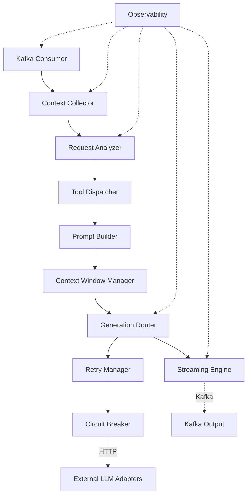

---

## Summary: LLM Service at a Glance

### Architecture Philosophy

The LLM Service is built on three foundational architectural beliefs:

1. **AI Orchestration must be explicit, not implicit.** Every decision — which mode, which tools, which model, which context — is logged, traced, and observable. There are no black-box routing decisions.

2. **Failure is inevitable; graceful degradation is the design.** The service is built to degrade gracefully at every layer — from provider outages to tool failures to context overflow — without surfacing hard errors to users.

3. **Extensibility is a first-class concern.** The tool registry, mode registry, and skill registry are designed so that new capabilities can be added with zero changes to core orchestration logic.

### Key Metrics Summary

| Metric | Target |
|---|---|
| End-to-end TTFT (Time to First Token) | < 650ms (p50) |
| p95 TTFT | < 1500ms |
| Context collection latency | < 100ms (parallel) |
| Provider failover time | < 5s |
| System availability | 99.95% |
| Maximum scale | 64 Kafka partitions × N pods |
| Token cost efficiency | Tiered by user plan |

### Decision Log

| Decision | Rationale |
|---|---|
| LangGraph over custom orchestration | Formal state machine semantics, testable nodes, conditional edges |
| Generation Router over direct SDK | Provider agnosticism, single migration point, built-in cost tracking |
| Kafka over direct gRPC for Conversation→LLM | Backpressure, at-least-once delivery, replay capability |
| gRPC over REST for internal services | Strong typing via proto, multiplexing, low latency |
| tiktoken for all providers | Consistent token counting across providers with known multipliers |
| asyncio throughout | Single-threaded async maximizes concurrency without threading overhead |
| mTLS via Istio | Zero-trust networking without application-level TLS code |
| Stateless service design | Unlimited horizontal scaling, simple deployment, no session affinity |

---

*End of LLM Service High-Level Design*
*Document Version: 1.1 | GraphGPT Engineering | Principal Staff Engineer*
*Last Updated: 2026-08-06*
