# GraphGPT — LLM Service
## High-Level Design (HLD) — Agentic AI Orchestrator
### Version 2.0 | Classification: Internal Engineering | Author: Principal Staff Engineer

---

> **Document Purpose**
> This document describes the production-grade High-Level Design of the LLM Service — the AI orchestration backbone of GraphGPT. It is intended for engineering leads, system architects, and senior engineers involved in designing, building, reviewing, or operating this service. It follows the architectural review format used by Staff/Principal Engineers at large-scale distributed systems organizations.

> **Version 2.0 Changelog**
> This revision formalizes the final architectural decisions for the LLM Service and supersedes Version 1.0 in full. Key changes:
> - Introduced the **Request Analyzer** (Groq-backed) as the single planning component, replacing the separate Intent Analyzer and Planner.
> - Introduced the **Workflow Engine**, which dispatches every request to either a lightweight Python **Mode Handler** or a **LangGraph** agentic graph.
> - Restricted **LangGraph** usage to exactly two agentic workflows — `SmartGraph` and `DeepResearchGraph`. All other modes (`Default`, `Tutor`, `Code`, `Ask Files`, `Web Search`) execute using standard async Python orchestration with no graph runtime overhead.
> - Removed **LiteLLM** entirely. Introduced the **Generation Router**, a purpose-built component responsible for primary provider selection, provider fallback, and streaming abstraction.
> - Formalized the provider split: **Groq** is used exclusively for Request Analysis; **NVIDIA NIM** is the primary generation provider; **Gemini** is the fallback generation provider.
> - Clarified that **Memory, Graph, and Retrieval are baseline context providers, not tools**. They are fetched on every request via parallel gRPC and are never optional. The Tool Dispatcher and Tool Registry govern only optional capabilities (Web Search today; Browser, GitHub, SQL, MCP, Slack, Jira, Gmail, Calendar in the roadmap).
> - Updated every diagram, sequence flow, folder structure, class responsibility table, and deployment artifact to be internally consistent with the above.

---

## Table of Contents

1. [Service Overview](#1-service-overview)
2. [Responsibilities](#2-responsibilities)
3. [Non-Responsibilities](#3-non-responsibilities)
4. [High-Level Architecture](#4-high-level-architecture)
5. [Complete Request Flow](#5-complete-request-flow)
6. [Internal Architecture](#6-internal-architecture)
7. [Component Responsibilities](#7-component-responsibilities)
8. [Context Collector](#8-context-collector)
9. [Request Analyzer](#9-request-analyzer)
10. [Workflow Engine](#10-workflow-engine)
11. [Mode Handlers (Standard Async Python)](#11-mode-handlers-standard-async-python)
12. [Agentic Workflows (LangGraph)](#12-agentic-workflows-langgraph)
13. [Mode Capability Table](#13-mode-capability-table)
14. [Tool Framework](#14-tool-framework)
15. [Prompt Builder](#15-prompt-builder)
16. [Context Window Manager](#16-context-window-manager)
17. [Generation Router](#17-generation-router)
18. [Provider Adapters](#18-provider-adapters)
19. [Streaming Engine](#19-streaming-engine)
20. [Retry Manager](#20-retry-manager)
21. [Circuit Breaker](#21-circuit-breaker)
22. [Observability](#22-observability)
23. [Prompt Management](#23-prompt-management)
24. [Communication with Other Services](#24-communication-with-other-services)
25. [gRPC APIs](#25-grpc-apis)
26. [Kafka Topics](#26-kafka-topics)
27. [External APIs](#27-external-apis)
28. [Technology Stack](#28-technology-stack)
29. [Scalability](#29-scalability)
30. [High Availability](#30-high-availability)
31. [Failure Handling](#31-failure-handling)
32. [Security](#32-security)
33. [Future Extensibility](#33-future-extensibility)
34. [Design Patterns](#34-design-patterns)
35. [Folder Structure](#35-folder-structure)
36. [Deployment Architecture](#36-deployment-architecture)
37. [Sequence Diagrams](#37-sequence-diagrams)
38. [Architecture Diagrams](#38-architecture-diagrams)

---

## 1. Service Overview

### What It Is

The **LLM Service** is the Agentic AI Orchestrator of GraphGPT — the cognitive core of the platform. It is responsible for understanding what the user wants, deciding how to fulfill the request using the best available context and capabilities, constructing an optimized prompt, routing the request to the best-fit language model, and streaming back an intelligent response.

This service is **NOT** a thin wrapper around an LLM API. It is a full-featured AI execution engine that embodies **context assembly, unified planning, deterministic orchestration, agentic reasoning, and multi-provider routing** — designed to support 100M+ users with sub-second response initiation latency.

### Why It Exists

Modern LLM applications are complex multi-step pipelines. A naive approach of forwarding user messages directly to a single LLM API fails at production scale because:

- Raw LLM responses lack context-awareness without memory and graph integration
- Single-provider dependency creates reliability and cost risks
- Prompt engineering is non-trivial and differs per use case / mode
- Only a subset of workflows are genuinely agentic (multi-step, iterative, tool-driven); forcing every request through an agentic graph runtime adds latency and complexity where it is not needed
- Token budget management is critical for cost control at scale
- Streaming must be coordinated between the LLM provider and downstream consumers

The LLM Service solves all of these problems by providing a **centralized, reusable, observable, and extensible AI orchestration layer** that every conversational flow in GraphGPT flows through, while keeping deterministic request handling cheap and fast, and reserving heavyweight agentic machinery for the workflows that actually require it.

### Core Architectural Thesis

> **Clean separation between deterministic orchestration and agentic workflows.**

- **Deterministic orchestration** (`Default`, `Tutor`, `Code`, `Ask Files`, `Web Search`) is implemented using standard async Python — a linear, predictable pipeline with no graph runtime, no cycles, and no dynamic re-planning.
- **Agentic workflows** (`Smart`, `Deep Research`) are implemented using **LangGraph**, because — and only because — they require conditional routing, multi-step planning, loops, iterative reasoning, and dynamic tool execution.

This separation is the single most important architectural decision in this document and is reflected consistently across every diagram, sequence flow, and component boundary below.

### Position in the GraphGPT Architecture

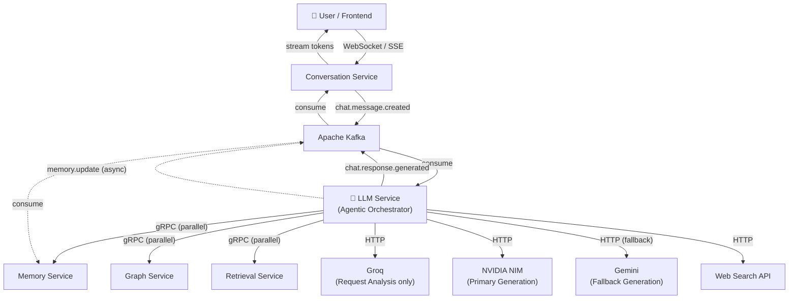

### Key Design Principles

| Principle | Application |
|---|---|
| **Single Responsibility** | LLM Service only orchestrates — it does not persist, summarize, or store |
| **Stateless Processing** | Every request is self-contained; no local state between requests |
| **Context-First Planning** | Context is always collected before analysis — the Request Analyzer sees full context before deciding |
| **Unified Request Analysis** | A single Groq call performs intent classification, mode selection, skill selection, tool selection, reasoning strategy, and execution plan generation |
| **Baseline Context, Always** | Memory, Graph, and Retrieval are fetched on every request via `asyncio.gather()` — they are context providers, not optional tools |
| **Deterministic-by-Default** | Every mode runs on standard async Python orchestration unless it genuinely requires agentic reasoning |
| **LangGraph Where It Earns Its Keep** | Only `Smart` and `Deep Research` use LangGraph, because only they require conditional routing, loops, and dynamic tool execution |
| **No Generic Provider Abstraction Layer** | LiteLLM has been removed; the purpose-built Generation Router owns provider selection, fallback, and streaming abstraction |
| **Async-First** | All I/O is async (asyncio + aiogrpc + aiokafka) |
| **Observability by Default** | Every operation is traced, metered, and logged |
| **Failure Isolation** | Context and tool failures are isolated and gracefully degraded |
| **Horizontally Scalable** | Stateless design enables arbitrary horizontal scaling |

---

## 2. Responsibilities

The LLM Service owns the following responsibilities exclusively:

### 2.1 Request Ingestion
- Consume `chat.message.created` events from Kafka
- Deserialize and validate message payloads using Pydantic models
- Correlate requests with trace IDs for distributed tracing

### 2.2 Context Collection (Always First, Always Complete)
- **Always** fetch from all three baseline context providers on every request — no mode-gating, no conditional skipping
- Fetch short-term memory and long-term facts from Memory Service (gRPC)
- Fetch entity nodes and relationships from Graph Service (gRPC)
- Fetch relevant document chunks from Retrieval Service (gRPC)
- All three calls execute in parallel using `asyncio.gather()` for sub-100ms collection
- Context services themselves determine relevance and scope of returned data; they may legitimately return empty results
- The LLM Service must gracefully degrade if one or more of these services is unavailable — a slow or failed context provider must never fail the overall request

### 2.3 Request Analysis (Groq — Sole Planning Call)
- A single Groq LLM call receives the full context bundle (Memory Context, Graph Context, Retrieval Context) and the user query
- Performs all of the following in one inference:
  - **Intent Classification**: categorize the user's goal
  - **Mode Selection**: confirm, override, or infer the operating mode
  - **Skill Selection**: map intent to an internal execution skill
  - **Tool Selection**: determine which optional tools to invoke and in what order
  - **Reasoning Strategy**: decide DIRECT, CoT, or ReAct
  - **Execution Plan Generation**: produce a structured JSON `ExecutionPlan`
- This is the only component in the request path that performs planning. There is no separate Intent Analyzer, Planner, ML Classifier, or keyword-matching component.

### 2.4 Workflow Dispatch and Execution
- Route the `ExecutionPlan` to the correct execution engine via the **Workflow Engine**
- Five modes (`Default`, `Tutor`, `Code`, `Ask Files`, `Web Search`) execute on dedicated, lightweight **Mode Handlers** using standard async Python — no graph runtime
- Two modes (`Smart`, `Deep Research`) execute on **LangGraph** graphs (`SmartGraph`, `DeepResearchGraph`) that provide conditional routing, iterative reasoning, and dynamic tool execution
- Execute only the optional tools declared in the Execution Plan, dispatched via the Tool Dispatcher
- Handle tool failures gracefully (non-fatal unless a tool is `required=true`)

### 2.5 Prompt Construction
- Assemble a single optimized prompt from: system instructions, mode-specific templates, baseline context (Memory/Graph/Retrieval), tool outputs, and conversation history
- Apply token budget management via the Context Window Manager
- Truncate, summarize, or prioritize context sections when the target model's context window is constrained

### 2.6 Generation Routing and Execution
- Route every generation request through the **Generation Router**
- **NVIDIA NIM** is the primary generation provider for all modes
- **Gemini** is used exclusively as the fallback generation provider when NVIDIA is unavailable, rate-limited, or returns an error
- **Groq** is never used for generation — it is reserved exclusively for Request Analysis
- Abstract streaming differences between providers behind a single interface

### 2.7 Response Streaming
- Stream tokens back to the Conversation Service as they are generated
- Publish incremental and final response events to Kafka
- Support cancellation / early termination of in-flight generations

### 2.8 Asynchronous Memory Updates
- After a response is finalized, publish a `memory.update` event to Kafka
- Memory Service consumes this asynchronously and persists new facts, summaries, or embeddings
- This path is fully decoupled from the synchronous request/response cycle — the LLM Service never blocks on memory writes

### 2.9 Observability
- Emit structured logs, distributed traces, and metrics for every stage of the pipeline
- Track per-provider latency, error rate, and token usage
- Track per-mode execution time, broken down by Mode Handler vs. LangGraph graph

---

## 3. Non-Responsibilities

To keep boundaries explicit, the LLM Service explicitly does **NOT**:

| Non-Responsibility | Owned By |
|---|---|
| Persisting conversation history | Conversation Service |
| Long-term memory storage and retrieval scoring | Memory Service |
| Entity/relationship graph storage and traversal | Graph Service |
| Document ingestion, chunking, and embedding storage | Retrieval Service |
| User authentication and session management | Auth Service / API Gateway |
| WebSocket / SSE connection management to end users | Conversation Service |
| Billing, quota enforcement, and rate limiting per user | API Gateway / Billing Service |
| Model fine-tuning or training | ML Platform Team |
| Long-term storage of generated responses | Conversation Service |
| UI rendering or client-side state | Frontend |

The LLM Service assumes all of the above are handled by their respective owning services and interacts with them only through well-defined Kafka topics and gRPC contracts.

---

## 4. High-Level Architecture

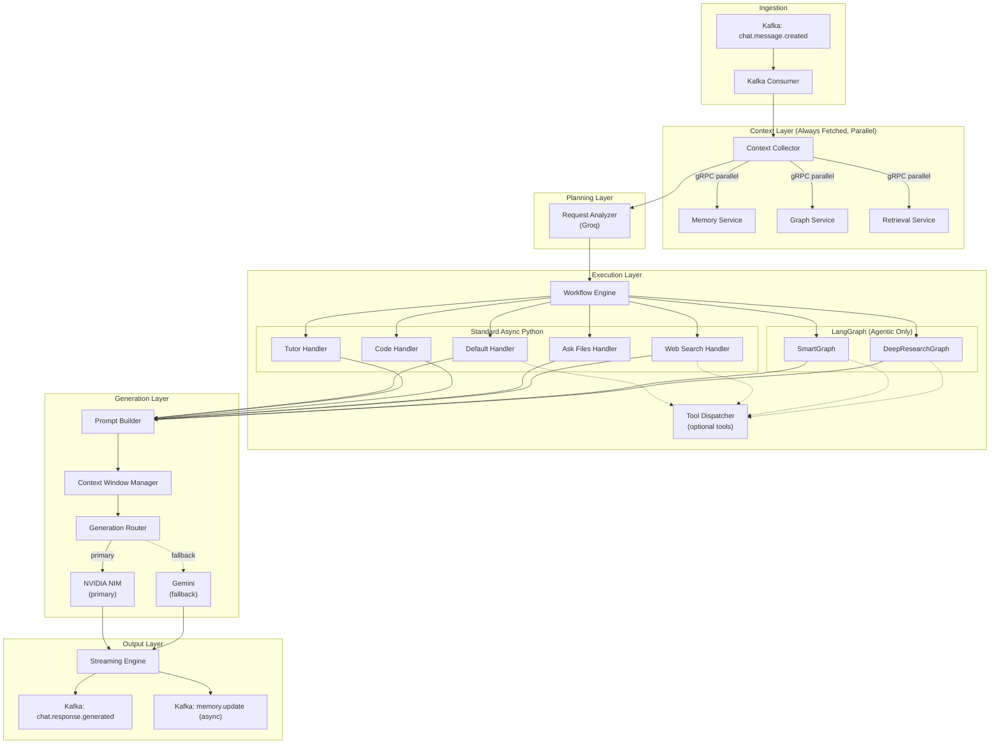

**Architectural note:** LangGraph does not wrap the service. It is invoked only inside the Workflow Engine, only for `SmartGraph` and `DeepResearchGraph`, and only after the Request Analyzer has already produced an Execution Plan. Every other mode never touches the LangGraph runtime.

---

## 5. Complete Request Flow

### 5.1 Canonical Pipeline

```text
Kafka Consumer
    │
    ▼
Context Collector  (parallel gRPC: Memory + Graph + Retrieval)
    │
    ▼
Request Analyzer  (Groq — Intent, Mode, Skill, Tools, Strategy, Execution Plan)
    │
    ▼
Workflow Engine
    ├── Default Handler        (async Python)
    ├── Tutor Handler          (async Python)
    ├── Code Handler           (async Python)
    ├── Ask Files Handler      (async Python)
    ├── Web Search Handler     (async Python)
    ├── SmartGraph             (LangGraph)
    └── DeepResearchGraph      (LangGraph)
    │
    ▼
Prompt Builder
    │
    ▼
Generation Router
    │
    ├── NVIDIA NIM   (primary)
    └── Gemini       (fallback)
    │
    ▼
Streaming Engine
    │
    ▼
Kafka Publisher  (chat.response.generated + memory.update)
```

### 5.2 Step-by-Step Narrative

1. **Kafka Consumer** receives a `chat.message.created` event from the Conversation Service and deserializes it into a `ChatRequest` model.
2. **Context Collector** fires three gRPC calls in parallel via `asyncio.gather()` — to Memory Service, Graph Service, and Retrieval Service. Each may return data or an empty result; a failure in one is caught and degraded independently without blocking the other two.
3. **Request Analyzer** receives the user query plus the three context bundles and makes a single Groq inference call. It returns a structured `ExecutionPlan` containing: classified intent, selected mode, selected skill(s), selected optional tool(s), reasoning strategy, and any mode-specific parameters.
4. **Workflow Engine** reads `ExecutionPlan.mode` and dispatches to the correct execution engine:
   - If `mode` is one of `default`, `tutor`, `code`, `ask_files`, `web_search` → dispatch to the corresponding **Mode Handler**, which runs a linear async Python coroutine.
   - If `mode` is `smart` or `deep_research` → dispatch to the corresponding **LangGraph** graph, which may loop, re-plan, and invoke tools dynamically.
5. Whichever engine handles the request may invoke the **Tool Dispatcher** for optional capabilities (currently Web Search; Browser/GitHub/SQL/MCP/Slack/Jira/Gmail/Calendar on the roadmap). Baseline context (Memory/Graph/Retrieval) is never re-fetched here — it was already collected in step 2 and is passed down the pipeline.
6. **Prompt Builder** assembles the final prompt from system instructions, mode template, baseline context, tool outputs, and conversation history.
7. **Context Window Manager** enforces the target model's token budget, trimming or summarizing lower-priority sections as needed.
8. **Generation Router** selects **NVIDIA NIM** as the primary provider. If NVIDIA is unavailable, rate-limited, or errors, it transparently falls back to **Gemini**. Groq is never invoked here.
9. **Streaming Engine** streams tokens back as Server-Sent chunks, abstracting away provider-specific streaming formats.
10. **Kafka Publisher** emits `chat.response.generated` events incrementally and a final completion event, and separately emits a `memory.update` event so Memory Service can persist new facts asynchronously.

### 5.3 Latency Budget (Indicative)

| Stage | Target p50 | Target p99 |
|---|---|---|
| Kafka consume + deserialize | 5 ms | 20 ms |
| Context Collector (parallel) | 60 ms | 180 ms |
| Request Analyzer (Groq) | 150 ms | 400 ms |
| Workflow Engine dispatch (Mode Handler) | 5 ms | 15 ms |
| Workflow Engine dispatch (LangGraph) | 20 ms | 60 ms |
| Tool execution (if any, per tool) | 200 ms | 1500 ms |
| Prompt Builder + Context Window Manager | 10 ms | 30 ms |
| Generation Router → first token (NVIDIA) | 300 ms | 900 ms |
| Generation Router → first token (Gemini fallback) | 400 ms | 1200 ms |

---
## 6. Internal Architecture

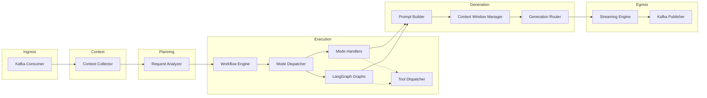

The internal architecture is organized into five layers, each with a single, non-overlapping responsibility:

1. **Ingress Layer** — Kafka Consumer. Pure I/O, no business logic.
2. **Context Layer** — Context Collector. Fetches baseline context in parallel; owns no decision logic.
3. **Planning Layer** — Request Analyzer. The only component that decides *what* to do.
4. **Execution Layer** — Workflow Engine (Mode Dispatcher + Mode Handlers + LangGraph graphs) and Tool Dispatcher. Executes *what* the Planning Layer decided.
5. **Generation Layer** — Prompt Builder, Context Window Manager, Generation Router. Turns an execution result into a final model response.
6. **Egress Layer** — Streaming Engine, Kafka Publisher. Delivers the response and triggers async memory updates.

This layering enforces a strict, one-directional data flow: no layer calls backward into a layer above it, which keeps the system testable and makes failure domains easy to reason about.

---

## 7. Component Responsibilities

| Component | Responsibility | Technology |
|---|---|---|
| Kafka Consumer | Ingest and deserialize `chat.message.created` | aiokafka |
| Context Collector | Parallel gRPC fetch of Memory/Graph/Retrieval | asyncio.gather + grpcio |
| Request Analyzer | Single-call intent/mode/skill/tool/strategy/plan generation | Groq API |
| Workflow Engine | Route Execution Plan to Mode Handler or LangGraph graph | Custom async dispatcher |
| Mode Dispatcher | Map `ExecutionPlan.mode` to the correct execution engine | Custom async dispatcher |
| Default Handler | General-purpose conversational response | async Python |
| Tutor Handler | Educational, step-by-step explanation flow | async Python |
| Code Handler | Code generation, explanation, and review flow | async Python |
| Ask Files Handler | Document-grounded Q&A flow | async Python |
| Web Search Handler | Search-augmented response flow | async Python |
| SmartGraph | Multi-step agentic reasoning with dynamic tool selection | LangGraph |
| DeepResearchGraph | Iterative multi-source research and report generation | LangGraph |
| Tool Dispatcher | Execute optional tools declared in the Execution Plan | Custom async registry |
| Prompt Builder | Assemble final prompt from all inputs | Jinja2 templates |
| Context Window Manager | Enforce token budgets per target model | tiktoken / model-specific tokenizers |
| Generation Router | Select provider, apply fallback, abstract streaming | Custom async router |
| Provider Adapters | Normalize request/response per provider | Custom adapters (NVIDIA, Gemini, Groq) |
| Streaming Engine | Token-by-token streaming to downstream consumers | Custom async generator |
| Retry Manager | Exponential backoff retries for transient failures | tenacity |
| Circuit Breaker | Trip on sustained provider/service failure | pybreaker |
| Observability Stack | Tracing, metrics, structured logs | OpenTelemetry, Prometheus, structlog |

---

## 8. Context Collector

### 8.1 Purpose

The Context Collector is the **first and only** component that fetches baseline context. It always fetches from all three baseline providers, on every request, regardless of mode. There is no mode-based gating — even a simple `default` chat message triggers all three calls.

### 8.2 Design

```python
async def collect_context(request: ChatRequest) -> ContextBundle:
    memory_task = fetch_memory_context(request)
    graph_task = fetch_graph_context(request)
    retrieval_task = fetch_retrieval_context(request)

    memory, graph, retrieval = await asyncio.gather(
        memory_task, graph_task, retrieval_task,
        return_exceptions=True,
    )

    return ContextBundle(
        memory=_degrade_if_error(memory),
        graph=_degrade_if_error(graph),
        retrieval=_degrade_if_error(retrieval),
    )
```

### 8.3 Graceful Degradation Rules

| Scenario | Behavior |
|---|---|
| Memory Service unavailable | Continue with `memory=None`; log + metric increment; request proceeds |
| Graph Service unavailable | Continue with `graph=None`; log + metric increment; request proceeds |
| Retrieval Service unavailable | Continue with `retrieval=None`; log + metric increment; request proceeds |
| All three unavailable | Continue with fully empty `ContextBundle`; Request Analyzer operates on user query alone |
| One or more return empty (not an error) | Treated as a legitimate response — the service decided nothing relevant exists |

### 8.4 Why Context Collection Is Never Conditional

Baseline context providers are cheap (gRPC, sub-100ms parallel) relative to the cost of a mode-selection mistake caused by insufficient context. Rather than have the Request Analyzer guess whether context might be relevant, the architecture always supplies it and trusts each context service's own relevance logic to return an empty payload when nothing applies. This keeps the Request Analyzer's prompt simple and its decisions consistently well-informed.

---

## 9. Request Analyzer

### 9.1 Purpose

The Request Analyzer is the **sole planning component** in the LLM Service. It replaces what, in earlier iterations of this system, was a chain of separate components: an Intent Analyzer, a keyword-matching layer, an ML classifier, and a Planner. All of that responsibility is now consolidated into a single Groq-backed call.

### 9.2 Inputs

- User Query (raw text + any attachments metadata)
- Memory Context (from Context Collector)
- Graph Context (from Context Collector)
- Retrieval Context (from Context Collector)
- Conversation metadata (mode hint from client, if provided; conversation ID; user preferences)

### 9.3 Responsibilities

| Responsibility | Description |
|---|---|
| Intent Classification | Determine the underlying goal of the user's message |
| Mode Selection | Confirm the client-provided mode, override it, or infer one when absent |
| Skill Selection | Map intent to an internal execution skill/capability |
| Tool Selection | Decide which *optional* tools (if any) are needed, and in what order |
| Reasoning Strategy | Choose `DIRECT`, `CoT` (chain-of-thought), or `ReAct` |
| Execution Plan Generation | Emit a single structured JSON object consumed by the Workflow Engine |

### 9.4 Output Contract — `ExecutionPlan`

```json
{
  "intent": "code_debugging",
  "mode": "code",
  "skill": "debug_assistant",
  "tools": [
    { "name": "web_search", "required": false, "order": 1 }
  ],
  "reasoning_strategy": "CoT",
  "confidence": 0.94,
  "notes": "User pasted a stack trace; context contains no prior debugging session."
}
```

### 9.5 Model Choice: Why Groq

Groq is used exclusively for Request Analysis because the task requires **low latency, structured JSON output, and moderate reasoning depth** — not maximal generation quality. Groq's inference speed keeps the planning step off the critical path for perceived latency, while its instruction-following is sufficient for reliable structured output. Groq is never used to generate the user-facing response.

### 9.6 Removed Components

The following components existed in earlier designs and have been fully removed. Their responsibilities are now covered by the Request Analyzer:

| Removed Component | Responsibility Absorbed By |
|---|---|
| Intent Analyzer | Request Analyzer (Intent Classification) |
| Keyword Matching | Request Analyzer (replaced with model-based classification) |
| ML Classifier | Request Analyzer (replaced with model-based classification) |
| Planner | Request Analyzer (Execution Plan Generation) |

---

## 10. Workflow Engine

### 10.1 Purpose

The Workflow Engine is the execution-layer component that takes the `ExecutionPlan` produced by the Request Analyzer and routes it to the correct execution engine. It was deliberately renamed from an earlier "Mode Handler" naming convention because it must dispatch to **two structurally different kinds of engines** — lightweight Python handlers and LangGraph graphs — and a name implying uniform handling would misrepresent the architecture.

### 10.2 Design

```python
class WorkflowEngine:
    def __init__(self):
        self.mode_dispatcher = ModeDispatcher(
            handlers={
                "default": DefaultHandler(),
                "tutor": TutorHandler(),
                "code": CodeHandler(),
                "ask_files": AskFilesHandler(),
                "web_search": WebSearchHandler(),
            },
            graphs={
                "smart": SmartGraph(),
                "deep_research": DeepResearchGraph(),
            },
        )

    async def execute(self, plan: ExecutionPlan, context: ContextBundle) -> WorkflowResult:
        return await self.mode_dispatcher.dispatch(plan, context)
```

### 10.3 Mode Dispatcher

The Mode Dispatcher is a thin routing component inside the Workflow Engine. Its only job is to look up `plan.mode` and invoke the matching engine — either a `Mode Handler` (async Python coroutine) or a LangGraph graph (`.ainvoke()`), and to normalize both output shapes into a common `WorkflowResult` before handing off to the Prompt Builder.

```text
Workflow Engine
│
├── Mode Dispatcher
│     │
│     ├── mode in {default, tutor, code, ask_files, web_search}
│     │        → dispatch to Mode Handler (async Python)
│     │
│     └── mode in {smart, deep_research}
│              → dispatch to LangGraph graph (.ainvoke)
│
└── WorkflowResult  (normalized output → Prompt Builder)
```

### 10.4 Why the Split Exists

| Consideration | Standard Async Python (5 modes) | LangGraph (2 modes) |
|---|---|---|
| Control flow | Linear, single pass | Conditional, cyclic |
| Re-planning mid-execution | Not needed | Required |
| Tool invocation pattern | Fixed, pre-declared by Execution Plan | Dynamic, decided during execution |
| Latency overhead | Minimal | Higher (graph state management) |
| Debuggability | Straightforward stack traces | Requires graph state inspection |
| When it's the right fit | Single-shot conversational, educational, code, file Q&A, single search | Multi-step planning, iterative research, dynamic tool chains |

Using LangGraph everywhere would impose graph-state overhead on requests that are structurally simple, single-pass conversations. Using plain async Python everywhere would leave `Smart` and `Deep Research` unable to loop, re-plan, or dynamically decide their next tool call. The split ensures each mode uses exactly the amount of orchestration machinery it needs — no more, no less.

---

## 11. Mode Handlers (Standard Async Python)

### 11.1 Common Interface

Every Mode Handler implements the same minimal interface, which keeps the Mode Dispatcher's routing logic trivial and keeps handlers independently testable:

```python
class ModeHandler(Protocol):
    async def handle(
        self,
        plan: ExecutionPlan,
        context: ContextBundle,
    ) -> WorkflowResult: ...
```

### 11.2 Default Handler

- **Purpose:** General-purpose conversational responses with no specialized behavior.
- **Flow:** Read baseline context → optionally invoke Web Search tool if the plan declares it → hand off to Prompt Builder.
- **Tool usage:** Optional (Web Search only, if selected by Request Analyzer).
- **LangGraph:** Not used.

### 11.3 Tutor Handler

- **Purpose:** Structured, pedagogical explanations — breaking a topic into steps, checking understanding, adjusting depth.
- **Flow:** Read baseline context → apply the Tutor prompt template (step-by-step scaffolding) → hand off to Prompt Builder.
- **Tool usage:** Optional (Web Search for supplementary references).
- **LangGraph:** Not used — the pedagogical structure is templated, not dynamically planned.

### 11.4 Code Handler

- **Purpose:** Code generation, explanation, review, and debugging assistance.
- **Flow:** Read baseline context and any attached code/file context → apply the Code prompt template → optionally invoke Web Search for library/API lookups → hand off to Prompt Builder.
- **Tool usage:** Optional (Web Search).
- **LangGraph:** Not used — code assistance in this mode is single-pass; multi-file, multi-step coding agents are a documented future extension (see [Future Extensibility](#33-future-extensibility)) and would be layered on LangGraph rather than added to this handler.

### 11.5 Ask Files Handler

- **Purpose:** Document-grounded question answering over user-provided files.
- **Flow:** Read baseline context (Retrieval Context specifically carries the relevant document chunks) → apply the Ask Files prompt template → hand off to Prompt Builder.
- **Tool usage:** None required; Retrieval Service (a baseline context provider, not a tool) already supplies the grounding chunks.
- **LangGraph:** Not used.

### 11.6 Web Search Handler

- **Purpose:** Search-augmented responses for queries that need current, external information.
- **Flow:** Read baseline context → invoke Web Search tool via Tool Dispatcher (required for this mode) → merge search results into context → apply the Web Search prompt template → hand off to Prompt Builder.
- **Tool usage:** Required (Web Search).
- **LangGraph:** Not used — a single search-and-answer pass does not require iterative planning; iterative, multi-query research is handled by `DeepResearchGraph` instead.

---

## 12. Agentic Workflows (LangGraph)

### 12.1 Scope

LangGraph is used **exclusively** for the two modes that genuinely require agentic behavior: conditional routing, multi-step planning, loops, iterative reasoning, and dynamic tool execution. It is never used to wrap the overall service, and it is never used for the five modes covered in [Section 11](#11-mode-handlers-standard-async-python).

### 12.2 SmartGraph

**Purpose:** General-purpose agentic assistant that dynamically decides which tools to use and in what sequence, based on intermediate results.

```text
Planner
  │
  ▼
Dynamic Tool Selection
  │
  ▼
Execution
  │
  ▼
Prompt
  │
  ▼
Generation
```

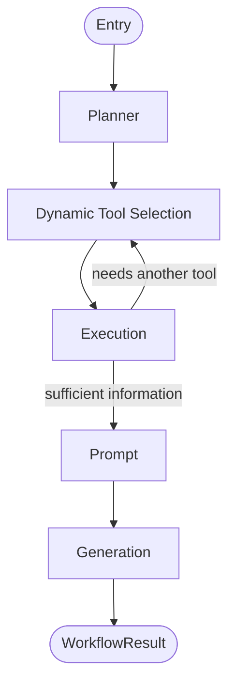

| Node | Responsibility |
|---|---|
| Planner | Breaks the user goal into an ordered set of candidate sub-tasks |
| Dynamic Tool Selection | Chooses the next tool to invoke based on planner output and prior execution results |
| Execution | Invokes the selected tool via the Tool Dispatcher and captures its output |
| Prompt | Assembles an intermediate prompt once sufficient information has been gathered |
| Generation | Produces the draft response passed onward to the shared Prompt Builder / Generation Router pipeline |

**Loop condition:** After `Execution`, the graph re-enters `Dynamic Tool Selection` if the Planner's sub-tasks are not yet satisfied; otherwise it proceeds to `Prompt`.

### 12.3 DeepResearchGraph

**Purpose:** Multi-source, iterative research culminating in a structured report.

```text
Search
  │
  ▼
Analyze
  │
  ▼
Need More Information?
  │
  ├── Yes → Search Again
  │              │
  │              ▼
  │         (back to Analyze)
  │
  └── No
      │
      ▼
  Compare Sources
      │
      ▼
  Summarize
      │
      ▼
  Generate Report
```

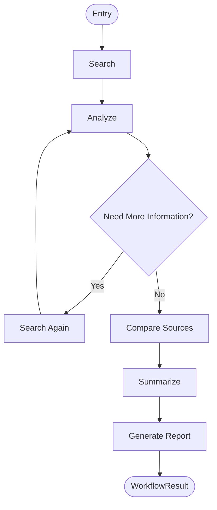

| Node | Responsibility |
|---|---|
| Search | Issues one or more search queries via the Web Search tool |
| Analyze | Extracts key findings and assesses coverage/quality of current sources |
| Need More Information? (conditional edge) | Decides whether to loop back for another search round or proceed |
| Search Again | Issues refined or additional queries targeting identified gaps |
| Compare Sources | Cross-references findings across sources, flags contradictions |
| Summarize | Produces a condensed synthesis of validated findings |
| Generate Report | Produces the final structured report passed onward to the Prompt Builder |

### 12.4 Shared Downstream Path

Both `SmartGraph` and `DeepResearchGraph` terminate by handing a `WorkflowResult` to the same **Prompt Builder → Context Window Manager → Generation Router** pipeline used by the five standard Mode Handlers. LangGraph's involvement ends the moment a `WorkflowResult` is produced — generation, streaming, and publishing are always handled by the shared, non-graph components described in Sections 15–19.

### 12.5 What LangGraph Is Not Used For

To avoid architectural drift back toward "LangGraph wraps everything," this is explicit:

- LangGraph does **not** wrap Kafka consumption, Context Collection, or Request Analysis.
- LangGraph does **not** run for `Default`, `Tutor`, `Code`, `Ask Files`, or `Web Search`.
- LangGraph does **not** own generation, streaming, or Kafka publishing — those remain graph-agnostic, shared components.

---

## 13. Mode Capability Table

Every mode always receives the same baseline context. The only true differences between modes are reasoning strategy, tool usage, and execution engine.

| Mode | Memory | Graph | Retrieval | Reasoning Strategy | Tool Usage | Execution Engine |
|---|---|---|---|---|---|---|
| Default | ✅ Always | ✅ Always | ✅ Always | DIRECT | Optional (Web Search) | Mode Handler (async Python) |
| Tutor | ✅ Always | ✅ Always | ✅ Always | CoT | Optional (Web Search) | Mode Handler (async Python) |
| Code | ✅ Always | ✅ Always | ✅ Always | CoT | Optional (Web Search) | Mode Handler (async Python) |
| Ask Files | ✅ Always | ✅ Always | ✅ Always | DIRECT | None (Retrieval covers grounding) | Mode Handler (async Python) |
| Web Search | ✅ Always | ✅ Always | ✅ Always | DIRECT / CoT | Required (Web Search) | Mode Handler (async Python) |
| Smart | ✅ Always | ✅ Always | ✅ Always | ReAct | Dynamic (any registered tool) | LangGraph (`SmartGraph`) |
| Deep Research | ✅ Always | ✅ Always | ✅ Always | ReAct | Dynamic, iterative (Web Search, dynamic) | LangGraph (`DeepResearchGraph`) |

**Key takeaway:** Memory, Graph, and Retrieval columns are identical across every row — this is intentional and enforced by the Context Collector fetching them unconditionally. Mode differentiation is entirely a function of reasoning strategy, tool usage, and execution engine, never of whether baseline context is fetched.

---
## 14. Tool Framework

### 14.1 Core Distinction: Baseline Context Providers vs. Tools

This is a foundational distinction that shapes the entire architecture:

| | Baseline Context Providers | Tools |
|---|---|---|
| Members | Memory, Graph, Retrieval | Web Search (today); Browser, GitHub, SQL, MCP, Slack, Jira, Gmail, Calendar (roadmap) |
| Invocation | Always, every request, via Context Collector | Optional, only when selected by the Request Analyzer's Execution Plan |
| Decision maker | None — unconditional | Request Analyzer decides which tools, if any |
| Transport | gRPC, parallel | HTTP / SDK / MCP, sequential or dynamically ordered |
| Failure handling | Graceful degradation, request always proceeds | Non-fatal unless `required=true` on the Execution Plan |
| Owned by | Context Collector | Tool Dispatcher + Tool Registry |

**Memory, Graph, and Retrieval are never registered in the Tool Registry and are never dispatched by the Tool Dispatcher.** They are structurally distinct from tools because every request depends on them, whereas tools are, by definition, optional augmentations selected per-request.

### 14.2 Tool Registry

The Tool Registry is a static, versioned catalog of every tool the Tool Dispatcher is capable of invoking. Each entry declares its invocation contract, timeout, and failure policy.

```python
TOOL_REGISTRY = {
    "web_search": ToolSpec(
        handler=WebSearchTool(),
        timeout_ms=3000,
        retryable=True,
        required_by_default=False,
    ),
    # Future tools — registered but not yet enabled in production:
    # "browser": ToolSpec(handler=BrowserTool(), ...),
    # "github": ToolSpec(handler=GitHubTool(), ...),
    # "sql": ToolSpec(handler=SQLTool(), ...),
    # "mcp": ToolSpec(handler=MCPTool(), ...),
    # "slack": ToolSpec(handler=SlackTool(), ...),
    # "jira": ToolSpec(handler=JiraTool(), ...),
    # "gmail": ToolSpec(handler=GmailTool(), ...),
    # "calendar": ToolSpec(handler=CalendarTool(), ...),
}
```

### 14.3 Tool Dispatcher

```python
class ToolDispatcher:
    async def dispatch(self, tools: list[ToolCall]) -> list[ToolResult]:
        results = []
        for tool_call in tools:
            spec = TOOL_REGISTRY[tool_call.name]
            try:
                result = await asyncio.wait_for(
                    spec.handler.execute(tool_call.params),
                    timeout=spec.timeout_ms / 1000,
                )
                results.append(ToolResult(name=tool_call.name, ok=True, data=result))
            except Exception as e:
                if tool_call.required:
                    raise ToolExecutionError(tool_call.name) from e
                results.append(ToolResult(name=tool_call.name, ok=False, error=str(e)))
        return results
```

### 14.4 Current Tools

| Tool | Status | Used By |
|---|---|---|
| Web Search | Production | Web Search Handler (required), Default/Tutor/Code Handlers (optional), SmartGraph (dynamic), DeepResearchGraph (dynamic, iterative) |

### 14.5 Future Tools (Roadmap)

| Tool | Purpose | Target Consumers |
|---|---|---|
| Browser | Headless page navigation and content extraction beyond search snippets | SmartGraph, DeepResearchGraph |
| GitHub | Repository search, file read, PR/issue context | Code Handler, SmartGraph |
| SQL | Read-only structured data queries against approved data sources | SmartGraph, Ask Files Handler |
| MCP | Generic Model Context Protocol tool bridge for third-party integrations | SmartGraph |
| Slack | Read/post messages in connected workspaces | SmartGraph |
| Jira | Read/create issues in connected projects | SmartGraph, Code Handler |
| Gmail | Read/draft email in connected accounts | SmartGraph |
| Calendar | Read/create calendar events | SmartGraph |

All future tools follow the same registration contract described in 14.2 and are invoked exclusively through the Tool Dispatcher — never as ad hoc HTTP calls from within a Mode Handler or graph node.

---

## 15. Prompt Builder

### 15.1 Purpose

Assembles the final prompt sent to the Generation Router from all upstream inputs: system instructions, mode-specific template, baseline context, tool outputs, and conversation history.

### 15.2 Assembly Order

```text
1. System Instructions        (global, versioned)
2. Mode-Specific Template     (Default / Tutor / Code / Ask Files / Web Search / Smart / Deep Research)
3. Baseline Context           (Memory → Graph → Retrieval, in that priority order)
4. Tool Outputs                (if any, appended after baseline context)
5. Conversation History        (most recent turns, subject to Context Window Manager trimming)
6. Current User Message
```

### 15.3 Design

```python
class PromptBuilder:
    def build(self, workflow_result: WorkflowResult, context: ContextBundle) -> Prompt:
        sections = [
            self._system_instructions(),
            self._mode_template(workflow_result.mode),
            self._render_context(context),
            self._render_tool_outputs(workflow_result.tool_outputs),
            self._render_history(workflow_result.conversation_history),
            workflow_result.user_message,
        ]
        return Prompt(sections=sections)
```

Templates are stored as versioned Jinja2 files (see [Section 23 — Prompt Management](#23-prompt-management)) so that prompt changes are reviewable and rollback-able independent of code deploys.

---

## 16. Context Window Manager

### 16.1 Purpose

Enforces the target model's token budget before a prompt is handed to the Generation Router. Because NVIDIA NIM and Gemini may have different context window sizes, the Context Window Manager is provider-aware and runs *after* the Generation Router has tentatively selected a primary provider, but *before* the request is actually sent.

### 16.2 Trimming Priority (Lowest Priority Trimmed First)

```text
1. Conversation History (oldest turns first)
2. Retrieval Context (lowest-relevance-scored chunks first)
3. Graph Context (least-connected nodes first)
4. Memory Context (lowest-confidence facts first)
5. Tool Outputs           — trimmed only as a last resort
6. Mode Template / System Instructions — never trimmed
```

### 16.3 Design

```python
class ContextWindowManager:
    def fit(self, prompt: Prompt, target_model: ModelSpec) -> Prompt:
        budget = target_model.max_input_tokens - target_model.reserved_output_tokens
        while prompt.token_count() > budget:
            prompt = self._trim_next_section(prompt)
        return prompt
```

---

## 17. Generation Router

### 17.1 Purpose

The Generation Router is a purpose-built replacement for the previously used generic provider-abstraction library (LiteLLM), which has been **removed entirely** from the architecture. The Generation Router owns exactly three responsibilities:

1. **Primary provider selection** — always NVIDIA NIM for generation.
2. **Provider fallback** — transparent failover to Gemini when NVIDIA is unavailable, rate-limited, or errors.
3. **Streaming abstraction** — normalize provider-specific streaming formats into a single internal token-stream interface consumed by the Streaming Engine.

### 17.2 Why LiteLLM Was Removed

| Concern with LiteLLM | Resolution via Generation Router |
|---|---|
| Generic abstraction covered many providers this service will never call, adding surface area and dependency risk | Generation Router only knows about NVIDIA and Gemini — the two providers actually used for generation |
| Fallback semantics were configuration-driven and opaque | Fallback logic is explicit, testable Python, co-located with Circuit Breaker and Retry Manager |
| Streaming normalization added an extra translation layer with its own latency and failure modes | Streaming Engine consumes a purpose-built internal stream type produced directly by the Provider Adapters |
| Provider selection logic was not easily unit-testable in isolation | Generation Router is a small, dependency-injected class covered by focused unit tests |

### 17.3 Provider Roles

| Provider | Role | Used For |
|---|---|---|
| Groq | Request Analysis only | Single planning call in the Request Analyzer — **never** generation |
| NVIDIA NIM | Primary generation provider | Final response generation for every mode |
| Gemini | Fallback generation provider | Final response generation only when NVIDIA is unavailable |

### 17.4 Design

```python
class GenerationRouter:
    def __init__(self, primary: ProviderAdapter, fallback: ProviderAdapter,
                 circuit_breaker: CircuitBreaker, retry_manager: RetryManager):
        self.primary = primary          # NVIDIA NIM
        self.fallback = fallback        # Gemini
        self.circuit_breaker = circuit_breaker
        self.retry_manager = retry_manager

    async def generate_stream(self, prompt: Prompt) -> AsyncIterator[Token]:
        if self.circuit_breaker.is_open("nvidia"):
            async for token in self.fallback.stream(prompt):
                yield token
            return

        try:
            async for token in self.retry_manager.wrap(self.primary.stream)(prompt):
                yield token
        except ProviderError:
            self.circuit_breaker.record_failure("nvidia")
            async for token in self.fallback.stream(prompt):
                yield token
```

### 17.5 Fallback Decision Matrix

| Condition on NVIDIA NIM | Action |
|---|---|
| Healthy, responds within SLA | Use NVIDIA, no fallback |
| Transient error (5xx, timeout) | Retry via Retry Manager (bounded attempts), then fallback to Gemini if still failing |
| Rate limited (429) | Immediate fallback to Gemini, no retry against NVIDIA |
| Circuit breaker open (sustained failures) | Skip NVIDIA entirely, route directly to Gemini |
| Circuit breaker half-open | Send a probe request to NVIDIA; on success, close circuit and resume primary routing |

---

## 18. Provider Adapters

### 18.1 Purpose

Each provider (Groq, NVIDIA NIM, Gemini) has a thin adapter that normalizes that provider's request/response shape into the LLM Service's internal types. Adapters are the only components aware of provider-specific SDKs or REST contracts.

### 18.2 Adapter Interface

```python
class ProviderAdapter(Protocol):
    async def complete(self, prompt: Prompt) -> Completion: ...
    async def stream(self, prompt: Prompt) -> AsyncIterator[Token]: ...
```

### 18.3 Adapter Inventory

| Adapter | Provider | Used By | Streaming Support |
|---|---|---|---|
| `GroqAdapter` | Groq | Request Analyzer only | No (single JSON completion) |
| `NvidiaAdapter` | NVIDIA NIM | Generation Router (primary) | Yes |
| `GeminiAdapter` | Gemini | Generation Router (fallback) | Yes |

Because each adapter implements the same `ProviderAdapter` interface, the Generation Router never branches on provider identity beyond selecting which adapter instance to call — all provider-specific quirks are contained within the adapter itself.

---

## 19. Streaming Engine

### 19.1 Purpose

Consumes the normalized token stream produced by the Generation Router and republishes it to downstream consumers (Kafka, and ultimately the Conversation Service's WebSocket/SSE connection to the end user).

### 19.2 Design

```python
class StreamingEngine:
    async def stream_response(self, token_stream: AsyncIterator[Token], request_id: str):
        buffer = []
        async for token in token_stream:
            buffer.append(token)
            await self.kafka_publisher.publish_partial(request_id, token)
            if self._should_flush(buffer):
                buffer.clear()
        await self.kafka_publisher.publish_final(request_id)
```

### 19.3 Responsibilities

- Emit incremental `chat.response.generated` events as tokens arrive (partial delivery)
- Emit a final completion event once the stream ends
- Support mid-stream cancellation (e.g., user stops generation)
- Track time-to-first-token and total streaming duration per request

---
## 20. Retry Manager

### 20.1 Purpose

The Retry Manager manages application-level retry policies for outbound calls using **tenacity**. It applies exponential backoff with jitter and coordinates with the Generation Router's fallback logic and the Circuit Breaker.

### 20.2 Scope of Application

| Call Type | Retried? | Policy |
|---|---|---|
| Context Collector → Memory/Graph/Retrieval (gRPC) | Yes, bounded | 2 attempts, 100ms base backoff |
| Request Analyzer → Groq (HTTP) | Yes, bounded | 2 attempts, 150ms base backoff |
| Generation Router → NVIDIA NIM (HTTP, streaming) | Yes, bounded, pre-first-token only | 1 retry, 200ms base backoff |
| Generation Router → Gemini (HTTP, streaming, fallback) | No — this is already the fallback path | N/A |
| Tool Dispatcher → Web Search (HTTP) | Yes, bounded | 2 attempts, 250ms base backoff |
| Kafka Publisher | Yes, bounded | 3 attempts, 100ms base backoff |

### 20.3 Design

```python
retry_policy = Retrying(
    stop=stop_after_attempt(2),
    wait=wait_exponential_jitter(initial=0.15, max=1.5),
    retry=retry_if_exception_type((TimeoutError, TransientProviderError)),
    reraise=True,
)
```

Retries never apply once streaming has begun — a partially streamed response is never retried, since doing so would duplicate tokens already delivered to the user. Only the pre-first-token phase of a generation call is eligible for retry.

---

## 21. Circuit Breaker

### 21.1 Purpose

The Circuit Breaker isolates failing dependencies per provider/service. If a dependency exceeds its failure threshold (e.g., five consecutive rate-limit or timeout errors within a rolling window), the circuit opens and the caller immediately routes around the failing dependency without incurring further latency against it.

### 21.2 Circuits Tracked

| Circuit | Trip Condition | Behavior When Open |
|---|---|---|
| `groq` (Request Analyzer) | 5 consecutive failures / 30s | Request Analyzer falls back to a minimal heuristic plan (`mode=default`, `strategy=DIRECT`, no tools) so the pipeline never stalls |
| `nvidia` (Generation Router primary) | 5 consecutive failures / 30s | Generation Router routes directly to Gemini, skipping NVIDIA entirely |
| `gemini` (Generation Router fallback) | 5 consecutive failures / 30s | Generation Router surfaces a graceful degraded-service response; alert fires immediately (both generation providers down is a critical incident) |
| `memory_service` / `graph_service` / `retrieval_service` (Context Collector) | 5 consecutive failures / 30s | Context Collector proceeds with that source degraded to empty; request continues |
| `web_search` (Tool Dispatcher) | 5 consecutive failures / 30s | Tool marked unavailable; Mode Handler/graph proceeds without search results unless the tool was `required=true` |

### 21.3 States

```text
CLOSED  → normal operation, all calls pass through
OPEN    → calls short-circuit immediately, no dependency call attempted
HALF-OPEN → a single probe call is allowed through to test recovery
```

---

## 22. Observability

### 22.1 Purpose

The Observability layer provides full visibility into the LLM Service through three pillars: **metrics** (Prometheus), **traces** (OpenTelemetry), and **structured logs** (Structlog).

### 22.2 Why It Exists

LLM services have unique observability needs:
- Token cost must be tracked per request, user, and model
- Latency must be tracked at each pipeline stage — including the split between Mode Handler execution and LangGraph execution
- Provider error rates must be monitored for circuit breaker tuning
- Agentic workflow steps (SmartGraph / DeepResearchGraph node transitions) must be traceable end-to-end

### 22.3 Metrics (Prometheus)

```text
# Request metrics
llm_requests_total{mode, skill, engine, provider, status}
llm_request_duration_seconds{mode, skill, engine, provider, quantile}

# Workflow engine metrics
llm_workflow_engine_dispatch_total{mode, engine_type}      # engine_type = "mode_handler" | "langgraph"
llm_langgraph_node_duration_seconds{graph, node, quantile}
llm_langgraph_loop_iterations{graph, quantile}

# Token metrics
llm_tokens_prompt_total{model, provider, mode}
llm_tokens_completion_total{model, provider, mode}
llm_tokens_total{model, provider, mode}

# Cost metrics
llm_cost_usd_total{model, provider, user_tier, mode}
llm_cost_per_request_usd{model, provider, user_tier, mode}

# Provider health
llm_provider_errors_total{provider, error_type}
llm_provider_circuit_breaker_state{provider}  # 0=closed, 1=half-open, 2=open
llm_generation_fallback_total{from_provider, to_provider}

# Streaming metrics
llm_ttft_seconds{model, provider, mode}       # time to first token
llm_streaming_chunks_total{conversation_id}

# Context metrics (baseline providers — always fetched)
llm_context_fetch_duration_seconds{source, quantile}  # source = memory | graph | retrieval
llm_context_degraded_total{source, reason}
llm_context_tokens_by_section{section, mode}
llm_context_trimmed_total{section, reason}

# Tool metrics (optional tools only)
llm_tool_calls_total{tool_name, status}
llm_tool_duration_seconds{tool_name, quantile}
```

### 22.4 Traces (OpenTelemetry)

Every request generates a distributed trace that spans across services. The trace structure below reflects the final architecture — note the single `request_analysis` span (not separate intent/planning spans) and the explicit branch between `mode_handler_execution` and `langgraph_execution`:

```text
Trace: chat.message.created → chat.response.generated
  Span: kafka_consume
  Span: context_collection
    Span: memory_grpc_call
    Span: graph_grpc_call
    Span: retrieval_grpc_call
  Span: request_analysis            (Groq — single call)
  Span: workflow_engine_dispatch
    Span: mode_handler_execution    (present only for Default/Tutor/Code/AskFiles/WebSearch)
      Span: tool_dispatch
        Span: web_search_http
    Span: langgraph_execution       (present only for Smart/DeepResearch)
      Span: langgraph_node.planner
      Span: langgraph_node.tool_selection
      Span: langgraph_node.execution
      Span: langgraph_node.analyze
      Span: langgraph_node.compare_sources
      Span: langgraph_node.summarize
  Span: prompt_building
  Span: context_window_fit
  Span: generation_routing
    Span: http_request → nvidia
    Span: http_request → gemini (fallback only)
  Span: streaming_output
  Span: kafka_publish
```

All spans include:
- `conversation_id`, `message_id`, `user_id` as span attributes
- `mode`, `skill`, `engine_type` (`mode_handler` | `langgraph`) as span attributes
- `provider` (`groq` | `nvidia` | `gemini`) as a span attribute on any generation-related span
- Token counts and cost as span events

### 22.5 Structured Logging (Structlog)

Every log line is structured JSON with consistent fields:

```json
{
  "timestamp": "2026-08-07T14:47:51.123Z",
  "level": "info",
  "service": "llm-service",
  "trace_id": "abc123",
  "span_id": "def456",
  "conversation_id": "conv_xyz",
  "user_id": "user_abc",
  "event": "generation_complete",
  "mode": "smart",
  "engine_type": "langgraph",
  "graph": "SmartGraph",
  "provider": "nvidia",
  "tokens_used": 1350,
  "latency_ms": 1240
}
```

### 22.6 Alerting Rules

| Alert | Condition | Severity |
|---|---|---|
| High error rate | `error_rate > 5%` for 2 min | Critical |
| NVIDIA circuit open | `circuit_breaker_state{provider="nvidia"} == 2` | Warning |
| Both generation providers down | `circuit_breaker_state{provider="nvidia"} == 2 AND circuit_breaker_state{provider="gemini"} == 2` | Critical |
| Groq circuit open (planning degraded) | `circuit_breaker_state{provider="groq"} == 2` | Warning |
| High TTFT | `p95(ttft) > 2s` | Warning |
| Cost spike | `cost_per_hour > threshold` | Warning |
| Consumer lag | `kafka_lag > 1000` | Critical |
| Tool failure surge | `tool_error_rate > 20%` | Warning |
| LangGraph loop runaway | `llm_langgraph_loop_iterations > 8` | Warning |
| Context provider degraded | `llm_context_degraded_total` rate increase | Warning |

---

## 23. Prompt Management

### 23.1 Purpose

Prompt Management is the system for storing, versioning, and retrieving prompt templates used by the Prompt Builder. It treats prompts as first-class engineering artifacts — version-controlled, tested, and deployed independently from code.

### 23.2 Why It Exists

Prompts are the primary interface between the LLM Service and the language model. Poorly managed prompts lead to:
- Inconsistent AI behavior across deployments
- Inability to A/B test prompt variations
- No audit trail for prompt changes
- Prompt regression with model updates

### 23.3 Prompt Template Format

Prompts are stored as YAML files with Jinja2-compatible template syntax, one file per mode, plus shared partials for baseline context rendering:

```yaml
# tutor_v2.yaml
name: tutor
version: "2.0"
mode: tutor
engine: mode_handler
variables:
  - user_name
  - memory_context
  - graph_context
  - retrieval_context
  - conversation_history
  - user_query

system: |
  You are GraphGPT operating in Tutor mode.
  You have access to the user's memory, knowledge graph, and retrieved documents.

  User Profile:
  - Name: {user_name}

  Memory Context:
  {memory_context}

  Knowledge Graph Context:
  {graph_context}

  Retrieval Context:
  {retrieval_context}

  Explain concepts step by step, check understanding, and adjust depth to the user's level.
```

Graph-backed modes (`smart`, `deep_research`) use an additional `engine: langgraph` field and reference per-node prompt fragments (e.g., `smart_planner_v1.yaml`, `deep_research_summarize_v1.yaml`) rather than a single monolithic template.

### 23.4 Prompt Versioning and Deployment

Prompts are stored as files in a `prompts/` directory, version-controlled in Git. Deployment of new prompts follows the same CI/CD pipeline as code, enabling:
- Rollback of bad prompt changes
- A/B testing by assigning traffic splits to prompt versions
- Canary promotion of new prompt versions

### 23.5 Prompt A/B Testing

```yaml
ab_test:
  name: tutor_cot_depth_experiment
  variants:
    - name: control
      prompt: tutor_v2.yaml
      weight: 80
    - name: treatment
      prompt: tutor_v3_deeper_scaffolding.yaml
      weight: 20
  metric: user_satisfaction_score
  duration_days: 14
```

---

## 24. Communication with Other Services

### 24.1 Overview

The LLM Service communicates with other services using a strict protocol hierarchy:
- **Kafka** for all asynchronous, event-driven communication
- **gRPC** for all synchronous, internal service-to-service calls
- **HTTP** for all external third-party API calls

This protocol discipline ensures that:
- Synchronous gRPC calls remain low-latency within the cluster
- Asynchronous Kafka events provide natural backpressure and decoupling
- External API dependencies are isolated behind the Generation Router and Tool Dispatcher

### 24.2 Communication Matrix

| Direction | Source | Destination | Protocol | Purpose |
|---|---|---|---|---|
| Inbound | Conversation Service | LLM Service | Kafka | `chat.message.created` event |
| Outbound | LLM Service | Memory Service | gRPC | Fetch memory context (baseline, always) |
| Outbound | LLM Service | Graph Service | gRPC | Fetch graph context (baseline, always) |
| Outbound | LLM Service | Retrieval Service | gRPC | Fetch document chunks (baseline, always) |
| Outbound | LLM Service | Groq | HTTP | Request Analysis only |
| Outbound | LLM Service | NVIDIA NIM | HTTP | Response generation (primary) |
| Outbound | LLM Service | Gemini | HTTP | Response generation (fallback only) |
| Outbound | LLM Service | Tavily | HTTP | Web Search tool (optional) |
| Outbound | LLM Service | Conversation Service | Kafka | `chat.response.generated` event |
| Outbound | LLM Service | Memory Service | Kafka | `memory.update.requested` event (async) |

### 24.3 Service Communication Diagram

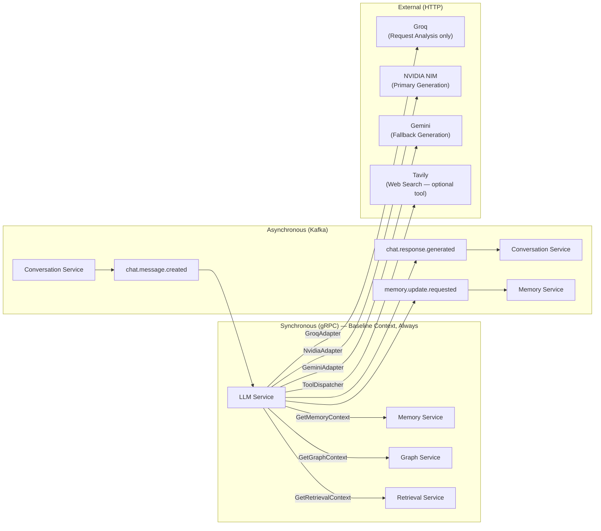

### 24.4 gRPC Connection Management

All gRPC connections to internal services are managed through a connection pool:
- **Connection Pool Size:** 10–50 connections per service (configurable)
- **Keep-alive:** gRPC HTTP/2 keep-alive pings every 30s
- **Load Balancing:** Client-side round-robin across service pod IPs (via Kubernetes DNS)
- **TLS:** mTLS enforced for all internal gRPC connections (using Istio service mesh)
- **Deadlines:** All gRPC calls include a deadline (default: 2000ms)

---

## 25. gRPC APIs

### 25.1 Overview

This section defines the gRPC service contracts that the LLM Service uses to communicate with internal baseline context providers. These are **consumer-perspective** definitions — the LLM Service is the client for all of these APIs. All three are invoked exclusively by the Context Collector; no other component holds a gRPC client to these services.

### 25.2 Memory Service gRPC API

```protobuf
service MemoryService {
  // Fetch all relevant memory context for a conversation
  rpc GetMemoryContext(GetMemoryContextRequest) returns (GetMemoryContextResponse);

  // Fetch only short-term conversation history
  rpc GetShortTermMemory(GetShortTermMemoryRequest) returns (GetShortTermMemoryResponse);
}

message GetMemoryContextRequest {
  string conversation_id = 1;
  string user_id = 2;
  string query = 3;           // for semantic memory retrieval
  MemoryScope scope = 4;      // SHORT_TERM | MEDIUM | LONG_TERM | SEMANTIC | ALL
  int32 max_tokens = 5;       // token budget for memory section
  string trace_id = 6;
}

message MemoryScope {
  enum Value {
    SHORT_TERM = 0;
    MEDIUM = 1;
    LONG_TERM = 2;
    SEMANTIC = 3;
    ALL = 4;
  }
}

message GetMemoryContextResponse {
  repeated Message short_term_messages = 1;
  string medium_summary = 2;
  repeated Fact long_term_facts = 3;
  repeated SemanticSnippet semantic_snippets = 4;
  int32 total_tokens = 5;
  string request_id = 6;
}

message Message {
  string role = 1;            // "user" | "assistant"
  string content = 2;
  int64 timestamp = 3;
  string message_id = 4;
}

message Fact {
  string content = 1;
  float confidence = 2;
  string category = 3;
  int64 last_updated = 4;
}

message SemanticSnippet {
  string content = 1;
  float relevance_score = 2;
  string source_message_id = 3;
}
```

### 25.3 Graph Service gRPC API

```protobuf
service GraphService {
  // Fetch relevant graph context for a query
  rpc GetGraphContext(GetGraphContextRequest) returns (GetGraphContextResponse);

  // Fetch specific nodes by ID
  rpc GetNodesByIds(GetNodesByIdsRequest) returns (GetNodesByIdsResponse);
}

message GetGraphContextRequest {
  string user_id = 1;
  string conversation_id = 2;
  string query = 3;           // for semantic node retrieval
  int32 max_nodes = 4;        // limit on returned nodes
  int32 max_depth = 5;        // graph traversal depth
  int32 max_tokens = 6;       // token budget for graph section
  string trace_id = 7;
}

message GetGraphContextResponse {
  repeated GraphNode nodes = 1;
  repeated GraphRelationship relationships = 2;
  string subgraph_summary = 3;    // LLM-friendly text summary
  int32 total_tokens = 4;
  string request_id = 5;
}

message GraphNode {
  string node_id = 1;
  string label = 2;
  string node_type = 3;
  map<string, string> properties = 4;
  float relevance_score = 5;
}

message GraphRelationship {
  string from_node_id = 1;
  string to_node_id = 2;
  string relationship_type = 3;
  map<string, string> properties = 4;
}
```

### 25.4 Retrieval Service gRPC API

```protobuf
service RetrievalService {
  // Retrieve top-k relevant document chunks
  rpc GetRelevantChunks(GetRelevantChunksRequest) returns (GetRelevantChunksResponse);
}

message GetRelevantChunksRequest {
  string user_id = 1;
  string conversation_id = 2;
  string query = 3;
  int32 top_k = 4;
  RetrievalScope scope = 5;   // FILES | KNOWLEDGE_BASE | ALL
  repeated string file_ids = 6;   // for Ask Files mode
  float min_relevance_score = 7;
  int32 max_tokens = 8;
  string trace_id = 9;
}

message GetRelevantChunksResponse {
  repeated DocumentChunk chunks = 1;
  int32 total_tokens = 2;
  string request_id = 3;
}

message DocumentChunk {
  string chunk_id = 1;
  string content = 2;
  string source_file_id = 3;
  string source_name = 4;
  float relevance_score = 5;
  map<string, string> metadata = 6;
}
```

### 25.5 LLM Service Exposed gRPC API

The LLM Service also exposes its own gRPC API for internal admin tools and health probes:

```protobuf
service LLMService {
  // Health check
  rpc HealthCheck(HealthCheckRequest) returns (HealthCheckResponse);

  // Get current provider health status (groq, nvidia, gemini)
  rpc GetProviderHealth(ProviderHealthRequest) returns (ProviderHealthResponse);

  // Get current Workflow Engine dispatch stats (mode_handler vs langgraph split)
  rpc GetWorkflowEngineStats(WorkflowEngineStatsRequest) returns (WorkflowEngineStatsResponse);

  // Trigger a direct (non-Kafka) completion for internal tools (admin only)
  rpc DirectComplete(DirectCompleteRequest) returns (stream DirectCompleteResponse);
}
```

---

## 26. Kafka Topics

### 26.1 Overview

The LLM Service participates in the following Kafka topics. Topic design follows the **event-first principle**: events are the source of truth for inter-service communication.

### 26.2 Consumed Topics

#### `chat.message.created`
- **Produced by:** Conversation Service
- **Consumed by:** LLM Service (consumer group: `llm-service-group`)
- **Partitioning Key:** `conversation_id`
- **Retention:** 7 days
- **Replication Factor:** 3
- **Partitions:** 64 (supports 64× parallel consumption)

**Schema:**
```json
{
  "event_type": "chat.message.created",
  "schema_version": "2.0",
  "message_id": "msg_abc123",
  "conversation_id": "conv_xyz789",
  "user_id": "user_def456",
  "content": "Explain quantum entanglement",
  "mode_hint": "tutor",
  "file_ids": [],
  "metadata": {
    "client_timestamp": "2026-08-07T14:47:51Z",
    "client_version": "3.2.1"
  },
  "trace_context": {
    "traceparent": "00-abc123-def456-01",
    "tracestate": ""
  },
  "timestamp": "2026-08-07T14:47:51.234Z"
}
```

Note the field rename from `mode` to `mode_hint` in schema `2.0` — the client's mode selection is now explicitly treated as a hint that the Request Analyzer may confirm or override, not an authoritative directive.

### 26.3 Produced Topics

#### `chat.response.chunk`
- **Produced by:** LLM Service
- **Consumed by:** Conversation Service
- **Purpose:** Streaming token delivery
- **Partitioning Key:** `conversation_id`

#### `chat.response.generated`
- **Produced by:** LLM Service
- **Consumed by:** Conversation Service, Memory Service, Analytics Service
- **Purpose:** Final response with full metadata for downstream processing
- **Partitioning Key:** `conversation_id`

**Schema:**
```json
{
  "event_type": "chat.response.generated",
  "schema_version": "2.0",
  "response_id": "resp_ghi789",
  "conversation_id": "conv_xyz789",
  "user_id": "user_def456",
  "request_message_id": "msg_abc123",
  "full_content": "Quantum entanglement is...",
  "provider": "nvidia",
  "generation_fallback_used": false,
  "mode": "tutor",
  "skill": "tutor",
  "engine_type": "mode_handler",
  "usage": {
    "prompt_tokens": 1200,
    "completion_tokens": 320,
    "total_tokens": 1520
  },
  "cost_usd": 0.0076,
  "latency_ms": 1840,
  "ttft_ms": 520,
  "finish_reason": "stop",
  "tools_used": [],
  "context_sources": ["memory", "graph", "retrieval"],
  "trace_context": {
    "traceparent": "00-abc123-def456-01"
  },
  "timestamp": "2026-08-07T14:47:53.074Z"
}
```

#### `memory.update.requested`
- **Produced by:** LLM Service
- **Consumed by:** Memory Service
- **Purpose:** Signal Memory Service to asynchronously update memory after a response
- **Partitioning Key:** `conversation_id`

**Schema:**
```json
{
  "event_type": "memory.update.requested",
  "conversation_id": "conv_xyz789",
  "user_id": "user_def456",
  "user_message": "Explain quantum entanglement",
  "assistant_response": "Quantum entanglement is...",
  "mode": "tutor",
  "timestamp": "2026-08-07T14:47:53.100Z"
}
```

#### `chat.message.dlq` (Dead Letter Queue)
- **Produced by:** LLM Service (on deserialization failures or permanent processing errors)
- **Consumed by:** Operations team / monitoring
- **Purpose:** Capture and alert on unprocessable messages

### 26.4 Kafka Configuration

| Parameter | Value | Rationale |
|---|---|---|
| `acks` | all | Strongest durability guarantee |
| `compression.type` | lz4 | Fast compression for high throughput |
| `max.message.bytes` | 2MB | LLM responses can be large |
| `retention.ms` | 7 days | Allow replay for debugging |
| `min.insync.replicas` | 2 | Tolerate one broker failure |
| Consumer `enable.auto.commit` | false | Manual commit for at-least-once |
| Consumer `max.poll.interval.ms` | 300000 | Allow 5 min for slow LangGraph iterations |

---

## 27. External APIs

### 27.1 Overview

The LLM Service interacts with the following external APIs. All external calls go through the Generation Router (for the two generation providers), the Request Analyzer's Groq adapter (for planning), or the Tool Dispatcher (for tool providers). There is no generic multi-provider abstraction layer — each integration is a purpose-built adapter.

### 27.2 LLM Provider APIs

| Provider | Role | API Base URL | Auth Method | Rate Limit Strategy |
|---|---|---|---|---|
| Groq | Request Analysis only | `https://api.groq.com/openai/v1` | Bearer token | Exponential backoff |
| NVIDIA NIM | Response generation (primary) | `https://integrate.api.nvidia.com/v1` | Bearer token | Exponential backoff + quota monitoring |
| Google Gemini | Response generation (fallback only) | `https://generativelanguage.googleapis.com/v1beta` | API key | Exponential backoff + quota monitoring |

No other LLM providers are integrated. This is a deliberate reduction in surface area relative to earlier designs that considered a broader multi-provider abstraction (LiteLLM) capable of routing to providers such as OpenAI, Anthropic, or Azure OpenAI — none of which are part of the final architecture.

### 27.3 Web Search APIs

| Provider | Primary Use | Fallback |
|---|---|---|
| **Tavily API** | Primary web search (optimized for LLM use) | Bing Search API |
| **Bing Search API** | Fallback web search | None |

**Tavily Integration:**
```text
POST https://api.tavily.com/search
{
  "query": "string",
  "search_depth": "advanced",
  "max_results": 10,
  "include_answer": true,
  "include_raw_content": false
}
```

### 27.4 API Key Management

All external API keys are managed through:
- **Kubernetes Secrets** for deployment-level key storage
- **HashiCorp Vault** (planned) for production-grade secret rotation
- **Environment variable injection** at container startup
- **No hardcoded secrets** in source code or container images

### 27.5 Rate Limiting and Quota Management

The LLM Service maintains per-provider rate limit state using Redis:
- Tracks requests per minute and tokens per minute for Groq, NVIDIA, and Gemini independently
- Proactively fails over from NVIDIA to Gemini before hitting hard limits
- Emits `provider_quota_usage_pct` metric for capacity planning

---

## 28. Technology Stack

### 28.1 Core Framework

| Component | Technology | Version | Rationale |
|---|---|---|---|
| Web Framework | FastAPI | ≥0.111 | High-performance async Python API framework |
| ASGI Server | Uvicorn + Gunicorn | ≥0.30 | Production-grade ASGI server with multi-worker support |
| Data Validation | Pydantic v2 | ≥2.7 | Fast, type-safe data validation and serialization |

### 28.2 AI Orchestration

| Component | Technology | Version | Rationale |
|---|---|---|---|
| Agentic Workflow (Smart, Deep Research only) | LangGraph | ≥0.2 | State-machine-based agentic orchestration, scoped to exactly two graphs |
| Deterministic Orchestration (5 modes) | Standard async Python | 3.11+ | No graph runtime overhead for linear, single-pass modes |
| Prompt Templates | Jinja2 + LangChain Core (templates only) | ≥0.3 | Prompt template management only — no chains, no generic LLM wrapper |
| Generation Abstraction | Generation Router (in-house) | n/a | Purpose-built replacement for LiteLLM; owns NVIDIA/Gemini selection, fallback, and streaming |
| Token Counting | tiktoken + provider-specific tokenizers | ≥0.7 | Accurate token accounting per target model |

### 28.3 Communication

| Component | Technology | Rationale |
|---|---|---|
| gRPC Client | grpcio + grpcio-tools | Standard Python gRPC library |
| Async gRPC | grpcio-asyncio | Async support for non-blocking gRPC calls |
| Kafka Consumer/Producer | aiokafka | Async Kafka client for Python |
| HTTP Client | httpx (async) | Async HTTP for external API calls |

### 28.4 Reliability

| Component | Technology | Rationale |
|---|---|---|
| Retry Logic | Tenacity | Flexible retry with backoff, jitter, and conditions |
| Circuit Breaker | PyBreaker | Python circuit breaker implementation |
| Rate Limiting | slowapi | FastAPI-compatible rate limiting |

### 28.5 Observability

| Component | Technology | Rationale |
|---|---|---|
| Distributed Tracing | OpenTelemetry SDK (Python) | Industry-standard distributed tracing |
| Metrics | Prometheus Client (prometheus-client) | Standard metrics exposition |
| Logging | Structlog | Structured JSON logging for log aggregation |
| Trace Exporter | OTLP → Jaeger / Tempo | Flexible trace backend |

### 28.6 Infrastructure

| Component | Technology | Rationale |
|---|---|---|
| Containerization | Docker | Standard container runtime |
| Orchestration | Kubernetes (K8s) | Production-grade container orchestration |
| Service Mesh | Istio | mTLS, traffic management, circuit breaking at infra level |
| Cache | Redis (optional) | Rate limit state, token budget caching |
| Secret Management | Kubernetes Secrets + Vault | Secure API key management |

### 28.7 Full Technology Stack Diagram

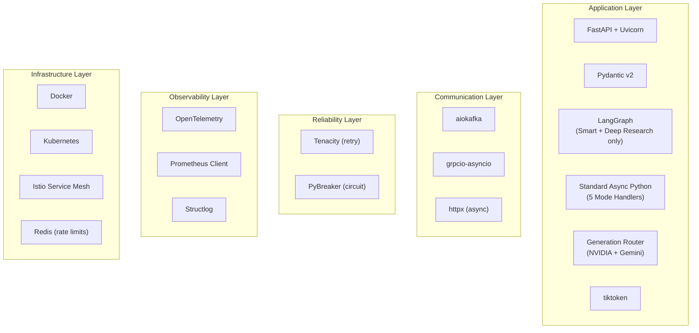

---
## 29. Scalability

### 29.1 Design Principles for 100M+ Users

#### Stateless Architecture
The LLM Service is completely stateless. No request state is stored in the service process. All state flows through:
- Kafka events (request/response)
- gRPC calls to stateful services (Memory, Graph, Retrieval)
- The LangGraph state object (ephemeral, per-request, exists only for `SmartGraph` and `DeepResearchGraph` invocations)

This enables **unlimited horizontal scaling** — adding more pods immediately adds proportional capacity.

#### Kafka-Based Backpressure
Consumer throughput is controlled by Kafka consumer group configuration:
- **Partition count (64)** determines maximum parallelism
- **max.poll.records** limits batch size per consumer iteration
- **Consumer group rebalancing** automatically redistributes partitions across new pods

#### Parallel Context Collection
By fetching Memory, Graph, and Retrieval context in parallel (`asyncio.gather`), the pipeline latency is bounded by the slowest service — not the sum of all service latencies. This holds true regardless of which mode ultimately handles the request, since context collection always happens before the Workflow Engine is even invoked.

#### Async Processing Throughout
All I/O operations (Kafka, gRPC, HTTP) are fully async using Python asyncio:
- A single pod can handle hundreds of concurrent requests
- No thread-per-request overhead
- Backpressure naturally propagates through async queues

#### Engine-Aware Capacity Planning
Because `Smart` and `Deep Research` run on LangGraph and typically involve multiple tool round-trips, they consume meaningfully more wall-clock time and compute per request than the five Mode Handler-based modes. Capacity planning tracks `llm_workflow_engine_dispatch_total{engine_type}` to forecast the mix of cheap vs. expensive requests and size pods accordingly, rather than assuming a uniform per-request cost.

### 29.2 Horizontal Scaling Strategy

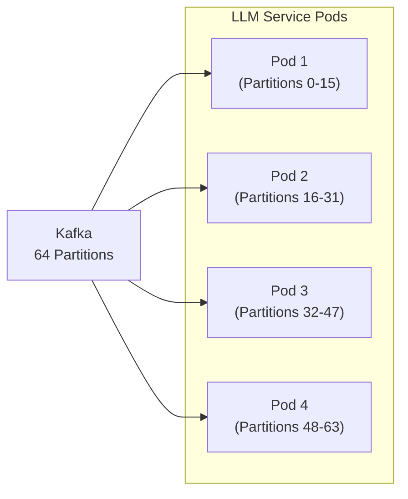

**Scaling Trigger (HPA):**
- Scale up: Kafka consumer lag > 500 messages OR CPU > 70% OR `llm_workflow_engine_dispatch_total{engine_type="langgraph"}` share > 25% of traffic (LangGraph requests are costlier)
- Scale down: Kafka consumer lag < 50 messages AND CPU < 30%
- Min replicas: 4 (one per AZ for HA)
- Max replicas: 64 (matches Kafka partition count)

### 29.3 Token Throughput Targets

| Scale | Requests/sec | Pods Required | Tokens/min |
|---|---|---|---|
| 10K users | 500 req/s | 4 | 60M |
| 100K users | 5,000 req/s | 40 | 600M |
| 1M users | 50,000 req/s | 64 (+ multi-cluster) | 6B |
| 100M users | 500,000 req/s | Multi-region, 640+ | 60B |

At 100M users, a multi-region deployment with regional Kafka clusters and regional LLM Service fleets is required.

### 29.4 Cost Efficiency by Design

Because Groq (fast, cheap, structured-output-optimized) is used only for planning and never for generation, and because only two of seven modes pay the LangGraph orchestration tax, the architecture keeps the majority of traffic on the cheapest viable execution path by default. The Request Analyzer's mode selection is therefore also, implicitly, a cost-control decision — routing a request to `Smart` or `Deep Research` when a simpler mode would suffice is treated as a mode-selection quality issue and tracked via `llm_workflow_engine_dispatch_total`.

---

## 30. High Availability

### 30.1 HA Architecture

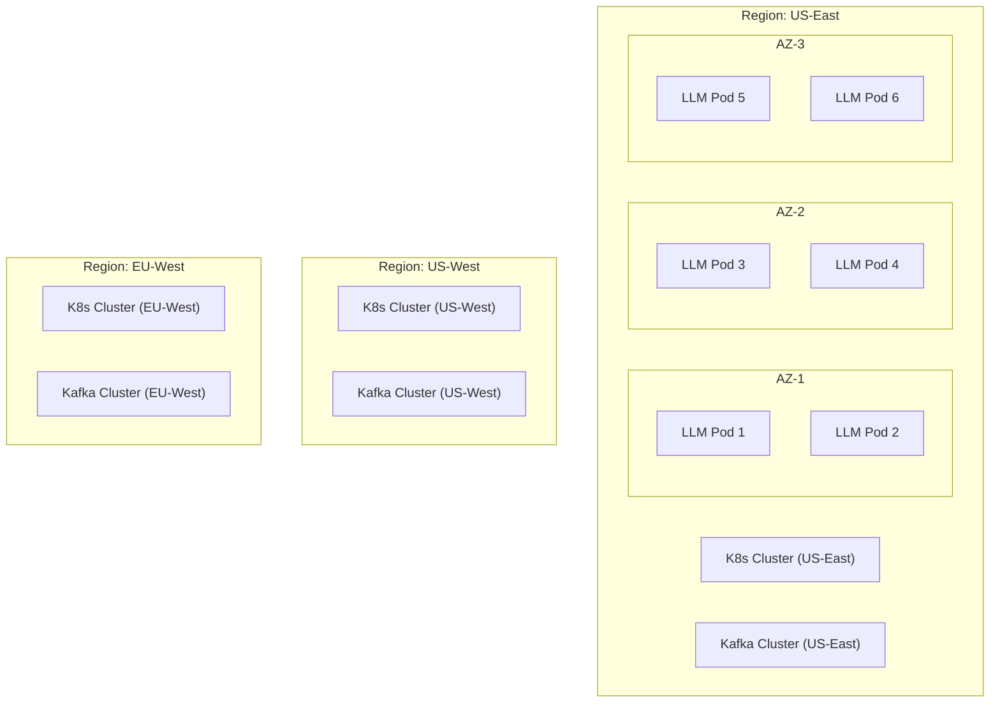

### 30.2 HA Mechanisms

| Mechanism | Description |
|---|---|
| **Multi-AZ Deployment** | Pods spread across ≥3 AZs using Pod Anti-Affinity rules |
| **Kafka Replication** | Replication factor 3, min ISR 2 — tolerates one broker failure |
| **Generation Provider Failover** | Circuit breakers + Generation Router fallback (NVIDIA → Gemini) ensures provider failures are transparent |
| **Planning Provider Degradation** | Circuit breaker on Groq falls back to a minimal heuristic Execution Plan rather than blocking the pipeline |
| **Context Provider Degradation** | Each of Memory/Graph/Retrieval degrades independently; no single context provider failure blocks a request |
| **gRPC Retries** | All gRPC calls have retries + deadline propagation |
| **Health Probes** | Kubernetes liveness (process health) and readiness (can serve traffic) probes |
| **Rolling Updates** | Zero-downtime deployments via Kubernetes RollingUpdate strategy |
| **PodDisruptionBudget** | Ensures ≥50% of pods remain available during node maintenance |

### 30.3 Recovery Time Objectives

| Failure Scenario | RTO | RPO |
|---|---|---|
| Single pod failure | < 30s (K8s restarts) | 0 (Kafka redelivers) |
| Single AZ failure | < 60s (pods reschedule) | 0 (Kafka redelivers) |
| NVIDIA outage (Gemini fallback) | < 5s (circuit breaker + fallback) | 0 |
| Groq outage (heuristic plan fallback) | < 2s (circuit breaker) | 0 |
| Both NVIDIA and Gemini outage | Manual incident response | 0 (requests queue in Kafka for replay) |
| Kafka broker failure | < 10s (partition leader election) | 0 |
| Full region failure | < 5min (global DNS failover) | Last checkpoint |

---

## 31. Failure Handling

### 31.1 Failure Taxonomy

The LLM Service can experience failures in three categories:

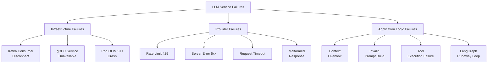

### 31.2 Failure Responses

#### Kafka Consumer Disconnect
- **Detection:** aiokafka connection error callback
- **Response:** Exponential reconnect with jitter; pod restarts if reconnect fails 5× in a row
- **User Impact:** Delayed response (messages queued in Kafka during disconnect)

#### gRPC Service Unavailable (Baseline Context Provider)
- **Detection:** gRPC status code UNAVAILABLE
- **Response:** Context Collector treats the affected source (Memory, Graph, or Retrieval) as empty and proceeds; the other two sources are unaffected since all three calls are independent
- **User Impact:** Degraded response quality (missing one context source) rather than failure

#### Request Analyzer (Groq) Unavailable
- **Detection:** Circuit breaker on the `groq` circuit trips
- **Response:** Fall back to a minimal heuristic Execution Plan (`mode=default`, `strategy=DIRECT`, `tools=[]`); log and alert
- **User Impact:** Request is routed to Default mode even if a more specific mode would have been selected; graceful rather than a hard failure

#### Generation Provider Rate Limit (429) — NVIDIA
- **Detection:** HTTP 429 response from NVIDIA NIM
- **Response:** Generation Router immediately fails over to Gemini; no retry against NVIDIA
- **User Impact:** Transparent to user; response from Gemini instead of NVIDIA

#### Generation Provider Server Error (5xx) — NVIDIA
- **Detection:** HTTP 5xx response from NVIDIA NIM
- **Response:** Retry Manager retries once with backoff (pre-first-token only); fail over to Gemini on exhaustion; Circuit Breaker opens `nvidia` circuit after threshold
- **User Impact:** Potential delay of 200-500ms; transparent if fallback succeeds

#### Both Generation Providers Unavailable
- **Detection:** `nvidia` and `gemini` circuits both open
- **Response:** Structured error response published via Kafka; PagerDuty critical alert fires
- **User Impact:** User-facing error message; this is treated as a critical incident, not a routine degradation

#### Context Window Overflow
- **Detection:** Token counter exceeds model limit after Context Window Manager trimming
- **Response:** Hard trim to absolute minimum context (system + query only); log warning
- **User Impact:** Response may lack context; acceptable degradation

#### Tool Execution Failure (Optional Tool)
- **Detection:** Tool raises exception or timeout exceeded
- **Response:** Mark tool result as failed; include a graceful note in the prompt; proceed unless `required=true`
- **User Impact:** Response may acknowledge inability to perform tool-dependent action

#### LangGraph Runaway Loop
- **Detection:** `llm_langgraph_loop_iterations` exceeds a configured maximum (default: 6 for `SmartGraph`, 4 for `DeepResearchGraph`)
- **Response:** Graph forcibly exits the loop and proceeds to the terminal `Prompt`/`Generate Report` node with whatever information has been gathered so far
- **User Impact:** Response may be based on incomplete research/tool results rather than failing outright

### 31.3 Graceful Degradation Hierarchy

```text
Full response with all baseline context (ideal path)
  ↓ Memory Service unavailable
Response without memory context (degraded)
  ↓ Graph Service also unavailable
Response without graph + memory (more degraded)
  ↓ Request Analyzer (Groq) unavailable
Response using heuristic Default-mode plan (degraded planning)
  ↓ Primary generation provider (NVIDIA) unavailable
Response from fallback provider (Gemini) — transparent to user
  ↓ Both generation providers unavailable
Structured error response via Kafka — critical incident
```

### 31.4 Dead Letter Queue (DLQ)

Messages that fail all retry attempts are published to `chat.message.dlq`:
- Operations team is alerted via PagerDuty
- DLQ messages can be replayed after the root cause is resolved
- DLQ retention: 30 days

---

## 32. Security

### 32.1 Threat Model

The LLM Service faces unique security threats specific to AI systems:

| Threat | Category | Mitigation |
|---|---|---|
| Prompt Injection | AI-specific | Input sanitization, system prompt hardening |
| Jailbreaking | AI-specific | Safety classifier before Request Analyzer and before generation |
| PII leakage in prompts | Data privacy | PII detection + masking in Prompt Builder |
| API key exposure | Secrets management | Kubernetes Secrets + Vault |
| Unauthorized access to user data | Access control | User-scoped gRPC calls (`user_id` in all requests) |
| Provider API abuse | Cost control | Rate limiting + quota monitoring per provider (Groq, NVIDIA, Gemini) |
| Man-in-the-middle | Network | mTLS for all internal communication |
| Excessive token consumption | Cost/DoS | Token budget enforcement + per-user rate limits |
| Tool misuse (e.g., search query injection) | AI-specific | Tool input validation in Tool Dispatcher before dispatch |
| Unbounded LangGraph loops | Availability | Hard iteration caps on `SmartGraph` and `DeepResearchGraph` |

### 32.2 Authentication and Authorization

**Internal gRPC Calls:**
- mTLS enforced via Istio service mesh (certificate-based service identity)
- Service account authorization: LLM Service can only call specific gRPC methods on Memory, Graph, and Retrieval services

**Kafka:**
- SASL/SCRAM authentication for Kafka producers and consumers
- ACLs: LLM Service can only produce to whitelisted topics

**External API calls:**
- API keys for Groq, NVIDIA NIM, Gemini, and Tavily stored in Kubernetes Secrets, injected at runtime
- Never logged or exposed in traces (keys masked in Structlog)

### 32.3 Prompt Injection Defense

User input passes through an input sanitization layer before being included in any prompt:
1. **Delimiter injection prevention:** System prompt delimiters are escaped in user input
2. **Instruction override detection:** Patterns like "ignore previous instructions" are flagged and logged
3. **Content policy enforcement:** Safety classifier (using a lightweight model) gates every user message before it reaches the Request Analyzer

### 32.4 PII Protection

The Prompt Builder applies PII detection before assembling prompts:
- Detect common PII patterns: email, phone, SSN, credit card numbers
- Mask detected PII in prompts sent to external providers (Groq, NVIDIA, Gemini)
- Log PII detection events (without the PII itself) for compliance monitoring

### 32.5 Rate Limiting

Per-user rate limiting enforced at the Kafka consumer level:
- **Free tier:** 20 requests/minute
- **Pro tier:** 100 requests/minute
- **Enterprise:** Custom limits

Requests exceeding limits are dropped with an error event published to Kafka for the Conversation Service to surface to the user.

### 32.6 Audit Logging

Every generation event is logged for compliance:
```json
{
  "audit_event": "llm_generation",
  "user_id": "user_abc",
  "conversation_id": "conv_xyz",
  "mode": "tutor",
  "engine_type": "mode_handler",
  "provider": "nvidia",
  "tokens_used": 1520,
  "timestamp": "2026-08-07T14:47:53Z",
  "pii_detected": false,
  "safety_check_passed": true
}
```

---
## 33. Future Extensibility

### 33.1 Extension Points

The LLM Service is designed for extensibility at four key points:

#### 1. New Mode Registration
Adding a new mode requires a decision, up front, about which execution engine it belongs to:
- If the mode is deterministic and single-pass → implement a new `ModeHandler` and register it in the Mode Dispatcher's `handlers` map. No LangGraph involvement.
- If the mode is genuinely agentic (requires loops, dynamic tool selection, or multi-step re-planning) → implement a new LangGraph graph and register it in the Mode Dispatcher's `graphs` map.
- Either way: register the mode in the Mode Registry (config, no core code change), optionally add a new prompt template, optionally register new tools.

#### 2. New Tool Registration
Adding a new tool requires:
- Implement the `BaseTool` interface
- Register it in the `ToolRegistry` with a timeout and failure policy (see [Section 14](#14-tool-framework))
- Add the tool's capability description to the Request Analyzer's tool knowledge so it can be selected in future Execution Plans

No changes to the Request Analyzer's core logic, Context Collector, or Prompt Builder are needed. Critically, adding a tool never involves touching the baseline context path — Memory, Graph, and Retrieval remain structurally separate from the Tool Registry permanently (see [Section 14.1](#141-core-distinction-baseline-context-providers-vs-tools)).

#### 3. New Generation Provider
The Generation Router is intentionally narrow — it knows about exactly two generation providers (NVIDIA primary, Gemini fallback) plus Groq for planning. Adding a third generation provider (e.g., as a second fallback, or to replace Gemini) requires:
- Implement a new `ProviderAdapter`
- Add provider credentials to Kubernetes Secrets
- Extend the Generation Router's fallback chain (a small, explicit code change — not a config-only change, by design, since fallback ordering has real cost and quality implications that deserve code review)

This is a deliberate trade-off: a narrower, purpose-built Generation Router is less "instantly pluggable" than a generic 100+-provider abstraction would have been, but it is easier to reason about, test, and keep the fallback behavior correct and observable — which is why LiteLLM was removed in favor of this component.

#### 4. New Skill / Prompt Template
- Add a new YAML prompt template to the `prompts/` directory
- Register the skill in `SkillRegistry`
- Deploy via CI/CD

### 33.2 Future Mode Roadmap

```mermaid
gantt
    title Future Mode Rollout
    dateFormat YYYY-Q
    axisFormat %Y Q%q

    section Phase 1 (Current — Final Architecture)
    Default Mode (Handler)        :done, 2026-Q1, 2026-Q2
    Tutor Mode (Handler)          :done, 2026-Q2, 2026-Q3
    Code Mode (Handler)           :done, 2026-Q3, 2026-Q4
    Ask Files Mode (Handler)      :done, 2026-Q3, 2026-Q4
    Web Search Mode (Handler)     :done, 2026-Q2, 2026-Q3
    Smart Mode (LangGraph)        :done, 2026-Q1, 2026-Q2
    Deep Research Mode (LangGraph):done, 2026-Q3, 2026-Q4

    section Phase 2 (Planned)
    Vision Mode (Handler)         :active, 2026-Q4, 2027-Q1
    Browser Tool                  :2026-Q4, 2027-Q1
    GitHub Tool                   :2027-Q1, 2027-Q2

    section Phase 3 (Future)
    SQL Tool                      :2027-Q2, 2027-Q3
    MCP Protocol Tool             :2027-Q2, 2027-Q3
    Slack Tool                    :2027-Q3, 2027-Q4
    Gmail Tool                    :2027-Q3, 2027-Q4
    Calendar Tool                 :2027-Q3, 2027-Q4
    Jira Tool                     :2027-Q4, 2028-Q1
    Multi-File Coding Agent (LangGraph) :2027-Q4, 2028-Q1
```

Note that all Phase 2/3 items listed as "Tool" are additions to the Tool Registry consumed primarily by `SmartGraph`, not new modes — this keeps the mode surface area (currently 7) stable while still growing capability. The one exception under consideration, a Multi-File Coding Agent, would be a new LangGraph graph (not an extension of the existing Code Handler) precisely because multi-file coordination requires the iterative, dynamic-planning behavior that only LangGraph provides in this architecture.

---

## 34. Design Patterns

### 34.1 Patterns Applied in LLM Service

| Pattern | Where Applied | Rationale |
|---|---|---|
| **Event-Driven Architecture** | Kafka consumption and publishing | Decoupling, backpressure, replay |
| **Strategy Pattern** | Mode Handler selection; reasoning strategy (DIRECT/CoT/ReAct) | Extensible mode behavior without if-else chains |
| **Registry Pattern** | Tool Registry, Skill Registry, Mode Registry | Dynamic discovery and extensibility |
| **Chain of Responsibility** | Pipeline stages (Context Collection → Request Analysis → Workflow Dispatch → Generation) | Composable, testable pipeline stages |
| **Dispatcher / Router Pattern** | Mode Dispatcher (inside Workflow Engine); Generation Router | Explicit, centralized routing decisions instead of scattered conditionals |
| **State Machine** | LangGraph agentic workflows (`SmartGraph`, `DeepResearchGraph` only) | Formal, inspectable execution graphs, scoped to genuinely agentic modes |
| **Circuit Breaker** | Per-provider and per-context-service calls | Prevent cascade failures |
| **Bulkhead Pattern** | Separate asyncio task groups per provider and per context service | Isolate provider/service failures from one another |
| **Adapter Pattern** | Provider Adapters (`GroqAdapter`, `NvidiaAdapter`, `GeminiAdapter`) behind the Generation Router | Normalize provider-specific contracts without a generic abstraction library |
| **Observer Pattern** | Observability layer | Decouple metrics/tracing from business logic |
| **Factory Pattern** | Tool instantiation from the Tool Registry | Decouple tool creation from usage |
| **Template Method Pattern** | Prompt templates per mode/skill | Consistent prompt structure with mode-specific customization |
| **Retry Pattern** | Provider API calls, gRPC calls, tool calls | Handle transient failures gracefully |
| **Parallel Scatter-Gather** | Context collection (Memory + Graph + Retrieval) | Minimize latency for multi-source data fetching |

### 34.2 Anti-Patterns Explicitly Avoided

| Anti-Pattern | Why Avoided |
|---|---|
| **God Object** | Each component has a single, well-defined responsibility; the Workflow Engine specifically avoids becoming a monolith by delegating to per-mode handlers and graphs |
| **Uniform Machinery for Non-Uniform Problems** | Not every mode is forced through LangGraph; deterministic modes use plain async Python, avoiding unnecessary graph-state overhead |
| **Tight Coupling to SDK** | All generation calls go through the Generation Router; no direct provider SDK imports outside Provider Adapters |
| **Generic Over-Abstraction** | LiteLLM's broad, generic multi-provider abstraction was replaced with a narrow, purpose-built Generation Router that only models the providers actually in use |
| **Conflating Context with Tools** | Memory, Graph, and Retrieval are never treated as optional tools, avoiding accidental gating of baseline context behind planning decisions |
| **Synchronous blocking** | All I/O is async throughout |
| **Shared mutable state** | LangGraph state is immutable between nodes; new state objects are created at each transition |
| **Magic configuration** | All routing decisions (mode dispatch, provider fallback) are explicit, testable Python and are logged |
| **Hardcoded prompts in code** | All prompts in versioned YAML files |

---
## 35. Folder Structure

### 35.1 High-Level Service Layout

The folder structure below reflects the final architecture directly: `intent/`, `mode/`, `skill/`, and `planner/` submodules from earlier designs have been consolidated into a single `request_analyzer/` module, and a new top-level `workflow_engine/` module holds the Mode Dispatcher, the five standard Mode Handlers, and the two LangGraph graphs side by side — making the deterministic/agentic split visible directly in the codebase layout.

```
llm-service/
├── src/
│   ├── llm_service/
│   │   ├── __init__.py
│   │   ├── main.py                        # FastAPI application entrypoint
│   │   ├── config.py                      # Configuration (Pydantic Settings)
│   │   │
│   │   ├── api/                           # FastAPI routes (health, admin)
│   │   │   ├── __init__.py
│   │   │   ├── health.py
│   │   │   └── admin.py
│   │   │
│   │   ├── consumer/                      # Kafka consumer layer
│   │   │   ├── __init__.py
│   │   │   ├── kafka_consumer.py          # aiokafka consumer
│   │   │   ├── event_dispatcher.py        # Routes events into the pipeline
│   │   │   └── schemas.py                 # Pydantic event schemas
│   │   │
│   │   ├── context/                       # Context Collector (baseline providers only)
│   │   │   ├── __init__.py
│   │   │   ├── context_collector.py       # Parallel gRPC context fetching
│   │   │   ├── degradation.py             # Graceful degradation policy
│   │   │   └── schemas.py                 # ContextBundle model
│   │   │
│   │   ├── request_analyzer/              # Single consolidated planning component
│   │   │   ├── __init__.py
│   │   │   ├── request_analyzer.py        # Orchestrates the single Groq call
│   │   │   ├── groq_client.py             # Groq API client wrapper
│   │   │   ├── prompt_template.py         # Request Analyzer's own prompt
│   │   │   └── schemas.py                 # ExecutionPlan model
│   │   │
│   │   ├── workflow_engine/               # Execution layer — the core of this revision
│   │   │   ├── __init__.py
│   │   │   ├── workflow_engine.py         # Top-level entrypoint (execute())
│   │   │   ├── mode_dispatcher.py         # Routes ExecutionPlan.mode → handler or graph
│   │   │   ├── workflow_result.py         # Normalized output type
│   │   │   │
│   │   │   ├── mode_handlers/             # Standard async Python — no graph runtime
│   │   │   │   ├── __init__.py
│   │   │   │   ├── base_handler.py        # ModeHandler protocol
│   │   │   │   ├── default_handler.py
│   │   │   │   ├── tutor_handler.py
│   │   │   │   ├── code_handler.py
│   │   │   │   ├── ask_files_handler.py
│   │   │   │   └── web_search_handler.py
│   │   │   │
│   │   │   └── langgraph_workflows/       # LangGraph — Smart & Deep Research ONLY
│   │   │       ├── __init__.py
│   │   │       ├── smart_graph.py         # SmartGraph definition + nodes
│   │   │       ├── smart_graph_state.py
│   │   │       ├── deep_research_graph.py # DeepResearchGraph definition + nodes
│   │   │       ├── deep_research_state.py
│   │   │       └── shared/
│   │   │           ├── __init__.py
│   │   │           └── graph_utils.py     # Loop-cap enforcement, shared node helpers
│   │   │
│   │   ├── tools/                         # Tool Framework (optional capabilities only)
│   │   │   ├── __init__.py
│   │   │   ├── base_tool.py               # BaseTool abstract class
│   │   │   ├── tool_registry.py           # Tool registration and discovery
│   │   │   ├── tool_dispatcher.py         # Tool execution and aggregation
│   │   │   │
│   │   │   ├── web_search_tool.py         # Current: production
│   │   │   ├── browser_tool.py            # Future: registered, disabled
│   │   │   ├── github_tool.py             # Future: registered, disabled
│   │   │   ├── sql_tool.py                # Future: registered, disabled
│   │   │   ├── mcp_tool.py                # Future: registered, disabled
│   │   │   ├── slack_tool.py              # Future: registered, disabled
│   │   │   ├── jira_tool.py               # Future: registered, disabled
│   │   │   ├── gmail_tool.py              # Future: registered, disabled
│   │   │   └── calendar_tool.py           # Future: registered, disabled
│   │   │
│   │   ├── prompt/                        # Prompt engineering
│   │   │   ├── __init__.py
│   │   │   ├── prompt_builder.py          # Assembles final prompt
│   │   │   ├── prompt_manager.py          # Template loading and versioning
│   │   │   ├── context_window_manager.py  # Token counting and trimming
│   │   │   └── schemas.py
│   │   │
│   │   ├── generation/                    # Generation Router replaces LiteLLM entirely
│   │   │   ├── __init__.py
│   │   │   ├── generation_router.py       # Primary selection + fallback + streaming abstraction
│   │   │   ├── provider_adapters/
│   │   │   │   ├── __init__.py
│   │   │   │   ├── base_adapter.py        # ProviderAdapter protocol
│   │   │   │   ├── groq_adapter.py        # Request Analysis only
│   │   │   │   ├── nvidia_adapter.py      # Primary generation
│   │   │   │   └── gemini_adapter.py      # Fallback generation
│   │   │   ├── streaming_engine.py        # Token streaming to Kafka
│   │   │   ├── retry_manager.py           # Exponential backoff retry
│   │   │   └── circuit_breaker.py         # Per-provider / per-service circuit breakers
│   │   │
│   │   ├── publisher/                     # Kafka event publishing
│   │   │   ├── __init__.py
│   │   │   ├── kafka_publisher.py
│   │   │   └── schemas.py
│   │   │
│   │   ├── clients/                       # gRPC client stubs (Context Collector only)
│   │   │   ├── __init__.py
│   │   │   ├── memory_client.py
│   │   │   ├── graph_client.py
│   │   │   └── retrieval_client.py
│   │   │
│   │   └── observability/                 # Cross-cutting observability
│   │       ├── __init__.py
│   │       ├── tracing.py                 # OpenTelemetry setup
│   │       ├── metrics.py                 # Prometheus metrics registry
│   │       └── logging.py                 # Structlog configuration
│   │
├── prompts/                               # Versioned prompt templates
│   ├── default_v1.yaml
│   ├── tutor_v2.yaml
│   ├── code_v3.yaml
│   ├── ask_files_v1.yaml
│   ├── web_search_v1.yaml
│   ├── smart/
│   │   ├── planner_v1.yaml
│   │   └── tool_selection_v1.yaml
│   └── deep_research/
│       ├── analyze_v1.yaml
│       ├── compare_sources_v1.yaml
│       ├── summarize_v1.yaml
│       └── generate_report_v1.yaml
│
├── proto/                                 # gRPC protobuf definitions (baseline providers only)
│   ├── memory_service.proto
│   ├── graph_service.proto
│   └── retrieval_service.proto
│
├── docs/                                  # Architecture documentation
│   ├── hld.md                             # This document
│   ├── lld.md                             # Low-Level Design (companion document)
│   └── adr/                               # Architecture Decision Records
│       ├── 0001-remove-litellm-adopt-generation-router.md
│       ├── 0002-scope-langgraph-to-smart-and-deep-research.md
│       ├── 0003-consolidate-intent-planner-into-request-analyzer.md
│       └── 0004-baseline-context-providers-are-not-tools.md
│
├── tests/
│   ├── unit/
│   │   ├── test_context_collector.py
│   │   ├── test_request_analyzer.py
│   │   ├── test_workflow_engine.py
│   │   ├── test_mode_handlers/
│   │   ├── test_langgraph_workflows/
│   │   ├── test_tool_dispatcher.py
│   │   └── test_generation_router.py
│   ├── integration/
│   └── e2e/
│
├── k8s/                                   # Kubernetes manifests
│   ├── deployment.yaml
│   ├── service.yaml
│   ├── hpa.yaml
│   ├── pdb.yaml
│   └── configmap.yaml
│
├── Dockerfile
├── docker-compose.yaml
├── pyproject.toml
└── README.md
```

### 35.2 Why This Structure Matters

- **`request_analyzer/` is singular and flat.** There is deliberately no `intent/`, `planner/`, or `mode_manager/` subpackage — collapsing those into one module at the folder level enforces, structurally, that planning is not distributed across multiple components.
- **`workflow_engine/mode_handlers/` and `workflow_engine/langgraph_workflows/` are siblings under the same parent.** This makes the architectural split between deterministic and agentic execution visible to anyone browsing the repository, and makes it structurally awkward to accidentally add a LangGraph dependency to a Mode Handler file (they live in different subpackages with different allowed imports, enforced via import-linter rules in CI).
- **`tools/` contains only optional capabilities.** Memory, Graph, and Retrieval clients live under `clients/`, consumed exclusively by `context/context_collector.py` — never under `tools/`, reinforcing the architectural boundary from [Section 14](#14-tool-framework) at the codebase level.
- **`generation/` has no `litellm_client.py` or similar generic dependency.** Only three adapters exist, matching the three providers actually used across the whole service (Groq, NVIDIA, Gemini).

---
## 36. Deployment Architecture

### 36.1 Kubernetes Deployment

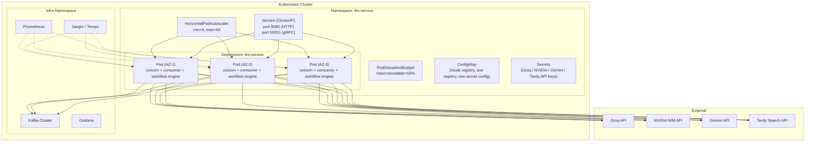

Every pod runs the full pipeline — Kafka Consumer, Context Collector, Request Analyzer, Workflow Engine (both Mode Handlers and LangGraph graphs), Generation Router, and Streaming Engine — as a single process. There is no separate deployment for LangGraph workloads; because only two of seven modes use LangGraph and both share the same latency/resource profile as the rest of the pipeline at current scale, splitting them into a dedicated deployment is not yet warranted. This is revisited in the Scalability section if `Smart`/`Deep Research` traffic share grows large enough to justify dedicated capacity.

### 36.2 Kubernetes Resource Specifications

```yaml
# Resource Requests and Limits
resources:
  requests:
    cpu: "2"
    memory: "4Gi"
  limits:
    cpu: "4"
    memory: "8Gi"

# HPA Configuration
metrics:
  - type: External
    external:
      metric:
        name: kafka_consumer_lag
        selector:
          matchLabels:
            topic: chat.message.created
      target:
        type: AverageValue
        averageValue: "50"
  - type: Resource
    resource:
      name: cpu
      target:
        type: Utilization
        averageUtilization: 70
  - type: Pods
    pods:
      metric:
        name: llm_langgraph_active_executions
      target:
        type: AverageValue
        averageValue: "10"
```

### 36.3 Environment Configuration

| Environment Variable | Purpose | Example |
|---|---|---|
| `GROQ_API_KEY` | Request Analyzer authentication | (secret) |
| `NVIDIA_API_KEY` | Generation Router primary provider authentication | (secret) |
| `GEMINI_API_KEY` | Generation Router fallback provider authentication | (secret) |
| `TAVILY_API_KEY` | Web Search tool authentication | (secret) |
| `MEMORY_SERVICE_GRPC_ADDR` | Context Collector target | `memory-service.internal:50051` |
| `GRAPH_SERVICE_GRPC_ADDR` | Context Collector target | `graph-service.internal:50051` |
| `RETRIEVAL_SERVICE_GRPC_ADDR` | Context Collector target | `retrieval-service.internal:50051` |
| `KAFKA_BOOTSTRAP_SERVERS` | Kafka connection | `kafka.internal:9092` |
| `LANGGRAPH_MAX_LOOP_ITERATIONS_SMART` | Runaway-loop cap for `SmartGraph` | `6` |
| `LANGGRAPH_MAX_LOOP_ITERATIONS_DEEP_RESEARCH` | Runaway-loop cap for `DeepResearchGraph` | `4` |

### 36.4 CI/CD Pipeline

```mermaid
flowchart LR
    Commit["Git Commit"]
    Lint["Lint + Type Check\n(ruff + mypy)"]
    ImportLint["Import Boundary Check\n(mode_handlers ⛔ langgraph imports)"]
    UnitTest["Unit Tests\n(pytest)"]
    Build["Docker Build"]
    IntTest["Integration Tests\n(testcontainers)"]
    ScanSec["Security Scan\n(trivy + bandit)"]
    Push["Push to Registry"]
    DeployDev["Deploy to Dev"]
    DeployStaging["Deploy to Staging"]
    DeployProd["Deploy to Prod\n(canary 5% → 100%)"]

    Commit --> Lint --> ImportLint --> UnitTest --> Build --> IntTest --> ScanSec --> Push --> DeployDev --> DeployStaging --> DeployProd
```

The **Import Boundary Check** is a CI-enforced architectural guardrail unique to this revision: it fails the build if any file under `workflow_engine/mode_handlers/` imports from `langgraph` or from `workflow_engine/langgraph_workflows/`, keeping the deterministic/agentic separation from [Section 10.4](#104-why-the-split-exists) enforced in code, not just in documentation.

---
## 37. Sequence Diagrams

### 37.1 Default Mode — Complete Request Flow (Mode Handler Path)

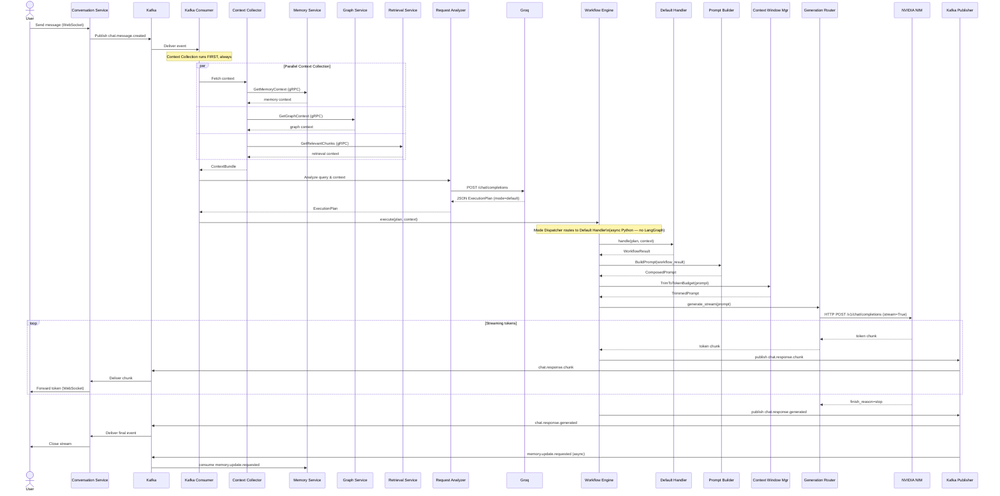

### 37.2 Web Search Mode — Required Tool Dispatch Flow (Mode Handler Path)

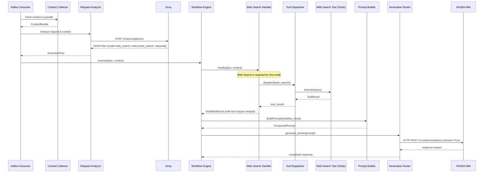

### 37.3 Smart Mode — LangGraph Path with Dynamic Tool Selection

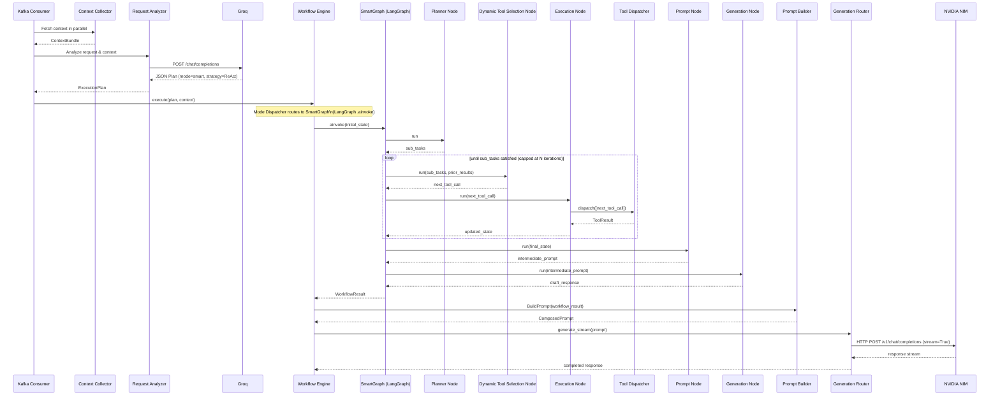

### 37.4 Deep Research Mode — Iterative LangGraph Path

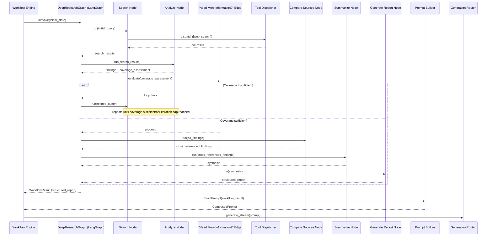

---
## 38. Architecture Diagrams

### 38.1 Complete System Context Diagram

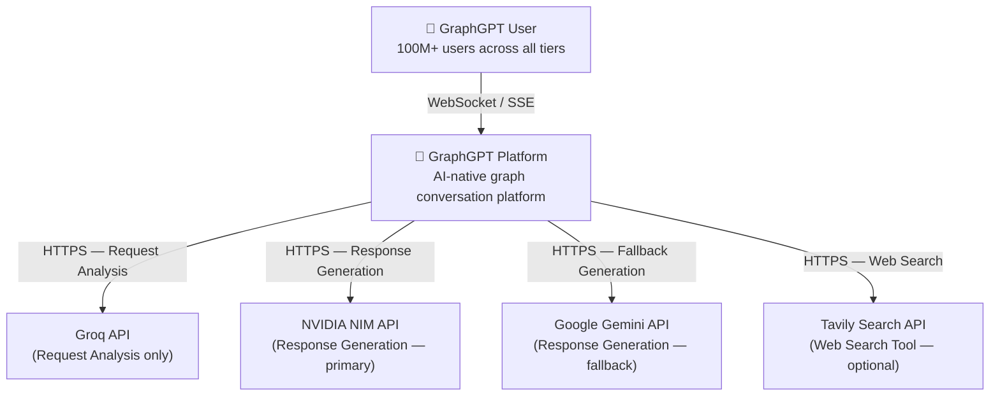

Note that this diagram intentionally shows only three LLM-adjacent external dependencies. There is no generic "LLM Providers" box standing in for an open-ended set of vendors — the final architecture has exactly three, each with a single, non-overlapping role.

### 38.2 Data Flow Diagram

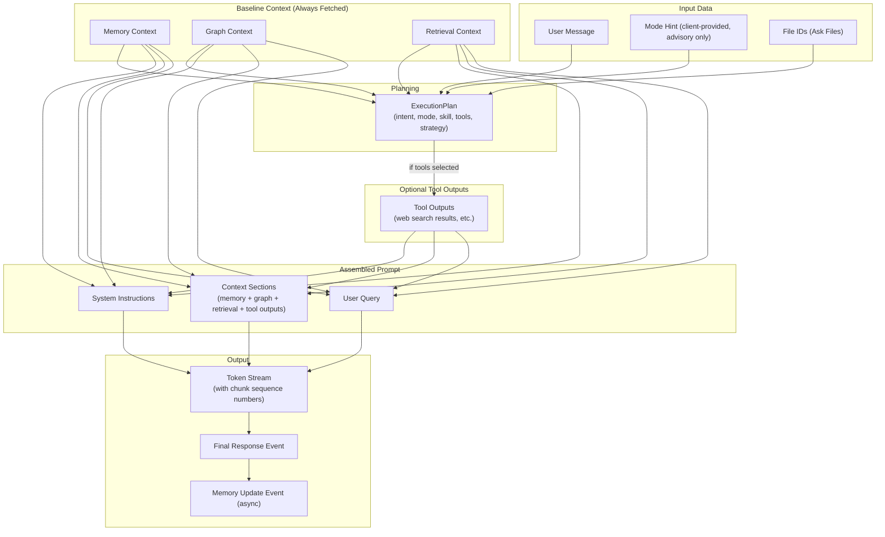

### 38.3 Component Dependency Graph

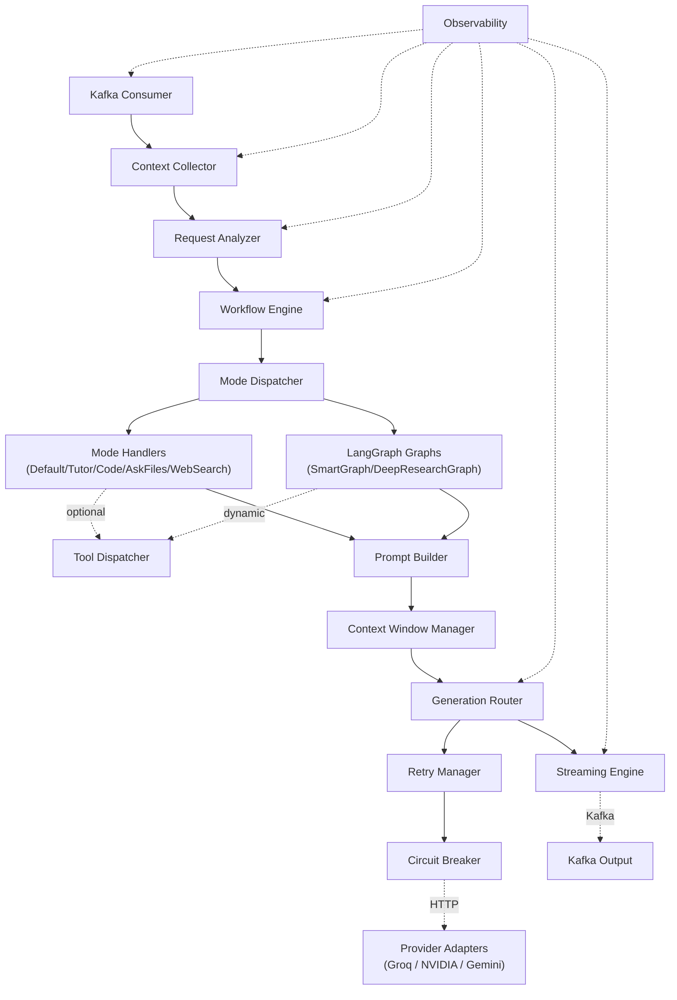

### 38.4 LangGraph Scope Diagram

This diagram exists specifically to make explicit what earlier designs left ambiguous — LangGraph does **not** wrap the service; it is invoked only from within the Workflow Engine, only for two of seven modes.

```mermaid
graph TB
    subgraph "Everything Outside LangGraph's Scope"
        Consumer2["Kafka Consumer"]
        Ctx2["Context Collector"]
        Analyzer2["Request Analyzer (Groq)"]
        MD2["Mode Dispatcher"]
        MH2["Default / Tutor / Code /\nAsk Files / Web Search Handlers"]
        PB2["Prompt Builder"]
        CWM2["Context Window Manager"]
        GR2["Generation Router (NVIDIA / Gemini)"]
        SE2["Streaming Engine"]
        Pub2["Kafka Publisher"]
    end

    subgraph "LangGraph's Scope — Smart & Deep Research Only"
        SG2["SmartGraph"]
        DRG2["DeepResearchGraph"]
    end

    Consumer2 --> Ctx2 --> Analyzer2 --> MD2
    MD2 -->|"5 modes"| MH2
    MD2 -->|"2 modes"| SG2
    MD2 -->|"2 modes"| DRG2
    MH2 --> PB2
    SG2 --> PB2
    DRG2 --> PB2
    PB2 --> CWM2 --> GR2 --> SE2 --> Pub2
```

---

## Summary: LLM Service at a Glance

### Architecture Philosophy

The LLM Service is built on four foundational architectural beliefs:

1. **AI Orchestration must be explicit, not implicit.** Every decision — which mode, which tools, which model, which context — is logged, traced, and observable. There are no black-box routing decisions.

2. **Use the minimum orchestration machinery a workflow actually needs.** Deterministic, single-pass modes run on plain async Python; only genuinely agentic modes (`Smart`, `Deep Research`) pay the cost of LangGraph's state machine. This is enforced at the folder-structure and CI-import level, not just documented.

3. **Failure is inevitable; graceful degradation is the design.** The service is built to degrade gracefully at every layer — from provider outages to tool failures to context overflow — without surfacing hard errors to users.

4. **Extensibility is a first-class concern, and it's still bounded.** The tool registry, mode registry, and skill registry allow new capabilities to be added with minimal changes to core orchestration logic, while the number of generation providers and the LangGraph surface area stay deliberately narrow.

### Key Metrics Summary

| Metric | Target |
|---|---|
| End-to-end TTFT (Time to First Token) — Mode Handler path | < 650ms (p50) |
| End-to-end TTFT — LangGraph path | < 1200ms (p50) |
| p95 TTFT (Mode Handler path) | < 1500ms |
| Context collection latency | < 100ms (parallel) |
| Generation provider failover time (NVIDIA → Gemini) | < 5s |
| Request Analyzer failover time (Groq degraded plan) | < 2s |
| System availability | 99.95% |
| Maximum scale | 64 Kafka partitions × N pods |
| Token cost efficiency | Tiered by user plan; Groq reserved for planning only |

### Decision Log

| Decision | Rationale |
|---|---|
| Consolidate Intent Analyzer + Planner into Request Analyzer | One Groq call is faster, simpler to trace, and removes cross-component consistency risk between separately-reasoned intent and plan |
| Rename Mode Handler concept to Workflow Engine | The component must dispatch to two structurally different engines (Python handlers, LangGraph graphs); "Mode Handler" implied uniform handling |
| Restrict LangGraph to Smart and Deep Research only | Only these two modes require conditional routing, loops, and dynamic tool execution; forcing every mode through LangGraph adds unnecessary state-management overhead |
| Treat Memory/Graph/Retrieval as baseline context providers, not tools | They are unconditionally required on every request; modeling them as tools would incorrectly imply they are optional and planner-gated |
| Remove LiteLLM, introduce Generation Router | A purpose-built, narrow component covering exactly three providers (Groq, NVIDIA, Gemini) is easier to test, trace, and reason about than a generic 100+-provider abstraction the service doesn't need |
| NVIDIA as primary, Gemini as fallback, Groq for planning only | Cleanly separates cost/latency-sensitive planning from quality-sensitive generation, and gives generation a well-defined single fallback path |
| Kafka over direct gRPC for Conversation → LLM | Backpressure, at-least-once delivery, replay capability |
| gRPC over REST for internal baseline context services | Strong typing via proto, multiplexing, low latency |
| asyncio throughout | Single-threaded async maximizes concurrency without threading overhead |
| mTLS via Istio | Zero-trust networking without application-level TLS code |
| Stateless service design | Unlimited horizontal scaling, simple deployment, no session affinity |
| CI-enforced import boundary between Mode Handlers and LangGraph | Keeps the deterministic/agentic architectural separation from silently eroding over time |

---

*End of LLM Service High-Level Design*
*Document Version: 2.0 | GraphGPT Engineering | Principal Staff Engineer*
*Last Updated: 2026-08-07*
