# GraphGPT — LLM Service
## Low Level Design (LLD) — Implementation Specification
### Version 1.0 | Classification: Internal Engineering | Author: Principal Staff Engineer

---

> **Document Purpose**
> This document defines the exact implementation design of every module inside the LLM Service. It directly follows the High-Level Design (HLD) and answers: *How is each component implemented, which classes and algorithms are used, how do modules communicate, and how are failures handled?* This is the reference document for engineers building and maintaining the service.

---

## Table of Contents

1. [Introduction](#1-introduction)
2. [Folder Structure](#2-folder-structure)
3. [Boot Process](#3-boot-process)
4. [Package Responsibilities](#4-package-responsibilities)
5. [Request Processing Pipeline](#5-request-processing-pipeline)
6. [Kafka Consumer Design](#6-kafka-consumer-design)
7. [Kafka Producer Design](#7-kafka-producer-design)
8. [gRPC Client Design](#8-grpc-client-design)
9. [LangGraph Implementation](#9-langgraph-implementation)
10. [Agent State Object](#10-agent-state-object)
11. [Context Collector](#11-context-collector)
12. [Request Analyzer](#12-request-analyzer)
13. [Tool Framework](#13-tool-framework)
14. [Tool Implementations](#14-tool-implementations)
15. [Prompt Engine](#15-prompt-engine)
16. [Context Window Manager](#16-context-window-manager)
17. [Generation Router](#17-provider-router)
18. [Provider Adapters](#18-provider-adapters)
19. [Streaming Engine](#19-streaming-engine)
20. [Retry Manager](#20-retry-manager)
21. [Circuit Breaker](#21-circuit-breaker)
22. [Cache Design](#22-cache-design)
23. [Configuration Management](#23-configuration-management)
24. [Security](#24-security)
25. [Observability](#25-observability)
26. [Error Handling](#26-error-handling)
27. [Performance Optimizations](#27-performance-optimizations)
28. [Deployment Design](#28-deployment-design)
29. [Testing Strategy](#29-testing-strategy)
30. [Sequence Diagrams](#30-sequence-diagrams)
31. [Class Diagrams](#31-class-diagrams)
32. [Future Extensibility](#32-future-extensibility)

---

## 1. Introduction

### 1.1 Purpose

This LLD specifies the exact implementation of every module within the LLM Service. It is intended to be used by engineers during implementation, code review, and debugging. It provides enough detail that any senior engineer can build or maintain any module without requiring verbal knowledge transfer.

### 1.2 Scope

This document covers:
- All Python modules under `src/llm_service/`
- Boot lifecycle and dependency initialization order
- Internal algorithms for every component
- Data models (Pydantic schemas) for inter-module communication
- Concurrency and async design patterns
- Error propagation and recovery strategies
- Deployment specifications

This document does **not** cover:
- Source code (except where pseudocode clarifies algorithm design)
- Infrastructure provisioning (Kafka cluster, Kubernetes cluster setup)
- Other services (Memory, Graph, Retrieval, Conversation)

### 1.3 Assumptions

| Assumption | Detail |
|---|---|
| Python version | 3.12+ (native asyncio improvements, task groups) |
| Kafka version | 3.7+ (KRaft mode, no ZooKeeper) |
| gRPC version | 1.64+ (asyncio native support) |
| All I/O is async | No synchronous blocking calls anywhere in hot path |
| LangGraph version | 0.2+ (stable graph builder API) |
| Service is stateless | No instance-level state shared across requests |
| Kafka at-least-once | Idempotency enforced at processing layer |
| Exactly 2 LLM calls | Groq (Request Analysis) + NVIDIA NIM (Response) — no LiteLLM gateway |

### 1.4 Key Dependencies

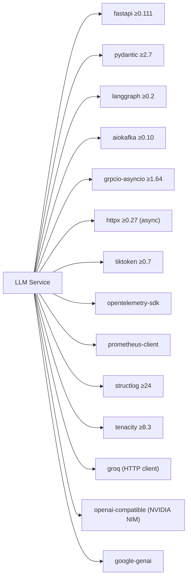
```mermaid
graph LR
    LLMSvc["LLM Service"]
    FastAPI["fastapi ≥0.111"]
    Pydantic["pydantic ≥2.7"]
    LangGraph["langgraph ≥0.2"]
    aiokafka["aiokafka ≥0.10"]
    grpcio["grpcio-asyncio ≥1.64"]
    httpx["httpx ≥0.27 (async)"]
    tiktoken["tiktoken ≥0.7"]
    OTel["opentelemetry-sdk"]
    Prometheus["prometheus-client"]
    Structlog["structlog ≥24"]
    Tenacity["tenacity ≥8.3"]
    GroqSDK["groq (HTTP client)"]
    NVIDIAClient["openai-compatible (NVIDIA NIM)"]
    GeminiClient["google-genai"]

    LLMSvc --> FastAPI & Pydantic & LangGraph
    LLMSvc --> aiokafka & grpcio & httpx
    LLMSvc --> tiktoken & OTel & Prometheus & Structlog & Tenacity
    LLMSvc --> GroqSDK & NVIDIAClient & GeminiClient
```

### 1.5 Design Goals

| Goal | Implementation Strategy |
|---|---|
| Zero blocking I/O | asyncio throughout; no `time.sleep`, no sync file reads |
| Sub-100ms context collection | `asyncio.gather` for all three gRPC calls always |
| Sub-680ms TTFT | Always-fetch context + Groq analysis + NVIDIA NIM streaming |
| Exactly 2 LLM calls | Groq Adapter for analysis; NVIDIA Adapter for generation |
| No LiteLLM dependency | Purpose-built provider adapters per provider |
| Full observability | OTel span on every async function; Prometheus counter on every outcome |
| Safe failure modes | Every tool failure is caught, logged, and result is `ToolResult(error=...)` |
| Testability | Every component injectable; no global singletons in business logic |

---

## 2. Folder Structure

### Complete Module Layout with Responsibilities

```
llm-service/
│
├── app/
│
│   ├── api/
│   │   ├── dependencies.py
│   │   ├── routers.py
│   │   └── internal/
│   │       ├── health.py
│   │       ├── readiness.py
│   │       └── metrics.py
│   │
│   ├── config/
│   │   ├── settings.py
│   │   ├── logging.py
│   │   ├── kafka.py
│   │   ├── grpc.py
│   │   ├── providers.py
│   │   └── prompts.py
│   │
│   ├── consumers/
│   │   ├── kafka_consumer.py
│   │   └── chat_consumer.py
│   │
│   ├── producers/
│   │   ├── kafka_producer.py
│   │   └── response_publisher.py
│   │
│   ├── graph/
│   │   ├── builder.py
│   │   ├── state.py
│   │   ├── edges.py
│   │   │
│   │   ├── nodes/
│   │   │   ├── context_collector.py   # Always-first: parallel gRPC to Memory/Graph/Retrieval
│   │   │   ├── request_analyzer.py    # Single Groq call - returns ExecutionPlan (Call 1)
│   │   │   ├── tool_dispatcher.py     # Dispatch tools from plan (no-op if tools=[])
│   │   │   ├── prompt_builder.py      # Assemble final prompt from context + tool results
│   │   │   ├── generation_router.py   # Route to NVIDIA NIM (Call 2) or Gemini fallback
│   │   │   ├── llm_generator.py       # Stream tokens from provider adapter
│   │   │   ├── response_validator.py  # Output safety and length checks
│   │   │   └── publish_response.py    # Publish chat.response.generated + memory.update.requested
│   │   │
│   │   └── subgraphs/             # Complex tools as LangGraph sub-graphs
│   │       ├── web_search/
│   │       │   ├── builder.py
│   │       │   ├── state.py
│   │       │   └── nodes.py
│   │       │
│   │       ├── deep_research/
│   │       │   ├── builder.py
│   │       │   ├── state.py
│   │       │   └── nodes.py
│   │       │
│   │       ├── github/
│   │       ├── browser/
│   │       ├── sql/
│   │       └── mcp/
│   │
│   ├── grpc/
│   │   ├── clients/
│   │   │   ├── memory_client.py
│   │   │   ├── graph_client.py
│   │   │   └── retrieval_client.py
│   │   │
│   │   └── proto/
│   │
│   ├── providers/
│   │   ├── base.py                # BaseProviderAdapter (abstract)
│   │   ├── router.py              # GenerationRouter - routes to correct adapter
│   │   ├── groq.py                # Groq Adapter (request analysis - Call 1)
│   │   ├── nvidia.py              # NVIDIA NIM Adapter (response generation - Call 2)
│   │   ├── gemini.py              # Gemini Adapter (fallback)
│   │   └── models.py              # ProviderConfig, ProviderSelection
│   │
│   ├── prompts/
│   │   ├── system/
│   │   ├── modes/
│   │   ├── skills/
│   │   └── templates/
│   │
│   ├── tools/                     # Tool framework (base classes only)
│   │   ├── base.py                # BaseTool abstract class
│   │   ├── registry.py            # ToolRegistry
│   │   ├── dispatcher.py          # ToolDispatcher (executes plans)
│   │   ├── executor.py            # ToolExecutor (single tool lifecycle)
│   │   ├── validator.py           # ToolParams validation
│   │   └── normalizer.py          # ToolResult normalization
│   │
│   ├── models/
│   │   ├── request.py
│   │   ├── response.py
│   │   ├── execution_plan.py
│   │   ├── provider.py
│   │   ├── tool.py
│   │   └── state.py
│   │
│   ├── services/
│   │   ├── context_service.py
│   │   ├── prompt_service.py
│   │   ├── provider_service.py
│   │   ├── streaming_service.py   # StreamingEngine (chunk accumulation + Kafka publish)
│   │   └── token_service.py       # ContextWindowManager (tiktoken counting + trimming)
│   │
│   ├── utils/
│   │   ├── retry.py               # RetryManager (tenacity wrapper)
│   │   ├── circuit_breaker.py     # CircuitBreaker (per-provider)
│   │   ├── token_counter.py       # tiktoken-based token counting
│   │   ├── metrics.py             # Prometheus metric definitions
│   │   ├── tracing.py             # OTel tracer factory + span decorators
│   │   └── helpers.py
│   │
│   ├── exceptions/
│   │   ├── provider.py            # ProviderError, AllProvidersFailedError
│   │   ├── tool.py                # ToolError, RequiredToolFailedError
│   │   ├── grpc.py                # GRPCError, GRPCUnavailableError
│   │   └── planner.py             # PlanError, CriticalAnalysisError
│   │
│   ├── middleware/
│   │
│   └── main.py
│
├── tests/
│   ├── unit/
│   ├── integration/
│   ├── graph/
│   ├── grpc/
│   ├── kafka/
│   ├── providers/
│   └── tools/
│
├── scripts/
│
├── proto/
│
├── deployments/
│   ├── docker/
│   └── kubernetes/
│
├── docs/
│
├── Dockerfile
├── docker-compose.yml
├── pyproject.toml
├── Makefile
└── README.md
```

> **Key design decision:** Tool *implementations* that are simple HTTP function calls live under `tools/`. Complex multi-step tool workflows (Deep Research, Browser Automation, GitHub search, SQL queries, MCP proxies) live under `graph/subgraphs/` as proper LangGraph sub-graphs, letting them evolve independently with their own state, edges, and nodes.

### Import Boundary Rules

```
consumers/ -> graph/ -> grpc/clients/
consumers/ -> producers/
graph/nodes/ -> services/ -> providers/
graph/subgraphs/ -> grpc/clients/
providers/ -> utils/retry, utils/circuit_breaker
ALL -> utils/, exceptions/, models/, config/

FORBIDDEN:
  grpc/clients/ -> graph/             (clients are pure gRPC wrappers)
  tools/        -> prompts/           (tools produce ToolResult, not prompts)
  prompts/      -> tools/             (prompt builder reads state, not tools)
```

## 3. Boot Process

### 3.1 Startup Sequence

The LLM Service uses FastAPI's `lifespan` context manager for controlled startup and shutdown. All initialization is sequential because later steps depend on earlier ones.

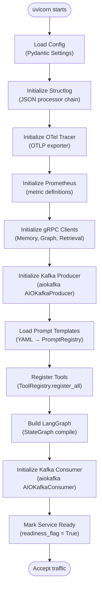
```mermaid
flowchart TD
    A(["uvicorn starts"]) --> B["Load Config\n(Pydantic Settings)"]
    B --> C["Initialize Structlog\n(JSON processor chain)"]
    C --> D["Initialize OTel Tracer\n(OTLP exporter)"]
    D --> E["Initialize Prometheus\n(metric definitions)"]
    E --> F["Initialize gRPC Clients\n(Memory, Graph, Retrieval)"]
    F --> G["Initialize Kafka Producer\n(aiokafka AIOKafkaProducer)"]
    G --> H["Load Prompt Templates\n(YAML → PromptRegistry)"]
    H --> I["Register Tools\n(ToolRegistry.register_all)"]
    I --> J["Build LangGraph\n(StateGraph compile)"]
    J --> K["Initialize Kafka Consumer\n(aiokafka AIOKafkaConsumer)"]
    K --> L["Mark Service Ready\n(readiness_flag = True)"]
    L --> M(["Accept traffic"])
```

### 3.2 Startup Failure Strategy

| Component | Failure Action |
|---|---|
| Config loading | Fatal — process exits with code 1 |
| gRPC client init | Fatal — cannot serve without context sources |
| Kafka Producer init | Fatal — cannot publish responses |
| Prompt loading | Fatal — cannot build prompts |
| Tool registration | Fatal — tools are required for all modes |
| LangGraph build | Fatal — no pipeline without graph |
| Kafka Consumer init | Fatal — cannot receive work |

All fatal startup errors are logged with Structlog at `CRITICAL` level before exit.

### 3.3 Config Loading

`config.py` uses **Pydantic Settings** (`pydantic-settings`) which reads from:
1. `.env` file (development)
2. Environment variables (production)
3. Kubernetes ConfigMap mounted as env vars

```
LLMServiceConfig:
  # Kafka
  kafka_bootstrap_servers: str
  kafka_consumer_group: str = "llm-service-group"
  kafka_input_topic: str = "chat.message.created"
  kafka_output_topic: str = "chat.response.generated"
  kafka_chunk_topic: str = "chat.response.chunk"
  kafka_dlq_topic: str = "chat.message.dlq"
  kafka_max_poll_interval_ms: int = 300000

  # gRPC
  memory_service_host: str
  memory_service_port: int = 50051
  graph_service_host: str
  graph_service_port: int = 50051
  retrieval_service_host: str
  retrieval_service_port: int = 50051
  grpc_deadline_ms: int = 2000
  grpc_max_connections: int = 20

  # Provider API Keys
  groq_api_key: SecretStr
  nvidia_api_key: SecretStr
  gemini_api_key: SecretStr
  tavily_api_key: SecretStr

  # Tool timeouts
  web_search_timeout_ms: int = 5000
  memory_tool_timeout_ms: int = 2000
  graph_tool_timeout_ms: int = 2000
  retrieval_tool_timeout_ms: int = 2000

  # Observability
  otel_endpoint: str
  prometheus_port: int = 9090
  log_level: str = "INFO"

  # Feature flags
  enable_smart_planning: bool = True
  enable_web_search: bool = True
  max_react_iterations: int = 3
```

### 3.4 gRPC Client Initialization

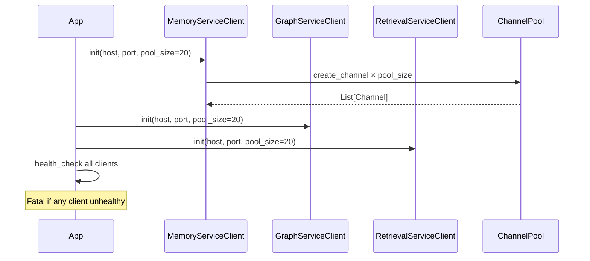
```mermaid
sequenceDiagram
    participant App
    participant MemClient as MemoryServiceClient
    participant GraphClient as GraphServiceClient
    participant RetClient as RetrievalServiceClient
    participant ChannelPool

    App->>MemClient: init(host, port, pool_size=20)
    MemClient->>ChannelPool: create_channel × pool_size
    ChannelPool-->>MemClient: List[Channel]
    App->>GraphClient: init(host, port, pool_size=20)
    App->>RetClient: init(host, port, pool_size=20)
    App->>App: health_check all clients
    Note over App: Fatal if any client unhealthy
```

Each client holds a **round-robin pool** of 20 gRPC channels. Channel creation is lazy — the connection is established on first use, not at initialization. This prevents blocking startup on slow services.

### 3.5 LangGraph Build

The LangGraph `StateGraph` is compiled once at startup and reused for all requests. Compilation involves:
1. Registering all node functions
2. Declaring all edges (fixed and conditional)
3. Setting entry and finish points
4. Calling `.compile()` → returns a `CompiledGraph` object

The compiled graph is **thread-safe and reentrant** — it can be invoked concurrently for multiple requests without sharing state. Each invocation receives its own `AgentState` copy.

### 3.6 Prompt Loading

On startup, `PromptLoader` scans the `prompts/` directory and loads all `.yaml` files:
1. Parse YAML → `PromptTemplateConfig`
2. Validate required fields: `name`, `version`, `skill`, `variables`, `system`
3. Create LangChain `ChatPromptTemplate` from template strings
4. Register in `PromptRegistry` keyed by `(skill, version)`
5. Set latest version as default for each skill

If any prompt template fails validation, startup is aborted.

---

## 4. Package Responsibilities

### Dependency Inversion and Injection

Each package exposes a clean public interface. Internal implementation modules are prefixed with `_` to signal they are not part of the public API.

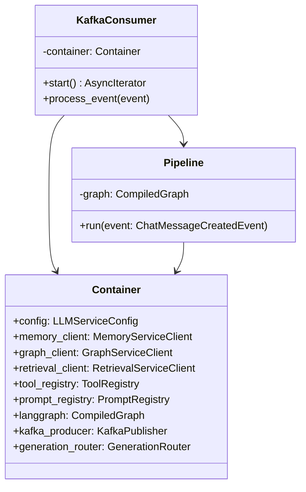
```mermaid
classDiagram
    class Container {
        +config: LLMServiceConfig
        +memory_client: MemoryServiceClient
        +graph_client: GraphServiceClient
        +retrieval_client: RetrievalServiceClient
        +tool_registry: ToolRegistry
        +prompt_registry: PromptRegistry
        +langgraph: CompiledGraph
        +kafka_producer: KafkaPublisher
        +generation_router: GenerationRouter
    }

    class KafkaConsumer {
        -container: Container
        +start() AsyncIterator
        +process_event(event)
    }

    class Pipeline {
        -graph: CompiledGraph
        +run(event: ChatMessageCreatedEvent)
    }

    KafkaConsumer --> Container
    KafkaConsumer --> Pipeline
    Pipeline --> Container
```

### Package Public APIs

| Package | Public Classes | Responsibilities |
|---|---|---|
| `consumer` | `KafkaConsumer`, `ChatMessageCreatedEvent` | Consume and validate Kafka events |
| `publisher` | `KafkaPublisher`, `ChatResponseGeneratedEvent` | Produce Kafka output events |
| `orchestration` | `Pipeline`, `AgentState`, `GraphBuilder` | LangGraph execution |
| `context` | `ContextCollector`, `ContextBundle` | **Always-fetch** parallel gRPC from all three sources |
| `analyzer` | `RequestAnalyzer`, `ExecutionPlan` | Single Groq call — intent + mode + skill + plan |
| `tools` | `BaseTool`, `ToolRegistry`, `ToolDispatcher`, `ToolResult` | Tool lifecycle (only tools in ExecutionPlan are executed) |
| `prompt` | `PromptBuilder`, `PromptRegistry`, `ComposedPrompt` | Prompt assembly |
| `inference` | `ContextWindowManager`, `GenerationRouter`, `StreamingEngine` | Provider routing + response generation |
| `inference.adapters` | `NVIDIAAdapter`, `GeminiAdapter`, `GroqAdapter` | Per-provider HTTP clients |
| `clients` | `MemoryServiceClient`, `GraphServiceClient`, `RetrievalServiceClient` | gRPC clients |
| `cache` | `TTLCache` | In-memory caching |
| `observability` | `get_tracer()`, `metrics`, `get_logger()` | Cross-cutting concerns |

---

## 5. Request Processing Pipeline

### Pipeline Overview

The pipeline is a LangGraph `StateGraph` with a **fixed linear order**. The key architectural constraint: **Context Collection always executes before Request Analysis.** The old variable-order multi-step orchestration (Intent → Mode → Skill → Plan → conditionally Context) is replaced by a deterministic **Context → Analyze → [Tools if needed] → Prompt → Infer → Stream** pipeline.

Exactly **2 LLM calls** are made per request regardless of mode:
- **Call 1 (Groq):** `request_analysis_node` — returns `ExecutionPlan`
- **Call 2 (NVIDIA NIM):** `llm_inference_node` — returns streamed response

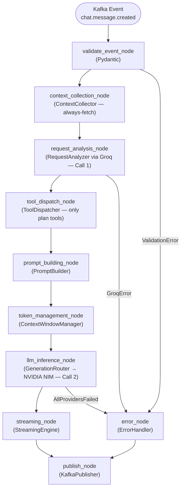
```mermaid
flowchart TD
    KafkaIn(["Kafka Event\nchat.message.created"])
    Validate["validate_event_node\n(Pydantic)"]
    ContextNode["context_collection_node\n(ContextCollector — always-fetch)"]
    AnalyzeNode["request_analysis_node\n(RequestAnalyzer via Groq — Call 1)"]
    ToolNode["tool_dispatch_node\n(ToolDispatcher — only plan tools)"]
    PromptNode["prompt_building_node\n(PromptBuilder)"]
    TokenNode["token_management_node\n(ContextWindowManager)"]
    InferNode["llm_inference_node\n(GenerationRouter → NVIDIA NIM — Call 2)"]
    StreamNode["streaming_node\n(StreamingEngine)"]
    PublishNode["publish_node\n(KafkaPublisher)"]
    ErrorNode["error_node\n(ErrorHandler)"]

    KafkaIn --> Validate
    Validate --> ContextNode
    ContextNode --> AnalyzeNode
    AnalyzeNode --> ToolNode
    ToolNode --> PromptNode
    PromptNode --> TokenNode
    TokenNode --> InferNode
    InferNode --> StreamNode
    StreamNode --> PublishNode

    Validate -- "ValidationError" --> ErrorNode
    AnalyzeNode -- "GroqError" --> ErrorNode
    InferNode -- "AllProvidersFailed" --> ErrorNode
    ErrorNode --> PublishNode
```

> **Note on Tool Dispatch:** `tool_dispatch_node` always runs but immediately returns if `state.plan.tools == []`. This keeps the graph linear and avoids conditional edge complexity for the common case (Default, Tutor, Code, Ask Files modes).

### Node Contract

Every LangGraph node is a pure async function with the signature:
```
async def node_name(state: AgentState) -> dict[str, Any]
```

Nodes **must not** mutate the state object directly. They return a partial dict. LangGraph merges the returned dict into the current state using a reducer function.

### Conditional Edge Routing

The frozen pipeline uses only **one** conditional edge — after inference, to handle the ReAct loop in Smart and Deep Research modes:

```
router_after_inference(state):
  if state.llm_response.finish_reason == "tool_calls":
    if state.react_iteration_count < state.plan.max_iterations:
      state.react_iteration_count += 1
      return "tool_dispatch_node"   # ReAct loop
    else:
      return "streaming_node"       # force completion
  if state.error is not None:
    return "error_node"
  return "streaming_node"
```

All other edges are fixed. This dramatically simplifies the graph and makes the flow deterministic and auditable.

---

## 6. Kafka Consumer Design

### 6.1 Consumer Class Architecture

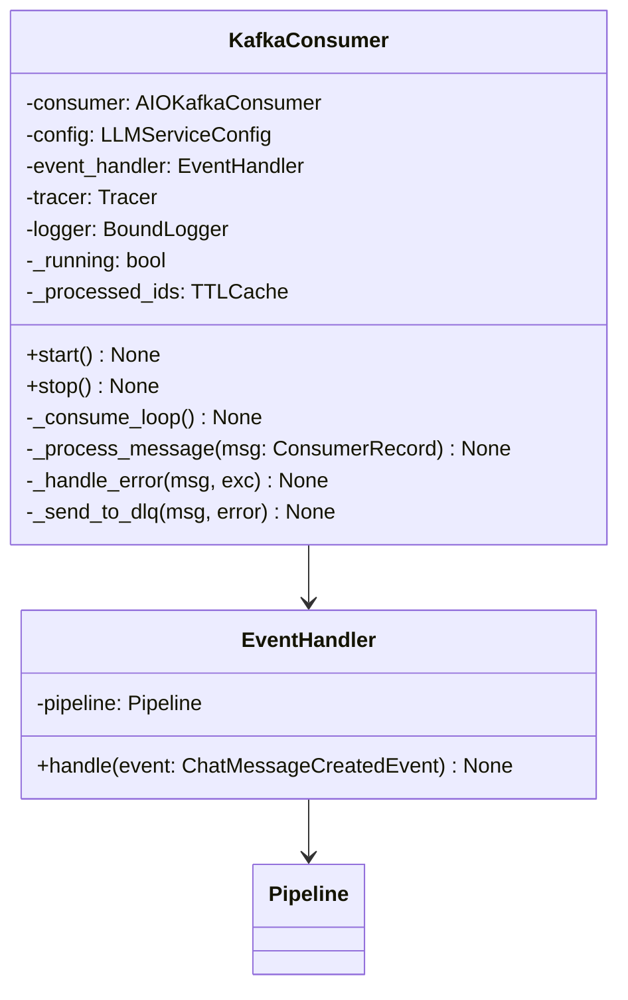
```mermaid
classDiagram
    class KafkaConsumer {
        -consumer: AIOKafkaConsumer
        -config: LLMServiceConfig
        -event_handler: EventHandler
        -tracer: Tracer
        -logger: BoundLogger
        -_running: bool
        -_processed_ids: TTLCache
        +start() None
        +stop() None
        -_consume_loop() None
        -_process_message(msg: ConsumerRecord) None
        -_handle_error(msg, exc) None
        -_send_to_dlq(msg, error) None
    }

    class EventHandler {
        -pipeline: Pipeline
        +handle(event: ChatMessageCreatedEvent) None
    }

    KafkaConsumer --> EventHandler
    EventHandler --> Pipeline
```

### 6.2 Consumer Group Design

| Parameter | Value | Rationale |
|---|---|---|
| `group_id` | `llm-service-group` | All LLM Service pods share one group for partitioned load distribution |
| `auto_offset_reset` | `earliest` | On new group, process from beginning (safety) |
| `enable_auto_commit` | `False` | Manual commit — only commit after successful processing |
| `max_poll_interval_ms` | `300000` | 5 minutes — LLM calls can be slow |
| `session_timeout_ms` | `45000` | Default; triggers rebalance if pod hangs |
| `heartbeat_interval_ms` | `3000` | Send heartbeat every 3s |
| `max_poll_records` | `10` | Limit batch size per poll to avoid memory spikes |

### 6.3 Message Processing Loop

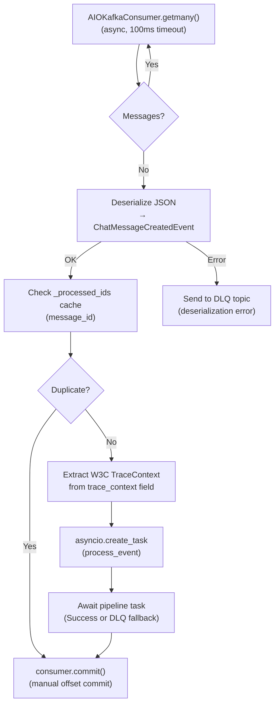
```mermaid
flowchart TD
    Poll["AIOKafkaConsumer.getmany()\n(async, 100ms timeout)"]
    Empty{"Messages?"}
    Deserialize["Deserialize JSON\n→ ChatMessageCreatedEvent"]
    Idempotency["Check _processed_ids cache\n(message_id)"]
    Duplicate{"Duplicate?"}
    PropTrace["Extract W3C TraceContext\nfrom trace_context field"]
    Spawn["asyncio.create_task\n(process_event)"]
    Commit["consumer.commit()\n(manual offset commit)"]
    DLQ["Send to DLQ topic\n(deserialization error)"]
    
    Poll --> Empty
    Empty -- "No" --> Deserialize
    Empty -- "Yes" --> Poll
    Deserialize -- "Error" --> DLQ
    Deserialize -- "OK" --> Idempotency
    Idempotency --> Duplicate
    Duplicate -- "Yes" --> Commit
    Duplicate -- "No" --> PropTrace --> Spawn --> WaitTask["Await pipeline task\n(Success or DLQ fallback)"] --> Commit
```

**At-Least-Once Commit Strategy:** The offset for a message is committed *only after* the processing task completes successfully (the final response is published to Kafka) or fails permanently (sent to the DLQ). This guarantees at-least-once delivery and prevents message loss. To handle concurrency, tasks run concurrently, but offset commits are tracked and committed asynchronously upon task completion, using the AIOKafkaConsumer's manual commit API.

**Task concurrency limit:** A `asyncio.Semaphore(max_concurrent=50)` gates task creation to prevent unbounded memory growth during traffic spikes.

### 6.4 Idempotency Design

The `_processed_ids` cache is a `TTLCache` with:
- **Max size:** 10,000 entries
- **TTL:** 300 seconds (5 minutes)
- **Key:** `message_id` (UUID string)

This prevents duplicate processing if Kafka redelivers a message (e.g., after consumer rebalance before offset commit completes).

**Collision strategy:** If a `message_id` is in the cache, log at `DEBUG` level and skip. No error is raised.

### 6.5 Dead Letter Queue (DLQ)

Messages are sent to `chat.message.dlq` in two cases:
1. **Deserialization error:** The Kafka message body cannot be parsed into `ChatMessageCreatedEvent`
2. **Permanent processing failure:** The pipeline fails after all retries are exhausted

DLQ message schema:
```
ChatMessageDLQEvent:
  original_topic: str
  original_partition: int
  original_offset: int
  original_key: bytes
  original_value: bytes         # raw bytes from failed message
  error_type: str               # "DeserializationError" | "PipelineError"
  error_message: str
  failed_at: datetime
  retry_count: int
```

### 6.6 Retry Within Consumer

Transient pipeline failures (e.g., gRPC timeout) are retried **within the same consumer task**:
- Max retries: 3
- Backoff: 100ms, 200ms, 400ms (exponential)
- Retry condition: `GRPCUnavailableError`, `KafkaPublishError`
- No retry: `DeserializationError`, `ValidationError` (permanent failures → DLQ)

---

## 7. Kafka Producer Design

### 7.1 Producer Architecture

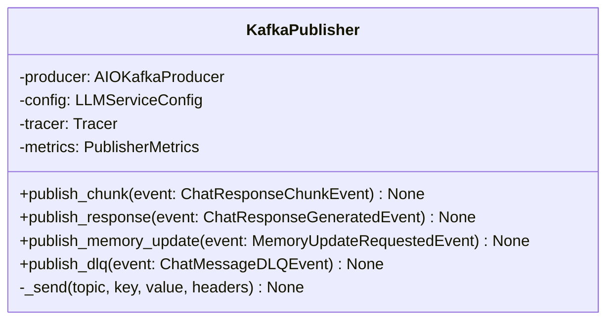
```mermaid
classDiagram
    class KafkaPublisher {
        -producer: AIOKafkaProducer
        -config: LLMServiceConfig
        -tracer: Tracer
        -metrics: PublisherMetrics
        +publish_chunk(event: ChatResponseChunkEvent) None
        +publish_response(event: ChatResponseGeneratedEvent) None
        +publish_memory_update(event: MemoryUpdateRequestedEvent) None
        +publish_dlq(event: ChatMessageDLQEvent) None
        -_send(topic, key, value, headers) None
    }
```

### 7.2 Producer Configuration

| Parameter | Value | Rationale |
|---|---|---|
| `acks` | `all` | Strongest durability; wait for all ISR acknowledgments |
| `compression_type` | `lz4` | Fast compression; reduces network bandwidth for large responses |
| `max_request_size` | `2097152` (2MB) | LLM responses can be large |
| `linger_ms` | `5` | Small batching window for chunk events |
| `enable_idempotence` | `True` | Exactly-once semantics at producer level |
| `retries` | `3` | Producer-level retry for transient broker errors |

### 7.3 Message Key Strategy

All messages use `conversation_id.encode()` as the Kafka key. This guarantees:
- All events for the same conversation go to the same partition
- Ordering is preserved within a conversation (chunk events arrive in order)
- Conversation Service's consumer can process them in order

### 7.4 Trace Header Propagation

Every produced message includes W3C TraceContext headers:
```
headers = [
    ("traceparent", traceparent.encode()),
    ("tracestate", tracestate.encode()),
    ("correlation_id", correlation_id.encode()),
]
```

This enables distributed traces to span from `chat.message.created` through LLM Service to `chat.response.generated`.

---

### 7.5 Publish Node Implementation

The `publish_node` is the terminal execution node in the LangGraph pipeline, executing after `streaming_node`. Following the **Single Responsibility Principle (SRP)**, all final event publishing and transaction-like completions are centralized here:

```python
async def publish_node(state: AgentState) -> dict[str, Any]:
    # 1. Publish final chat.response.generated event
    final_event = ChatResponseGeneratedEvent(
        conversation_id=state.conversation_id,
        user_id=state.user_id,
        message_id=state.message_id,
        request_id=state.request_id,
        response_text=state.full_response,
        usage=state.usage,
        cost_usd=state.cost_usd,
        completed_at=now()
    )
    await publisher.publish_response(final_event)

    # 2. Publish memory.update.requested event to trigger background memory synthesis
    memory_event = MemoryUpdateRequestedEvent(
        conversation_id=state.conversation_id,
        user_message=state.user_message,
        assistant_response=state.full_response,
        mode=state.mode
    )
    await publisher.publish_memory_update(memory_event)

    # 3. Commit Kafka Consumer offsets safely (At-Least-Once Delivery point)
    await consumer.commit_offset_for_request(state.request_id)
    
    return {"completed_at": now()}
```

---

## 8. gRPC Client Design

### 8.1 Base gRPC Client

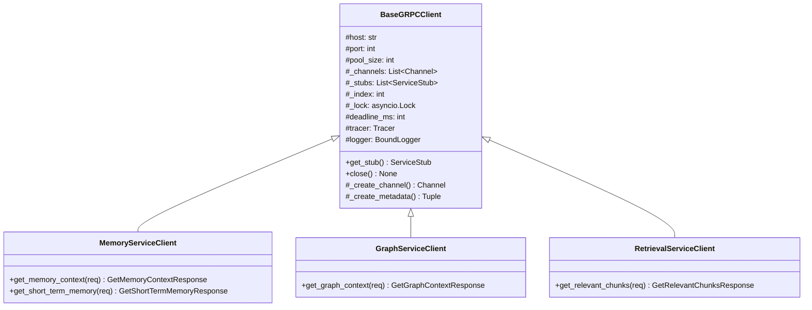
```mermaid
classDiagram
    class BaseGRPCClient {
        #host: str
        #port: int
        #pool_size: int
        #_channels: List~Channel~
        #_stubs: List~ServiceStub~
        #_index: int
        #_lock: asyncio.Lock
        #deadline_ms: int
        #tracer: Tracer
        #logger: BoundLogger
        +get_stub() ServiceStub
        +close() None
        #_create_channel() Channel
        #_create_metadata() Tuple
    }

    class MemoryServiceClient {
        +get_memory_context(req) GetMemoryContextResponse
        +get_short_term_memory(req) GetShortTermMemoryResponse
    }

    class GraphServiceClient {
        +get_graph_context(req) GetGraphContextResponse
    }

    class RetrievalServiceClient {
        +get_relevant_chunks(req) GetRelevantChunksResponse
    }

    BaseGRPCClient <|-- MemoryServiceClient
    BaseGRPCClient <|-- GraphServiceClient
    BaseGRPCClient <|-- RetrievalServiceClient
```

### 8.2 Connection Pool Implementation

The pool is a fixed-size array of channels. A round-robin counter selects the next channel:

```
Algorithm: Round-Robin Channel Selection
  _index is an atomic integer (asyncio.Lock protected)
  get_stub():
    async with _lock:
      idx = _index % pool_size
      _index += 1
      return _stubs[idx]
```

**Why not use a queue?** Round-robin with a fixed index avoids queue contention under high concurrency. Each channel supports HTTP/2 multiplexing, so a single channel can handle many concurrent RPCs. Pool size of 20 is sufficient for 500 concurrent requests per pod.

### 8.3 Channel Options

```python
CHANNEL_OPTIONS = [
    ("grpc.keepalive_time_ms", 30000),          # send keepalive every 30s
    ("grpc.keepalive_timeout_ms", 5000),         # timeout for keepalive response
    ("grpc.keepalive_permit_without_calls", 1),  # allow keepalive without active RPCs
    ("grpc.http2.max_pings_without_data", 0),    # no limit on pings
    ("grpc.max_receive_message_length", 10485760),  # 10MB max response
    ("grpc.max_send_message_length", 2097152),       # 2MB max request
]
```

### 8.4 Deadline Propagation

Every gRPC call uses an absolute deadline:
```
deadline = asyncio.get_event_loop().time() + (deadline_ms / 1000.0)
await stub.GetMemoryContext(request, timeout=deadline_ms/1000.0)
```

**Important:** Deadline is per-call, not per-retry. If a call retries, the new attempt also gets a fresh `deadline_ms` window.

### 8.5 gRPC Retry Policy (Server-Side Metadata)

gRPC-level service config is injected at channel creation:
```json
{
  "methodConfig": [{
    "name": [{"service": "memory.MemoryService"}],
    "retryPolicy": {
      "maxAttempts": 3,
      "initialBackoff": "0.1s",
      "maxBackoff": "1s",
      "backoffMultiplier": 2,
      "retryableStatusCodes": ["UNAVAILABLE", "DEADLINE_EXCEEDED"]
    }
  }]
}
```

This enables **gRPC-level retries** independent of the application-level retry manager. They complement each other: gRPC retries handle transient network issues; the application retry manager handles higher-level failures.

### 8.6 Metadata for Authentication

All gRPC calls include service identity metadata (verified by Istio mTLS at the network layer, but also included for auditing):
```
metadata = [
    ("x-service-name", "llm-service"),
    ("x-trace-id", state.trace_id),
    ("x-user-id", state.user_id),
    ("x-conversation-id", state.conversation_id),
]
```

---

## 9. LangGraph Implementation

### 9.1 Graph Builder

`graph_builder.py` is the single module responsible for constructing the LangGraph `StateGraph`. It is called once during boot. The compiled graph is stored in the `Container`.

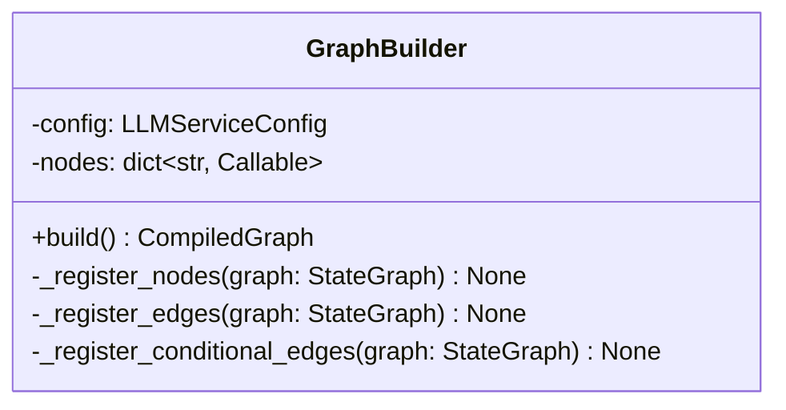
```mermaid
classDiagram
    class GraphBuilder {
        -config: LLMServiceConfig
        -nodes: dict~str, Callable~
        +build() CompiledGraph
        -_register_nodes(graph: StateGraph) None
        -_register_edges(graph: StateGraph) None
        -_register_conditional_edges(graph: StateGraph) None
    }
```

### 9.2 Node Registration

Each node is a module-level async function in its respective module. `GraphBuilder` imports them and registers them by name:

```
Registered Nodes (Frozen):
  "validate"          → consumer.message_processor.validate_event_node
  "collect_context"   → context.collector.context_collection_node        (ALWAYS FIRST)
  "analyze_request"   → analyzer.request_analyzer.request_analysis_node  (Groq — Call 1)
  "dispatch_tools"    → tools.dispatcher.tool_dispatch_node              (no-op if plan.tools=[])
  "build_prompt"      → prompt.builder.prompt_building_node
  "manage_tokens"     → inference.context_window.token_management_node
  "infer"             → inference.generation_router.llm_inference_node     (NVIDIA — Call 2)
  "stream"            → inference.streaming_engine.streaming_node
  "publish"           → publisher.kafka_publisher.publish_node
  "handle_error"      → orchestration.error_handler.error_node
```

### 9.3 Edge Declarations

```
Fixed Edges (all edges are fixed in the frozen pipeline):
  START → "validate"
  "validate" → "collect_context"
  "collect_context" → "analyze_request"
  "analyze_request" → "dispatch_tools"
  "dispatch_tools" → "build_prompt"
  "build_prompt" → "manage_tokens"
  "manage_tokens" → "infer"
  "stream" → "publish"
  "publish" → END
  "handle_error" → "publish"

Conditional Edges (only one):
  "infer" → router_after_inference
    → "stream"          (finish_reason="stop" OR max_iterations reached)
    → "dispatch_tools"  (finish_reason="tool_calls", ReAct loop, Smart/DeepResearch only)
    → "handle_error"    (error state)
```

### 9.4 ReAct Loop Prevention

The `router_after_inference` function checks `state.react_iteration_count`:
```
if state.react_iteration_count >= state.plan.max_iterations:
    log warning "Max ReAct iterations reached"
    return "stream"   # force completion with what we have
```

This prevents infinite loops in Smart and Deep Research modes.

### 9.5 State Reducers

LangGraph requires reducer functions for list fields that accumulate across nodes:

```
tool_results: Annotated[List[ToolResult], operator.add]
    → new tool results are appended, not replaced

response_chunks: Annotated[List[str], operator.add]
    → streaming chunks are appended

All other fields: last-write-wins (default behavior)
```

---

## 10. Agent State Object

### 10.1 Complete State Schema

The `AgentState` is a `TypedDict` (not Pydantic) because LangGraph requires TypedDict for its state management. All nested objects within the state are Pydantic models for validation.

```
AgentState (TypedDict):

  # Identity
  conversation_id: str          # from Kafka event
  user_id: str                  # from Kafka event
  message_id: str               # from Kafka event
  request_id: str               # generated UUID for this pipeline run
  trace_id: str                 # W3C traceparent trace-id segment
  span_id: str                  # W3C traceparent span-id segment

  # Input
  user_message: str             # raw user message content
  user_mode: UserMode           # explicitly selected mode from client
  file_ids: List[str]           # file IDs for Ask Files mode

  # Context Bundle (set by ContextCollector — always present)
  context_bundle: Optional[ContextBundle]  # contains memory + graph + retrieval
  context_collected_at: Optional[datetime]
  context_degraded: bool                   # True if any source partially failed
  context_degraded_sources: List[str]      # which sources had partial failures

  # Request Analysis (set by RequestAnalyzer via Groq — Call 1)
  intent: Optional[IntentCategory]         # classified intent
  mode: Optional[UserMode]                 # validated/overridden mode
  skill: Optional[Skill]                   # mapped skill
  plan: Optional[ExecutionPlan]            # full execution plan from Groq

  # Tool execution
  tool_results: Annotated[List[ToolResult], operator.add]
  react_iteration_count: int    # current ReAct loop count

  # Prompt
  composed_prompt: Optional[ComposedPrompt]
  token_count: int              # total tokens in composed prompt
  token_budget: int             # available tokens for NVIDIA NIM

  # Inference (set by GenerationRouter — Call 2)
  selected_provider: Optional[str]                  # e.g., 'nvidia' or 'gemini'
  llm_response: Optional[LLMResponse]
  response_chunks: Annotated[List[str], operator.add]

  # Output
  full_response: Optional[str]  # assembled from chunks after stream completes
  usage: Optional[UsageMetrics]
  cost_usd: Optional[float]

  # Error handling
  error: Optional[ServiceError]    # set if pipeline encounters unrecoverable error
  degraded_mode: bool           # True if operating with partial context
  degraded_reasons: List[str]   # which context sources failed

  # Metadata
  started_at: datetime
  context_collected_at: Optional[datetime]
  inference_started_at: Optional[datetime]
  first_chunk_at: Optional[datetime]
  completed_at: Optional[datetime]
```

### 10.2 State Lifecycle

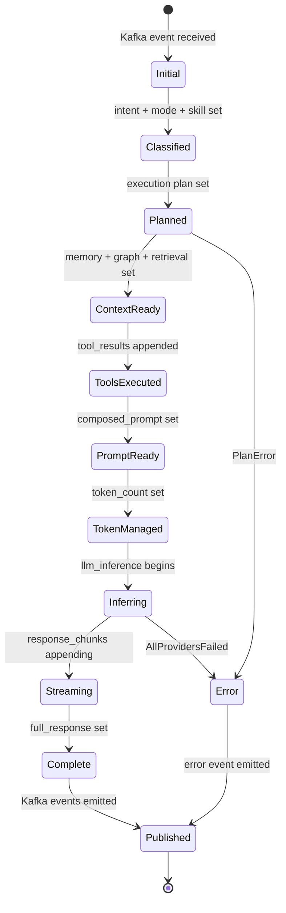
```mermaid
stateDiagram-v2
    [*] --> Initial: Kafka event received
    Initial --> Classified: intent + mode + skill set
    Classified --> Planned: execution plan set
    Planned --> ContextReady: memory + graph + retrieval set
    ContextReady --> ToolsExecuted: tool_results appended
    ToolsExecuted --> PromptReady: composed_prompt set
    PromptReady --> TokenManaged: token_count set
    TokenManaged --> Inferring: llm_inference begins
    Inferring --> Streaming: response_chunks appending
    Streaming --> Complete: full_response set
    Complete --> Published: Kafka events emitted
    Published --> [*]

    Planned --> Error: PlanError
    Inferring --> Error: AllProvidersFailed
    Error --> Published: error event emitted
```

### 10.3 ServiceError Schema

```
ServiceError:
  error_type: ErrorType         # Enum: VALIDATION | PLAN | TOOL | INFERENCE | PUBLISH
  error_code: str               # "PROVIDER_ALL_FAILED", "CONTEXT_OVERFLOW", etc.
  message: str
  retriable: bool
  provider: Optional[str]       # which provider failed (if inference error)
  tool_name: Optional[str]      # which tool failed (if tool error)
  traceback: Optional[str]      # truncated traceback for debugging
```

---

## 11. Context Collector

> **Architecture Freeze:** The `ContextCollector` runs **on every request, unconditionally.** Memory, Graph, and Retrieval are always fetched in parallel via `asyncio.gather()`. No mode-gating. Context services are responsible for returning only what is relevant.

### 11.1 Class Design

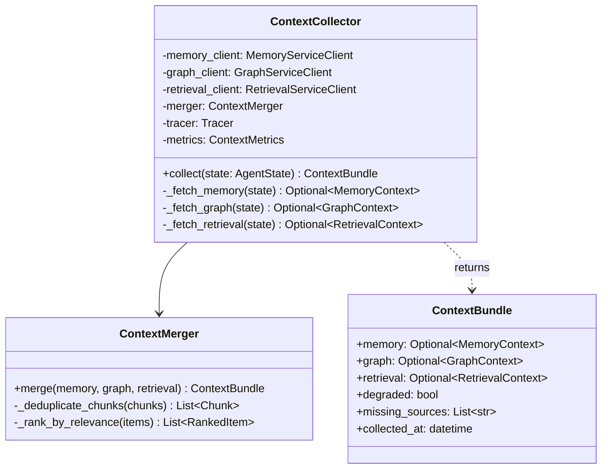
```mermaid
classDiagram
    class ContextCollector {
        -memory_client: MemoryServiceClient
        -graph_client: GraphServiceClient
        -retrieval_client: RetrievalServiceClient
        -merger: ContextMerger
        -tracer: Tracer
        -metrics: ContextMetrics
        +collect(state: AgentState) ContextBundle
        -_fetch_memory(state) Optional~MemoryContext~
        -_fetch_graph(state) Optional~GraphContext~
        -_fetch_retrieval(state) Optional~RetrievalContext~
    }

    class ContextMerger {
        +merge(memory, graph, retrieval) ContextBundle
        -_deduplicate_chunks(chunks) List~Chunk~
        -_rank_by_relevance(items) List~RankedItem~
    }

    class ContextBundle {
        +memory: Optional~MemoryContext~
        +graph: Optional~GraphContext~
        +retrieval: Optional~RetrievalContext~
        +degraded: bool
        +missing_sources: List~str~
        +collected_at: datetime
    }

    ContextCollector --> ContextMerger
    ContextCollector ..> ContextBundle : returns
```

### 11.2 Always-Fetch Algorithm

```
Algorithm: ContextCollector.collect(state)

Input: state.user_id, state.conversation_id, state.user_message, state.file_ids

Step 1: Build all three async tasks unconditionally:
  tasks = [
    _fetch_memory(state),
    _fetch_graph(state),
    _fetch_retrieval(state),
  ]

Step 2: Execute all tasks in parallel:
  results = await asyncio.gather(*tasks, return_exceptions=True)

Step 3: Process results with graceful degradation:
  memory, graph, retrieval = None, None, None
  missing = []

  for i, result in enumerate(results):
    source_name = ["memory", "graph", "retrieval"][i]
    if isinstance(result, Exception):
      log.warning(f"Context source {source_name} failed", error=str(result))
      metrics.context_failure.labels(source=source_name).inc()
      missing.append(source_name)
    else:
      [memory | graph | retrieval] = result   # assign to correct var

Step 4: Merge and deduplicate:
  bundle = merger.merge(memory, graph, retrieval)
  bundle.degraded = len(missing) > 0
  bundle.missing_sources = missing

Step 5: Return bundle (never raises \u2014 always returns, even if all sources failed)
```

**Key guarantee:** `collect()` never raises. A `ContextBundle` is always returned. If all sources fail, `bundle.degraded=True` and `bundle.missing_sources=["memory","graph","retrieval"]`. The Request Analyzer will still run with whatever context is available.

### 11.3 Memory Fetch

- Calls `MemoryServiceClient.get_memory_context(user_id, conversation_id, query=user_message)`
- Returns: short-term conversation messages + long-term facts
- **Not mode-scoped** — Memory Service returns what it judges relevant given the query
- Timeout: `config.grpc_deadline_ms` (default 2000ms)

### 11.4 Graph Fetch

- Calls `GraphServiceClient.get_graph_context(user_id, conversation_id, query=user_message)`
- Returns: entity nodes, relationship edges, pre-computed subgraph summary string
- Timeout: `config.grpc_deadline_ms`

### 11.5 Retrieval Fetch

- Calls `RetrievalServiceClient.get_relevant_chunks(user_id, file_ids=state.file_ids, query=user_message)`
- `file_ids` is passed from the event — if empty, Retrieval Service searches the knowledge base
- Returns: document chunks ranked by relevance
- Timeout: `config.grpc_deadline_ms`

### 11.6 Deduplication Algorithm

```
Algorithm: ChunkDeduplication

For overlapping content between Retrieval chunks and Graph node descriptions:
  fingerprint = sha256(content[:200].lower().strip())
  if fingerprint in seen: skip
  else: add to output; add fingerprint to seen set
```

---

## 12. Request Analyzer

> **Architecture Freeze:** The `RequestAnalyzer` is a single **Groq** LLM call that replaces the old four-step pipeline (Intent Analyzer + Mode Manager + Skill Manager + Planner). It receives the full context bundle and user message, then returns a complete `ExecutionPlan` in one inference. This is **Call 1 of 2** in the system.

### 12.1 Class Design

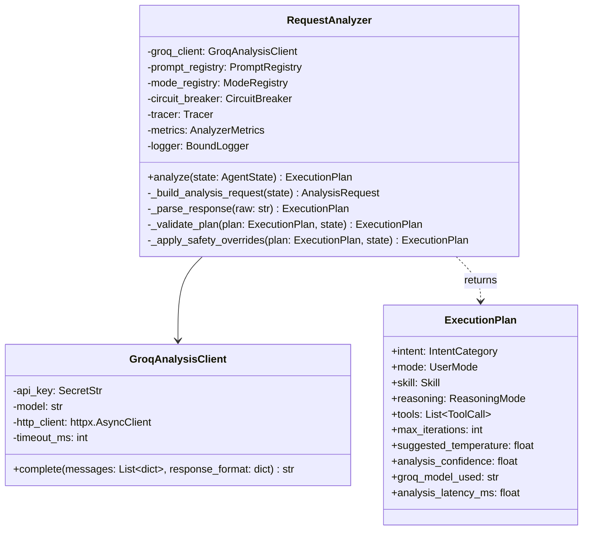
```mermaid
classDiagram
    class RequestAnalyzer {
        -groq_client: GroqAnalysisClient
        -prompt_registry: PromptRegistry
        -mode_registry: ModeRegistry
        -circuit_breaker: CircuitBreaker
        -tracer: Tracer
        -metrics: AnalyzerMetrics
        -logger: BoundLogger
        +analyze(state: AgentState) ExecutionPlan
        -_build_analysis_request(state) AnalysisRequest
        -_parse_response(raw: str) ExecutionPlan
        -_validate_plan(plan: ExecutionPlan, state) ExecutionPlan
        -_apply_safety_overrides(plan: ExecutionPlan, state) ExecutionPlan
    }

    class GroqAnalysisClient {
        -api_key: SecretStr
        -model: str
        -http_client: httpx.AsyncClient
        -timeout_ms: int
        +complete(messages: List~dict~, response_format: dict) str
    }

    class ExecutionPlan {
        +intent: IntentCategory
        +mode: UserMode
        +skill: Skill
        +reasoning: ReasoningMode
        +tools: List~ToolCall~
        +max_iterations: int
        +suggested_temperature: float
        +analysis_confidence: float
        +groq_model_used: str
        +analysis_latency_ms: float
    }

    RequestAnalyzer --> GroqAnalysisClient
    RequestAnalyzer ..> ExecutionPlan : returns
```

### 12.2 Analysis Request Construction

The analysis prompt is a system prompt that provides the Groq model with:
1. **Context bundle** — formatted memory, graph nodes, retrieval chunks
2. **Available tools** — descriptions of registered tools
3. **User message** — the raw user input
4. **User-selected mode** — from the Kafka event
5. **Output schema** — strict JSON schema that Groq must follow

```
AnalysisPrompt structure:

System: |
  You are GraphGPT's Request Analyzer. Given a user message and context,
  analyze the request and return a structured execution plan.

  ## User Context
  Memory: {formatted_memory}

  ## Knowledge Graph
  {formatted_graph}

  ## Retrieved Documents
  {formatted_retrieval}

  ## Available Tools
  {tools_json_schema}

  ## User-Selected Mode
  {user_mode}

  ## Output Format (strict JSON, no markdown)
  {
    "intent": "GENERAL_CHAT | QUESTION_ANSWERING | CODE_GENERATION | ...",
    "mode": "DEFAULT | SMART | TUTOR | WEB_SEARCH | DEEP_RESEARCH | CODE | ASK_FILES",
    "skill": "general_chat | tutor | coding | research | writing | reasoning",
    "reasoning": "DIRECT | CHAIN_OF_THOUGHT | REACT",
    "tools": [{"tool_name": "...", "params": {}, "parallel": true, "required": false}],
    "max_iterations": 1-3,
    "suggested_temperature": 0.1-0.9,
    "analysis_confidence": 0.0-1.0
  }

User: {user_message}
```

**Groq model:** `llama-3.3-70b-versatile` (default) or `llama3-8b-8192` (low-latency fallback)

### 12.3 Response Parsing Algorithm

```
Algorithm: ExecutionPlan parsing

1. Raw response is a JSON string (enforced via Groq's JSON mode)
2. Parse: plan_dict = json.loads(raw_response)
3. Validate with Pydantic: ExecutionPlan(**plan_dict)
4. Apply safety overrides:

   Override Rule 1: if user_mode == ASK_FILES and len(state.file_ids) == 0:
     plan.mode = DEFAULT  (cannot ask files without files)

   Override Rule 2: if plan.tools contains "web_search" and config.enable_web_search == False:
     plan.tools = [t for t in plan.tools if t.tool_name != "web_search"]

   Override Rule 3: if plan.max_iterations > config.max_react_iterations:
     plan.max_iterations = config.max_react_iterations

5. On ParseError (JSON invalid, schema mismatch):
   log.warning("Request analyzer parse failed, using safe default plan")
   return _safe_default_plan(state)  # DIRECT, no tools, DEFAULT mode

6. Return validated ExecutionPlan
```

### 12.4 Safe Default Plan (Groq Failure Fallback)

If the Groq call fails entirely (network error, circuit breaker open), the analyzer returns a deterministic safe default:

```
SafeDefaultPlan:
  intent: GENERAL_CHAT
  mode: DEFAULT          # respect user_mode if set
  skill: general_chat
  reasoning: DIRECT
  tools: []
  max_iterations: 1
  suggested_temperature: 0.7
  analysis_confidence: 0.0   # signals to observability that this was a fallback
  provider: nvidia          # routed to NVIDIA NIM response generation directly
```

This ensures the pipeline **never blocks** waiting for Groq. Worst case: the user gets a context-aware general chat response without tool augmentation.

### 12.5 ExecutionPlan Schema (Complete)

```
IntentCategory (enum):
  GENERAL_CHAT | QUESTION_ANSWERING | CODE_GENERATION | CODE_DEBUGGING |
  CODE_EXPLANATION | RESEARCH | WEB_SEARCH | DOCUMENT_ANALYSIS |
  TUTORING | CREATIVE_WRITING | REASONING

UserMode (enum):
  DEFAULT | SMART | TUTOR | WEB_SEARCH | DEEP_RESEARCH | CODE | ASK_FILES

Skill (enum):
  general_chat | tutor | coding | research | writing | reasoning

ReasoningMode (enum):
  DIRECT | CHAIN_OF_THOUGHT | REACT | EXTENDED_THINKING

ToolCall:
  tool_name: str
  params: dict[str, Any]      # tool-specific parameters
  parallel: bool              # can run concurrently with others?
  required: bool              # if False, failure is non-fatal

ExecutionPlan:
  intent: IntentCategory
  mode: UserMode
  skill: Skill
  reasoning: ReasoningMode
  tools: List[ToolCall]
  max_iterations: int         # max ReAct loops (1 for non-ReAct modes)
  suggested_temperature: float
  analysis_confidence: float  # 0.0 = fallback used
  groq_model_used: str
  analysis_latency_ms: float
```

### 12.6 Mode Context Table (Enforcement)

The Request Analyzer is **instructed** via its system prompt to respect this table when selecting tools. It is also enforced by safety overrides:

| Mode | Tools Allowed | Reasoning | Max Iterations |
|---|---|---|---|
| Default | None | DIRECT | 1 |
| Smart | Dynamic (from Groq) | REACT | 1-3 |
| Tutor | None | CHAIN_OF_THOUGHT | 1 |
| Web Search | [WebSearch] | DIRECT | 1 |
| Deep Research | [WebSearch, multi-step] | REACT | 2-3 |
| Code | None | CHAIN_OF_THOUGHT | 1 |
| Ask Files | None | DIRECT | 1 |


## 13. Tool Framework

### 13.1 BaseTool Abstract Interface

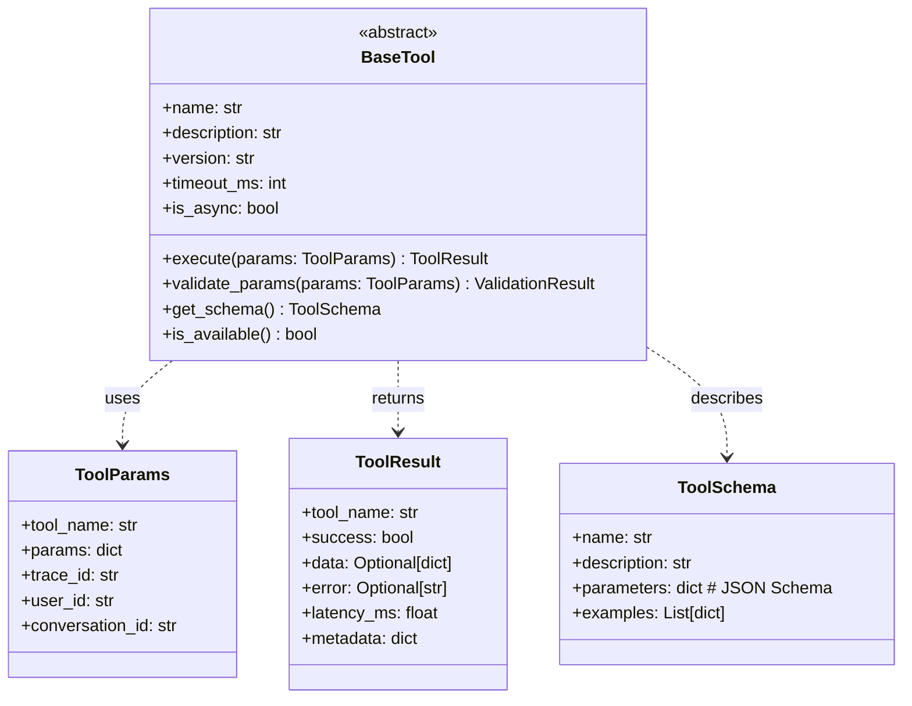
```mermaid
classDiagram
    class BaseTool {
        <<abstract>>
        +name: str
        +description: str
        +version: str
        +timeout_ms: int
        +is_async: bool
        +execute(params: ToolParams) ToolResult
        +validate_params(params: ToolParams) ValidationResult
        +get_schema() ToolSchema
        +is_available() bool
    }

    class ToolParams {
        +tool_name: str
        +params: dict
        +trace_id: str
        +user_id: str
        +conversation_id: str
    }

    class ToolResult {
        +tool_name: str
        +success: bool
        +data: Optional[dict]
        +error: Optional[str]
        +latency_ms: float
        +metadata: dict
    }

    class ToolSchema {
        +name: str
        +description: str
        +parameters: dict      # JSON Schema
        +examples: List[dict]
    }

    BaseTool ..> ToolParams : uses
    BaseTool ..> ToolResult : returns
    BaseTool ..> ToolSchema : describes
```

### 13.2 ToolRegistry

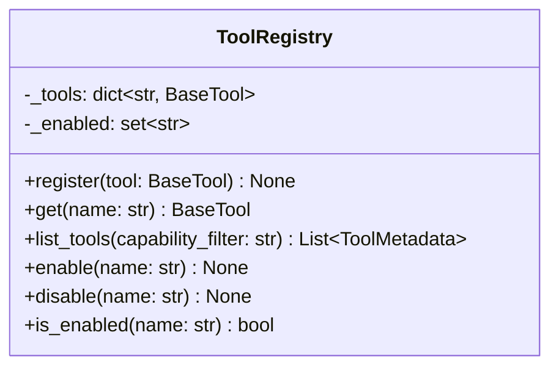
```mermaid
classDiagram
    class ToolRegistry {
        -_tools: dict~str, BaseTool~
        -_enabled: set~str~
        +register(tool: BaseTool) None
        +get(name: str) BaseTool
        +list_tools(capability_filter: str) List~ToolMetadata~
        +enable(name: str) None
        +disable(name: str) None
        +is_enabled(name: str) bool
    }
```

**ToolRegistry** is initialized in `main.py` lifespan and passed into the `Container`. It is **not a global singleton** — it is a regular instance injected as a dependency. This makes it easily replaceable in tests.

**Registration sequence (at boot):**
```
registry = ToolRegistry()
registry.register(WebSearchTool(http_client, config.tavily_api_key))
registry.register(MCPTool(config.mcp_server_url))
```

### 13.3 ToolDispatcher

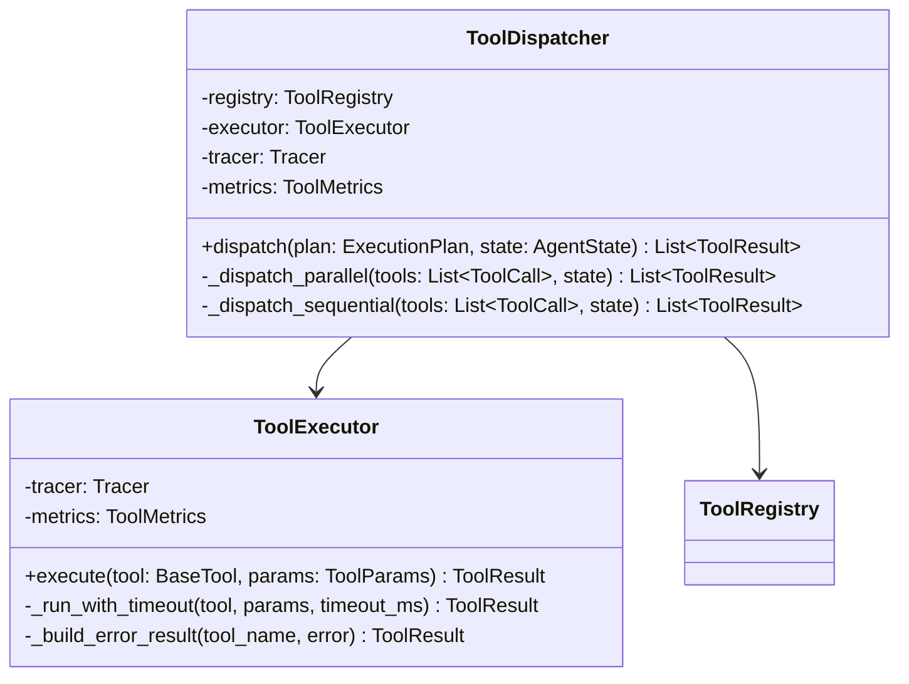
```mermaid
classDiagram
    class ToolDispatcher {
        -registry: ToolRegistry
        -executor: ToolExecutor
        -tracer: Tracer
        -metrics: ToolMetrics
        +dispatch(plan: ExecutionPlan, state: AgentState) List~ToolResult~
        -_dispatch_parallel(tools: List~ToolCall~, state) List~ToolResult~
        -_dispatch_sequential(tools: List~ToolCall~, state) List~ToolResult~
    }

    class ToolExecutor {
        -tracer: Tracer
        -metrics: ToolMetrics
        +execute(tool: BaseTool, params: ToolParams) ToolResult
        -_run_with_timeout(tool, params, timeout_ms) ToolResult
        -_build_error_result(tool_name, error) ToolResult
    }

    ToolDispatcher --> ToolExecutor
    ToolDispatcher --> ToolRegistry
```

### 13.4 Parallel Tool Execution Algorithm

```
Algorithm: ToolDispatcher.dispatch

1. Group tools from ExecutionPlan:
   parallel_group = [t for t in plan.tools if t.parallel]
   sequential_group = [t for t in plan.tools if not t.parallel]

2. Execute parallel group:
   tasks = [executor.execute(registry.get(t.tool_name), build_params(t, state))
            for t in parallel_group]
   parallel_results = await asyncio.gather(*tasks, return_exceptions=True)

3. For each result in parallel_results:
   if isinstance(result, Exception):
     log warning
     parallel_results[i] = ToolResult(success=False, error=str(result))

4. Execute sequential group in order:
   for tool_call in sequential_group:
     result = await executor.execute(...)
     if not result.success and tool_call.required:
       raise RequiredToolFailedError(tool_call.tool_name)

5. Return all results: parallel_results + sequential_results
```

### 13.5 ToolExecutor Timeout Enforcement

Each tool execution is wrapped in `asyncio.wait_for`:
```
async def _run_with_timeout(tool, params, timeout_ms):
    try:
        return await asyncio.wait_for(
            tool.execute(params),
            timeout=timeout_ms / 1000.0
        )
    except asyncio.TimeoutError:
        return ToolResult(
            tool_name=tool.name,
            success=False,
            error=f"Tool timed out after {timeout_ms}ms",
            latency_ms=timeout_ms
        )
```

### 13.6 Result Normalization

Every `ToolResult` includes a `data` dict with a **standardized schema** regardless of the tool type. This allows `PromptBuilder` to handle tool results uniformly:

```
ToolResult.data schema:
  

  For WebSearchTool:
    {
      "type": "web_search",
      "results": [{"title": ..., "url": ..., "snippet": ...}],
      "query": "..."
    }
```

---

## 14. Tool Implementations

### 14.1 WebSearchTool

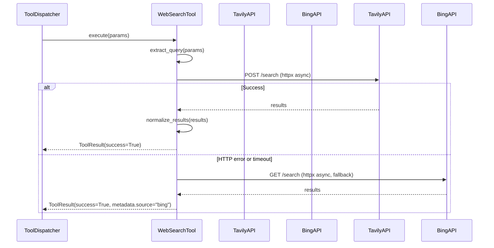
```mermaid
sequenceDiagram
    participant Dispatcher as ToolDispatcher
    participant SearchTool as WebSearchTool
    participant Tavily as TavilyAPI
    participant Bing as BingAPI

    Dispatcher->>SearchTool: execute(params)
    SearchTool->>SearchTool: extract_query(params)
    SearchTool->>TavilyAPI: POST /search (httpx async)
    alt Success
        TavilyAPI-->>SearchTool: results
        SearchTool->>SearchTool: normalize_results(results)
        SearchTool-->>Dispatcher: ToolResult(success=True)
    else HTTP error or timeout
        SearchTool->>BingAPI: GET /search (httpx async, fallback)
        BingAPI-->>SearchTool: results
        SearchTool-->>Dispatcher: ToolResult(success=True, metadata.source="bing")
    end
```

**Query extraction:** `params["query"]` is used directly if provided. If not, the tool extracts the search query from `state.user_message` using a simple noun phrase extractor (regex-based).

**Result deduplication:** If multiple results have the same domain, keep only the highest-ranked one.

**Caching:** Identical queries within 60 seconds return cached results (using `TTLCache`). This prevents duplicate API calls during ReAct loops.

---

## 15. Prompt Engine

### 15.1 Class Design

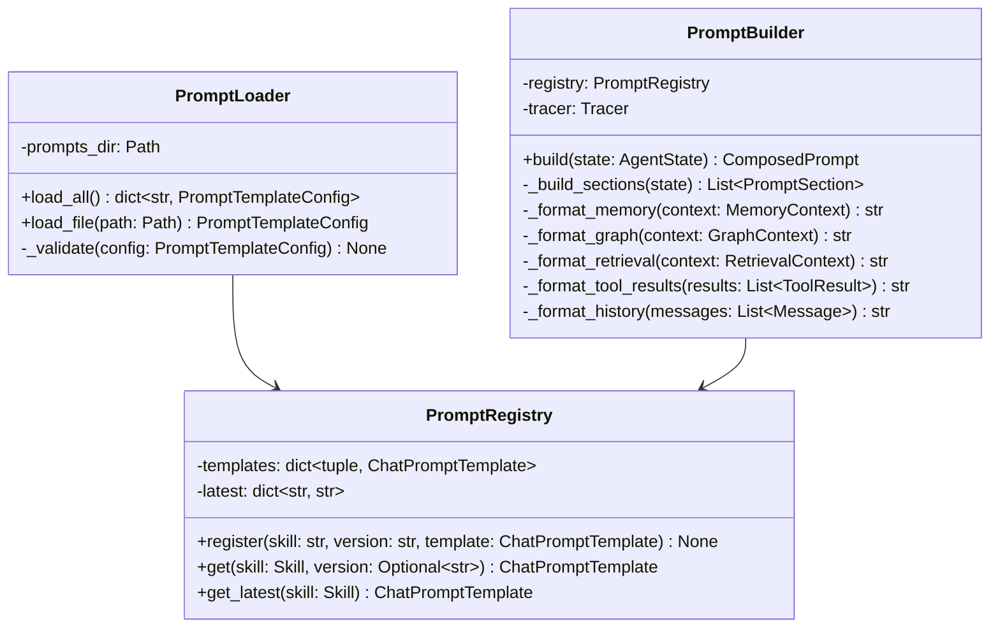
```mermaid
classDiagram
    class PromptLoader {
        -prompts_dir: Path
        +load_all() dict~str, PromptTemplateConfig~
        +load_file(path: Path) PromptTemplateConfig
        -_validate(config: PromptTemplateConfig) None
    }

    class PromptRegistry {
        -templates: dict~tuple, ChatPromptTemplate~
        -latest: dict~str, str~
        +register(skill: str, version: str, template: ChatPromptTemplate) None
        +get(skill: Skill, version: Optional~str~) ChatPromptTemplate
        +get_latest(skill: Skill) ChatPromptTemplate
    }

    class PromptBuilder {
        -registry: PromptRegistry
        -tracer: Tracer
        +build(state: AgentState) ComposedPrompt
        -_build_sections(state) List~PromptSection~
        -_format_memory(context: MemoryContext) str
        -_format_graph(context: GraphContext) str
        -_format_retrieval(context: RetrievalContext) str
        -_format_tool_results(results: List~ToolResult~) str
        -_format_history(messages: List~Message~) str
    }

    PromptLoader --> PromptRegistry
    PromptBuilder --> PromptRegistry
```

### 15.2 Prompt Template YAML Format

```yaml
# tutor_v1.yaml
name: tutor
version: "1.0"
skill: tutor
variables:
  - user_name
  - long_term_facts
  - learning_history_summary
  - graph_context
  - curriculum_chunks
  - conversation_history
  - user_query

system: |
  You are GraphGPT Tutor, a personalized learning assistant.

  ## User Profile
  Name: {user_name}
  Known Facts: {long_term_facts}

  ## Learning History
  {learning_history_summary}

  ## Knowledge Graph Context
  {graph_context}

  ## Curriculum Reference
  {curriculum_chunks}

  ## Instructions
  - Break down complex concepts step by step
  - Reference the user's learning history to personalize explanations
  - End with a follow-up question to check understanding
  - Suggest related topics to explore next

### 15.3 PromptBuilder Algorithm

```
Algorithm: PromptBuilder.build(state)

1. Get prompt template:
   template = registry.get_latest(state.skill)

2. Build each section as a PromptSection:
   sections = []

   sections.append(PromptSection(
     name="system",
     content=_format_system(state),
     priority=10,                        # never trimmed
     token_count=count(content)
   ))

   if state.memory_context.long_term_facts:
     sections.append(PromptSection(
       name="long_term_memory",
       content=_format_long_term(state.memory_context),
       priority=7
     ))

   if state.graph_context:
     sections.append(PromptSection(
       name="graph_context",
       content=_format_graph(state.graph_context),
       priority=5
     ))

   if state.retrieval_context:
     sections.append(PromptSection(
       name="retrieval",
       content=_format_retrieval(state.retrieval_context),
       priority=5
     ))

   for tool_result in state.tool_results:
     sections.append(PromptSection(
       name=f"tool_{tool_result.tool_name}",
       content=_format_tool_result(tool_result),
       priority=6
     ))

   if state.memory_context.short_term_messages:
     sections.append(PromptSection(
       name="conversation_history",
       content=_format_history(state.memory_context.short_term_messages),
       priority=8                        # trimmed only after others
     ))

   sections.append(PromptSection(
     name="user_query",
     content=state.user_message,
     priority=10                         # never trimmed
   ))

3. Return ComposedPrompt(sections=sections)
```

### 15.4 ComposedPrompt Schema

```
PromptSection:
  name: str                   # section identifier for trimming
  content: str                # rendered text
  priority: int               # 1-10; lower = trimmed first
  token_count: int            # pre-calculated token count
  trimmable: bool             # whether this section can be trimmed

ComposedPrompt:
  sections: List[PromptSection]
  total_tokens: int           # sum of all section token counts
  messages: List[dict]        # OpenAI-format message list
  skill: Skill
  template_version: str
```

### 15.5 Memory Formatting

Short-term messages are formatted as a readable conversation block:
```
## Recent Conversation
User: {message}
Assistant: {response}
User: {message}
...
```

Long-term facts are formatted as a bulleted list:
```
## What I Know About You
- Your name is {name}
- You prefer Python for coding
- You are learning {topic} at {level} level
```

---

## 16. Context Window Manager

### 16.1 Class Design

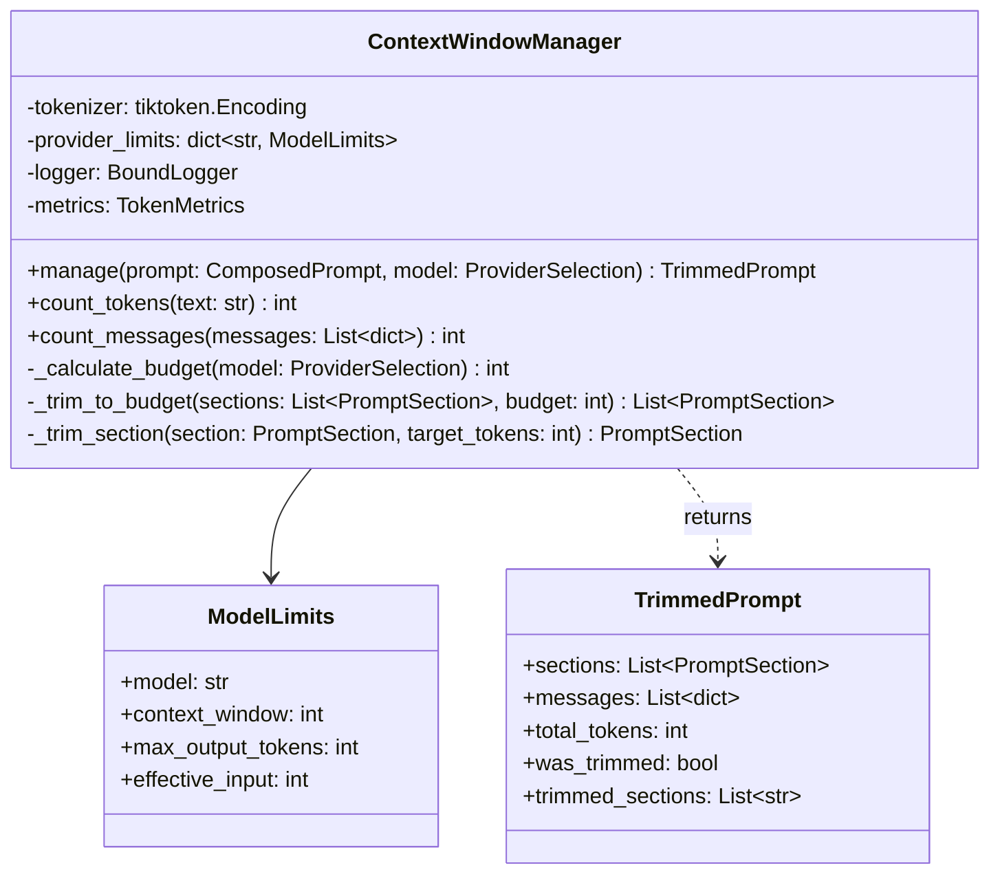
```mermaid
classDiagram
    class ContextWindowManager {
        -tokenizer: tiktoken.Encoding
        -provider_limits: dict~str, ModelLimits~
        -logger: BoundLogger
        -metrics: TokenMetrics
        +manage(prompt: ComposedPrompt, model: ProviderSelection) TrimmedPrompt
        +count_tokens(text: str) int
        +count_messages(messages: List~dict~) int
        -_calculate_budget(model: ProviderSelection) int
        -_trim_to_budget(sections: List~PromptSection~, budget: int) List~PromptSection~
        -_trim_section(section: PromptSection, target_tokens: int) PromptSection
    }

    class ModelLimits {
        +model: str
        +context_window: int
        +max_output_tokens: int
        +effective_input: int
    }

    class TrimmedPrompt {
        +sections: List~PromptSection~
        +messages: List~dict~
        +total_tokens: int
        +was_trimmed: bool
        +trimmed_sections: List~str~
    }

    ContextWindowManager --> ModelLimits
    ContextWindowManager ..> TrimmedPrompt : returns
```

### 16.2 Token Counting Implementation

The `ContextWindowManager` uses **tiktoken** with the `cl100k_base` encoding (used by GPT-4 family). For other providers, a multiplier is applied:

```
tiktoken_count = tokenizer.encode(text)
actual_count = tiktoken_count × provider_multiplier

Provider multipliers:
  nvidia:    1.00   (NVIDIA NIM OpenAI-compatible cl100k_base)
  groq:      1.00   (llama models, approximate)
  gemini:    0.97   (Gemini tokenizer is slightly more efficient)
```

**Performance:** tiktoken encoding is implemented in Rust and runs at ~100MB/s. For typical prompts (10K tokens), counting takes < 1ms.

### 16.3 Budget Allocation Algorithm

```
Algorithm: BudgetCalculator

Input: model (ProviderSelection with context_window, max_output_tokens, user_tier)

1. effective_window = model.context_window × 0.95   # 5% safety margin

2. reserved_output = model.max_output_tokens
   (capped at skill.max_output_tokens from SkillDefinition)

3. input_budget = effective_window - reserved_output

4. Allocate by section priority:
   system_budget         = input_budget × 0.10
   skill_prompt_budget   = input_budget × 0.10
   long_term_mem_budget  = input_budget × 0.10
   graph_context_budget  = input_budget × 0.10
   retrieval_budget      = input_budget × 0.20
   tool_results_budget   = input_budget × 0.15
   conversation_budget   = input_budget × 0.20
   user_query_budget     = input_budget × 0.05  (min: actual query length)

5. Return BudgetAllocation dict
```

### 16.4 Trimming Algorithm

```
Algorithm: PriorityTrimmer

Input: sections (sorted by priority ascending), total_budget

1. Calculate current total:
   total = sum(s.token_count for s in sections)

2. If total <= total_budget: return sections unchanged (no trimming needed)

3. excess = total - total_budget

4. Process sections in priority order (lowest priority first):
   for section in sorted(sections, key=lambda s: s.priority):
     if not section.trimmable:
       continue
     if excess <= 0:
       break
     can_trim = section.token_count - section_minimums[section.name]
     actual_trim = min(can_trim, excess)
     section.content = _truncate_to_tokens(section.content, section.token_count - actual_trim)
     section.token_count -= actual_trim
     excess -= actual_trim
     trimmed_sections.append(section.name)

5. If excess > 0 after all trimmable sections:
   raise ContextOverflowError("Cannot fit prompt within budget even after maximum trimming")

6. Rebuild messages list from trimmed sections.
   Return TrimmedPrompt(was_trimmed=True, trimmed_sections=...)
```

### 16.5 Section Minimums

To prevent sections from being trimmed to nothing (which would break the AI response), each section has a minimum token count:

```
section_minimums:
  system:               always full (priority 10, not trimmable)
  user_query:           always full (priority 10, not trimmable)
  conversation_history: 200 tokens minimum (last 2 turns)
  long_term_memory:     100 tokens minimum (top 3 facts)
  graph_context:        0   (can be fully removed)
  retrieval:            0   (can be fully removed)
  tool_results:         50  (at least one search result snippet)
```

---

## 17. Generation Router

> **Architecture Freeze:** The `GenerationRouter` replaces the old model router. It routes requests to the appropriate provider adapter based on the task:
> 1. **Request Analysis** -> routed to **Groq Adapter** (Call 1)
> 2. **Response Generation** -> routed to **NVIDIA Adapter** (Call 2)
> 3. **Fallback** -> routed to **Gemini Adapter** (if NVIDIA is unavailable)

### 17.1 Class Design

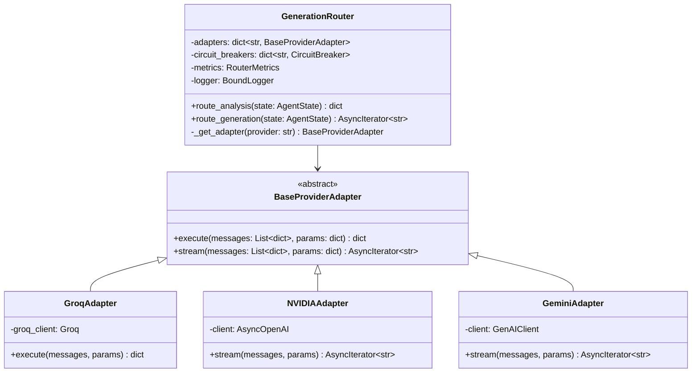
```mermaid
classDiagram
    class GenerationRouter {
        -adapters: dict~str, BaseProviderAdapter~
        -circuit_breakers: dict~str, CircuitBreaker~
        -metrics: RouterMetrics
        -logger: BoundLogger
        +route_analysis(state: AgentState) dict
        +route_generation(state: AgentState) AsyncIterator~str~
        -_get_adapter(provider: str) BaseProviderAdapter
    }

    class BaseProviderAdapter {
        <<abstract>>
        +execute(messages: List~dict~, params: dict) dict
        +stream(messages: List~dict~, params: dict) AsyncIterator~str~
    }

    class GroqAdapter {
        -groq_client: Groq
        +execute(messages, params) dict
    }

    class NVIDIAAdapter {
        -client: AsyncOpenAI
        +stream(messages, params) AsyncIterator~str~
    }

    class GeminiAdapter {
        -client: GenAIClient
        +stream(messages, params) AsyncIterator~str~
    }

    GenerationRouter --> BaseProviderAdapter
    BaseProviderAdapter <|-- GroqAdapter
    BaseProviderAdapter <|-- NVIDIAAdapter
    BaseProviderAdapter <|-- GeminiAdapter
```

### 17.2 Routing Logic

The routing is entirely deterministic based on the task type:

```
Algorithm: GenerationRouter routing

For Request Analysis (Call 1):
  - Primary provider: Groq
  - If Groq circuit breaker is OPEN:
    - Fall back to Gemini Adapter
    - If Gemini also fails: raise CriticalAnalysisError (falls back to safe default plan)

For Response Generation (Call 2):
  - Primary provider: NVIDIA NIM
  - If NVIDIA circuit breaker is OPEN:
    - Fall back to Gemini Adapter
    - If Gemini circuit breaker is OPEN: raise AllProvidersFailedError
```

### 17.3 Provider Configuration

```yaml
providers:
  groq:
    model: llama-3.3-70b-versatile
    api_key_env: GROQ_API_KEY
    timeout_ms: 5000
  nvidia:
    model: meta/llama-3.1-70b-instruct
    api_key_env: NVIDIA_API_KEY
    base_url: https://integrate.api.nvidia.com/v1
    timeout_ms: 15000
  gemini:
    model: gemini-1.5-pro
    api_key_env: GEMINI_API_KEY
    timeout_ms: 15000
```

---

## 18. Provider Adapters

### 18.1 BaseProviderAdapter Interface

Every adapter implements the `BaseProviderAdapter` interface to wrap provider-specific SDKs and format exceptions.

```python
class BaseProviderAdapter(ABC):
    @abstractmethod
    async def execute(self, messages: List[dict], params: dict) -> dict:
        """For non-streaming calls (e.g. Request Analysis)"""
        pass

    @abstractmethod
    async def stream(self, messages: List[dict], params: dict) -> AsyncIterator[str]:
        """For streaming calls (e.g. Response Generation)"""
        pass
```

### 18.2 Groq Adapter

- Wraps the official `groq` async client.
- Enforces JSON output format (`response_format={"type": "json_object"}`).
- Maps Groq API errors to internal exceptions (`GroqAPIError`, `GroqRateLimitError`).

### 18.3 NVIDIA Adapter

- Wraps `AsyncOpenAI` pointing to NVIDIA NIM endpoints (`https://integrate.api.nvidia.com/v1`).
- Connects using standard HTTP/2 keep-alive connection pooling.
- Handles token streaming with raw response chunks parsing.

### 18.4 Gemini Adapter

- Wraps `google-genai` SDK for Gemini API access.
- Used as the ultimate fallback for both analysis and response generation.
- Formats Gemini's response object structure to match the standard output dictionary layout.

---

## 19. Streaming Engine

### 19.1 Class Design

```mermaid
classDiagram
    class StreamingEngine {
        -publisher: KafkaPublisher
        -tracer: Tracer
        -metrics: StreamingMetrics
        -chunk_buffer: List~str~
        -chunk_size: int
        -flush_interval_ms: int
        +stream(token_iter: AsyncIterator~str~, state: AgentState) str
        -_flush_buffer(state: AgentState) None
        -_build_chunk_event(content: str, state: AgentState, idx: int, seq_num: int) ChatResponseChunkEvent
    }
```

### 19.2 Streaming Algorithm

```
Algorithm: StreamingEngine.stream(token_iter, state)

Variables:
  buffer = []
  buffer_tokens = 0
  chunk_index = 0
  full_content = []
  last_flush_time = now()
  first_chunk_emitted = False

For each token in token_iter:
  buffer.append(token)
  full_content.append(token)
  buffer_tokens += 1

  if not first_chunk_emitted:
    state.first_chunk_at = now()
    metrics.record_ttft(now() - state.inference_started_at)
    first_chunk_emitted = True

  should_flush = (
    buffer_tokens >= chunk_size  OR          # size-based flush
    (now() - last_flush_time) >= flush_interval  # time-based flush
  )

  if should_flush:
    await _flush_buffer(buffer, state, chunk_index, chunk_sequence_number=chunk_index + 1)
    chunk_index += 1
    buffer = []
    buffer_tokens = 0
    last_flush_time = now()

# Final flush (remaining tokens)
if buffer:
  await _flush_buffer(buffer, state, chunk_index, chunk_sequence_number=chunk_index + 1)

full_response = "".join(full_content)
# Returns the compiled response (LangGraph merges it into state.full_response)
return full_response
```

### 19.3 Chunk Size Strategy

| Condition | Chunk Size | Rationale |
|---|---|---|
| Default | 6 tokens | Good balance of Kafka throughput vs. perceived streaming speed |
| First chunk | 1 token | Get first token to user as fast as possible |
| Rate-limited (high load) | 12 tokens | Reduce Kafka publish rate during high traffic |
| Code blocks (detected) | 20 tokens | Code renders better in larger blocks |

### 19.4 Cancellation Handling

If the Conversation Service disconnects before the stream completes (detected via a `CancellationToken` passed into the pipeline), the streaming engine:
1. Stops consuming tokens from the provider token stream
2. Closes the active async generator (prevents dangling HTTP connection)
3. Publishes a `chat.response.cancelled` event to Kafka
4. Logs cost incurred up to cancellation point

---

## 20. Retry Manager

### 20.1 Class Design

```mermaid
classDiagram
    class RetryManager {
        -policy: RetryPolicy
        -logger: BoundLogger
        -metrics: RetryMetrics
        +execute_with_retry(fn: Callable, provider: str) Any
        +is_retriable(exc: Exception) bool
    }

    class RetryPolicy {
        +max_attempts: int = 3
        +initial_delay_ms: int = 100
        +max_delay_ms: int = 2000
        +backoff_factor: float = 2.0
        +jitter: bool = True
        +retriable_status_codes: List~int~
        +retriable_exceptions: List~type~
    }

    RetryManager --> RetryPolicy
```

### 20.2 Retry Implementation

The `RetryManager` wraps **Tenacity** with a custom retry predicate:

```
@retry(
  stop=stop_after_attempt(policy.max_attempts),
  wait=wait_exponential_jitter(
    initial=policy.initial_delay_ms / 1000,
    max=policy.max_delay_ms / 1000,
    jitter=policy.jitter
  ),
  retry=retry_if_exception(is_retriable),
  before_sleep=log_retry_attempt,
  reraise=True
)
async def execute_with_retry(fn, provider):
  return await fn()
```

### 20.3 Retry Classification

```
is_retriable(exc):
  if isinstance(exc, (groq.RateLimitError, openai.RateLimitError, google.api_core.exceptions.TooManyRequests)): return True
  if isinstance(exc, (groq.InternalServerError, openai.InternalServerError, google.api_core.exceptions.InternalServerError)): return True
  if isinstance(exc, (groq.APIConnectionError, openai.APIConnectionError, google.api_core.exceptions.RetryError)): return True
  if isinstance(exc, grpc.aio.AioRpcError):
    if exc.code() in [StatusCode.UNAVAILABLE, StatusCode.DEADLINE_EXCEEDED]:
      return True
  if isinstance(exc, asyncio.TimeoutError):        return True
  return False    # authentication errors, bad requests: do NOT retry
```

### 20.4 Jitter Algorithm

Jitter prevents **thundering herd** after provider recovery:
```
delay = min(initial × factor^attempt, max_delay)
jitter_amount = random.uniform(0, delay × 0.1)  # ±10% jitter
final_delay = delay + jitter_amount
```

### 20.5 Fallback After Exhaustion

When all retry attempts are exhausted for the primary model, the `RetryManager` signals the `GenerationRouter` to select the next fallback:

```
try:
  # The GenerationRouter wraps the execution with the RetryManager and manages the fallback sequence internally.
  result = await generation_router.route_generation(state)
except MaxRetryError:
  # If all retries and fallback providers are exhausted:
  raise AllProvidersFailed("All provider adapters exhausted")
```

---

## 21. Circuit Breaker

### 21.1 Class Design

```mermaid
classDiagram
    class CircuitBreaker {
        -provider: str
        -config: CircuitBreakerConfig
        -state: CircuitState
        -failure_count: int
        -success_count: int
        -last_failure_time: Optional~datetime~
        -_lock: asyncio.Lock
        -metrics: CircuitBreakerMetrics
        +call() AsyncContextManager
        +on_success() None
        +on_failure() None
        +is_open() bool
        +reset() None
    }

    class CircuitBreakerConfig {
        +failure_threshold: int = 5
        +success_threshold: int = 2
        +window_seconds: int = 60
        +recovery_timeout_seconds: int = 30
    }

    class CircuitState {
        <<enumeration>>
        CLOSED
        OPEN
        HALF_OPEN
    }

    CircuitBreaker --> CircuitBreakerConfig
    CircuitBreaker --> CircuitState
```

### 21.2 State Transition Logic

```
Algorithm: CircuitBreaker state machine

on_failure():
  async with _lock:
    failure_count += 1
    last_failure_time = now()
    if state == HALF_OPEN:
      state = OPEN        # probe failed, reopen
    if failure_count >= config.failure_threshold:
      state = OPEN
      log warning f"Circuit opened for {provider}"
      metrics.circuit_opened.inc()

on_success():
  async with _lock:
    if state == HALF_OPEN:
      success_count += 1
      if success_count >= config.success_threshold:
        state = CLOSED     # enough successes, close circuit
        failure_count = 0
        success_count = 0
        log info f"Circuit closed for {provider}"
    elif state == CLOSED:
      failure_count = max(0, failure_count - 1)  # decay failure count

call() (context manager):
  if state == OPEN:
    elapsed = now() - last_failure_time
    if elapsed >= config.recovery_timeout_seconds:
      state = HALF_OPEN    # allow probe
    else:
      raise CircuitOpenError(f"{provider} circuit is open")

  try:
    yield   # execute the wrapped call
    on_success()
  except Exception as e:
    if is_retriable(e):
      on_failure()
    raise
```

### 21.3 Per-Provider Isolation

Each provider has its own `CircuitBreaker` instance. This ensures that:
- An OpenAI outage does not prevent Anthropic requests
- Each provider's failure count is tracked independently
- Circuit recovery is independent per provider

The circuit breaker map is initialized at boot:
```
circuit_breakers = {
  "groq": CircuitBreaker("groq", config),
  "nvidia": CircuitBreaker("nvidia", config),
  "gemini": CircuitBreaker("gemini", config),
}
```

---

## 22. Cache Design

### 22.1 TTLCache Implementation

```mermaid
classDiagram
    class TTLCache {
        -_store: dict~str, CacheEntry~
        -_max_size: int
        -_default_ttl: int
        -_lock: asyncio.Lock
        +get(key: str) Optional~Any~
        +set(key: str, value: Any, ttl: Optional~int~) None
        +delete(key: str) None
        +clear() None
        -_evict_expired() None
        -_evict_lru() None
    }

    class CacheEntry {
        +value: Any
        +expires_at: float
        +access_count: int
        +last_accessed: float
    }

    TTLCache --> CacheEntry
```

### 22.2 Cache Eviction

Two eviction strategies run cooperatively:

1. **TTL eviction:** Entries older than their TTL are removed lazily on `get()`. A background task also runs every 60 seconds to purge all expired entries.

2. **LRU eviction:** When `max_size` is reached, the least recently accessed entry is removed. LRU tracking uses `last_accessed` timestamp updated on every `get()`.

### 22.3 What Gets Cached

| Cache | Key | TTL | Max Size | Rationale |
|---|---|---|---|---|
| **Web Search Results** | `sha256(query)` | 60s | 1,000 | Prevent duplicate API calls in ReAct loop |
| **Idempotency IDs** | `message_id` | 300s | 10,000 | Prevent duplicate Kafka message processing |
| **Provider Quotas** | `provider` | 5s | 10 | Rate limit status caching |
| **Prompt Templates** | `(skill, version)` | ∞ (boot-loaded) | 100 | Avoid repeated YAML parsing |

**No LLM response caching** is implemented. LLM responses are inherently non-deterministic (temperature > 0) and user-specific. Caching them would require extensive cache key design and raises privacy concerns.

---

## 23. Configuration Management

### 23.1 Configuration Hierarchy

```
Priority (highest to lowest):
  1. Environment variables (K8s Secrets / ConfigMap)
  2. .env file (development only)
  3. Default values in Pydantic Settings model
```

### 23.2 Secret Management

API keys are stored as Kubernetes Secrets and injected as environment variables at pod startup:

```yaml
env:
  - name: OPENAI_API_KEY
    valueFrom:
      secretKeyRef:
        name: llm-service-secrets
        key: nvidia-api-key
  - name: ANTHROPIC_API_KEY
    valueFrom:
      secretKeyRef:
        name: llm-service-secrets
        key: gemini-api-key
```

In `config.py`, these are typed as `SecretStr` from Pydantic. When logged (e.g., in Structlog), `SecretStr.__str__()` returns `"**********"` — never the actual value.

### 23.3 Feature Flags

Feature flags are implemented as boolean config fields with `FEATURE_` prefix:

```
FEATURE_SMART_PLANNING=true
FEATURE_WEB_SEARCH=true
FEATURE_DEEP_RESEARCH=true
FEATURE_VISION=false
FEATURE_GRPC_KEEPALIVE=true
```

These are read from environment variables. Changing them requires a pod restart (no hot-reload). For production feature flag management, this can be extended to use a feature flag service (e.g., LaunchDarkly) in the future.

### 23.4 Configuration Validation

Pydantic Settings validates all config on startup:
- `kafka_bootstrap_servers` must be a valid host:port string
- `groq_api_key` and `nvidia_api_key` must be set and non-empty
- `grpc_deadline_ms` must be between 500 and 30000
- `max_react_iterations` must be between 1 and 10

Any validation failure causes immediate process exit with a clear error message.

---

## 24. Security

### 24.1 mTLS via Istio

All inter-service gRPC communication is protected by **mutual TLS** enforced at the Istio sidecar level:

```yaml
# Istio PeerAuthentication (enforced mTLS in the namespace)
apiVersion: security.istio.io/v1beta1
kind: PeerAuthentication
metadata:
  name: default
  namespace: graphgpt
spec:
  mtls:
    mode: STRICT
```

The LLM Service application code does not need to implement TLS — Istio's Envoy sidecar handles certificate negotiation transparently.

### 24.2 Input Sanitization (Prompt Injection Protection)

User input passes through `InputSanitizer` before being included in any prompt:

```mermaid
flowchart LR
    Input["raw user_message"]
    Sanitizer["InputSanitizer"]
    DI["Delimiter Injection Check\n(escape system prompt tokens)"]
    Override["Instruction Override Check\n(regex: ignore previous, forget)"]
    Length["Length Enforcement\n(max 4096 chars)"]
    Clean["sanitized_message"]

    Input --> Sanitizer --> DI --> Override --> Length --> Clean
```

**Delimiter Injection:** System prompt delimiters used by common LLM providers (`###`, `<|im_start|>`, `[INST]`, `<<SYS>>`) are escaped in user input to prevent them from being interpreted as prompt structure.

**Instruction Override Detection:** Regex patterns matching common jailbreak phrases (`"ignore all previous instructions"`, `"forget your system prompt"`, `"you are now DAN"`) are detected. On detection:
1. Log at WARNING level with `pii_sanitized=true`
2. Include a `safety_check_failed=true` flag in the agent state
3. Optionally add a safety reminder to the system prompt

### 24.3 Output Validation

Before streaming the LLM response to Kafka, the `OutputValidator` checks:
- Response is non-empty
- Response does not contain raw API keys (regex: `sk-[a-zA-Z0-9]{48}`, `AIza...`)
- Response length is within expected bounds
- Response encoding is valid UTF-8

### 24.4 PII Detection

The `PIIDetector` runs on user messages before they are sent to external LLM providers:

```
PIIPatterns:
  email:         r"[a-zA-Z0-9._%+-]+@[a-zA-Z0-9.-]+\.[a-zA-Z]{2,}"
  phone_us:      r"\b(\+1[-.\s]?)?\(?\d{3}\)?[-.\s]?\d{3}[-.\s]?\d{4}\b"
  ssn:           r"\b\d{3}-\d{2}-\d{4}\b"
  credit_card:   r"\b(?:\d[ -]?){13,16}\b"

For each match:
  Replace with placeholder: [EMAIL_REDACTED], [PHONE_REDACTED], etc.
  Log PII detection event (without the PII value itself)
  Set state.pii_detected = True
```

### 24.5 Kafka Authentication

Kafka connections use SASL/SCRAM-SHA-512:
```python
AIOKafkaConsumer(
  security_protocol="SASL_SSL",
  sasl_mechanism="SCRAM-SHA-512",
  sasl_plain_username=config.kafka_username,
  sasl_plain_password=config.kafka_password.get_secret_value(),
)
```

---

## 25. Observability

### 25.1 Structlog Configuration

Structlog is configured with a processor chain that runs on every log call:

```
Processor Chain:
  1. add_log_level                    → adds "level" field
  2. add_timestamp                    → adds ISO8601 "timestamp"
  3. ContextVar processor             → adds trace_id, span_id, conversation_id
                                        from contextvars (set per-request)
  4. stdlib_log_level_field           → maps to stdlib for library compatibility
  5. JSONRenderer                     → serializes to JSON string
```

Every log line includes:
```json
{
  "timestamp": "2026-08-06T14:47:51.123Z",
  "level": "info",
  "service": "llm-service",
  "version": "1.3.2",
  "pod_name": "llm-service-pod-abc",
  "trace_id": "abc123",
  "span_id": "def456",
  "conversation_id": "conv_xyz",
  "user_id": "user_abc",    // only in non-production for GDPR
  "event": "llm_inference_complete",
  "model": "meta/llama-3.1-70b-instruct",
  "latency_ms": 1240
}
```

### 25.2 OpenTelemetry Tracing

Every significant async function is decorated with a span:

```python
@trace_span("intent_analysis")
async def intent_analysis_node(state: AgentState) -> dict:
    ...
```

The `@trace_span` decorator:
1. Starts a child span from the current context
2. Sets common attributes: `conversation_id`, `user_id`, `mode`
3. Records exceptions as span events with `exception.type` and `exception.message`
4. Sets span status to ERROR on exception
5. Ends the span on exit (success or failure)

**Trace propagation:** The `traceparent` header from the Kafka event is extracted at consumer level and set as the root span context using `propagate.extract()`. All downstream spans are children of this root span.

### 25.3 Prometheus Metrics Definitions

All metrics are defined in `observability/metrics.py` as module-level objects:

```python
# Request metrics
REQUESTS_TOTAL = Counter(
    "llm_requests_total",
    "Total LLM service requests",
    ["mode", "skill", "model", "provider", "status"]
)

REQUEST_DURATION = Histogram(
    "llm_request_duration_seconds",
    "End-to-end request duration",
    ["mode", "skill", "model", "provider"],
    buckets=[0.1, 0.25, 0.5, 1.0, 2.0, 5.0, 10.0, 30.0]
)

TTFT = Histogram(
    "llm_ttft_seconds",
    "Time to first token",
    ["model", "provider", "mode"],
    buckets=[0.1, 0.25, 0.5, 1.0, 2.0, 5.0]
)

TOKENS_TOTAL = Counter(
    "llm_tokens_total",
    "Total tokens processed",
    ["model", "provider", "token_type"]   # token_type: prompt | completion
)

COST_USD = Counter(
    "llm_cost_usd_total",
    "Total LLM cost in USD",
    ["model", "provider", "skill", "user_tier"]
)

CIRCUIT_BREAKER_STATE = Gauge(
    "llm_circuit_breaker_state",
    "Circuit breaker state (0=closed, 1=half-open, 2=open)",
    ["provider"]
)

TOOL_CALLS = Counter(
    "llm_tool_calls_total",
    "Tool execution count",
    ["tool_name", "status"]
)

TOOL_DURATION = Histogram(
    "llm_tool_duration_seconds",
    "Tool execution duration",
    ["tool_name"],
    buckets=[0.01, 0.05, 0.1, 0.5, 1.0, 5.0]
)

KAFKA_LAG = Gauge(
    "llm_kafka_consumer_lag",
    "Kafka consumer lag",
    ["topic", "partition"]
)

CONTEXT_TOKENS = Histogram(
    "llm_context_tokens_by_section",
    "Token count per prompt section",
    ["section", "mode"]
)
```

### 25.4 Correlation IDs

A unique `request_id` (UUID4) is generated for every pipeline invocation. It is:
- Added to all log entries via `contextvars.ContextVar`
- Added to all OTel span attributes
- Included in every Kafka event produced
- Returned in error responses

The `conversation_id` from the original Kafka event is also propagated throughout and serves as the primary correlation key across services.

---

## 26. Error Handling

### 26.1 Error Taxonomy and Classification

```mermaid
graph TD
    AllErrors["All Errors"]
    Retriable["Retriable Errors\n(transient)"]
    Permanent["Permanent Errors\n(non-retriable)"]
    Fatal["Fatal Errors\n(shutdown service)"]

    AllErrors --> Retriable & Permanent & Fatal

    Retriable --> R1["gRPC UNAVAILABLE"]
    Retriable --> R2["HTTP 429 / 503"]
    Retriable --> R3["asyncio.TimeoutError"]
    Retriable --> R4["Kafka connection lost"]

    Permanent --> P1["Pydantic ValidationError"]
    Permanent --> P2["HTTP 400 / 401 / 403"]
    Permanent --> P3["Content policy violation"]
    Permanent --> P4["Context overflow (trimming failed)"]

    Fatal --> F1["Config load failure"]
    Fatal --> F2["gRPC client init failure"]
    Fatal --> F3["LangGraph build failure"]
    Fatal --> F4["Kafka connection failure at startup"]
```

### 26.2 Error Propagation Strategy

```
Node-Level Error Handling:

Every LangGraph node catches all exceptions:
  try:
    result = await do_work(state)
    return result
  except RetriableError as e:
    # Logged, counter incremented, re-raised for RetryManager
    raise
  except PermanentError as e:
    # Set state.error, return error state dict
    return {"error": ServiceError(type=PERMANENT, ...)}
  except Exception as e:
    # Unexpected error — treated as permanent
    log.error("Unexpected error in node", exc_info=True)
    return {"error": ServiceError(type=UNEXPECTED, ...)}

Error state propagates to conditional router → "handle_error" node
"handle_error" node publishes error response to Kafka
```

### 26.3 Error Response Published to Kafka

```
ChatResponseGeneratedEvent (error variant):
  status: "error"
  error_code: "PROVIDER_ALL_FAILED"
  error_message: "Unable to generate response at this time. Please try again."
  full_content: null
  conversation_id: ...
  message_id: ...
```

The Conversation Service reads this and surfaces a user-friendly error message.

### 26.4 Graceful Degradation Decisions

| Failure | Response |
|---|---|
| Memory Service unavailable | Proceed without memory context; set `degraded_mode=True` |
| Graph Service unavailable | Proceed without graph context; set `degraded_mode=True` |
| Retrieval Service unavailable | Proceed without retrieval; set `degraded_mode=True` |
| Web Search tool failure | Proceed without search results; acknowledge in response |
| Primary LLM provider fails | Try fallback 1, then fallback 2 |
| All LLM providers fail | Publish error event to Kafka |
| Kafka publish failure | Retry 3×; if all fail, log CRITICAL alert |

---

## 27. Performance Optimizations

### 27.1 Async Event Loop Architecture

The service runs a single asyncio event loop per process (uvicorn default). Both the FastAPI server and the Kafka consumer share this event loop:

```mermaid
graph LR
    EventLoop["asyncio Event Loop\n(single per process)"]
    UvicornServer["Uvicorn HTTP Server\n(FastAPI health endpoints)"]
    KafkaConsumerTask["Kafka Consumer Task\n(continuous loop)"]
    PipelineTasks["Pipeline Tasks\n(one per message)"]
    HealthProbeTask["Provider Health Probe\n(every 30s)"]

    EventLoop --> UvicornServer
    EventLoop --> KafkaConsumerTask
    EventLoop --> PipelineTasks
    EventLoop --> HealthProbeTask
```

**CPU-bound work** (tiktoken encoding for large prompts) is offloaded to a `ProcessPoolExecutor` to avoid blocking the event loop:
```
token_count = await loop.run_in_executor(
    process_pool,
    tiktoken_encode,
    text
)
```

### 27.2 Connection Pooling Summary

| Connection Type | Pool Size | Rationale |
|---|---|---|
| gRPC channels (per service) | 20 | HTTP/2 multiplexing; 20 channels × 100 streams = 2000 concurrent RPCs |
| httpx async client | 1 (shared) | httpx manages internal connection pool per host |
| Kafka producer | 1 (shared) | aiokafka producer is async-safe |
| Kafka consumer | 1 (shared) | One consumer per partition assignment |

### 27.3 Memory Optimization

- **AgentState immutability:** LangGraph creates new state dict objects rather than mutating in place. Large context strings (graph summaries, retrieval chunks) are stored once and referenced by index.
- **Streaming vs. buffering:** Responses are streamed token-by-token. The full response is assembled only once streaming completes.
- **Proto object lifecycle:** gRPC proto response objects are converted to Python dicts immediately after receipt. The proto objects are then eligible for GC.

### 27.4 Parallel Context Collection

The parallel gRPC scatter-gather pattern (Section 17.2) is the single largest latency optimization. Sequential context collection would add ~200ms. Parallel collection reduces this to ~100ms.

### 27.5 Prompt Template Caching

Prompt templates are loaded once at startup and stored in `PromptRegistry`. Each request reads from this in-memory registry — no file I/O in the hot path.

---

## 28. Deployment Design

### 28.1 Dockerfile

```dockerfile
# Multi-stage build for minimal image size
FROM python:3.12-slim AS builder

WORKDIR /build
COPY pyproject.toml .
RUN pip install --no-cache-dir build
COPY src/ src/
RUN python -m build --wheel

FROM python:3.12-slim AS runtime

# Non-root user for security
RUN groupadd -r llmservice && useradd -r -g llmservice llmservice

WORKDIR /app

# Install dependencies
COPY --from=builder /build/dist/*.whl .
RUN pip install --no-cache-dir *.whl && rm *.whl

# Copy runtime assets
COPY prompts/ prompts/
COPY proto/generated/ proto/generated/

USER llmservice

# Health check
HEALTHCHECK --interval=10s --timeout=5s --start-period=30s --retries=3 \
  CMD curl -f http://localhost:8080/health || exit 1

EXPOSE 8080 9090

CMD ["uvicorn", "llm_service.main:app", \
     "--host", "0.0.0.0", \
     "--port", "8080", \
     "--workers", "1", \
     "--loop", "uvloop", \
     "--no-access-log"]
```

**Why `--workers 1`?** The Kafka consumer runs as an asyncio task within the same process. Multiple workers would create multiple independent consumers, each with their own partition assignments. This is correct behavior but requires careful consumer group management. For simplicity and predictability, one worker per pod is recommended. Pod count is scaled by K8s HPA.

### 28.2 Kubernetes Deployment

```yaml
apiVersion: apps/v1
kind: Deployment
metadata:
  name: llm-service
  namespace: graphgpt
spec:
  replicas: 4    # minimum; HPA manages actual count
  selector:
    matchLabels:
      app: llm-service
  strategy:
    type: RollingUpdate
    rollingUpdate:
      maxSurge: 2
      maxUnavailable: 0    # zero-downtime rolling deployment
  template:
    metadata:
      labels:
        app: llm-service
      annotations:
        prometheus.io/scrape: "true"
        prometheus.io/port: "9090"
        prometheus.io/path: "/metrics"
    spec:
      serviceAccountName: llm-service
      affinity:
        podAntiAffinity:
          requiredDuringSchedulingIgnoredDuringExecution:
            - labelSelector:
                matchLabels:
                  app: llm-service
              topologyKey: topology.kubernetes.io/zone    # spread across AZs
      containers:
        - name: llm-service
          image: graphgpt/llm-service:1.3.2
          ports:
            - containerPort: 8080
            - containerPort: 9090
          resources:
            requests:
              cpu: "2"
              memory: "4Gi"
            limits:
              cpu: "4"
              memory: "8Gi"
          readinessProbe:
            httpGet:
              path: /ready
              port: 8080
            initialDelaySeconds: 20
            periodSeconds: 5
            failureThreshold: 3
          livenessProbe:
            httpGet:
              path: /health
              port: 8080
            initialDelaySeconds: 30
            periodSeconds: 10
            failureThreshold: 3
          envFrom:
            - configMapRef:
                name: llm-service-config
            - secretRef:
                name: llm-service-secrets
```

### 28.3 HPA Configuration

```yaml
apiVersion: autoscaling/v2
kind: HorizontalPodAutoscaler
metadata:
  name: llm-service-hpa
  namespace: graphgpt
spec:
  scaleTargetRef:
    apiVersion: apps/v1
    kind: Deployment
    name: llm-service
  minReplicas: 4
  maxReplicas: 64
  metrics:
    - type: External
      external:
        metric:
          name: kafka_consumer_group_lag
          selector:
            matchLabels:
              consumer_group: llm-service-group
              topic: chat.message.created
        target:
          type: AverageValue
          averageValue: "50"
    - type: Resource
      resource:
        name: cpu
        target:
          type: Utilization
          averageUtilization: 70
  behavior:
    scaleUp:
      stabilizationWindowSeconds: 30
      policies:
        - type: Pods
          value: 4
          periodSeconds: 60
    scaleDown:
      stabilizationWindowSeconds: 300    # 5 min stabilization before scale down
```

### 28.4 Health Endpoints

```
GET /health
  Returns 200 if process is running
  Returns 503 if event loop is deadlocked (detected by heartbeat task)

GET /ready
  Returns 200 if:
    - Kafka consumer is connected and running
    - gRPC clients are initialized
    - LangGraph is compiled
    - Prompts are loaded
  Returns 503 if any of the above are not ready
  K8s removes pod from Service endpoints during unready state (prevents traffic)

GET /metrics
  Returns Prometheus text format metrics
```

---

## 29. Testing Strategy

### 29.1 Test Architecture

```mermaid
graph TD
    subgraph "Unit Tests"
        UT1["test_context_collector.py\n(parallel fetch + merge)"]
        UT2["test_request_analyzer.py\n(Groq analysis + plan)"]
        UT3["test_generation_router.py\n(routing to adapters)"]
        UT4["test_prompt_builder.py\n(section assembly)"]
        UT5["test_context_window.py\n(trimming algorithm)"]
        UT7["test_circuit_breaker.py\n(state transitions)"]
        UT8["test_retry_manager.py\n(backoff + jitter)"]
    end

    subgraph "Integration Tests"
        IT1["test_grpc_clients.py\n(testcontainers gRPC mock)"]
        IT2["test_kafka_consumer.py\n(embedded Kafka)"]
        IT3["test_tool_dispatcher.py\n(mock tools)"]
        IT4["test_pipeline_e2e.py\n(full pipeline, mocked LLM)"]
    end

    subgraph "Load Tests"
        LT1["locustfile.py\n(Kafka event injection)"]
    end
```

### 29.2 Unit Test Design Principles

- **No mocking of internal modules.** Unit tests test real implementations against controlled inputs.
- **Mock only external I/O:** gRPC clients, Kafka, HTTP clients are replaced with mock implementations.
- **Use pytest-asyncio** for all async test functions.
- **Fixtures for common state:** `conftest.py` provides factories for `AgentState`, `ExecutionPlan`, `MemoryContext`.

### 29.3 Key Test Scenarios

#### Request Analyzer Tests
```
test_analyzer_valid_query:
  input: "What is the capital of France?" + context_bundle
  expected: ExecutionPlan(intent=QUESTION_ANSWERING, mode=DEFAULT, skill=general_chat, reasoning=DIRECT, tools=[])

test_analyzer_smart_mode_tool_selection:
  input: "Check recent search on AI in 2026" + context_bundle
  expected: ExecutionPlan(intent=WEB_SEARCH, mode=SMART, skill=research, reasoning=REACT, tools=[ToolCall(name="web_search")])

test_analyzer_fallback_on_groq_failure:
  Groq API call raises GroqAPIError
  expected: returns SafeDefaultPlan (DIRECT, tools=[], provider=nvidia)
```

#### Context Collector Tests
```
test_collector_parallel_fetch:
  Mock all 3 services (Memory, Graph, Retrieval)
  expected: all 3 gRPC calls made concurrently, returns ContextBundle

test_collector_graceful_degradation:
  Mock GraphService unreachable
  expected: bundle.degraded == True, bundle.missing_sources == ["graph"], memory and retrieval context populate successfully
```

#### Circuit Breaker Tests
```
test_opens_after_failure_threshold:
  Call on_failure() 5 times
  expected: state == OPEN after 5th call

test_allows_probe_after_recovery_timeout:
  Open circuit, advance time by recovery_timeout
  Next call() should not raise CircuitOpenError (HALF_OPEN state)

test_closes_after_success_threshold:
  HALF_OPEN state, call on_success() 2 times
  expected: state == CLOSED
```

### 29.4 Integration Test: Full Pipeline

```
test_pipeline_default_mode_e2e:
  Setup:
    - Mock MemoryServiceClient returns 5 short-term messages + 3 facts
    - Mock GraphServiceClient returns 3 nodes + summary
    - Mock GenerationRouter returns streaming "Hello from the AI!"
    - Mock KafkaPublisher captures all published events

  Execute:
    event = make_chat_message_event(content="Hello", mode=DEFAULT)
    state = await pipeline.run(event)

  Assertions:
    - state.intent == IntentCategory.GENERAL_CHAT
    - state.mode == UserMode.DEFAULT
    - state.skill == Skill.general_chat
    - state.plan.tools == []
    - state.context_bundle is not None
    - state.composed_prompt is not None
    - state.full_response == "Hello from the AI!"
    - kafka_publisher.published_events includes ChatResponseGeneratedEvent (with chunk_sequence_number)
    - kafka_publisher.published_events includes MemoryUpdateRequestedEvent
```

### 29.5 Kafka Consumer Integration Test

Uses `testcontainers-python` to start a real Kafka instance:
```
test_consumer_processes_message:
  Start Kafka container
  Start LLM Service consumer with mock pipeline
  Produce event to chat.message.created
  Assert pipeline.run called with correct event
  Assert consumer committed offset
```

### 29.6 Load Testing

`locustfile.py` injects Kafka events at controlled rates:
```
KafkaUser(User):
  @task
  def send_message(self):
    producer.send("chat.message.created", make_event())

Targets:
  - 100 req/s for 5 minutes → verify < 1% error rate and p95 TTFT < 1500ms
  - 1000 req/s for 1 minute → verify graceful degradation, no pod OOM
```

---

## 30. Sequence Diagrams

### 30.1 Full Default Mode Sequence

```mermaid
sequenceDiagram
    participant Kafka
    participant Consumer as KafkaConsumer
    participant Pipeline
    participant Ctx as ContextCollector
    participant MemGRPC as MemoryServiceClient
    participant GraphGRPC as GraphServiceClient
    participant RetGRPC as RetrievalServiceClient
    participant Analyzer as RequestAnalyzer
    participant Groq as Groq
    participant PB as PromptBuilder
    participant CWM as ContextWindowManager
    participant Router as GenerationRouter
    participant NVIDIA as NVIDIA_NIM
    participant Stream as StreamingEngine
    participant Pub as KafkaPublisher
    participant Consumer

    Kafka->>Consumer: ConsumerRecord(chat.message.created)
    Consumer->>Consumer: deserialize + idempotency check
    Consumer->>Pipeline: run(event)

    Note over Pipeline: Context Collection runs FIRST and always
    par Parallel Context
        Pipeline->>Ctx: context_collection_node(state)
        Ctx->>MemGRPC: GetMemoryContext()
        MemGRPC-->>Ctx: MemoryContext
    and
        Ctx->>GraphGRPC: GetGraphContext()
        GraphGRPC-->>Ctx: GraphContext
    and
        Ctx->>RetGRPC: GetRelevantChunks()
        RetGRPC-->>Ctx: RetrievalContext
    end
    Ctx-->>Pipeline: {context_bundle: ...}

    Pipeline->>Analyzer: request_analysis_node(state)
    Analyzer->>Groq: POST /chat/completions (llama-3.3-70b-versatile)
    Groq-->>Analyzer: JSON Plan Response
    Analyzer-->>Pipeline: {plan: ExecutionPlan, mode: DEFAULT, skill: general_chat, reasoning: DIRECT}

    Note over Pipeline: DEFAULT mode: no tools to dispatch
    Pipeline->>PB: prompt_building_node(state)
    PB-->>Pipeline: {composed_prompt: ...}
    Pipeline->>CWM: token_management_node(state)
    CWM-->>Pipeline: {token_count: 1450}

    Pipeline->>Router: llm_inference_node(state)
    Router->>NVIDIA_NIM: POST /v1/chat/completions (stream=true, llama-3.1-70b-instruct)

    loop Token stream
        NVIDIA_NIM-->>Router: chunk
        Router-->>Stream: token
        Stream->>Pub: publish_chunk(chunk_sequence_number)
    end

    Router-->>Pipeline: {llm_response: finish_reason=stop}
    Pipeline->>Stream: streaming_node(state)
    Stream-->>Pipeline: {full_response: ...}
    Pipeline->>Pub: publish_node(state)
    Pub->>Kafka: Publish chat.response.generated
    Pub->>Kafka: Publish memory.update.requested
    Pub->>Consumer: Trigger commit
    Consumer->>Kafka: consumer.commit()
```

### 30.2 Smart Mode Sequence

```mermaid
sequenceDiagram
    participant Pipeline
    participant Ctx as ContextCollector
    participant Analyzer as RequestAnalyzer
    participant Groq as Groq (Call 1)
    participant Dispatcher as ToolDispatcher
    participant WebSearch as WebSearchTool
    participant PB as PromptBuilder
    participant Router as GenerationRouter
    participant NVIDIA as NVIDIA_NIM

    Pipeline->>Ctx: context_collection_node(state)
    Ctx-->>Pipeline: {context_bundle: ...}

    Pipeline->>Analyzer: request_analysis_node(state)
    Analyzer->>Groq: POST /chat/completions (llama-3.3-70b-versatile)
    Groq-->>Analyzer: JSON Plan {"tools": [{"tool_name": "web_search", "params": {"query": "..."}}]}
    Analyzer-->>Pipeline: ExecutionPlan (SMART mode)

    Note over Pipeline: Execute only planned tools
    Pipeline->>Dispatcher: tool_dispatch_node(state)
    Dispatcher->>WebSearch: execute(query)
    WebSearch-->>Dispatcher: SearchResults
    Dispatcher-->>Pipeline: {tool_results: [...]}

    Pipeline->>PB: prompt_building_node(state)
    PB-->>Pipeline: {composed_prompt: ...}

    Pipeline->>Router: llm_inference_node(state)
    Router->>NVIDIA: POST /v1/chat/completions (stream=true)
    NVIDIA-->>Router: stream chunks
    Router-->>Pipeline: {llm_response: finish_reason=stop}
```


### 31.1 Complete Tool Framework Class Diagram

```mermaid
classDiagram
    class BaseTool {
        <<abstract>>
        +name: str
        +description: str
        +version: str
        +timeout_ms: int
        +execute(params: ToolParams) ToolResult
        +validate_params(params) ValidationResult
        +get_schema() ToolSchema
        +is_available() bool
    }

    class MCPTool {
        -client: MCPClient
        +execute(params) ToolResult
    }

    class WebSearchTool {
        -http_client: httpx.AsyncClient
        -api_key: str
        -cache: TTLCache
        +execute(params) ToolResult
        -_search_tavily(query) List~SearchResult~
        -_search_bing_fallback(query) List~SearchResult~
    }

    class ToolRegistry {
        -_tools: dict
        -_enabled: set
        +register(tool: BaseTool) None
        +get(name: str) BaseTool
        +list_tools() List~ToolMetadata~
    }

    class ToolDispatcher {
        -registry: ToolRegistry
        -executor: ToolExecutor
        +dispatch(plan, state) List~ToolResult~
    }

    class ToolExecutor {
        +execute(tool, params) ToolResult
    }

    BaseTool <|-- MCPTool
    BaseTool <|-- WebSearchTool
    ToolRegistry "1" --> "*" BaseTool
    ToolDispatcher --> ToolRegistry
    ToolDispatcher --> ToolExecutor
```

### 31.2 Inference Layer Class Diagram

```mermaid
classDiagram
    class GenerationRouter {
        -adapters: dict~str, BaseProviderAdapter~
        -circuit_breakers: dict~str, CircuitBreaker~
        +route_analysis(state) dict
        +route_generation(state) AsyncIterator~str~
    }

    class BaseProviderAdapter {
        <<abstract>>
        +execute(messages, params) dict
        +stream(messages, params) AsyncIterator~str~
    }

    class GroqAdapter {
        -groq_client: Groq
        +execute(messages, params) dict
    }

    class NVIDIAAdapter {
        -client: AsyncOpenAI
        +stream(messages, params) AsyncIterator~str~
    }

    class GeminiAdapter {
        -client: GenAIClient
        +stream(messages, params) AsyncIterator~str~
    }

    class RetryManager {
        -policy: RetryPolicy
        +execute_with_retry(fn, provider) Any
    }

    class CircuitBreaker {
        -state: CircuitState
        -failure_count: int
        +call() AsyncContextManager
        +on_failure() None
        +on_success() None
    }

    class StreamingEngine {
        -publisher: KafkaPublisher
        +stream(token_iter, state) str
    }

    class ContextWindowManager {
        -tokenizer: Encoding
        +manage(prompt, provider_selection) TrimmedPrompt
        +count_tokens(text) int
    }

    GenerationRouter --> BaseProviderAdapter
    BaseProviderAdapter <|-- GroqAdapter
    BaseProviderAdapter <|-- NVIDIAAdapter
    BaseProviderAdapter <|-- GeminiAdapter
    GenerationRouter --> CircuitBreaker
    GenerationRouter --> RetryManager
    GenerationRouter --> StreamingEngine
    StreamingEngine --> KafkaPublisher
```

### 31.3 Orchestration Layer Class Diagram

```mermaid
classDiagram
    class Pipeline {
        -graph: CompiledGraph
        +run(event) AgentState
    }

    class GraphBuilder {
        -config: LLMServiceConfig
        +build() CompiledGraph
    }

    class RequestAnalyzer {
        -groq_client: GroqAnalysisClient
        +analyze(state) ExecutionPlan
    }

    class ContextCollector {
        -memory_client: MemoryServiceClient
        -graph_client: GraphServiceClient
        -retrieval_client: RetrievalServiceClient
        -merger: ContextMerger
        +collect(state) ContextBundle
    }

    Pipeline --> GraphBuilder
    GraphBuilder --> RequestAnalyzer
    GraphBuilder --> ContextCollector
```

---

## 32. Future Extensibility

### 32.1 Adding a New Tool

To add a new tool (e.g., `GitHubTool`), the following steps are required.

```
Step 1: Create src/llm_service/tools/implementations/github_tool.py
  class GitHubTool(BaseTool):
    name = "github"
    description = "Search GitHub repositories and code"
    timeout_ms = 5000
    ...

Step 2: Register in main.py lifespan:
  registry.register(GitHubTool(config.github_token))

Step 3: Update PromptBuilder to handle ToolResult with type="github"
  (Add formatting in _format_tool_result for new data type)

Step 4: Write tests in tests/unit/test_github_tool.py

Total: ~4 files modified/created. Zero changes to orchestration core.
```

### 32.2 Adding a New LLM Provider (Adapter)

Since LiteLLM is removed, we add providers by creating custom adapters:

```
Step 1: Create src/llm_service/inference/adapters/cohere_adapter.py
  class CohereAdapter(BaseProviderAdapter):
    ...

Step 2: Add API key to Kubernetes Secrets:
  COHERE_API_KEY: <base64>

Step 3: Add to config.py:
  cohere_api_key: SecretStr

Step 4: Register adapter in GenerationRouter:
  self.adapters["cohere"] = CohereAdapter(config.cohere_api_key)

Step 5: Add circuit breaker for new provider in GenerationRouter:
  self.circuit_breakers["cohere"] = CircuitBreaker("cohere", config)

Total: ~5 changes.
```

### 32.3 Adding a New Skill

```
Step 1: Add to Skill enum in orchestration/schemas.py:
  CREATIVE_WRITING = "creative_writing"

Step 2: Create prompt template:
  prompts/creative_writing_v1.yaml

Step 3: Register SkillDefinition in SkillRegistry:
  SkillDefinition(
    skill=Skill.CREATIVE_WRITING,
    prompt_template_key="creative_writing",
    reasoning_mode=ReasoningMode.DIRECT,
    temperature=0.9,
    max_output_tokens=8192,
    tool_allowed=False
  )

Total: ~3 files. Zero changes to routing or inference.
```

### 32.4 Adding MCP (Model Context Protocol) Support

MCP is an emerging protocol for tool communication. Integration plan:

```mermaid
flowchart TD
    MCPServer["MCP Server\n(external process)"]
    MCPTool["MCPTool (BaseTool impl)"]
    MCPClient["MCPClient\n(MCP protocol client)"]
    Registry["ToolRegistry"]

    MCPTool --> MCPClient
    MCPClient -->|"stdio / SSE / HTTP"| MCPServer
    Registry --> MCPTool
```

`MCPTool` implementation:
1. `MCPClient` connects to an MCP server at startup (via stdio, SSE, or HTTP as per MCP spec)
2. `MCPTool.get_schema()` queries the MCP server's `list_tools` endpoint to get dynamic tool descriptions
3. `MCPTool.execute()` forwards the call to the MCP server's `call_tool` endpoint
4. Results are normalized to `ToolResult` format

**Dynamic tool discovery from MCP:** At startup, `MCPTool` registers itself once per MCP server. The tool dispatcher's registry is updated with the server's exposed tools. This means MCP tools are **first-class citizens** in the planning system without code changes per tool.

### 32.5 Adding Vision Mode

```
Step 1: Add UserMode.VISION to modes
Step 2: Add VISION ModeDefinition inside ModeContextTable validation
Step 3: Update GenerationRouter to route Vision skill to vision-capable adapter models (NVIDIA or Gemini fallback)
Step 4: Update PromptBuilder to handle image content in messages:
        messages = [
          {"role": "user", "content": [
            {"type": "text", "text": user_message},
            {"type": "image_url", "image_url": {"url": image_url}}
          ]}
        ]
Step 5: Update ChatMessageCreatedEvent schema to include image_urls field

Total: ~5 files. Core orchestration unchanged.
```

### 32.6 Extensibility Summary Table

| Extension | Files Changed | Core Changes | Estimated Effort |
|---|---|---|---|
| New Tool | 1 new file, 1 registration | None | 0.5 day |
| New LLM Provider | 1 new adapter file, configs | None | 2 hours |
| New Skill | 2 files (YAML + registration) | None | 0.5 day |
| MCP Integration | 1 new MCPTool class | None | 3-5 days |
| Vision Mode | 5 files | Schema update | 3-5 days |

---

## Appendix A: Error Codes Reference

| Error Code | Category | Description | User Impact |
|---|---|---|---|
| `PROVIDER_RATE_LIMITED` | Inference | Provider returned 429 | Transparent (failover) |
| `PROVIDER_UNAVAILABLE` | Inference | Provider returned 503 | Transparent (failover) |
| `PROVIDER_ALL_FAILED` | Inference | All fallbacks exhausted | Error response to user |
| `PROVIDER_AUTH_FAILED` | Inference | Invalid API key | Error response + ops alert |
| `CONTEXT_OVERFLOW` | Prompt | Cannot fit prompt in budget | Degraded (minimal context) |
| `GRPC_UNAVAILABLE` | Context | gRPC service unreachable | Degraded (missing context) |
| `TOOL_TIMEOUT` | Tool | Tool exceeded timeout | Degraded (missing tool result) |
| `REQUIRED_TOOL_FAILED` | Tool | Required tool failed | Error response |
| `DESERIALIZATION_ERROR` | Consumer | Cannot parse Kafka event | DLQ |
| `VALIDATION_ERROR` | Consumer | Event fails schema validation | DLQ |
| `KAFKA_PUBLISH_ERROR` | Publisher | Cannot publish response | Retry + ops alert |
| `CONTENT_FILTERED` | Inference | Safety filter triggered | Error response |
| `PLAN_PARSE_ERROR` | Request Analysis | Groq returned invalid JSON plan | Fallback to safe default plan |

---

## Appendix B: Configuration Reference

| Variable | Type | Required | Default | Description |
|---|---|---|---|---|
| `KAFKA_BOOTSTRAP_SERVERS` | str | ✅ | — | Kafka broker list |
| `KAFKA_CONSUMER_GROUP` | str | ❌ | `llm-service-group` | Consumer group ID |
| `MEMORY_SERVICE_HOST` | str | ✅ | — | Memory Service gRPC host |
| `GRAPH_SERVICE_HOST` | str | ✅ | — | Graph Service gRPC host |
| `RETRIEVAL_SERVICE_HOST` | str | ✅ | — | Retrieval Service gRPC host |
| `GROQ_API_KEY` | SecretStr | ✅ | — | Groq API key |
| `NVIDIA_API_KEY` | SecretStr | ✅ | — | NVIDIA NIM API key |
| `GEMINI_API_KEY` | SecretStr | ❌ | — | Google Gemini API key (fallback) |
| `TAVILY_API_KEY` | SecretStr | ❌ | — | Tavily API key (web search) |
| `OTEL_ENDPOINT` | str | ✅ | — | OTLP gRPC endpoint |
| `GRPC_DEADLINE_MS` | int | ❌ | `2000` | gRPC call deadline |
| `MAX_REACT_ITERATIONS` | int | ❌ | `3` | ReAct loop iteration limit |
| `LOG_LEVEL` | str | ❌ | `INFO` | Log verbosity |
| `FEATURE_WEB_SEARCH` | bool | ❌ | `true` | Enable web search tool |
| `CB_FAILURE_THRESHOLD` | int | ❌ | `5` | Circuit breaker open threshold |
| `CB_RECOVERY_TIMEOUT_S` | int | ❌ | `30` | Circuit breaker recovery window |

---

*End of LLM Service Low Level Design*
*Document Version: 1.1 | GraphGPT Engineering | Principal Staff Engineer*
*Last Updated: 2026-08-06*
