# GraphGPT — LLM Service
## Low-Level Design (LLD) — Implementation Specification
### Version 2.0 | Classification: Internal Engineering | Author: Principal Staff Engineer

---

> **Document Purpose**
> This document defines the exact implementation design of every module inside the LLM Service. It directly follows the High-Level Design (HLD) v2.0 and answers: *How is each component implemented, which classes and algorithms are used, how do modules communicate, and how are failures handled?* This is the reference document for engineers building and maintaining the service.

> **Version 2.0 Changelog — Supersedes v1.1 in full**
> This revision implements the final architectural decisions from HLD v2.0. The single most significant change: **the request pipeline is no longer one monolithic LangGraph `StateGraph`.** It previously governed every node from Kafka consumption through publishing. It has been replaced by a **Workflow Engine** that dispatches to one of two structurally different execution engines *after* Context Collection and Request Analysis have already run as plain async code:
> - **Mode Handlers** — `DefaultHandler`, `TutorHandler`, `CodeHandler`, `AskFilesHandler`, `WebSearchHandler` — implemented as plain `async def` coroutines with **zero LangGraph dependency**.
> - **LangGraph Graphs** — `SmartGraph`, `DeepResearchGraph` — the **only** two `StateGraph` instances that exist in the codebase, scoped exactly to the two modes that require conditional routing, loops, and dynamic tool execution.
>
> Other changes in this revision:
> - `graph/` package (formerly the home of the single frozen pipeline) is removed. Replaced by `context/`, `request_analyzer/`, `workflow_engine/mode_handlers/`, and `workflow_engine/langgraph_workflows/`.
> - `AgentState` (a single monolithic `TypedDict` used for the whole pipeline) is replaced by three narrower types: `PipelineContext` (shared, pre-dispatch), `ModeHandlerState` (used only inside Mode Handlers, plain Pydantic, no LangGraph reducers), and per-graph `SmartGraphState` / `DeepResearchGraphState` (`TypedDict`, LangGraph-only).
> - `ToolDispatcher` no longer has any code path that could dispatch Memory/Graph/Retrieval as tools — those three are exclusively owned by `ContextCollector` and are structurally absent from `ToolRegistry`.
> - `GenerationRouter` implementation is unchanged in spirit (Groq for analysis, NVIDIA primary / Gemini fallback for generation) but is now documented as never being invoked from inside a Mode Handler or LangGraph graph directly — both hand off a `WorkflowResult` to the shared post-dispatch pipeline, which alone owns the Generation Router call.
> - A new CI-enforced **Import Boundary Check** prevents `workflow_engine/mode_handlers/*` from importing `langgraph` or anything under `workflow_engine/langgraph_workflows/`.

---

## Table of Contents

1. [Introduction](#1-introduction)
2. [Folder Structure](#2-folder-structure)
3. [Boot Process](#3-boot-process)
4. [Package Responsibilities](#4-package-responsibilities)
5. [Request Processing Pipeline](#5-request-processing-pipeline)
6. [Kafka Consumer Design](#6-kafka-consumer-design)
7. [Kafka Producer Design](#7-kafka-producer-design)
8. [gRPC Client Design](#8-grpc-client-design)
9. [Context Collector](#9-context-collector)
10. [Request Analyzer](#10-request-analyzer)
11. [Workflow Engine and Mode Dispatcher](#11-workflow-engine-and-mode-dispatcher)
12. [Mode Handlers Implementation](#12-mode-handlers-implementation)
13. [LangGraph Implementation](#13-langgraph-implementation)
14. [State and Data Model Reference](#14-state-and-data-model-reference)
15. [Tool Framework](#15-tool-framework)
16. [Tool Implementations](#16-tool-implementations)
17. [Prompt Engine](#17-prompt-engine)
18. [Context Window Manager](#18-context-window-manager)
19. [Generation Router](#19-generation-router)
20. [Provider Adapters](#20-provider-adapters)
21. [Streaming Engine](#21-streaming-engine)
22. [Retry Manager](#22-retry-manager)
23. [Circuit Breaker](#23-circuit-breaker)
24. [Cache Design](#24-cache-design)
25. [Configuration Management](#25-configuration-management)
26. [Security](#26-security)
27. [Observability](#27-observability)
28. [Error Handling](#28-error-handling)
29. [Performance Optimizations](#29-performance-optimizations)
30. [Deployment Design](#30-deployment-design)
31. [Testing Strategy](#31-testing-strategy)
32. [Sequence Diagrams](#32-sequence-diagrams)
33. [Class Diagrams](#33-class-diagrams)
34. [Future Extensibility](#34-future-extensibility)

---

## 1. Introduction

### 1.1 Purpose

This LLD specifies the exact implementation of every module within the LLM Service. It is intended to be used by engineers during implementation, code review, and debugging. It provides enough detail that any senior engineer can build or maintain any module without requiring verbal knowledge transfer.

### 1.2 Scope

This document covers:
- All Python modules under `app/`
- Boot lifecycle and dependency initialization order
- Internal algorithms for every component
- Data models (Pydantic schemas and TypedDicts) for inter-module communication
- Concurrency and async design patterns
- Error propagation and recovery strategies
- Deployment specifications

This document does **not** cover:
- Source code (except where pseudocode clarifies algorithm design)
- Infrastructure provisioning (Kafka cluster, Kubernetes cluster setup)
- Other services (Memory, Graph, Retrieval, Conversation)

### 1.3 Assumptions

| Assumption | Detail |
|---|---|
| Python version | 3.12+ (native asyncio improvements, task groups) |
| Kafka version | 3.7+ (KRaft mode, no ZooKeeper) |
| gRPC version | 1.64+ (asyncio native support) |
| All I/O is async | No synchronous blocking calls anywhere in hot path |
| LangGraph version | 0.2+ (stable graph builder API) — used for exactly two graphs |
| Service is stateless | No instance-level state shared across requests |
| Kafka at-least-once | Idempotency enforced at processing layer |
| Exactly 2 LLM calls per request (Mode Handler path) | Groq (Request Analysis) + NVIDIA NIM (Response) |
| More than 2 LLM calls possible (LangGraph path) | `SmartGraph`/`DeepResearchGraph` may invoke tools iteratively before the single Generation Router call that produces the final response |
| No LiteLLM dependency | Purpose-built provider adapters per provider (Groq, NVIDIA, Gemini) |

### 1.4 Key Dependencies

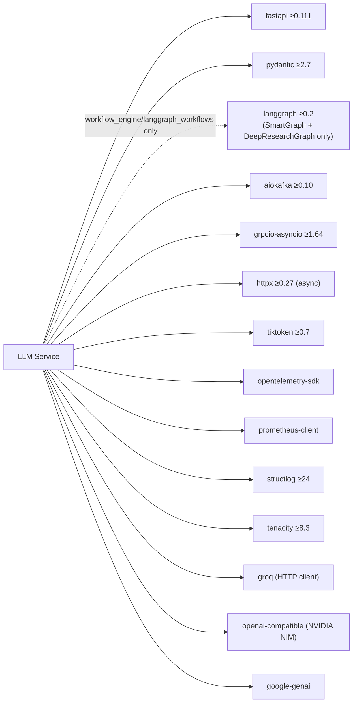
```mermaid
graph LR
    LLMSvc["LLM Service"]
    FastAPI["fastapi ≥0.111"]
    Pydantic["pydantic ≥2.7"]
    LangGraph["langgraph ≥0.2\n(SmartGraph + DeepResearchGraph only)"]
    aiokafka["aiokafka ≥0.10"]
    grpcio["grpcio-asyncio ≥1.64"]
    httpx["httpx ≥0.27 (async)"]
    tiktoken["tiktoken ≥0.7"]
    OTel["opentelemetry-sdk"]
    Prometheus["prometheus-client"]
    Structlog["structlog ≥24"]
    Tenacity["tenacity ≥8.3"]
    GroqSDK["groq (HTTP client)"]
    NVIDIAClient["openai-compatible (NVIDIA NIM)"]
    GeminiClient["google-genai"]

    LLMSvc --> FastAPI & Pydantic
    LLMSvc -.->|"workflow_engine/langgraph_workflows only"| LangGraph
    LLMSvc --> aiokafka & grpcio & httpx
    LLMSvc --> tiktoken & OTel & Prometheus & Structlog & Tenacity
    LLMSvc --> GroqSDK & NVIDIAClient & GeminiClient
```

### 1.5 Design Goals

| Goal | Implementation Strategy |
|---|---|
| Zero blocking I/O | asyncio throughout; no `time.sleep`, no sync file reads |
| Sub-100ms context collection | `asyncio.gather` for all three gRPC calls, always, on every mode |
| Sub-680ms TTFT (Mode Handler path) | Always-fetch context + Groq analysis + NVIDIA NIM streaming, no graph overhead |
| Minimum orchestration machinery per mode | Deterministic modes never import `langgraph`; only `SmartGraph`/`DeepResearchGraph` pay state-machine overhead |
| No LiteLLM dependency | Purpose-built provider adapters per provider |
| Full observability | OTel span on every async function; Prometheus counter on every outcome, tagged with `engine_type` |
| Safe failure modes | Every tool failure is caught, logged, and result is `ToolResult(error=...)` |
| Testability | Every component injectable; no global singletons in business logic |
| Structural enforcement of architecture | Import Boundary Check in CI fails the build if Mode Handlers import LangGraph |

---

## 2. Folder Structure

### 2.1 Complete Module Layout with Responsibilities

The layout below replaces the single `graph/` package from v1.1 with a structure that makes the deterministic/agentic split visible at the directory level, matching HLD v2.0 Section 35.

```
llm-service/
│
├── app/
│
│   ├── api/
│   │   ├── dependencies.py
│   │   ├── routers.py
│   │   └── internal/
│   │       ├── health.py
│   │       ├── readiness.py
│   │       └── metrics.py
│   │
│   ├── config/
│   │   ├── settings.py
│   │   ├── logging.py
│   │   ├── kafka.py
│   │   ├── grpc.py
│   │   ├── providers.py
│   │   └── prompts.py
│   │
│   ├── consumers/
│   │   ├── kafka_consumer.py
│   │   └── chat_consumer.py
│   │
│   ├── producers/
│   │   ├── kafka_producer.py
│   │   └── response_publisher.py
│   │
│   ├── context/                        # Context Collector — baseline providers, always fetched
│   │   ├── collector.py                # ContextCollector — parallel gRPC scatter-gather
│   │   ├── merger.py                   # ContextMerger — dedup + rank
│   │   └── schemas.py                  # ContextBundle, MemoryContext, GraphContext, RetrievalContext
│   │
│   ├── request_analyzer/               # Single consolidated planning component (Groq — Call 1)
│   │   ├── analyzer.py                 # RequestAnalyzer
│   │   ├── groq_client.py              # GroqAnalysisClient
│   │   ├── prompt_template.py          # Analysis system prompt builder
│   │   ├── safe_default.py             # SafeDefaultPlan fallback logic
│   │   └── schemas.py                  # ExecutionPlan, IntentCategory, UserMode, Skill, ReasoningMode
│   │
│   ├── workflow_engine/                # Execution layer — dispatch to Mode Handler or LangGraph
│   │   ├── engine.py                   # WorkflowEngine.execute() — top-level entrypoint
│   │   ├── mode_dispatcher.py          # ModeDispatcher — routes ExecutionPlan.mode
│   │   ├── workflow_result.py          # WorkflowResult — normalized output of both engine kinds
│   │   │
│   │   ├── mode_handlers/              # Standard async Python — NO langgraph import permitted
│   │   │   ├── base.py                 # ModeHandler protocol
│   │   │   ├── default_handler.py
│   │   │   ├── tutor_handler.py
│   │   │   ├── code_handler.py
│   │   │   ├── ask_files_handler.py
│   │   │   ├── web_search_handler.py
│   │   │   └── state.py                # ModeHandlerState (plain Pydantic, no reducers)
│   │   │
│   │   └── langgraph_workflows/        # LangGraph — SmartGraph & DeepResearchGraph ONLY
│   │       ├── smart/
│   │       │   ├── graph.py            # SmartGraph StateGraph builder
│   │       │   ├── state.py            # SmartGraphState (TypedDict)
│   │       │   ├── nodes.py            # planner, tool_selection, execution, prompt, generation
│   │       │   └── edges.py            # loop condition on Dynamic Tool Selection
│   │       │
│   │       ├── deep_research/
│   │       │   ├── graph.py            # DeepResearchGraph StateGraph builder
│   │       │   ├── state.py            # DeepResearchGraphState (TypedDict)
│   │       │   ├── nodes.py            # search, analyze, compare_sources, summarize, generate_report
│   │       │   └── edges.py            # "Need More Information?" conditional edge
│   │       │
│   │       └── shared/
│   │           ├── loop_guard.py       # Iteration cap enforcement (shared by both graphs)
│   │           └── graph_utils.py      # Shared node helpers
│   │
│   ├── grpc/
│   │   ├── clients/
│   │   │   ├── memory_client.py
│   │   │   ├── graph_client.py
│   │   │   └── retrieval_client.py
│   │   │
│   │   └── proto/
│   │
│   ├── providers/
│   │   ├── base.py                # BaseProviderAdapter (abstract)
│   │   ├── router.py              # GenerationRouter - routes to correct adapter
│   │   ├── groq.py                # Groq Adapter (request analysis - Call 1)
│   │   ├── nvidia.py              # NVIDIA NIM Adapter (response generation - primary)
│   │   ├── gemini.py              # Gemini Adapter (response generation - fallback)
│   │   └── models.py              # ProviderConfig, ProviderSelection
│   │
│   ├── prompts/
│   │   ├── system/
│   │   ├── modes/                 # default, tutor, code, ask_files, web_search (Mode Handler templates)
│   │   ├── smart/                 # per-node prompt fragments for SmartGraph
│   │   ├── deep_research/          # per-node prompt fragments for DeepResearchGraph
│   │   └── templates/
│   │
│   ├── tools/                     # Tool framework — OPTIONAL capabilities only, never Memory/Graph/Retrieval
│   │   ├── base.py                # BaseTool abstract class
│   │   ├── registry.py            # ToolRegistry
│   │   ├── dispatcher.py          # ToolDispatcher (executes plans)
│   │   ├── executor.py            # ToolExecutor (single tool lifecycle)
│   │   ├── validator.py           # ToolParams validation
│   │   ├── normalizer.py          # ToolResult normalization
│   │   └── web_search.py          # WebSearchTool — the only production tool today
│   │
│   ├── models/
│   │   ├── request.py
│   │   ├── response.py
│   │   ├── execution_plan.py
│   │   ├── provider.py
│   │   ├── tool.py
│   │   └── pipeline_context.py    # PipelineContext — shared pre-dispatch state
│   │
│   ├── services/
│   │   ├── prompt_service.py
│   │   ├── provider_service.py
│   │   ├── streaming_service.py   # StreamingEngine (chunk accumulation + Kafka publish)
│   │   └── token_service.py       # ContextWindowManager (tiktoken counting + trimming)
│   │
│   ├── utils/
│   │   ├── retry.py               # RetryManager (tenacity wrapper)
│   │   ├── circuit_breaker.py     # CircuitBreaker (per-provider / per-service)
│   │   ├── token_counter.py       # tiktoken-based token counting
│   │   ├── metrics.py             # Prometheus metric definitions
│   │   ├── tracing.py             # OTel tracer factory + span decorators
│   │   └── helpers.py
│   │
│   ├── exceptions/
│   │   ├── provider.py            # ProviderError, AllProvidersFailedError
│   │   ├── tool.py                # ToolError, RequiredToolFailedError
│   │   ├── grpc.py                # GRPCError, GRPCUnavailableError
│   │   └── analysis.py            # PlanParseError, CriticalAnalysisError
│   │
│   ├── middleware/
│   │
│   └── main.py
│
├── tests/
│   ├── unit/
│   ├── integration/
│   ├── workflow_engine/
│   │   ├── mode_handlers/
│   │   └── langgraph_workflows/
│   ├── grpc/
│   ├── kafka/
│   ├── providers/
│   └── tools/
│
├── scripts/
│   └── check_import_boundaries.py     # CI Import Boundary Check (see Section 30.4)
│
├── proto/
│
├── deployments/
│   ├── docker/
│   └── kubernetes/
│
├── docs/
│   ├── hld.md
│   ├── lld.md                          # This document
│   └── adr/
│
├── Dockerfile
├── docker-compose.yml
├── pyproject.toml
├── Makefile
└── README.md
```

> **Key design decision:** `workflow_engine/mode_handlers/` and `workflow_engine/langgraph_workflows/` are siblings under the same parent package specifically so the architectural split is visible to anyone browsing the repository. `tools/web_search.py` is the only tool shipped in production; future tools (`browser.py`, `github.py`, `sql.py`, `mcp.py`, `slack.py`, `jira.py`, `gmail.py`, `calendar.py`) are added under the same `tools/` package without touching `context/`, which remains permanently reserved for Memory, Graph, and Retrieval.

### 2.2 Import Boundary Rules

```text
consumers/          -> request_analyzer/, context/, workflow_engine/, producers/
context/            -> grpc/clients/                                    (baseline providers ONLY)
request_analyzer/   -> providers/ (groq adapter only), context/ (read state)
workflow_engine/engine.py, mode_dispatcher.py
                     -> workflow_engine/mode_handlers/, workflow_engine/langgraph_workflows/
workflow_engine/mode_handlers/*
                     -> tools/, prompts/modes/, services/
                     -> ⛔ FORBIDDEN: langgraph (package), workflow_engine/langgraph_workflows/
workflow_engine/langgraph_workflows/*
                     -> tools/, prompts/smart/, prompts/deep_research/, langgraph (package)
providers/           -> utils/retry, utils/circuit_breaker
ALL                  -> utils/, exceptions/, models/, config/

FORBIDDEN (enforced by scripts/check_import_boundaries.py in CI):
  grpc/clients/                    -> workflow_engine/ or request_analyzer/   (clients are pure gRPC wrappers)
  tools/                           -> prompts/                                (tools produce ToolResult, not prompts)
  prompts/                         -> tools/                                  (prompt builder reads state, not tools)
  workflow_engine/mode_handlers/*  -> langgraph, workflow_engine/langgraph_workflows/
  context/                         -> tools/                                  (baseline providers structurally distinct from tools)
  tools/                           -> context/                                (tools never re-fetch or wrap baseline context)
```

The last two rules under FORBIDDEN are the codebase-level enforcement of HLD v2.0 Section 14.1 — Memory, Graph, and Retrieval must never be reachable through the Tool Registry, and tools must never be able to silently duplicate a baseline context fetch.

---

## 3. Boot Process

### 3.1 Startup Sequence

The LLM Service uses FastAPI's `lifespan` context manager for controlled startup and shutdown. All initialization is sequential because later steps depend on earlier ones. Note step **I** — the service now compiles **two** LangGraph graphs (not one frozen pipeline graph), and step **H.1** registers Mode Handlers as plain object instances requiring no compilation at all.

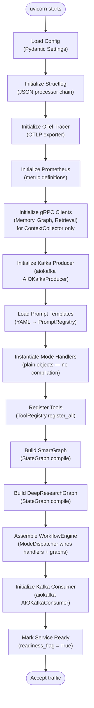
```mermaid
flowchart TD
    A(["uvicorn starts"]) --> B["Load Config\n(Pydantic Settings)"]
    B --> C["Initialize Structlog\n(JSON processor chain)"]
    C --> D["Initialize OTel Tracer\n(OTLP exporter)"]
    D --> E["Initialize Prometheus\n(metric definitions)"]
    E --> F["Initialize gRPC Clients\n(Memory, Graph, Retrieval)\nfor ContextCollector only"]
    F --> G["Initialize Kafka Producer\n(aiokafka AIOKafkaProducer)"]
    G --> H["Load Prompt Templates\n(YAML → PromptRegistry)"]
    H --> H1["Instantiate Mode Handlers\n(plain objects — no compilation)"]
    H1 --> I["Register Tools\n(ToolRegistry.register_all)"]
    I --> J["Build SmartGraph\n(StateGraph compile)"]
    J --> J2["Build DeepResearchGraph\n(StateGraph compile)"]
    J2 --> K["Assemble WorkflowEngine\n(ModeDispatcher wires handlers + graphs)"]
    K --> L["Initialize Kafka Consumer\n(aiokafka AIOKafkaConsumer)"]
    L --> M["Mark Service Ready\n(readiness_flag = True)"]
    M --> N(["Accept traffic"])
```

### 3.2 Startup Failure Strategy

| Component | Failure Action |
|---|---|
| Config loading | Fatal — process exits with code 1 |
| gRPC client init | Fatal — cannot serve without context sources |
| Kafka Producer init | Fatal — cannot publish responses |
| Prompt loading | Fatal — cannot build prompts |
| Mode Handler instantiation | Fatal — 5 of 7 modes are unavailable without them |
| Tool registration | Fatal — required tools (Web Search) are needed for Web Search mode |
| SmartGraph build | Fatal — Smart mode unavailable without it |
| DeepResearchGraph build | Fatal — Deep Research mode unavailable without it |
| WorkflowEngine assembly | Fatal — no dispatch possible without it |
| Kafka Consumer init | Fatal — cannot receive work |

All fatal startup errors are logged with Structlog at `CRITICAL` level before exit. Unlike v1.1, a `SmartGraph` build failure does **not** take down Mode Handler modes and vice versa — but because both are required for a complete service, the current startup strategy treats either failure as fatal. A future resilience improvement (tracked in the backlog) would allow the service to boot in a degraded state serving only Mode Handler modes if graph compilation fails; this is explicitly out of scope for v2.0.

### 3.3 Config Loading

`config.py` uses **Pydantic Settings** (`pydantic-settings`) which reads from:
1. `.env` file (development)
2. Environment variables (production)
3. Kubernetes ConfigMap mounted as env vars

```text
LLMServiceConfig:
  # Kafka
  kafka_bootstrap_servers: str
  kafka_consumer_group: str = "llm-service-group"
  kafka_input_topic: str = "chat.message.created"
  kafka_output_topic: str = "chat.response.generated"
  kafka_chunk_topic: str = "chat.response.chunk"
  kafka_dlq_topic: str = "chat.message.dlq"
  kafka_max_poll_interval_ms: int = 300000

  # gRPC (Context Collector only)
  memory_service_host: str
  memory_service_port: int = 50051
  graph_service_host: str
  graph_service_port: int = 50051
  retrieval_service_host: str
  retrieval_service_port: int = 50051
  grpc_deadline_ms: int = 2000
  grpc_max_connections: int = 20

  # Provider API Keys
  groq_api_key: SecretStr
  nvidia_api_key: SecretStr
  gemini_api_key: SecretStr
  tavily_api_key: SecretStr

  # Tool timeouts
  web_search_timeout_ms: int = 5000

  # Workflow Engine / LangGraph
  langgraph_max_loop_iterations_smart: int = 6
  langgraph_max_loop_iterations_deep_research: int = 4

  # Observability
  otel_endpoint: str
  prometheus_port: int = 9090
  log_level: str = "INFO"

  # Feature flags
  enable_smart_mode: bool = True
  enable_deep_research_mode: bool = True
  enable_web_search: bool = True
```

### 3.4 gRPC Client Initialization

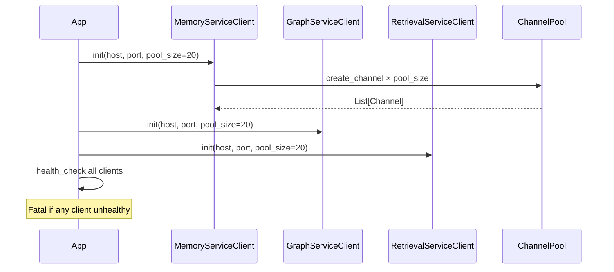
```mermaid
sequenceDiagram
    participant App
    participant MemClient as MemoryServiceClient
    participant GraphClient as GraphServiceClient
    participant RetClient as RetrievalServiceClient
    participant ChannelPool

    App->>MemClient: init(host, port, pool_size=20)
    MemClient->>ChannelPool: create_channel × pool_size
    ChannelPool-->>MemClient: List[Channel]
    App->>GraphClient: init(host, port, pool_size=20)
    App->>RetClient: init(host, port, pool_size=20)
    App->>App: health_check all clients
    Note over App: Fatal if any client unhealthy
```

Each client holds a **round-robin pool** of 20 gRPC channels. Channel creation is lazy — the connection is established on first use, not at initialization. This prevents blocking startup on slow services. These three clients are instantiated exactly once and injected **only** into `ContextCollector` — no other component in the codebase holds a reference to them, which is enforced by the Import Boundary Check in Section 2.2.

### 3.5 Mode Handler Instantiation

Unlike LangGraph graphs, Mode Handlers require no compilation step. Each is a plain class instance constructed with its dependencies injected directly:

```python
mode_handlers = {
    "default": DefaultHandler(tool_dispatcher, prompt_registry),
    "tutor": TutorHandler(tool_dispatcher, prompt_registry),
    "code": CodeHandler(tool_dispatcher, prompt_registry),
    "ask_files": AskFilesHandler(prompt_registry),  # no tool_dispatcher needed
    "web_search": WebSearchHandler(tool_dispatcher, prompt_registry),
}
```

This step is intentionally trivial — it is the direct implementation consequence of Mode Handlers being "standard async Python" per HLD Section 11: no graph state, no node registration, no edge declarations.

### 3.6 LangGraph Build (SmartGraph and DeepResearchGraph)

Each of the two `StateGraph` instances is compiled once at startup, independently:

1. `SmartGraphBuilder.build()` registers the `planner`, `dynamic_tool_selection`, `execution`, `prompt`, and `generation` nodes, declares the loop-back edge from `execution` to `dynamic_tool_selection`, sets the entry/finish points, and calls `.compile()`.
2. `DeepResearchGraphBuilder.build()` registers the `search`, `analyze`, `compare_sources`, `summarize`, and `generate_report` nodes, declares the conditional `Need More Information?` edge from `analyze` back to `search` (aliased internally as `search_again`), sets the entry/finish points, and calls `.compile()`.

Both compiled graphs are **thread-safe and reentrant** — each can be invoked concurrently for multiple requests without sharing state, since every `.ainvoke()` call receives its own fresh state object. Full node/edge detail is in [Section 13](#13-langgraph-implementation).

### 3.7 WorkflowEngine Assembly

Once both Mode Handlers and both LangGraph graphs exist, `WorkflowEngine` is assembled by wiring a `ModeDispatcher` with both maps:

```python
workflow_engine = WorkflowEngine(
    mode_dispatcher=ModeDispatcher(
        handlers=mode_handlers,             # from 3.5
        graphs={
            "smart": smart_graph_compiled,          # from 3.6
            "deep_research": deep_research_graph_compiled,
        },
    )
)
```

This object is stored on the `Container` and is the single entrypoint the Kafka Consumer's pipeline calls after Request Analysis completes.

### 3.8 Prompt Loading

On startup, `PromptLoader` scans the `prompts/` directory and loads all `.yaml` files:
1. Parse YAML → `PromptTemplateConfig`
2. Validate required fields: `name`, `version`, `mode` (or `graph` + `node` for LangGraph fragments), `variables`, `system`
3. Create a Jinja2 `Template` from the template string
4. Register in `PromptRegistry` keyed by `(mode_or_graph, version)` for Mode Handler templates, or `(graph, node, version)` for LangGraph node fragments
5. Set latest version as default for each key

If any prompt template fails validation, startup is aborted.

---

## 4. Package Responsibilities

### 4.1 Dependency Inversion and Injection

Each package exposes a clean public interface. Internal implementation modules are prefixed with `_` to signal they are not part of the public API.

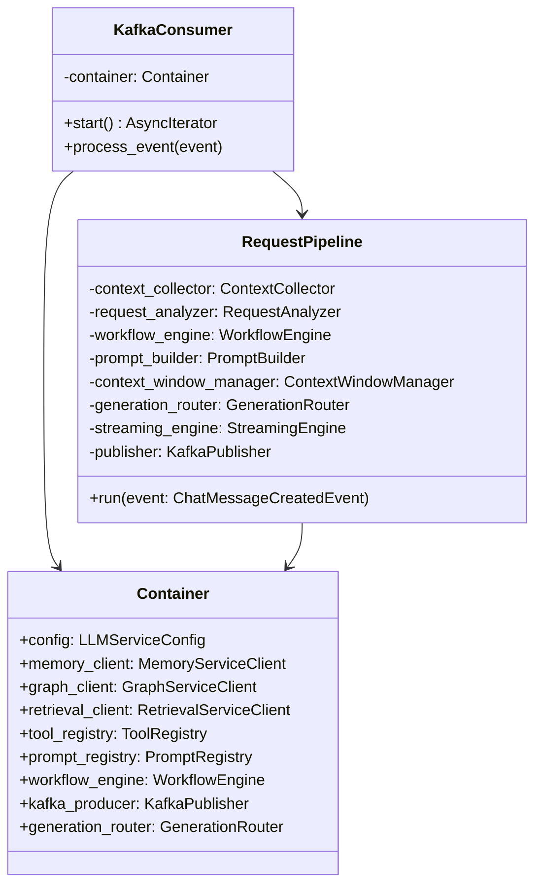
```mermaid
classDiagram
    class Container {
        +config: LLMServiceConfig
        +memory_client: MemoryServiceClient
        +graph_client: GraphServiceClient
        +retrieval_client: RetrievalServiceClient
        +tool_registry: ToolRegistry
        +prompt_registry: PromptRegistry
        +workflow_engine: WorkflowEngine
        +kafka_producer: KafkaPublisher
        +generation_router: GenerationRouter
    }

    class KafkaConsumer {
        -container: Container
        +start() AsyncIterator
        +process_event(event)
    }

    class RequestPipeline {
        -context_collector: ContextCollector
        -request_analyzer: RequestAnalyzer
        -workflow_engine: WorkflowEngine
        -prompt_builder: PromptBuilder
        -context_window_manager: ContextWindowManager
        -generation_router: GenerationRouter
        -streaming_engine: StreamingEngine
        -publisher: KafkaPublisher
        +run(event: ChatMessageCreatedEvent)
    }

    KafkaConsumer --> Container
    KafkaConsumer --> RequestPipeline
    RequestPipeline --> Container
```

Note that `RequestPipeline` replaces the v1.1 `Pipeline` wrapper around a single `CompiledGraph`. It is now a plain orchestrating class that calls each stage explicitly — Context Collector, then Request Analyzer, then Workflow Engine, then the shared Prompt Builder / Generation Router / Streaming Engine chain — rather than delegating everything to one graph's `.ainvoke()`.

### 4.2 Package Public APIs

| Package | Public Classes | Responsibilities |
|---|---|---|
| `consumers` | `KafkaConsumer`, `ChatMessageCreatedEvent` | Consume and validate Kafka events |
| `producers` | `KafkaPublisher`, `ChatResponseGeneratedEvent` | Produce Kafka output events |
| `context` | `ContextCollector`, `ContextBundle` | **Always-fetch** parallel gRPC from all three baseline sources |
| `request_analyzer` | `RequestAnalyzer`, `ExecutionPlan` | Single Groq call — intent + mode + skill + tools + strategy + plan |
| `workflow_engine` | `WorkflowEngine`, `ModeDispatcher`, `WorkflowResult` | Route `ExecutionPlan` to the correct execution engine and normalize output |
| `workflow_engine.mode_handlers` | `DefaultHandler`, `TutorHandler`, `CodeHandler`, `AskFilesHandler`, `WebSearchHandler` | Deterministic, single-pass mode execution — no LangGraph |
| `workflow_engine.langgraph_workflows.smart` | `SmartGraph` (compiled) | Agentic, dynamic-tool-selection execution |
| `workflow_engine.langgraph_workflows.deep_research` | `DeepResearchGraph` (compiled) | Iterative multi-source research execution |
| `tools` | `BaseTool`, `ToolRegistry`, `ToolDispatcher`, `ToolResult` | Tool lifecycle (only tools in `ExecutionPlan` are executed; never Memory/Graph/Retrieval) |
| `services.prompt_service` (`prompts/`) | `PromptBuilder`, `PromptRegistry`, `ComposedPrompt` | Prompt assembly, shared by all execution engines |
| `services.token_service` | `ContextWindowManager` | Token budgeting shared by all execution engines |
| `providers` | `GenerationRouter`, `NVIDIAAdapter`, `GeminiAdapter`, `GroqAdapter` | Provider routing + response generation |
| `services.streaming_service` | `StreamingEngine` | Token streaming, shared by all execution engines |
| `grpc.clients` | `MemoryServiceClient`, `GraphServiceClient`, `RetrievalServiceClient` | gRPC clients — consumed exclusively by `context.ContextCollector` |
| `utils` | `RetryManager`, `CircuitBreaker`, `get_tracer()`, `metrics`, `get_logger()` | Cross-cutting concerns |

---

## 5. Request Processing Pipeline

### 5.1 Pipeline Overview

The pipeline is **no longer a single LangGraph `StateGraph`**. It is a plain async function, `RequestPipeline.run()`, that calls each stage in a fixed order. Only two of the seven possible mode outcomes ever touch LangGraph, and even then only for the single "Workflow Dispatch" stage — everything before and after it is shared, graph-agnostic code.

Exactly **2 LLM calls** are guaranteed for the five Mode Handler modes; the two LangGraph modes make 1 Groq call plus a *variable* number of NVIDIA/tool round trips internal to the graph, followed by exactly one final Generation Router call:

- **Call 1 (Groq):** `RequestAnalyzer.analyze()` — returns `ExecutionPlan` — always exactly once
- **Workflow Dispatch:** Mode Handler (no LLM call) or LangGraph graph (zero or more internal tool/LLM round trips, bounded by the loop-iteration cap)
- **Final Generation Call (NVIDIA primary / Gemini fallback):** `GenerationRouter.generate_stream()` — always exactly once, regardless of which engine produced the `WorkflowResult`

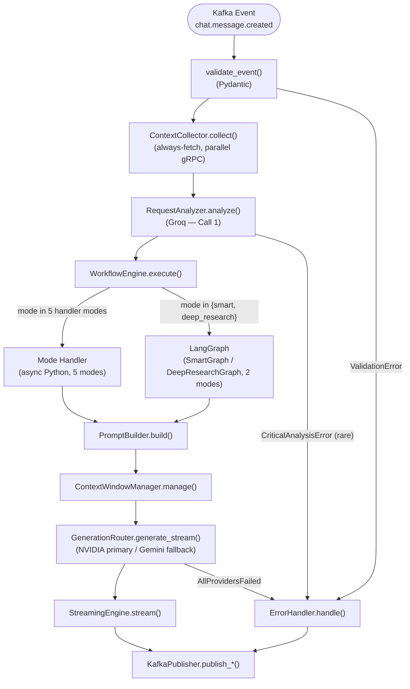
```mermaid
flowchart TD
    KafkaIn(["Kafka Event\nchat.message.created"])
    Validate["validate_event()\n(Pydantic)"]
    ContextStage["ContextCollector.collect()\n(always-fetch, parallel gRPC)"]
    AnalyzeStage["RequestAnalyzer.analyze()\n(Groq — Call 1)"]
    DispatchStage["WorkflowEngine.execute()"]
    ModeHandlerPath["Mode Handler\n(async Python, 5 modes)"]
    LangGraphPath["LangGraph\n(SmartGraph / DeepResearchGraph, 2 modes)"]
    PromptStage["PromptBuilder.build()"]
    TokenStage["ContextWindowManager.manage()"]
    InferStage["GenerationRouter.generate_stream()\n(NVIDIA primary / Gemini fallback)"]
    StreamStage["StreamingEngine.stream()"]
    PublishStage["KafkaPublisher.publish_*()"]
    ErrorStage["ErrorHandler.handle()"]

    KafkaIn --> Validate
    Validate --> ContextStage
    ContextStage --> AnalyzeStage
    AnalyzeStage --> DispatchStage
    DispatchStage -->|"mode in 5 handler modes"| ModeHandlerPath
    DispatchStage -->|"mode in {smart, deep_research}"| LangGraphPath
    ModeHandlerPath --> PromptStage
    LangGraphPath --> PromptStage
    PromptStage --> TokenStage
    TokenStage --> InferStage
    InferStage --> StreamStage
    StreamStage --> PublishStage

    Validate -- "ValidationError" --> ErrorStage
    AnalyzeStage -- "CriticalAnalysisError (rare)" --> ErrorStage
    InferStage -- "AllProvidersFailed" --> ErrorStage
    ErrorStage --> PublishStage
```

### 5.2 Why This Is No Longer a Single StateGraph

In v1.1, the entire pipeline — including Kafka validation, context collection, analysis, tool dispatch, prompt building, inference, and publishing — was modeled as nodes in one `StateGraph`, with a single conditional edge for the ReAct loop. This had two problems that HLD v2.0 identifies directly:

1. **It implied every mode needed graph-state machinery**, including `Default` and `Ask Files`, which are structurally linear and never loop.
2. **The ReAct loop's conditional edge lived at the top level**, meaning a bug in loop-condition logic could affect every mode, not just the two that actually loop.

`RequestPipeline.run()` now calls plain async functions for every stage except Workflow Dispatch. Workflow Dispatch is the **only** stage where a LangGraph `.ainvoke()` call can occur, and only for 2 of 7 modes. This is a direct, mechanical translation of HLD Section 10 into code structure.

### 5.3 RequestPipeline.run() — Reference Implementation

```python
class RequestPipeline:
    async def run(self, event: ChatMessageCreatedEvent) -> None:
        trace_ctx = extract_trace_context(event.trace_context)

        with tracer.start_as_current_span("request_pipeline", context=trace_ctx):
            pipeline_ctx = PipelineContext.from_event(event)

            # Stage 1: Context Collection — always, all three sources, parallel
            pipeline_ctx.context_bundle = await self.context_collector.collect(pipeline_ctx)

            # Stage 2: Request Analysis — single Groq call
            pipeline_ctx.plan = await self.request_analyzer.analyze(pipeline_ctx)

            # Stage 3: Workflow Dispatch — Mode Handler OR LangGraph, decided here
            workflow_result = await self.workflow_engine.execute(pipeline_ctx.plan, pipeline_ctx)

            # Stage 4-6: Shared post-dispatch pipeline (identical for both engine kinds)
            composed_prompt = await self.prompt_builder.build(workflow_result, pipeline_ctx)
            trimmed_prompt = await self.context_window_manager.manage(composed_prompt, target_model="nvidia")

            try:
                token_stream = self.generation_router.generate_stream(trimmed_prompt)
                full_response = await self.streaming_engine.stream(token_stream, pipeline_ctx)
            except AllProvidersFailedError as e:
                await self.error_handler.handle(pipeline_ctx, e)
                return

            await self.publisher.publish_response(pipeline_ctx, full_response)
            await self.publisher.publish_memory_update(pipeline_ctx, full_response)
```

### 5.4 Workflow Dispatch Stage Detail

```python
class WorkflowEngine:
    def __init__(self, mode_dispatcher: ModeDispatcher):
        self.mode_dispatcher = mode_dispatcher

    async def execute(self, plan: ExecutionPlan, ctx: PipelineContext) -> WorkflowResult:
        with tracer.start_as_current_span(
            "workflow_engine_dispatch",
            attributes={"mode": plan.mode, "engine_type": self.mode_dispatcher.engine_type_for(plan.mode)},
        ):
            return await self.mode_dispatcher.dispatch(plan, ctx)


class ModeDispatcher:
    def __init__(self, handlers: dict[str, ModeHandler], graphs: dict[str, CompiledGraph]):
        self.handlers = handlers
        self.graphs = graphs

    def engine_type_for(self, mode: str) -> str:
        return "langgraph" if mode in self.graphs else "mode_handler"

    async def dispatch(self, plan: ExecutionPlan, ctx: PipelineContext) -> WorkflowResult:
        if plan.mode in self.handlers:
            handler = self.handlers[plan.mode]
            return await handler.handle(plan, ctx)          # plain coroutine call
        if plan.mode in self.graphs:
            graph = self.graphs[plan.mode]
            initial_state = build_graph_state(plan, ctx)     # mode-specific TypedDict
            final_state = await graph.ainvoke(initial_state)  # LangGraph invocation
            return WorkflowResult.from_graph_state(final_state)
        raise UnknownModeError(plan.mode)
```

This function is the entire architectural boundary described in HLD Section 10.3 — everything above it in the call stack has never heard of LangGraph; everything the two `graphs[...]` entries call internally is LangGraph and nothing else.

---

## 6. Kafka Consumer Design

### 6.1 Consumer Class Architecture

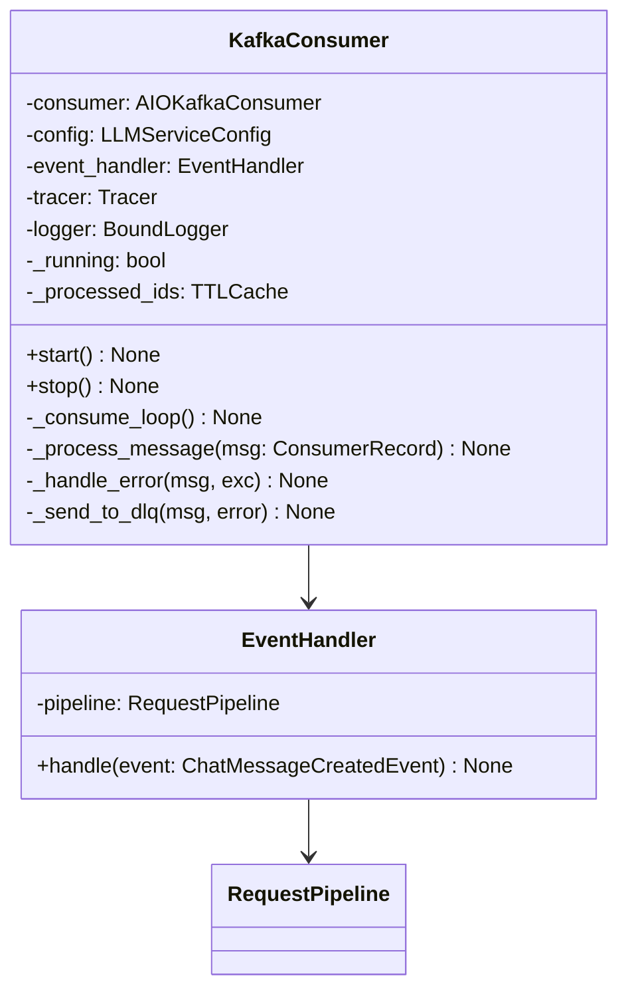
```mermaid
classDiagram
    class KafkaConsumer {
        -consumer: AIOKafkaConsumer
        -config: LLMServiceConfig
        -event_handler: EventHandler
        -tracer: Tracer
        -logger: BoundLogger
        -_running: bool
        -_processed_ids: TTLCache
        +start() None
        +stop() None
        -_consume_loop() None
        -_process_message(msg: ConsumerRecord) None
        -_handle_error(msg, exc) None
        -_send_to_dlq(msg, error) None
    }

    class EventHandler {
        -pipeline: RequestPipeline
        +handle(event: ChatMessageCreatedEvent) None
    }

    KafkaConsumer --> EventHandler
    EventHandler --> RequestPipeline
```

### 6.2 Consumer Group Design

| Parameter | Value | Rationale |
|---|---|---|
| `group_id` | `llm-service-group` | All LLM Service pods share one group for partitioned load distribution |
| `auto_offset_reset` | `earliest` | On new group, process from beginning (safety) |
| `enable_auto_commit` | `False` | Manual commit — only commit after successful processing |
| `max_poll_interval_ms` | `300000` | 5 minutes — LangGraph iterations on Smart/Deep Research can be slow |
| `session_timeout_ms` | `45000` | Default; triggers rebalance if pod hangs |
| `heartbeat_interval_ms` | `3000` | Send heartbeat every 3s |
| `max_poll_records` | `10` | Limit batch size per poll to avoid memory spikes |

### 6.3 Message Processing Loop

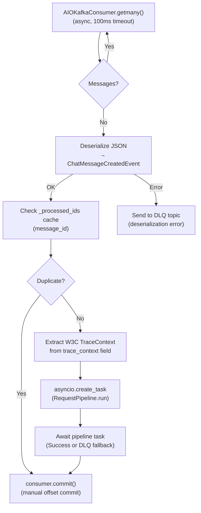
```mermaid
flowchart TD
    Poll["AIOKafkaConsumer.getmany()\n(async, 100ms timeout)"]
    Empty{"Messages?"}
    Deserialize["Deserialize JSON\n→ ChatMessageCreatedEvent"]
    Idempotency["Check _processed_ids cache\n(message_id)"]
    Duplicate{"Duplicate?"}
    PropTrace["Extract W3C TraceContext\nfrom trace_context field"]
    Spawn["asyncio.create_task\n(RequestPipeline.run)"]
    Commit["consumer.commit()\n(manual offset commit)"]
    DLQ["Send to DLQ topic\n(deserialization error)"]

    Poll --> Empty
    Empty -- "No" --> Deserialize
    Empty -- "Yes" --> Poll
    Deserialize -- "Error" --> DLQ
    Deserialize -- "OK" --> Idempotency
    Idempotency --> Duplicate
    Duplicate -- "Yes" --> Commit
    Duplicate -- "No" --> PropTrace --> Spawn --> WaitTask["Await pipeline task\n(Success or DLQ fallback)"] --> Commit
```

**At-Least-Once Commit Strategy:** The offset for a message is committed *only after* the processing task completes successfully (the final response is published to Kafka) or fails permanently (sent to the DLQ). This guarantees at-least-once delivery and prevents message loss. Tasks run concurrently, and offset commits are tracked and committed asynchronously upon task completion, using the AIOKafkaConsumer's manual commit API.

**Task concurrency limit:** A `asyncio.Semaphore(max_concurrent=50)` gates task creation to prevent unbounded memory growth during traffic spikes. Because LangGraph-backed requests (Smart, Deep Research) hold their semaphore slot for longer on average than Mode Handler requests, `llm_workflow_engine_dispatch_total{engine_type}` is monitored to detect when the semaphore limit should be raised or pod count increased (see HLD Section 29.4).

### 6.4 Idempotency Design

The `_processed_ids` cache is a `TTLCache` with:
- **Max size:** 10,000 entries
- **TTL:** 300 seconds (5 minutes)
- **Key:** `message_id` (UUID string)

This prevents duplicate processing if Kafka redelivers a message (e.g., after consumer rebalance before offset commit completes).

**Collision strategy:** If a `message_id` is in the cache, log at `DEBUG` level and skip. No error is raised.

### 6.5 Dead Letter Queue (DLQ)

Messages are sent to `chat.message.dlq` in two cases:
1. **Deserialization error:** The Kafka message body cannot be parsed into `ChatMessageCreatedEvent`
2. **Permanent processing failure:** The pipeline fails after all retries are exhausted

DLQ message schema:
```text
ChatMessageDLQEvent:
  original_topic: str
  original_partition: int
  original_offset: int
  original_key: bytes
  original_value: bytes         # raw bytes from failed message
  error_type: str               # "DeserializationError" | "PipelineError"
  error_message: str
  failed_at: datetime
  retry_count: int
```

### 6.6 Retry Within Consumer

Transient pipeline failures (e.g., gRPC timeout) are retried **within the same consumer task**:
- Max retries: 3
- Backoff: 100ms, 200ms, 400ms (exponential)
- Retry condition: `GRPCUnavailableError`, `KafkaPublishError`
- No retry: `DeserializationError`, `ValidationError` (permanent failures → DLQ)

---

## 7. Kafka Producer Design

### 7.1 Producer Architecture

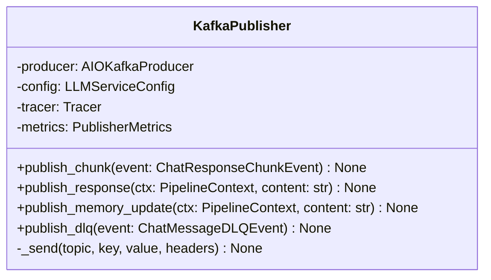
```mermaid
classDiagram
    class KafkaPublisher {
        -producer: AIOKafkaProducer
        -config: LLMServiceConfig
        -tracer: Tracer
        -metrics: PublisherMetrics
        +publish_chunk(event: ChatResponseChunkEvent) None
        +publish_response(ctx: PipelineContext, content: str) None
        +publish_memory_update(ctx: PipelineContext, content: str) None
        +publish_dlq(event: ChatMessageDLQEvent) None
        -_send(topic, key, value, headers) None
    }
```

### 7.2 Producer Configuration

| Parameter | Value | Rationale |
|---|---|---|
| `acks` | `all` | Strongest durability; wait for all ISR acknowledgments |
| `compression_type` | `lz4` | Fast compression; reduces network bandwidth for large responses |
| `max_request_size` | `2097152` (2MB) | LLM responses can be large, especially DeepResearchGraph reports |
| `linger_ms` | `5` | Small batching window for chunk events |
| `enable_idempotence` | `True` | Exactly-once semantics at producer level |
| `retries` | `3` | Producer-level retry for transient broker errors |

### 7.3 Message Key Strategy

All messages use `conversation_id.encode()` as the Kafka key. This guarantees:
- All events for the same conversation go to the same partition
- Ordering is preserved within a conversation (chunk events arrive in order)
- Conversation Service's consumer can process them in order

### 7.4 Trace Header Propagation

Every produced message includes W3C TraceContext headers:
```text
headers = [
    ("traceparent", traceparent.encode()),
    ("tracestate", tracestate.encode()),
    ("correlation_id", correlation_id.encode()),
]
```

This enables distributed traces to span from `chat.message.created` through LLM Service to `chat.response.generated`, including the internal `workflow_engine_dispatch` span and, when applicable, the `langgraph_execution` child spans (see Section 27.2).

### 7.5 Publish Stage Implementation

Publishing is the terminal stage of `RequestPipeline.run()`, executing after `StreamingEngine.stream()` returns. Following the **Single Responsibility Principle (SRP)**, all final event publishing and transaction-like completions are centralized in `KafkaPublisher`:

```python
async def publish_response(self, ctx: PipelineContext, full_response: str) -> None:
    # 1. Publish final chat.response.generated event
    final_event = ChatResponseGeneratedEvent(
        conversation_id=ctx.conversation_id,
        user_id=ctx.user_id,
        message_id=ctx.message_id,
        request_id=ctx.request_id,
        full_content=full_response,
        provider=ctx.selected_provider,
        generation_fallback_used=ctx.generation_fallback_used,
        mode=ctx.plan.mode,
        skill=ctx.plan.skill,
        engine_type=ctx.engine_type,           # "mode_handler" | "langgraph"
        usage=ctx.usage,
        cost_usd=ctx.cost_usd,
        completed_at=now(),
    )
    await self._send(self.config.kafka_output_topic, ctx.conversation_id, final_event)

async def publish_memory_update(self, ctx: PipelineContext, full_response: str) -> None:
    # 2. Publish memory.update.requested event to trigger background memory synthesis
    memory_event = MemoryUpdateRequestedEvent(
        conversation_id=ctx.conversation_id,
        user_message=ctx.user_message,
        assistant_response=full_response,
        mode=ctx.plan.mode,
    )
    await self._send("memory.update.requested", ctx.conversation_id, memory_event)
```

Kafka Consumer offset commit (the at-least-once delivery point) happens in the consumer task after both of these publish calls complete successfully — see Section 6.3.

---

## 8. gRPC Client Design

### 8.1 Base gRPC Client

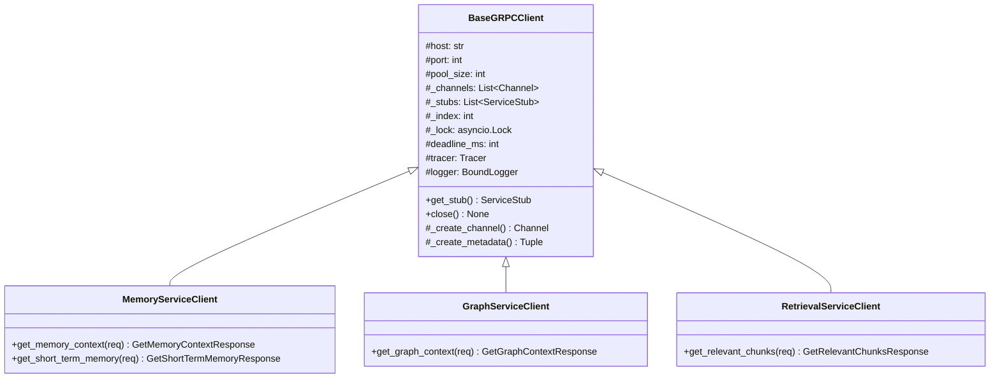
```mermaid
classDiagram
    class BaseGRPCClient {
        #host: str
        #port: int
        #pool_size: int
        #_channels: List~Channel~
        #_stubs: List~ServiceStub~
        #_index: int
        #_lock: asyncio.Lock
        #deadline_ms: int
        #tracer: Tracer
        #logger: BoundLogger
        +get_stub() ServiceStub
        +close() None
        #_create_channel() Channel
        #_create_metadata() Tuple
    }

    class MemoryServiceClient {
        +get_memory_context(req) GetMemoryContextResponse
        +get_short_term_memory(req) GetShortTermMemoryResponse
    }

    class GraphServiceClient {
        +get_graph_context(req) GetGraphContextResponse
    }

    class RetrievalServiceClient {
        +get_relevant_chunks(req) GetRelevantChunksResponse
    }

    BaseGRPCClient <|-- MemoryServiceClient
    BaseGRPCClient <|-- GraphServiceClient
    BaseGRPCClient <|-- RetrievalServiceClient
```

> **Consumer restriction:** These three clients are instantiated once at boot and injected **only** into `ContextCollector` (Section 9). No Mode Handler, no LangGraph node, and no Tool implementation holds a reference to them. This is a direct implementation of HLD Section 14.1 — baseline context providers are categorically distinct from tools, and that distinction is enforced by dependency wiring, not just convention.

### 8.2 Connection Pool Implementation

The pool is a fixed-size array of channels. A round-robin counter selects the next channel:

```text
Algorithm: Round-Robin Channel Selection
  _index is an atomic integer (asyncio.Lock protected)
  get_stub():
    async with _lock:
      idx = _index % pool_size
      _index += 1
      return _stubs[idx]
```

**Why not use a queue?** Round-robin with a fixed index avoids queue contention under high concurrency. Each channel supports HTTP/2 multiplexing, so a single channel can handle many concurrent RPCs. Pool size of 20 is sufficient for 500 concurrent requests per pod.

### 8.3 Channel Options

```python
CHANNEL_OPTIONS = [
    ("grpc.keepalive_time_ms", 30000),          # send keepalive every 30s
    ("grpc.keepalive_timeout_ms", 5000),         # timeout for keepalive response
    ("grpc.keepalive_permit_without_calls", 1),  # allow keepalive without active RPCs
    ("grpc.http2.max_pings_without_data", 0),    # no limit on pings
    ("grpc.max_receive_message_length", 10485760),  # 10MB max response
    ("grpc.max_send_message_length", 2097152),       # 2MB max request
]
```

### 8.4 Deadline Propagation

Every gRPC call uses an absolute deadline:
```text
deadline = asyncio.get_event_loop().time() + (deadline_ms / 1000.0)
await stub.GetMemoryContext(request, timeout=deadline_ms/1000.0)
```

**Important:** Deadline is per-call, not per-retry. If a call retries, the new attempt also gets a fresh `deadline_ms` window.

### 8.5 gRPC Retry Policy (Server-Side Metadata)

gRPC-level service config is injected at channel creation:
```json
{
  "methodConfig": [{
    "name": [{"service": "memory.MemoryService"}],
    "retryPolicy": {
      "maxAttempts": 3,
      "initialBackoff": "0.1s",
      "maxBackoff": "1s",
      "backoffMultiplier": 2,
      "retryableStatusCodes": ["UNAVAILABLE", "DEADLINE_EXCEEDED"]
    }
  }]
}
```

This enables **gRPC-level retries** independent of the application-level `RetryManager`. They complement each other: gRPC retries handle transient network issues; the application retry manager handles higher-level failures.

### 8.6 Metadata for Authentication

All gRPC calls include service identity metadata (verified by Istio mTLS at the network layer, but also included for auditing):
```text
metadata = [
    ("x-service-name", "llm-service"),
    ("x-trace-id", ctx.trace_id),
    ("x-user-id", ctx.user_id),
    ("x-conversation-id", ctx.conversation_id),
]
```

---

## 9. Context Collector

> **Architecture Freeze:** The `ContextCollector` runs **on every request, unconditionally**, before Request Analysis and before Workflow Dispatch. Memory, Graph, and Retrieval are always fetched in parallel via `asyncio.gather()`. No mode-gating. Context services are responsible for returning only what is relevant. This is the single upstream data source shared by all seven modes, both Mode Handler and LangGraph.

### 9.1 Class Design

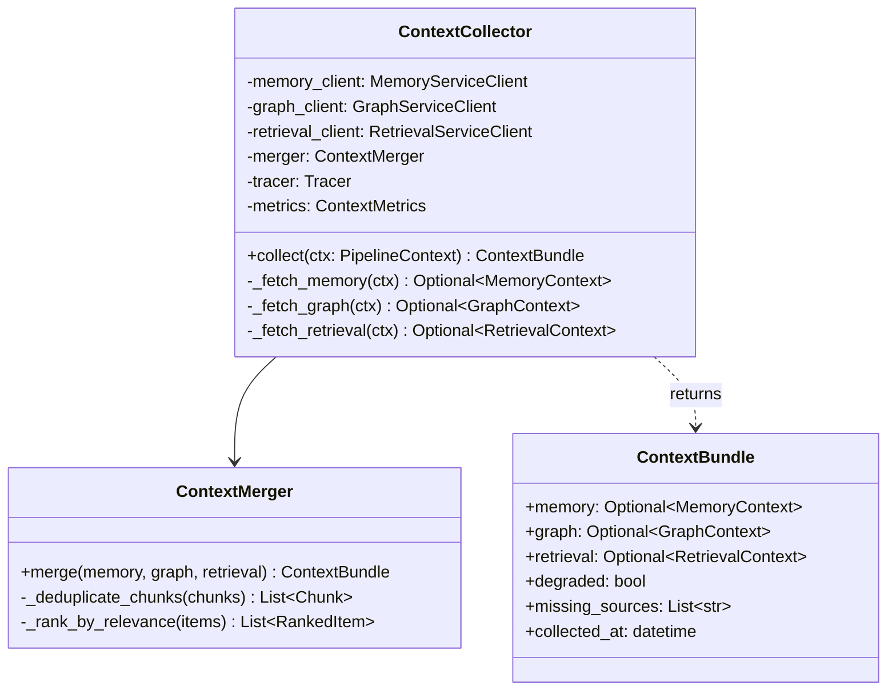
```mermaid
classDiagram
    class ContextCollector {
        -memory_client: MemoryServiceClient
        -graph_client: GraphServiceClient
        -retrieval_client: RetrievalServiceClient
        -merger: ContextMerger
        -tracer: Tracer
        -metrics: ContextMetrics
        +collect(ctx: PipelineContext) ContextBundle
        -_fetch_memory(ctx) Optional~MemoryContext~
        -_fetch_graph(ctx) Optional~GraphContext~
        -_fetch_retrieval(ctx) Optional~RetrievalContext~
    }

    class ContextMerger {
        +merge(memory, graph, retrieval) ContextBundle
        -_deduplicate_chunks(chunks) List~Chunk~
        -_rank_by_relevance(items) List~RankedItem~
    }

    class ContextBundle {
        +memory: Optional~MemoryContext~
        +graph: Optional~GraphContext~
        +retrieval: Optional~RetrievalContext~
        +degraded: bool
        +missing_sources: List~str~
        +collected_at: datetime
    }

    ContextCollector --> ContextMerger
    ContextCollector ..> ContextBundle : returns
```

### 9.2 Always-Fetch Algorithm

```text
Algorithm: ContextCollector.collect(ctx)

Input: ctx.user_id, ctx.conversation_id, ctx.user_message, ctx.file_ids

Step 1: Build all three async tasks unconditionally:
  tasks = [
    _fetch_memory(ctx),
    _fetch_graph(ctx),
    _fetch_retrieval(ctx),
  ]

Step 2: Execute all tasks in parallel:
  results = await asyncio.gather(*tasks, return_exceptions=True)

Step 3: Process results with graceful degradation:
  memory, graph, retrieval = None, None, None
  missing = []

  for i, result in enumerate(results):
    source_name = ["memory", "graph", "retrieval"][i]
    if isinstance(result, Exception):
      log.warning(f"Context source {source_name} failed", error=str(result))
      metrics.context_failure.labels(source=source_name).inc()
      missing.append(source_name)
    else:
      [memory | graph | retrieval] = result   # assign to correct var

Step 4: Merge and deduplicate:
  bundle = merger.merge(memory, graph, retrieval)
  bundle.degraded = len(missing) > 0
  bundle.missing_sources = missing

Step 5: Return bundle (never raises — always returns, even if all sources failed)
```

**Key guarantee:** `collect()` never raises. A `ContextBundle` is always returned. If all sources fail, `bundle.degraded=True` and `bundle.missing_sources=["memory","graph","retrieval"]`. The Request Analyzer, every Mode Handler, and both LangGraph graphs are all written to tolerate a fully empty `ContextBundle`.

### 9.3 Memory Fetch

- Calls `MemoryServiceClient.get_memory_context(user_id, conversation_id, query=user_message)`
- Returns: short-term conversation messages + long-term facts
- **Not mode-scoped** — Memory Service returns what it judges relevant given the query
- Timeout: `config.grpc_deadline_ms` (default 2000ms)

### 9.4 Graph Fetch

- Calls `GraphServiceClient.get_graph_context(user_id, conversation_id, query=user_message)`
- Returns: entity nodes, relationship edges, pre-computed subgraph summary string
- Timeout: `config.grpc_deadline_ms`

### 9.5 Retrieval Fetch

- Calls `RetrievalServiceClient.get_relevant_chunks(user_id, file_ids=ctx.file_ids, query=user_message)`
- `file_ids` is passed from the event — if empty, Retrieval Service searches the knowledge base
- Returns: document chunks ranked by relevance
- Timeout: `config.grpc_deadline_ms`

### 9.6 Deduplication Algorithm

```text
Algorithm: ChunkDeduplication

For overlapping content between Retrieval chunks and Graph node descriptions:
  fingerprint = sha256(content[:200].lower().strip())
  if fingerprint in seen: skip
  else: add to output; add fingerprint to seen set
```

### 9.7 Why ContextCollector Is Not a Tool and Never Will Be

`ContextCollector` is deliberately excluded from the `tools/` package and from `ToolRegistry` (see Section 15.1). It is invoked exactly once per request, at a fixed point in `RequestPipeline.run()`, before `WorkflowEngine.execute()` is even called — no Mode Handler and no LangGraph node has the ability to invoke it conditionally, retry it independently, or skip it. This is intentional: the whole point of the baseline-context-vs-tool distinction in HLD Section 14.1 is that Memory/Graph/Retrieval availability must never depend on a planning decision.

---

## 10. Request Analyzer

> **Architecture Freeze:** The `RequestAnalyzer` is a single **Groq** LLM call that produces a complete `ExecutionPlan` in one inference. It receives the full context bundle and user message. This is the **only** planning component in the codebase — there is no `IntentAnalyzer`, `ModeManager`, `SkillManager`, or `Planner` class anywhere in `app/`.

### 10.1 Class Design

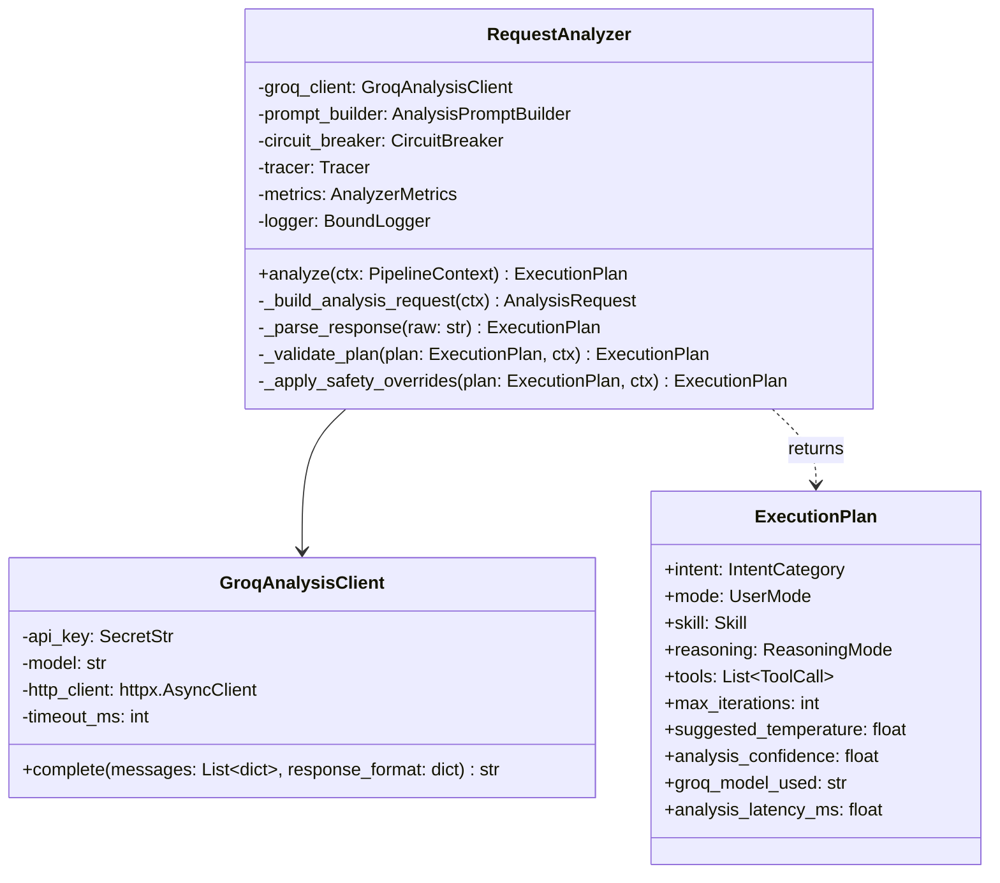
```mermaid
classDiagram
    class RequestAnalyzer {
        -groq_client: GroqAnalysisClient
        -prompt_builder: AnalysisPromptBuilder
        -circuit_breaker: CircuitBreaker
        -tracer: Tracer
        -metrics: AnalyzerMetrics
        -logger: BoundLogger
        +analyze(ctx: PipelineContext) ExecutionPlan
        -_build_analysis_request(ctx) AnalysisRequest
        -_parse_response(raw: str) ExecutionPlan
        -_validate_plan(plan: ExecutionPlan, ctx) ExecutionPlan
        -_apply_safety_overrides(plan: ExecutionPlan, ctx) ExecutionPlan
    }

    class GroqAnalysisClient {
        -api_key: SecretStr
        -model: str
        -http_client: httpx.AsyncClient
        -timeout_ms: int
        +complete(messages: List~dict~, response_format: dict) str
    }

    class ExecutionPlan {
        +intent: IntentCategory
        +mode: UserMode
        +skill: Skill
        +reasoning: ReasoningMode
        +tools: List~ToolCall~
        +max_iterations: int
        +suggested_temperature: float
        +analysis_confidence: float
        +groq_model_used: str
        +analysis_latency_ms: float
    }

    RequestAnalyzer --> GroqAnalysisClient
    RequestAnalyzer ..> ExecutionPlan : returns
```

### 10.2 Analysis Request Construction

The analysis prompt is a system prompt that provides the Groq model with:
1. **Context bundle** — formatted memory, graph nodes, retrieval chunks
2. **Available tools** — descriptions of registered tools (Web Search only today)
3. **User message** — the raw user input
4. **User-selected mode hint** — from the Kafka event (`mode_hint`, advisory only, per HLD Section 26.2)
5. **Output schema** — strict JSON schema that Groq must follow, including `mode`, which the Request Analyzer alone decides authoritatively

```text
AnalysisPrompt structure:

System: |
  You are GraphGPT's Request Analyzer. Given a user message and context,
  analyze the request and return a structured execution plan.

  ## User Context
  Memory: {formatted_memory}

  ## Knowledge Graph
  {formatted_graph}

  ## Retrieved Documents
  {formatted_retrieval}

  ## Available Tools
  {tools_json_schema}

  ## Client-Provided Mode Hint (advisory only — you may confirm or override)
  {mode_hint}

  ## Output Format (strict JSON, no markdown)
  {
    "intent": "GENERAL_CHAT | QUESTION_ANSWERING | CODE_GENERATION | ...",
    "mode": "default | tutor | code | ask_files | web_search | smart | deep_research",
    "skill": "general_chat | tutor | coding | research | writing | reasoning",
    "reasoning": "DIRECT | CHAIN_OF_THOUGHT | REACT",
    "tools": [{"tool_name": "...", "params": {}, "parallel": true, "required": false}],
    "max_iterations": 1-6,
    "suggested_temperature": 0.1-0.9,
    "analysis_confidence": 0.0-1.0
  }

User: {user_message}
```

**Groq model:** `llama-3.3-70b-versatile` (default) or `llama3-8b-8192` (low-latency fallback)

### 10.3 Response Parsing Algorithm

```text
Algorithm: ExecutionPlan parsing

1. Raw response is a JSON string (enforced via Groq's JSON mode)
2. Parse: plan_dict = json.loads(raw_response)
3. Validate with Pydantic: ExecutionPlan(**plan_dict)
4. Apply safety overrides:

   Override Rule 1: if plan.mode == "ask_files" and len(ctx.file_ids) == 0:
     plan.mode = "default"  (cannot ask files without files)

   Override Rule 2: if plan.tools contains "web_search" and config.enable_web_search == False:
     plan.tools = [t for t in plan.tools if t.tool_name != "web_search"]

   Override Rule 3: if plan.mode == "smart" and plan.max_iterations > config.langgraph_max_loop_iterations_smart:
     plan.max_iterations = config.langgraph_max_loop_iterations_smart

   Override Rule 4: if plan.mode == "deep_research" and plan.max_iterations > config.langgraph_max_loop_iterations_deep_research:
     plan.max_iterations = config.langgraph_max_loop_iterations_deep_research

   Override Rule 5: if plan.mode not in {"smart", "deep_research"} and plan.max_iterations > 1:
     plan.max_iterations = 1   (Mode Handlers are single-pass by construction; a >1 value is meaningless there)

5. On ParseError (JSON invalid, schema mismatch):
   log.warning("Request analyzer parse failed, using safe default plan")
   return _safe_default_plan(ctx)  # DIRECT, no tools, mode=default

6. Return validated ExecutionPlan
```

### 10.4 Safe Default Plan (Groq Failure Fallback)

If the Groq call fails entirely (network error, circuit breaker open), the analyzer returns a deterministic safe default:

```text
SafeDefaultPlan:
  intent: GENERAL_CHAT
  mode: default              # ModeDispatcher will route this to DefaultHandler — never a graph
  skill: general_chat
  reasoning: DIRECT
  tools: []
  max_iterations: 1
  suggested_temperature: 0.7
  analysis_confidence: 0.0   # signals to observability that this was a fallback
```

This ensures the pipeline **never blocks** waiting for Groq, and — critically — it guarantees the fallback always routes to a Mode Handler, never to a LangGraph graph. This is a deliberate implementation choice: if the Request Analyzer itself is degraded, the pipeline should not simultaneously ask a stateful, iterative graph to run without a properly-reasoned plan. Worst case: the user gets a context-aware general chat response without tool augmentation.

### 10.5 ExecutionPlan Schema (Complete)

```text
IntentCategory (enum):
  GENERAL_CHAT | QUESTION_ANSWERING | CODE_GENERATION | CODE_DEBUGGING |
  CODE_EXPLANATION | RESEARCH | WEB_SEARCH | DOCUMENT_ANALYSIS |
  TUTORING | CREATIVE_WRITING | REASONING

UserMode (enum, string values match ModeDispatcher routing keys exactly):
  "default" | "tutor" | "code" | "ask_files" | "web_search" | "smart" | "deep_research"

Skill (enum):
  general_chat | tutor | coding | research | writing | reasoning

ReasoningMode (enum):
  DIRECT | CHAIN_OF_THOUGHT | REACT

ToolCall:
  tool_name: str
  params: dict[str, Any]      # tool-specific parameters
  parallel: bool              # can run concurrently with others?
  required: bool              # if False, failure is non-fatal

ExecutionPlan:
  intent: IntentCategory
  mode: UserMode
  skill: Skill
  reasoning: ReasoningMode
  tools: List[ToolCall]
  max_iterations: int         # meaningful only for mode in {smart, deep_research}; forced to 1 otherwise
  suggested_temperature: float
  analysis_confidence: float  # 0.0 = fallback used
  groq_model_used: str
  analysis_latency_ms: float
```

### 10.6 Mode Capability Enforcement Table

The Request Analyzer is **instructed** via its system prompt to respect this table when selecting tools and reasoning strategy. It is also enforced programmatically by the safety overrides in 10.3, and — most importantly — by `ModeDispatcher` itself, which is the only place in the codebase where `plan.mode` is translated into an actual execution engine (see Section 11.3):

| Mode | Tools Allowed | Reasoning | Max Iterations | Execution Engine |
|---|---|---|---|---|
| default | None | DIRECT | 1 | `DefaultHandler` (Mode Handler) |
| tutor | None | CHAIN_OF_THOUGHT | 1 | `TutorHandler` (Mode Handler) |
| code | None | CHAIN_OF_THOUGHT | 1 | `CodeHandler` (Mode Handler) |
| ask_files | None | DIRECT | 1 | `AskFilesHandler` (Mode Handler) |
| web_search | [web_search: required] | DIRECT | 1 | `WebSearchHandler` (Mode Handler) |
| smart | Dynamic (from Groq) | REACT | 1-6 | `SmartGraph` (LangGraph) |
| deep_research | Dynamic, iterative (web_search) | REACT | 1-4 | `DeepResearchGraph` (LangGraph) |

---

## 11. Workflow Engine and Mode Dispatcher

### 11.1 Purpose and Position in the Codebase

`workflow_engine/` is the package that implements HLD Section 10 in code. It is the **only** package that is allowed to import from both `workflow_engine/mode_handlers/` and `workflow_engine/langgraph_workflows/` — every other package interacts with execution results only through the shared `WorkflowResult` type, never through mode-specific internals.

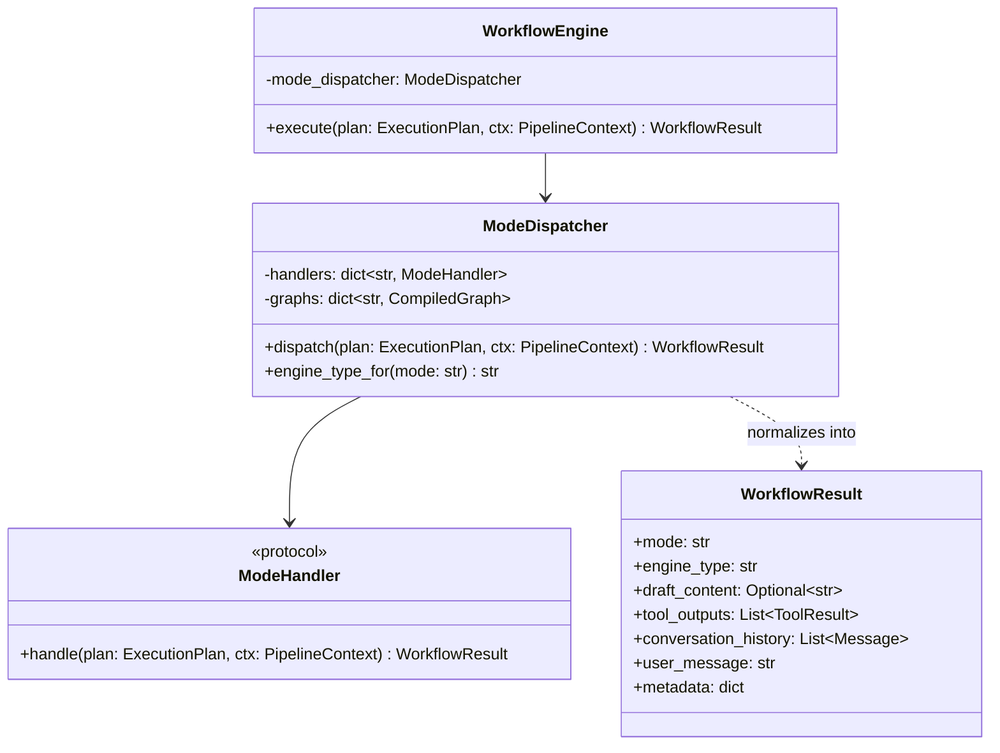
```mermaid
classDiagram
    class WorkflowEngine {
        -mode_dispatcher: ModeDispatcher
        +execute(plan: ExecutionPlan, ctx: PipelineContext) WorkflowResult
    }

    class ModeDispatcher {
        -handlers: dict~str, ModeHandler~
        -graphs: dict~str, CompiledGraph~
        +dispatch(plan: ExecutionPlan, ctx: PipelineContext) WorkflowResult
        +engine_type_for(mode: str) str
    }

    class ModeHandler {
        <<protocol>>
        +handle(plan: ExecutionPlan, ctx: PipelineContext) WorkflowResult
    }

    class WorkflowResult {
        +mode: str
        +engine_type: str
        +draft_content: Optional~str~
        +tool_outputs: List~ToolResult~
        +conversation_history: List~Message~
        +user_message: str
        +metadata: dict
    }

    WorkflowEngine --> ModeDispatcher
    ModeDispatcher --> ModeHandler
    ModeDispatcher ..> WorkflowResult : normalizes into
```

### 11.2 WorkflowResult — The Normalization Boundary

Both execution engine kinds must produce the same output shape so that the shared Prompt Builder (Section 17) never needs to know which engine ran. `WorkflowResult` is the single normalization point:

```python
@dataclass
class WorkflowResult:
    mode: str
    engine_type: str                      # "mode_handler" | "langgraph"
    draft_content: str | None             # pre-generation intermediate content, if any (used by LangGraph modes)
    tool_outputs: list[ToolResult]
    conversation_history: list[Message]
    user_message: str
    metadata: dict[str, Any]              # engine-specific debug metadata, never consumed by PromptBuilder

    @classmethod
    def from_mode_handler(cls, handler_output: ModeHandlerOutput) -> "WorkflowResult":
        return cls(
            mode=handler_output.mode,
            engine_type="mode_handler",
            draft_content=None,
            tool_outputs=handler_output.tool_outputs,
            conversation_history=handler_output.conversation_history,
            user_message=handler_output.user_message,
            metadata={},
        )

    @classmethod
    def from_graph_state(cls, final_state: SmartGraphState | DeepResearchGraphState) -> "WorkflowResult":
        return cls(
            mode=final_state["mode"],
            engine_type="langgraph",
            draft_content=final_state.get("draft_response") or final_state.get("structured_report"),
            tool_outputs=final_state.get("tool_results", []),
            conversation_history=final_state.get("conversation_history", []),
            user_message=final_state["user_message"],
            metadata={"loop_iterations": final_state.get("loop_iteration_count", 0)},
        )
```

### 11.3 ModeDispatcher — The Sole Routing Decision Point

```python
class ModeDispatcher:
    def __init__(self, handlers: dict[str, "ModeHandler"], graphs: dict[str, "CompiledGraph"]):
        # Invariant, checked at construction time: no mode key appears in both maps.
        overlap = set(handlers) & set(graphs)
        if overlap:
            raise ConfigurationError(f"Modes registered in both handlers and graphs: {overlap}")
        self.handlers = handlers
        self.graphs = graphs

    def engine_type_for(self, mode: str) -> str:
        if mode in self.handlers:
            return "mode_handler"
        if mode in self.graphs:
            return "langgraph"
        raise UnknownModeError(mode)

    async def dispatch(self, plan: ExecutionPlan, ctx: PipelineContext) -> WorkflowResult:
        metrics.workflow_dispatch_total.labels(
            mode=plan.mode, engine_type=self.engine_type_for(plan.mode)
        ).inc()

        if plan.mode in self.handlers:
            with tracer.start_as_current_span("mode_handler_execution", attributes={"mode": plan.mode}):
                handler_output = await self.handlers[plan.mode].handle(plan, ctx)
                return WorkflowResult.from_mode_handler(handler_output)

        if plan.mode in self.graphs:
            with tracer.start_as_current_span("langgraph_execution", attributes={"mode": plan.mode}):
                initial_state = build_graph_state(plan, ctx)
                final_state = await self.graphs[plan.mode].ainvoke(initial_state)
                return WorkflowResult.from_graph_state(final_state)

        raise UnknownModeError(plan.mode)
```

The constructor-time overlap check is a second, runtime-enforced layer on top of the CI-level Import Boundary Check from Section 2.2 — it is structurally impossible to register the same mode key in both `handlers` and `graphs`, so `ModeDispatcher` itself cannot become ambiguous about which engine owns a given mode.

### 11.4 Registered Modes at Boot

```python
MODE_HANDLER_KEYS = {"default", "tutor", "code", "ask_files", "web_search"}
LANGGRAPH_KEYS = {"smart", "deep_research"}

assert MODE_HANDLER_KEYS.isdisjoint(LANGGRAPH_KEYS)      # sanity check, also asserted in tests
assert MODE_HANDLER_KEYS | LANGGRAPH_KEYS == set(UserMode.__members__.values())
```

This assertion runs both at boot (fail fast) and in `tests/workflow_engine/test_mode_dispatcher.py` (fail in CI before deploy) to guarantee every value the `UserMode` enum can take has exactly one owning engine.

---

## 12. Mode Handlers Implementation

### 12.1 ModeHandler Protocol

Every Mode Handler implements the same minimal interface. There is no shared base *class* with inherited behavior — only a `Protocol` — because the five handlers deliberately do not share a common execution template beyond "read inputs, optionally call tools, produce a `ModeHandlerOutput`." Forcing a shared base class was found in earlier iterations to encourage accidental coupling between unrelated modes.

```python
class ModeHandler(Protocol):
    async def handle(self, plan: ExecutionPlan, ctx: PipelineContext) -> "ModeHandlerOutput": ...


@dataclass
class ModeHandlerOutput:
    mode: str
    tool_outputs: list[ToolResult]
    conversation_history: list[Message]
    user_message: str
```

### 12.2 DefaultHandler

```python
class DefaultHandler:
    def __init__(self, tool_dispatcher: ToolDispatcher, prompt_registry: PromptRegistry):
        self.tool_dispatcher = tool_dispatcher
        self.prompt_registry = prompt_registry

    async def handle(self, plan: ExecutionPlan, ctx: PipelineContext) -> ModeHandlerOutput:
        tool_outputs = []
        if plan.tools:  # Request Analyzer may optionally attach web_search
            tool_outputs = await self.tool_dispatcher.dispatch(plan.tools)

        return ModeHandlerOutput(
            mode="default",
            tool_outputs=tool_outputs,
            conversation_history=ctx.context_bundle.memory.short_term_messages if ctx.context_bundle.memory else [],
            user_message=ctx.user_message,
        )
```

No LangGraph import anywhere in this file — enforced by the Import Boundary Check.

### 12.3 TutorHandler

```python
class TutorHandler:
    def __init__(self, tool_dispatcher: ToolDispatcher, prompt_registry: PromptRegistry):
        self.tool_dispatcher = tool_dispatcher
        self.prompt_registry = prompt_registry

    async def handle(self, plan: ExecutionPlan, ctx: PipelineContext) -> ModeHandlerOutput:
        tool_outputs = []
        if plan.tools:  # optional supplementary references
            tool_outputs = await self.tool_dispatcher.dispatch(plan.tools)

        return ModeHandlerOutput(
            mode="tutor",
            tool_outputs=tool_outputs,
            conversation_history=ctx.context_bundle.memory.short_term_messages if ctx.context_bundle.memory else [],
            user_message=ctx.user_message,
        )
```

The pedagogical step-by-step structure lives entirely in the `tutor_v2.yaml` prompt template (Section 17.2) — `TutorHandler` itself does not implement any pedagogical logic; it only assembles inputs.

### 12.4 CodeHandler

```python
class CodeHandler:
    def __init__(self, tool_dispatcher: ToolDispatcher, prompt_registry: PromptRegistry):
        self.tool_dispatcher = tool_dispatcher
        self.prompt_registry = prompt_registry

    async def handle(self, plan: ExecutionPlan, ctx: PipelineContext) -> ModeHandlerOutput:
        tool_outputs = []
        if plan.tools:  # e.g., web_search for library/API lookups
            tool_outputs = await self.tool_dispatcher.dispatch(plan.tools)

        return ModeHandlerOutput(
            mode="code",
            tool_outputs=tool_outputs,
            conversation_history=ctx.context_bundle.memory.short_term_messages if ctx.context_bundle.memory else [],
            user_message=ctx.user_message,
        )
```

Multi-file, multi-step coding assistance is explicitly **not** implemented here — per HLD Section 33.2, that capability is planned as a new LangGraph graph (a Multi-File Coding Agent), not an extension of `CodeHandler`.

### 12.5 AskFilesHandler

```python
class AskFilesHandler:
    def __init__(self, prompt_registry: PromptRegistry):
        self.prompt_registry = prompt_registry
        # Deliberately no tool_dispatcher dependency — Ask Files needs no optional tools;
        # grounding comes entirely from ctx.context_bundle.retrieval (a baseline provider).

    async def handle(self, plan: ExecutionPlan, ctx: PipelineContext) -> ModeHandlerOutput:
        if not ctx.file_ids:
            log.warning("ask_files handler invoked with no file_ids", conversation_id=ctx.conversation_id)

        return ModeHandlerOutput(
            mode="ask_files",
            tool_outputs=[],
            conversation_history=ctx.context_bundle.memory.short_term_messages if ctx.context_bundle.memory else [],
            user_message=ctx.user_message,
        )
```

### 12.6 WebSearchHandler

```python
class WebSearchHandler:
    def __init__(self, tool_dispatcher: ToolDispatcher, prompt_registry: PromptRegistry):
        self.tool_dispatcher = tool_dispatcher
        self.prompt_registry = prompt_registry

    async def handle(self, plan: ExecutionPlan, ctx: PipelineContext) -> ModeHandlerOutput:
        # Web Search is required=True for this mode by the Mode Capability Table (Section 10.6).
        # If the Request Analyzer somehow omitted it, add it defensively.
        tools = plan.tools or [ToolCall(tool_name="web_search", params={"query": ctx.user_message},
                                          parallel=False, required=True)]

        tool_outputs = await self.tool_dispatcher.dispatch(tools)

        return ModeHandlerOutput(
            mode="web_search",
            tool_outputs=tool_outputs,
            conversation_history=ctx.context_bundle.memory.short_term_messages if ctx.context_bundle.memory else [],
            user_message=ctx.user_message,
        )
```

If the required `web_search` tool call fails, `ToolDispatcher.dispatch()` raises `RequiredToolFailedError`, which propagates up through `ModeDispatcher.dispatch()` and is caught by `RequestPipeline.run()`'s error handling (Section 28), never silently swallowed.

### 12.7 Common Traits Across All Five Handlers

| Trait | Detail |
|---|---|
| No `langgraph` import | Enforced by CI; verified in `tests/workflow_engine/test_import_boundaries.py` |
| No direct gRPC client access | All baseline context arrives pre-fetched via `ctx.context_bundle` |
| Stateless instances | Constructed once at boot, reused for every request; hold no per-request mutable state |
| Tool access only via `ToolDispatcher` | Never call `httpx` or an external API directly |
| Single `handle()` call, no internal loop | If a handler needs to loop, that mode does not belong as a Mode Handler — it belongs in `langgraph_workflows/` |

---

## 13. LangGraph Implementation

> **Architecture Freeze:** LangGraph exists in exactly two places in this codebase: `workflow_engine/langgraph_workflows/smart/` and `workflow_engine/langgraph_workflows/deep_research/`. There is no shared `StateGraph` wrapping the whole service, and no third graph. Adding a third graph requires an ADR (see `docs/adr/0002-scope-langgraph-to-smart-and-deep-research.md`).

### 13.1 SmartGraph

#### 13.1.1 Graph Builder

```python
class SmartGraphBuilder:
    def __init__(self, tool_dispatcher: ToolDispatcher, prompt_registry: PromptRegistry, config: LLMServiceConfig):
        self.tool_dispatcher = tool_dispatcher
        self.prompt_registry = prompt_registry
        self.max_iterations = config.langgraph_max_loop_iterations_smart

    def build(self) -> CompiledGraph:
        graph = StateGraph(SmartGraphState)

        graph.add_node("planner", make_planner_node(self.prompt_registry))
        graph.add_node("dynamic_tool_selection", make_tool_selection_node(self.prompt_registry))
        graph.add_node("execution", make_execution_node(self.tool_dispatcher))
        graph.add_node("prompt", make_prompt_node(self.prompt_registry))
        graph.add_node("generation", make_generation_node())

        graph.set_entry_point("planner")
        graph.add_edge("planner", "dynamic_tool_selection")
        graph.add_edge("dynamic_tool_selection", "execution")
        graph.add_conditional_edges(
            "execution",
            route_after_execution,     # see 13.1.3
            {
                "loop": "dynamic_tool_selection",
                "proceed": "prompt",
            },
        )
        graph.add_edge("prompt", "generation")
        graph.set_finish_point("generation")

        return graph.compile()
```

#### 13.1.2 SmartGraphState

```python
class SmartGraphState(TypedDict):
    # Identity (copied in from PipelineContext at initial_state construction)
    conversation_id: str
    user_id: str
    request_id: str
    mode: Literal["smart"]

    # Inputs
    user_message: str
    context_bundle: ContextBundle          # baseline context, passed through unchanged
    conversation_history: list[Message]

    # Planner output
    sub_tasks: list[SubTask]
    satisfied_sub_tasks: Annotated[list[str], operator.add]

    # Tool loop state
    tool_results: Annotated[list[ToolResult], operator.add]
    next_tool_call: ToolCall | None
    loop_iteration_count: int
    max_iterations: int

    # Terminal output
    draft_response: str | None
```

#### 13.1.3 Node Implementations

```python
def make_planner_node(prompt_registry: PromptRegistry):
    async def planner(state: SmartGraphState) -> dict:
        with tracer.start_as_current_span("langgraph_node.planner"):
            prompt = prompt_registry.render("smart", "planner", state)
            raw = await groq_or_nvidia_light_call(prompt)   # lightweight planning call, NVIDIA-backed
            sub_tasks = parse_sub_tasks(raw)
            return {"sub_tasks": sub_tasks, "loop_iteration_count": 0}
    return planner


def make_tool_selection_node(prompt_registry: PromptRegistry):
    async def dynamic_tool_selection(state: SmartGraphState) -> dict:
        with tracer.start_as_current_span("langgraph_node.tool_selection"):
            unsatisfied = [t for t in state["sub_tasks"] if t.id not in state["satisfied_sub_tasks"]]
            if not unsatisfied:
                return {"next_tool_call": None}
            prompt = prompt_registry.render("smart", "tool_selection", state)
            raw = await groq_or_nvidia_light_call(prompt)
            next_call = parse_tool_call(raw)
            return {"next_tool_call": next_call}
    return dynamic_tool_selection


def make_execution_node(tool_dispatcher: ToolDispatcher):
    async def execution(state: SmartGraphState) -> dict:
        with tracer.start_as_current_span("langgraph_node.execution"):
            if state["next_tool_call"] is None:
                return {"loop_iteration_count": state["loop_iteration_count"]}
            results = await tool_dispatcher.dispatch([state["next_tool_call"]])
            satisfied_id = state["next_tool_call"].params.get("sub_task_id")
            return {
                "tool_results": results,
                "satisfied_sub_tasks": [satisfied_id] if satisfied_id else [],
                "loop_iteration_count": state["loop_iteration_count"] + 1,
            }
    return execution


def make_prompt_node(prompt_registry: PromptRegistry):
    async def prompt(state: SmartGraphState) -> dict:
        with tracer.start_as_current_span("langgraph_node.prompt"):
            rendered = prompt_registry.render("smart", "assemble_intermediate", state)
            return {"_intermediate_prompt": rendered}
    return prompt


def make_generation_node():
    async def generation(state: SmartGraphState) -> dict:
        with tracer.start_as_current_span("langgraph_node.generation"):
            # This is an INTERMEDIATE draft, not the final NVIDIA/Gemini call —
            # the final call still happens once, later, in the shared post-dispatch pipeline.
            draft = await draft_completion(state["_intermediate_prompt"])
            return {"draft_response": draft}
    return generation
```

#### 13.1.4 Loop Condition — `route_after_execution`

```python
def route_after_execution(state: SmartGraphState) -> Literal["loop", "proceed"]:
    unsatisfied = [t for t in state["sub_tasks"] if t.id not in state["satisfied_sub_tasks"]]
    if not unsatisfied:
        return "proceed"
    if state["loop_iteration_count"] >= state["max_iterations"]:
        log.warning("SmartGraph loop cap reached", iterations=state["loop_iteration_count"])
        metrics.langgraph_loop_capped.labels(graph="smart").inc()
        return "proceed"           # forced exit — proceed with whatever was gathered
    return "loop"
```

This is the code-level implementation of HLD Section 12.2's loop condition, and of HLD Section 31.2's "LangGraph Runaway Loop" failure mode — the cap is enforced here, not left to the LLM's judgment.

#### 13.1.5 SmartGraph Diagram (Reference)

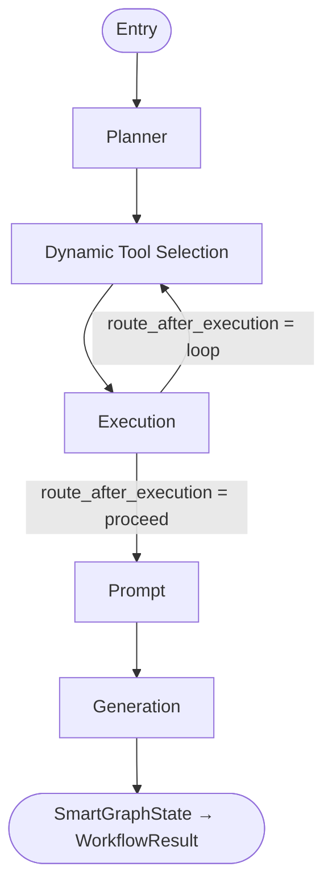
```mermaid
graph TD
    Start([Entry]) --> Planner
    Planner --> ToolSelect["Dynamic Tool Selection"]
    ToolSelect --> Execution
    Execution -->|"route_after_execution = loop"| ToolSelect
    Execution -->|"route_after_execution = proceed"| Prompt
    Prompt --> Generation
    Generation --> End(["SmartGraphState → WorkflowResult"])
```

---

### 13.2 DeepResearchGraph

#### 13.2.1 Graph Builder

```python
class DeepResearchGraphBuilder:
    def __init__(self, tool_dispatcher: ToolDispatcher, prompt_registry: PromptRegistry, config: LLMServiceConfig):
        self.tool_dispatcher = tool_dispatcher
        self.prompt_registry = prompt_registry
        self.max_iterations = config.langgraph_max_loop_iterations_deep_research

    def build(self) -> CompiledGraph:
        graph = StateGraph(DeepResearchGraphState)

        graph.add_node("search", make_search_node(self.tool_dispatcher))
        graph.add_node("analyze", make_analyze_node(self.prompt_registry))
        graph.add_node("compare_sources", make_compare_sources_node(self.prompt_registry))
        graph.add_node("summarize", make_summarize_node(self.prompt_registry))
        graph.add_node("generate_report", make_generate_report_node(self.prompt_registry))

        graph.set_entry_point("search")
        graph.add_edge("search", "analyze")
        graph.add_conditional_edges(
            "analyze",
            route_need_more_information,   # see 13.2.3
            {
                "search_again": "search",
                "proceed": "compare_sources",
            },
        )
        graph.add_edge("compare_sources", "summarize")
        graph.add_edge("summarize", "generate_report")
        graph.set_finish_point("generate_report")

        return graph.compile()
```

#### 13.2.2 DeepResearchGraphState

```python
class DeepResearchGraphState(TypedDict):
    conversation_id: str
    user_id: str
    request_id: str
    mode: Literal["deep_research"]

    user_message: str
    context_bundle: ContextBundle
    conversation_history: list[Message]

    queries_issued: Annotated[list[str], operator.add]
    search_results: Annotated[list[ToolResult], operator.add]
    findings: Annotated[list[Finding], operator.add]
    coverage_sufficient: bool
    loop_iteration_count: int
    max_iterations: int

    cross_referenced_findings: list[Finding] | None
    synthesis: str | None
    structured_report: str | None
```

#### 13.2.3 Node Implementations

```python
def make_search_node(tool_dispatcher: ToolDispatcher):
    async def search(state: DeepResearchGraphState) -> dict:
        with tracer.start_as_current_span("langgraph_node.search"):
            query = state["queries_issued"][-1] if state["queries_issued"] else state["user_message"]
            results = await tool_dispatcher.dispatch(
                [ToolCall(tool_name="web_search", params={"query": query}, parallel=False, required=True)]
            )
            return {
                "search_results": results,
                "queries_issued": [query] if not state.get("queries_issued") else [],
                "loop_iteration_count": state.get("loop_iteration_count", 0) + 1,
            }
    return search


def make_analyze_node(prompt_registry: PromptRegistry):
    async def analyze(state: DeepResearchGraphState) -> dict:
        with tracer.start_as_current_span("langgraph_node.analyze"):
            prompt = prompt_registry.render("deep_research", "analyze", state)
            raw = await draft_completion(prompt)
            findings, coverage = parse_findings_and_coverage(raw)
            return {"findings": findings, "coverage_sufficient": coverage}
    return analyze


def make_compare_sources_node(prompt_registry: PromptRegistry):
    async def compare_sources(state: DeepResearchGraphState) -> dict:
        with tracer.start_as_current_span("langgraph_node.compare_sources"):
            prompt = prompt_registry.render("deep_research", "compare_sources", state)
            raw = await draft_completion(prompt)
            return {"cross_referenced_findings": parse_findings(raw)}
    return compare_sources


def make_summarize_node(prompt_registry: PromptRegistry):
    async def summarize(state: DeepResearchGraphState) -> dict:
        with tracer.start_as_current_span("langgraph_node.summarize"):
            prompt = prompt_registry.render("deep_research", "summarize", state)
            synthesis = await draft_completion(prompt)
            return {"synthesis": synthesis}
    return summarize


def make_generate_report_node(prompt_registry: PromptRegistry):
    async def generate_report(state: DeepResearchGraphState) -> dict:
        with tracer.start_as_current_span("langgraph_node.generate_report"):
            prompt = prompt_registry.render("deep_research", "generate_report", state)
            report = await draft_completion(prompt)
            return {"structured_report": report}
    return generate_report
```

#### 13.2.4 Loop Condition — `route_need_more_information`

```python
def route_need_more_information(state: DeepResearchGraphState) -> Literal["search_again", "proceed"]:
    if state["coverage_sufficient"]:
        return "proceed"
    if state["loop_iteration_count"] >= state["max_iterations"]:
        log.warning("DeepResearchGraph loop cap reached", iterations=state["loop_iteration_count"])
        metrics.langgraph_loop_capped.labels(graph="deep_research").inc()
        return "proceed"           # forced exit — proceed with partial coverage
    return "search_again"
```

#### 13.2.5 DeepResearchGraph Diagram (Reference)

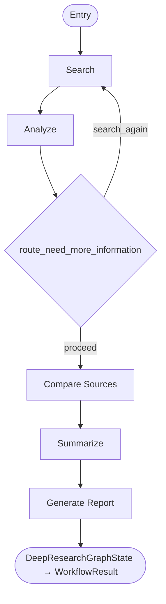
```mermaid
graph TD
    Start([Entry]) --> Search
    Search --> Analyze
    Analyze --> Decision{"route_need_more_information"}
    Decision -->|"search_again"| Search
    Decision -->|"proceed"| Compare["Compare Sources"]
    Compare --> Summarize
    Summarize --> Report["Generate Report"]
    Report --> End(["DeepResearchGraphState → WorkflowResult"])
```

---

### 13.3 Shared LangGraph Utilities

`workflow_engine/langgraph_workflows/shared/loop_guard.py` centralizes the iteration-cap logic pattern used identically by both `route_after_execution` and `route_need_more_information`, to prevent the two graphs' loop-safety logic from drifting apart over time:

```python
def check_loop_cap(current_iterations: int, max_iterations: int, graph_name: str) -> bool:
    """Returns True if the loop cap has been reached and the graph should forcibly proceed."""
    if current_iterations >= max_iterations:
        log.warning(f"{graph_name} loop cap reached", iterations=current_iterations)
        metrics.langgraph_loop_capped.labels(graph=graph_name).inc()
        return True
    return False
```

### 13.4 What Is Deliberately Absent From This Section

Consistent with HLD Section 12.5, the following are **not** implemented anywhere in `workflow_engine/langgraph_workflows/`:
- A node or graph wrapping Kafka consumption, Context Collection, or Request Analysis
- A `StateGraph` instance for `default`, `tutor`, `code`, `ask_files`, or `web_search`
- Any LangGraph node that calls `GenerationRouter`, `StreamingEngine`, or `KafkaPublisher` directly — those remain exclusively owned by the shared post-dispatch stages in `RequestPipeline.run()` (Section 5.3)

---

## 14. State and Data Model Reference

> **Architecture Freeze:** v1.1 used a single monolithic `AgentState` `TypedDict` shared by every node in the one frozen pipeline graph. v2.0 splits this into **three narrower types**, matching the three places state actually needs to exist: before dispatch (shared by everyone), inside a Mode Handler (plain Pydantic, no graph reducers), and inside a LangGraph graph (`TypedDict`, reducers only where accumulation is needed). This split is not cosmetic — it is what makes the Import Boundary Check in Section 2.2 enforceable, since `ModeHandlerState` has no LangGraph dependency to accidentally import.

### 14.1 PipelineContext — Shared, Pre-Dispatch

`PipelineContext` is a plain Pydantic model (not a `TypedDict`) constructed once per request in `RequestPipeline.run()` and passed by reference through Context Collection, Request Analysis, and into Workflow Dispatch. It is read-only from that point forward by Mode Handlers (they return a `ModeHandlerOutput`, they do not mutate `PipelineContext`), and is used only to construct `SmartGraphState`/`DeepResearchGraphState` initial state for the LangGraph path.

```text
PipelineContext (Pydantic BaseModel):

  # Identity
  conversation_id: str
  user_id: str
  message_id: str
  request_id: str               # generated UUID for this pipeline run
  trace_id: str
  span_id: str

  # Input
  user_message: str
  mode_hint: Optional[UserMode]  # advisory client-provided hint, schema field name per HLD 26.2
  file_ids: List[str]

  # Context Bundle (set by ContextCollector — always present after Stage 1)
  context_bundle: Optional[ContextBundle]
  context_collected_at: Optional[datetime]

  # Request Analysis (set by RequestAnalyzer — always present after Stage 2)
  plan: Optional[ExecutionPlan]

  # Post-dispatch (set by the shared pipeline after Workflow Dispatch)
  engine_type: Optional[str]              # "mode_handler" | "langgraph"
  selected_provider: Optional[str]        # "nvidia" | "gemini" — set by GenerationRouter
  generation_fallback_used: bool
  usage: Optional[UsageMetrics]
  cost_usd: Optional[float]

  # Metadata
  started_at: datetime
  inference_started_at: Optional[datetime]
  first_chunk_at: Optional[datetime]
  completed_at: Optional[datetime]
```

`PipelineContext` deliberately has **no** `tool_results`, `react_iteration_count`, or `response_chunks` fields — those belonged to the old monolithic `AgentState` because every node shared one object. In v2.0 they live only where they are actually produced: `tool_outputs` on `ModeHandlerOutput`/`WorkflowResult`, loop counters inside the graph-specific `TypedDict`s, and `response_chunks` locally inside `StreamingEngine.stream()`.

### 14.2 ModeHandlerState — Internal to Mode Handlers Only

Unlike `PipelineContext`, `ModeHandlerState` is not a formal shared type — each Mode Handler receives `plan: ExecutionPlan` and `ctx: PipelineContext` as separate parameters (Section 12) and returns a `ModeHandlerOutput`. There is no intermediate mutable state object threaded through a Mode Handler's execution, because a Mode Handler makes exactly one pass: read inputs, optionally call tools, return output. This is the direct implementation of "Mode Handlers are standard async Python, no graph state" from HLD Section 11.

```text
ModeHandlerOutput (dataclass, defined in workflow_engine/workflow_result.py):
  mode: str
  tool_outputs: List[ToolResult]
  conversation_history: List[Message]
  user_message: str
```

### 14.3 LangGraph State Types — Internal to Each Graph Only

`SmartGraphState` and `DeepResearchGraphState` are defined in full in Section 13.1.2 and 13.2.2 respectively. Both are `TypedDict` (required by LangGraph's state management) and both are constructed fresh for each `.ainvoke()` call via `build_graph_state()`:

```python
def build_graph_state(plan: ExecutionPlan, ctx: PipelineContext) -> dict:
    base = {
        "conversation_id": ctx.conversation_id,
        "user_id": ctx.user_id,
        "request_id": ctx.request_id,
        "mode": plan.mode,
        "user_message": ctx.user_message,
        "context_bundle": ctx.context_bundle,
        "conversation_history": ctx.context_bundle.memory.short_term_messages if ctx.context_bundle.memory else [],
        "loop_iteration_count": 0,
        "max_iterations": plan.max_iterations,
    }
    if plan.mode == "smart":
        return {**base, "sub_tasks": [], "satisfied_sub_tasks": [], "tool_results": [],
                "next_tool_call": None, "draft_response": None}
    if plan.mode == "deep_research":
        return {**base, "queries_issued": [], "search_results": [], "findings": [],
                "coverage_sufficient": False, "cross_referenced_findings": None,
                "synthesis": None, "structured_report": None}
    raise UnknownModeError(plan.mode)
```

Neither `TypedDict` is importable from outside its own subpackage — `SmartGraphState` is not referenced anywhere except `smart/graph.py`, `smart/nodes.py`, and `smart/edges.py`; the same isolation applies to `DeepResearchGraphState`.

### 14.4 State Reducers (LangGraph Only)

LangGraph requires reducer functions for fields that accumulate across node invocations within a single graph run. These exist **only** inside the two graph state definitions — `PipelineContext` and `ModeHandlerOutput` never use reducers because they are not LangGraph-managed objects:

```python
# SmartGraphState
tool_results: Annotated[list[ToolResult], operator.add]
satisfied_sub_tasks: Annotated[list[str], operator.add]

# DeepResearchGraphState
queries_issued: Annotated[list[str], operator.add]
search_results: Annotated[list[ToolResult], operator.add]
findings: Annotated[list[Finding], operator.add]

# All other TypedDict fields in both graphs: last-write-wins (LangGraph default)
```

### 14.5 Full Request Lifecycle (All Object Types)

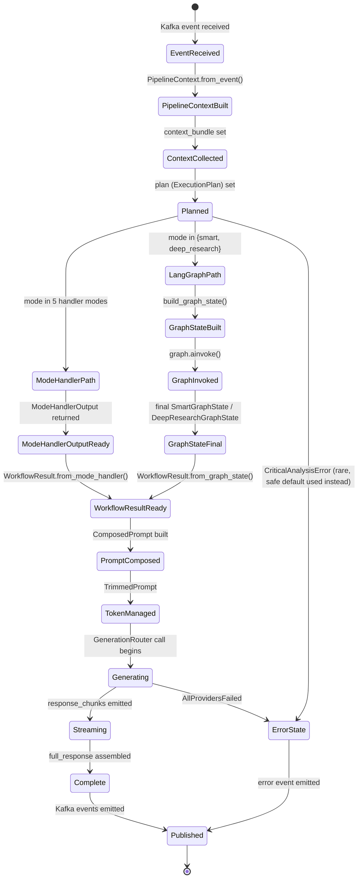
```mermaid
stateDiagram-v2
    [*] --> EventReceived: Kafka event received
    EventReceived --> PipelineContextBuilt: PipelineContext.from_event()
    PipelineContextBuilt --> ContextCollected: context_bundle set
    ContextCollected --> Planned: plan (ExecutionPlan) set

    Planned --> ModeHandlerPath: mode in 5 handler modes
    Planned --> LangGraphPath: mode in {smart, deep_research}

    ModeHandlerPath --> ModeHandlerOutputReady: ModeHandlerOutput returned
    LangGraphPath --> GraphStateBuilt: build_graph_state()
    GraphStateBuilt --> GraphInvoked: graph.ainvoke()
    GraphInvoked --> GraphStateFinal: final SmartGraphState / DeepResearchGraphState

    ModeHandlerOutputReady --> WorkflowResultReady: WorkflowResult.from_mode_handler()
    GraphStateFinal --> WorkflowResultReady: WorkflowResult.from_graph_state()

    WorkflowResultReady --> PromptComposed: ComposedPrompt built
    PromptComposed --> TokenManaged: TrimmedPrompt
    TokenManaged --> Generating: GenerationRouter call begins
    Generating --> Streaming: response_chunks emitted
    Streaming --> Complete: full_response assembled
    Complete --> Published: Kafka events emitted
    Published --> [*]

    Planned --> ErrorState: CriticalAnalysisError (rare, safe default used instead)
    Generating --> ErrorState: AllProvidersFailed
    ErrorState --> Published: error event emitted
```

### 14.6 ServiceError Schema

```text
ServiceError:
  error_type: ErrorType         # Enum: VALIDATION | ANALYSIS | TOOL | INFERENCE | PUBLISH | GRAPH_LOOP
  error_code: str               # "PROVIDER_ALL_FAILED", "CONTEXT_OVERFLOW", "GRAPH_LOOP_CAPPED", etc.
  message: str
  retriable: bool
  provider: Optional[str]       # which provider failed (if inference error)
  tool_name: Optional[str]      # which tool failed (if tool error)
  mode: Optional[str]           # which mode was executing
  engine_type: Optional[str]    # "mode_handler" | "langgraph"
  traceback: Optional[str]      # truncated traceback for debugging
```

Note the addition of `engine_type` and the new `GRAPH_LOOP` category relative to v1.1 — both exist specifically so dashboards and alerts can distinguish "a Mode Handler failed" from "a LangGraph graph hit its loop cap or failed mid-iteration," which have different operational implications.

---

## 15. Tool Framework

### 15.1 BaseTool Abstract Interface

> **Architecture Freeze:** `tools/` contains **only** optional capabilities. Memory, Graph, and Retrieval clients live under `grpc/clients/` and are wired exclusively into `ContextCollector` (Section 9). There is no `MemoryTool`, `GraphTool`, or `RetrievalTool` class anywhere in this codebase — that pattern existed in v1.1 and has been removed entirely, per HLD Section 14.1.

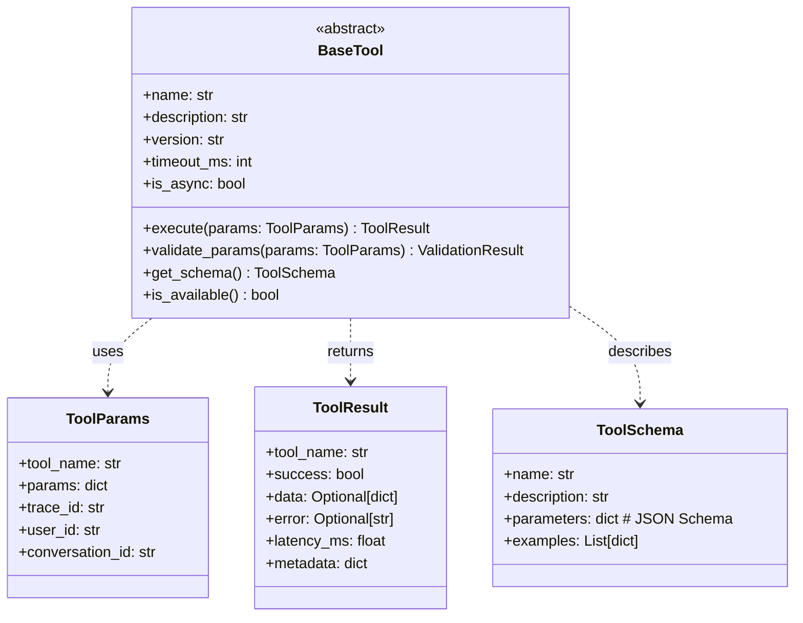
```mermaid
classDiagram
    class BaseTool {
        <<abstract>>
        +name: str
        +description: str
        +version: str
        +timeout_ms: int
        +is_async: bool
        +execute(params: ToolParams) ToolResult
        +validate_params(params: ToolParams) ValidationResult
        +get_schema() ToolSchema
        +is_available() bool
    }

    class ToolParams {
        +tool_name: str
        +params: dict
        +trace_id: str
        +user_id: str
        +conversation_id: str
    }

    class ToolResult {
        +tool_name: str
        +success: bool
        +data: Optional[dict]
        +error: Optional[str]
        +latency_ms: float
        +metadata: dict
    }

    class ToolSchema {
        +name: str
        +description: str
        +parameters: dict      # JSON Schema
        +examples: List[dict]
    }

    BaseTool ..> ToolParams : uses
    BaseTool ..> ToolResult : returns
    BaseTool ..> ToolSchema : describes
```

### 15.2 ToolRegistry

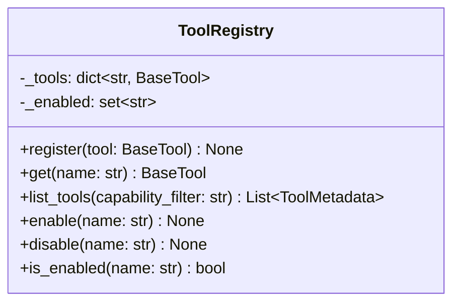
```mermaid
classDiagram
    class ToolRegistry {
        -_tools: dict~str, BaseTool~
        -_enabled: set~str~
        +register(tool: BaseTool) None
        +get(name: str) BaseTool
        +list_tools(capability_filter: str) List~ToolMetadata~
        +enable(name: str) None
        +disable(name: str) None
        +is_enabled(name: str) bool
    }
```

**ToolRegistry** is initialized in `main.py` lifespan and passed into the `Container`. It is **not a global singleton** — it is a regular instance injected as a dependency. This makes it easily replaceable in tests.

**Registration sequence (at boot, production configuration):**
```python
registry = ToolRegistry()
registry.register(WebSearchTool(http_client, config.tavily_api_key))
# Future tools, registered but disabled pending rollout (see HLD Section 33.2):
# registry.register(BrowserTool(...)); registry.disable("browser")
# registry.register(GitHubTool(...)); registry.disable("github")
# registry.register(SQLTool(...)); registry.disable("sql")
# registry.register(MCPTool(...)); registry.disable("mcp")
```

### 15.3 ToolDispatcher

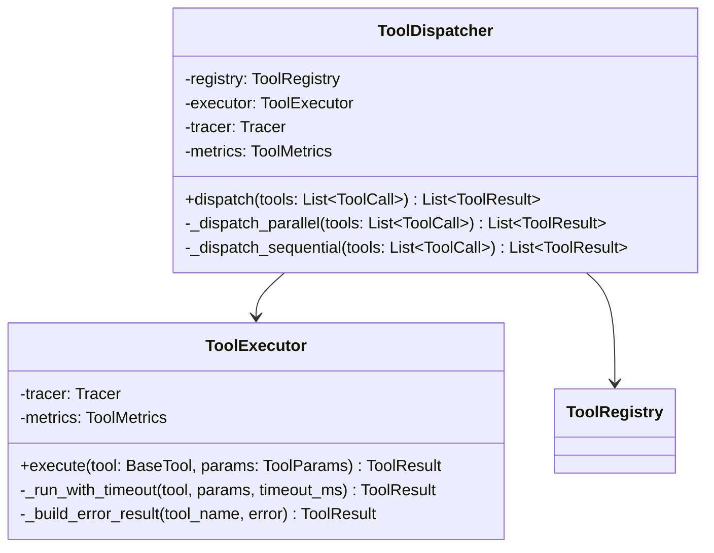
```mermaid
classDiagram
    class ToolDispatcher {
        -registry: ToolRegistry
        -executor: ToolExecutor
        -tracer: Tracer
        -metrics: ToolMetrics
        +dispatch(tools: List~ToolCall~) List~ToolResult~
        -_dispatch_parallel(tools: List~ToolCall~) List~ToolResult~
        -_dispatch_sequential(tools: List~ToolCall~) List~ToolResult~
    }

    class ToolExecutor {
        -tracer: Tracer
        -metrics: ToolMetrics
        +execute(tool: BaseTool, params: ToolParams) ToolResult
        -_run_with_timeout(tool, params, timeout_ms) ToolResult
        -_build_error_result(tool_name, error) ToolResult
    }

    ToolDispatcher --> ToolExecutor
    ToolDispatcher --> ToolRegistry
```

Note the signature change from v1.1: `dispatch()` now takes `tools: List[ToolCall]` directly rather than `(plan, state)`. This reflects that callers — Mode Handlers and LangGraph's `execution` node — have already decided exactly which tools to invoke; `ToolDispatcher` never inspects an `ExecutionPlan` or any pipeline state itself. This keeps it usable identically from both a plain `async def` Mode Handler and a LangGraph node.

### 15.4 Parallel Tool Execution Algorithm

```text
Algorithm: ToolDispatcher.dispatch(tools)

1. Group tools by parallel flag:
   parallel_group = [t for t in tools if t.parallel]
   sequential_group = [t for t in tools if not t.parallel]

2. Execute parallel group:
   tasks = [executor.execute(registry.get(t.tool_name), build_params(t))
            for t in parallel_group]
   parallel_results = await asyncio.gather(*tasks, return_exceptions=True)

3. For each result in parallel_results:
   if isinstance(result, Exception):
     log warning
     parallel_results[i] = ToolResult(success=False, error=str(result))

4. Execute sequential group in order:
   for tool_call in sequential_group:
     result = await executor.execute(...)
     if not result.success and tool_call.required:
       raise RequiredToolFailedError(tool_call.tool_name)

5. Return all results: parallel_results + sequential_results
```

### 15.5 ToolExecutor Timeout Enforcement

Each tool execution is wrapped in `asyncio.wait_for`:
```python
async def _run_with_timeout(self, tool, params, timeout_ms):
    try:
        return await asyncio.wait_for(
            tool.execute(params),
            timeout=timeout_ms / 1000.0
        )
    except asyncio.TimeoutError:
        return ToolResult(
            tool_name=tool.name,
            success=False,
            error=f"Tool timed out after {timeout_ms}ms",
            latency_ms=timeout_ms
        )
```

### 15.6 Result Normalization

Every `ToolResult` includes a `data` dict with a **standardized schema** regardless of the tool type. This allows `PromptBuilder` to handle tool results uniformly across both Mode Handlers and LangGraph graphs:

```text
ToolResult.data schema:

  For WebSearchTool:
    {
      "type": "web_search",
      "results": [{"title": ..., "url": ..., "snippet": ...}],
      "query": "..."
    }
```

### 15.7 Why ToolDispatcher Cannot Reach Memory/Graph/Retrieval

This is enforced at three independent layers, deliberately redundant:
1. **Dependency wiring:** `ToolDispatcher.__init__` never receives `MemoryServiceClient`, `GraphServiceClient`, or `RetrievalServiceClient` as constructor arguments anywhere in `main.py`.
2. **Import Boundary Check (Section 2.2):** `tools/` importing from `context/` or `grpc/clients/` fails CI.
3. **ToolRegistry contents:** No `MemoryTool`/`GraphTool`/`RetrievalTool` class exists to register in the first place.

---

## 16. Tool Implementations

### 16.1 WebSearchTool

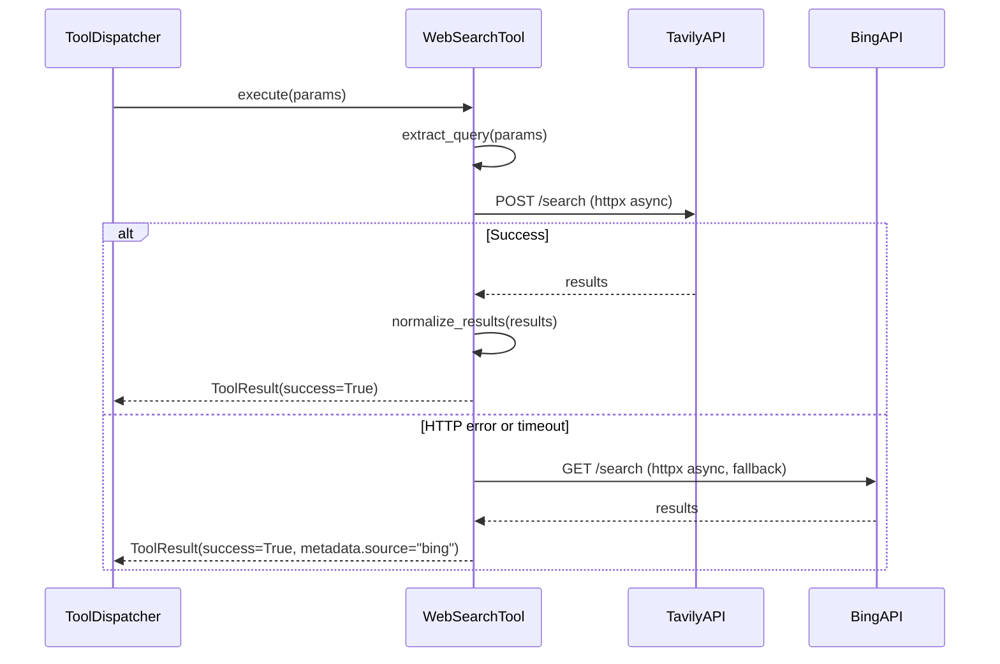
```mermaid
sequenceDiagram
    participant Dispatcher as ToolDispatcher
    participant SearchTool as WebSearchTool
    participant Tavily as TavilyAPI
    participant Bing as BingAPI

    Dispatcher->>SearchTool: execute(params)
    SearchTool->>SearchTool: extract_query(params)
    SearchTool->>Tavily: POST /search (httpx async)
    alt Success
        Tavily-->>SearchTool: results
        SearchTool->>SearchTool: normalize_results(results)
        SearchTool-->>Dispatcher: ToolResult(success=True)
    else HTTP error or timeout
        SearchTool->>Bing: GET /search (httpx async, fallback)
        Bing-->>SearchTool: results
        SearchTool-->>Dispatcher: ToolResult(success=True, metadata.source="bing")
    end
```

**Query extraction:** `params["query"]` is used directly if provided. If not, the tool extracts the search query from the caller-provided `user_message` using a simple noun phrase extractor (regex-based).

**Result deduplication:** If multiple results have the same domain, keep only the highest-ranked one.

**Caching:** Identical queries within 60 seconds return cached results (using `TTLCache`). This is particularly important for `SmartGraph` and `DeepResearchGraph`, where the same or overlapping queries can be issued across successive loop iterations.

### 16.2 Future Tool Skeleton (Registration Pattern)

Every future tool in the HLD Section 14.5 roadmap (`browser`, `github`, `sql`, `mcp`, `slack`, `jira`, `gmail`, `calendar`) follows the identical registration pattern as `WebSearchTool` — implement `BaseTool`, register in `ToolRegistry`, no changes required to `ToolDispatcher`, `ContextCollector`, `PromptBuilder`, or any Mode Handler / LangGraph node:

```python
class GitHubTool(BaseTool):
    name = "github"
    description = "Search GitHub repositories and code"
    timeout_ms = 5000

    async def execute(self, params: ToolParams) -> ToolResult:
        ...  # implementation deferred to Phase 2 rollout, see HLD Section 33.2
```

---

## 17. Prompt Engine

### 17.1 Class Design

`PromptBuilder` is a **shared** component — it is called identically whether the upstream `WorkflowResult` came from a Mode Handler or from a LangGraph graph. It has no knowledge of `engine_type` beyond an informational field it may include in rendering context.

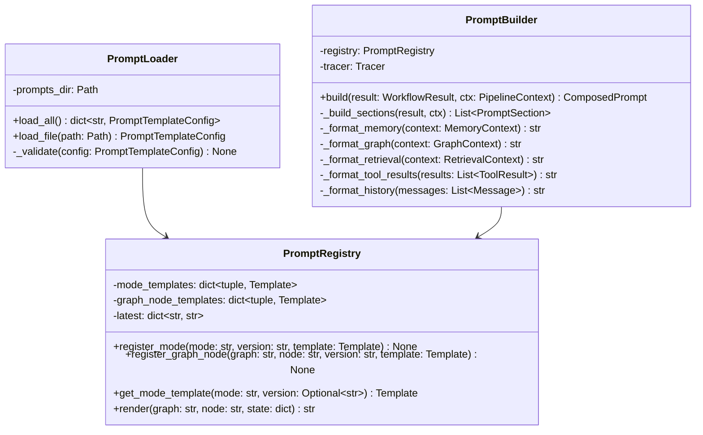
```mermaid
classDiagram
    class PromptLoader {
        -prompts_dir: Path
        +load_all() dict~str, PromptTemplateConfig~
        +load_file(path: Path) PromptTemplateConfig
        -_validate(config: PromptTemplateConfig) None
    }

    class PromptRegistry {
        -mode_templates: dict~tuple, Template~
        -graph_node_templates: dict~tuple, Template~
        -latest: dict~str, str~
        +register_mode(mode: str, version: str, template: Template) None
        +register_graph_node(graph: str, node: str, version: str, template: Template) None
        +get_mode_template(mode: str, version: Optional~str~) Template
        +render(graph: str, node: str, state: dict) str
    }

    class PromptBuilder {
        -registry: PromptRegistry
        -tracer: Tracer
        +build(result: WorkflowResult, ctx: PipelineContext) ComposedPrompt
        -_build_sections(result, ctx) List~PromptSection~
        -_format_memory(context: MemoryContext) str
        -_format_graph(context: GraphContext) str
        -_format_retrieval(context: RetrievalContext) str
        -_format_tool_results(results: List~ToolResult~) str
        -_format_history(messages: List~Message~) str
    }

    PromptLoader --> PromptRegistry
    PromptBuilder --> PromptRegistry
```

### 17.2 Prompt Template YAML Format — Mode Handler Templates

```yaml
# tutor_v2.yaml
name: tutor
version: "2.0"
mode: tutor
engine: mode_handler
variables:
  - user_name
  - memory_context
  - graph_context
  - retrieval_context
  - conversation_history
  - user_query

system: |
  You are GraphGPT operating in Tutor mode.
  You have access to the user's memory, knowledge graph, and retrieved documents.

  User Profile:
  - Name: {user_name}

  Memory Context:
  {memory_context}

  Knowledge Graph Context:
  {graph_context}

  Retrieval Context:
  {retrieval_context}

  Explain concepts step by step, check understanding, and adjust depth to the user's level.
```

### 17.3 Prompt Template YAML Format — LangGraph Node Fragments

LangGraph-backed modes use smaller, per-node fragments rather than one monolithic template, since each node in `SmartGraph`/`DeepResearchGraph` performs a distinct sub-task with its own inputs:

```yaml
# deep_research/analyze_v1.yaml
name: deep_research_analyze
version: "1.0"
graph: deep_research
node: analyze
engine: langgraph
variables:
  - search_results
  - queries_issued
  - user_query

system: |
  You are analyzing search results gathered so far for a deep research task.

  Original question: {user_query}
  Queries issued so far: {queries_issued}
  Search results: {search_results}

  Extract key findings. Assess whether coverage is sufficient to answer the
  original question, or whether another search round is needed. Respond in the
  required structured JSON format (see schema).
```

### 17.4 PromptBuilder Algorithm

```text
Algorithm: PromptBuilder.build(result, ctx)

1. Get prompt template:
   template = registry.get_mode_template(result.mode)   # works identically for both engine types,
                                                          # since result.mode is always one of the 7 modes

2. Build each section as a PromptSection:
   sections = []

   sections.append(PromptSection(
     name="system",
     content=_format_system(result, ctx),
     priority=10,                        # never trimmed
     token_count=count(content)
   ))

   if ctx.context_bundle.memory and ctx.context_bundle.memory.long_term_facts:
     sections.append(PromptSection(
       name="long_term_memory",
       content=_format_long_term(ctx.context_bundle.memory),
       priority=7
     ))

   if ctx.context_bundle.graph:
     sections.append(PromptSection(
       name="graph_context",
       content=_format_graph(ctx.context_bundle.graph),
       priority=5
     ))

   if ctx.context_bundle.retrieval:
     sections.append(PromptSection(
       name="retrieval",
       content=_format_retrieval(ctx.context_bundle.retrieval),
       priority=5
     ))

   for tool_result in result.tool_outputs:
     sections.append(PromptSection(
       name=f"tool_{tool_result.tool_name}",
       content=_format_tool_result(tool_result),
       priority=6
     ))

   if result.draft_content:   # only present for LangGraph-produced results
     sections.append(PromptSection(
       name="draft_content",
       content=result.draft_content,
       priority=9                        # high priority — this is the graph's synthesized output
     ))

   if result.conversation_history:
     sections.append(PromptSection(
       name="conversation_history",
       content=_format_history(result.conversation_history),
       priority=8                        # trimmed only after others
     ))

   sections.append(PromptSection(
     name="user_query",
     content=result.user_message,
     priority=10                         # never trimmed
   ))

3. Return ComposedPrompt(sections=sections, mode=result.mode, engine_type=result.engine_type)
```

Step 2's `draft_content` handling is the one place `PromptBuilder` behaves conditionally on which engine produced the `WorkflowResult` — and even there, it is driven entirely by whether the field is populated, not by an `if engine_type == "langgraph"` branch. Mode Handler results simply always have `draft_content=None`.

### 17.5 ComposedPrompt Schema

```text
PromptSection:
  name: str                   # section identifier for trimming
  content: str                # rendered text
  priority: int               # 1-10; lower = trimmed first
  token_count: int            # pre-calculated token count
  trimmable: bool              # whether this section can be trimmed

ComposedPrompt:
  sections: List[PromptSection]
  total_tokens: int           # sum of all section token counts
  messages: List[dict]        # OpenAI-format message list
  mode: str
  engine_type: str            # "mode_handler" | "langgraph" — carried through for observability only
  template_version: str
```

### 17.6 Memory Formatting

Short-term messages are formatted as a readable conversation block:
```text
## Recent Conversation
User: {message}
Assistant: {response}
User: {message}
...
```

Long-term facts are formatted as a bulleted list:
```text
## What I Know About You
- Your name is {name}
- You prefer Python for coding
- You are learning {topic} at {level} level
```

---

## 18. Context Window Manager

### 18.1 Class Design

`ContextWindowManager` is, like `PromptBuilder`, a shared component invoked exactly once per request, after Workflow Dispatch has already completed for both engine types.

```mermaid
classDiagram
    class ContextWindowManager {
        -tokenizer: tiktoken.Encoding
        -provider_limits: dict~str, ModelLimits~
        -logger: BoundLogger
        -metrics: TokenMetrics
        +manage(prompt: ComposedPrompt, target_model: str) TrimmedPrompt
        +count_tokens(text: str) int
        +count_messages(messages: List~dict~) int
        -_calculate_budget(model: ModelLimits) int
        -_trim_to_budget(sections: List~PromptSection~, budget: int) List~PromptSection~
        -_trim_section(section: PromptSection, target_tokens: int) PromptSection
    }

    class ModelLimits {
        +model: str
        +context_window: int
        +max_output_tokens: int
        +effective_input: int
    }

    class TrimmedPrompt {
        +sections: List~PromptSection~
        +messages: List~dict~
        +total_tokens: int
        +was_trimmed: bool
        +trimmed_sections: List~str~
    }

    ContextWindowManager --> ModelLimits
    ContextWindowManager ..> TrimmedPrompt : returns
```

### 18.2 Token Counting Implementation

The `ContextWindowManager` uses **tiktoken** with the `cl100k_base` encoding. For other providers, a multiplier is applied:

```text
tiktoken_count = tokenizer.encode(text)
actual_count = tiktoken_count × provider_multiplier

Provider multipliers:
  nvidia:    1.00   (NVIDIA NIM OpenAI-compatible cl100k_base)
  groq:      1.00   (llama models, approximate)
  gemini:    0.97   (Gemini tokenizer is slightly more efficient)
```

**Performance:** tiktoken encoding is implemented in Rust and runs at ~100MB/s. For typical prompts (10K tokens), counting takes < 1ms.

### 18.3 Budget Allocation Algorithm

```text
Algorithm: BudgetCalculator

Input: model (ModelLimits with context_window, max_output_tokens)

1. effective_window = model.context_window × 0.95   # 5% safety margin

2. reserved_output = model.max_output_tokens
   (capped at mode-specific max_output_tokens from ModeDefinition)

3. input_budget = effective_window - reserved_output

4. Allocate by section priority:
   system_budget         = input_budget × 0.10
   mode_prompt_budget    = input_budget × 0.10
   long_term_mem_budget  = input_budget × 0.10
   graph_context_budget  = input_budget × 0.10
   retrieval_budget      = input_budget × 0.15
   tool_results_budget   = input_budget × 0.15
   draft_content_budget  = input_budget × 0.10   # only nonzero for LangGraph-produced results
   conversation_budget   = input_budget × 0.15
   user_query_budget     = input_budget × 0.05  (min: actual query length)

5. Return BudgetAllocation dict
```

### 18.4 Trimming Algorithm

```text
Algorithm: PriorityTrimmer

Input: sections (sorted by priority ascending), total_budget

1. Calculate current total:
   total = sum(s.token_count for s in sections)

2. If total <= total_budget: return sections unchanged (no trimming needed)

3. excess = total - total_budget

4. Process sections in priority order (lowest priority first):
   for section in sorted(sections, key=lambda s: s.priority):
     if not section.trimmable:
       continue
     if excess <= 0:
       break
     can_trim = section.token_count - section_minimums[section.name]
     actual_trim = min(can_trim, excess)
     section.content = _truncate_to_tokens(section.content, section.token_count - actual_trim)
     section.token_count -= actual_trim
     excess -= actual_trim
     trimmed_sections.append(section.name)

5. If excess > 0 after all trimmable sections:
   raise ContextOverflowError("Cannot fit prompt within budget even after maximum trimming")

6. Rebuild messages list from trimmed sections.
   Return TrimmedPrompt(was_trimmed=True, trimmed_sections=...)
```

### 18.5 Section Minimums

```text
section_minimums:
  system:               always full (priority 10, not trimmable)
  user_query:           always full (priority 10, not trimmable)
  draft_content:        200 tokens minimum (LangGraph modes — losing this discards the graph's work)
  conversation_history: 200 tokens minimum (last 2 turns)
  long_term_memory:     100 tokens minimum (top 3 facts)
  graph_context:        0   (can be fully removed)
  retrieval:            0   (can be fully removed)
  tool_results:         50  (at least one search result snippet)
```

---

## 19. Generation Router

> **Architecture Freeze:** The `GenerationRouter` is called **exactly once per request**, after `PromptBuilder` and `ContextWindowManager` have run, regardless of which execution engine (Mode Handler or LangGraph) produced the input. It routes to the appropriate provider adapter based on task:
> 1. **Request Analysis** → **Groq Adapter**, invoked separately and earlier, inside `RequestAnalyzer` (Section 10) — not part of this call.
> 2. **Response Generation** → **NVIDIA Adapter** (primary).
> 3. **Fallback** → **Gemini Adapter** (only if NVIDIA is unavailable).

### 19.1 Class Design

```mermaid
classDiagram
    class GenerationRouter {
        -adapters: dict~str, BaseProviderAdapter~
        -circuit_breakers: dict~str, CircuitBreaker~
        -retry_manager: RetryManager
        -metrics: RouterMetrics
        -logger: BoundLogger
        +generate_stream(prompt: TrimmedPrompt) AsyncIterator~str~
        -_get_adapter(provider: str) BaseProviderAdapter
    }

    class BaseProviderAdapter {
        <<abstract>>
        +execute(messages: List~dict~, params: dict) dict
        +stream(messages: List~dict~, params: dict) AsyncIterator~str~
    }

    class NVIDIAAdapter {
        -client: AsyncOpenAI
        +stream(messages, params) AsyncIterator~str~
    }

    class GeminiAdapter {
        -client: GenAIClient
        +stream(messages, params) AsyncIterator~str~
    }

    GenerationRouter --> BaseProviderAdapter
    BaseProviderAdapter <|-- NVIDIAAdapter
    BaseProviderAdapter <|-- GeminiAdapter
```

Note: `GroqAdapter` is intentionally **not** wired into `GenerationRouter` in this section — it is owned exclusively by `RequestAnalyzer` (Section 10.1). This is a deliberate implementation choice mirroring HLD Section 17.1's statement that Groq is never used for generation; keeping the adapter instance out of `GenerationRouter` entirely makes that invariant impossible to violate by accident.

### 19.2 Routing and Fallback Logic

```python
class GenerationRouter:
    def __init__(self, nvidia_adapter, gemini_adapter, circuit_breakers, retry_manager):
        self.primary = nvidia_adapter
        self.fallback = gemini_adapter
        self.circuit_breakers = circuit_breakers    # {"nvidia": CB, "gemini": CB}
        self.retry_manager = retry_manager

    async def generate_stream(self, prompt: TrimmedPrompt) -> AsyncIterator[str]:
        if self.circuit_breakers["nvidia"].is_open():
            metrics.generation_fallback_total.labels(from_provider="nvidia", to_provider="gemini").inc()
            async for token in self.fallback.stream(prompt.messages, {}):
                yield token
            return

        try:
            async for token in self.retry_manager.execute_with_retry(
                lambda: self.primary.stream(prompt.messages, {}), provider="nvidia"
            ):
                yield token
        except ProviderError:
            self.circuit_breakers["nvidia"].on_failure()
            metrics.generation_fallback_total.labels(from_provider="nvidia", to_provider="gemini").inc()
            if self.circuit_breakers["gemini"].is_open():
                raise AllProvidersFailedError("Both NVIDIA and Gemini unavailable")
            async for token in self.fallback.stream(prompt.messages, {}):
                yield token
```

### 19.3 Provider Configuration

```yaml
providers:
  groq:                                    # owned by RequestAnalyzer, not GenerationRouter
    model: llama-3.3-70b-versatile
    api_key_env: GROQ_API_KEY
    timeout_ms: 5000
  nvidia:
    model: meta/llama-3.1-70b-instruct
    api_key_env: NVIDIA_API_KEY
    base_url: https://integrate.api.nvidia.com/v1
    timeout_ms: 15000
  gemini:
    model: gemini-1.5-pro
    api_key_env: GEMINI_API_KEY
    timeout_ms: 15000
```

---

## 20. Provider Adapters

### 20.1 BaseProviderAdapter Interface

Every adapter implements the `BaseProviderAdapter` interface to wrap provider-specific SDKs and format exceptions.

```python
class BaseProviderAdapter(ABC):
    @abstractmethod
    async def execute(self, messages: List[dict], params: dict) -> dict:
        """For non-streaming calls (e.g. Request Analysis)"""
        pass

    @abstractmethod
    async def stream(self, messages: List[dict], params: dict) -> AsyncIterator[str]:
        """For streaming calls (e.g. Response Generation)"""
        pass
```

### 20.2 Groq Adapter

- Wraps the official `groq` async client.
- Enforces JSON output format (`response_format={"type": "json_object"}`).
- Maps Groq API errors to internal exceptions (`GroqAPIError`, `GroqRateLimitError`).
- Instantiated once at boot and injected **only** into `RequestAnalyzer`.

### 20.3 NVIDIA Adapter

- Wraps `AsyncOpenAI` pointing to NVIDIA NIM endpoints (`https://integrate.api.nvidia.com/v1`).
- Connects using standard HTTP/2 keep-alive connection pooling.
- Handles token streaming with raw response chunks parsing.
- Instantiated once at boot and injected **only** into `GenerationRouter` as the primary adapter.

### 20.4 Gemini Adapter

- Wraps `google-genai` SDK for Gemini API access.
- Used as the fallback for response generation only.
- Formats Gemini's response object structure to match the standard output dictionary layout.
- Instantiated once at boot and injected **only** into `GenerationRouter` as the fallback adapter.

---

## 21. Streaming Engine

### 21.1 Class Design

```mermaid
classDiagram
    class StreamingEngine {
        -publisher: KafkaPublisher
        -tracer: Tracer
        -metrics: StreamingMetrics
        -chunk_size: int
        -flush_interval_ms: int
        +stream(token_iter: AsyncIterator~str~, ctx: PipelineContext) str
        -_flush_buffer(buffer, ctx, idx) None
        -_build_chunk_event(content: str, ctx: PipelineContext, idx: int, seq_num: int) ChatResponseChunkEvent
    }
```

### 21.2 Streaming Algorithm

```text
Algorithm: StreamingEngine.stream(token_iter, ctx)

Variables:
  buffer = []
  buffer_tokens = 0
  chunk_index = 0
  full_content = []
  last_flush_time = now()
  first_chunk_emitted = False

For each token in token_iter:
  buffer.append(token)
  full_content.append(token)
  buffer_tokens += 1

  if not first_chunk_emitted:
    ctx.first_chunk_at = now()
    metrics.record_ttft(now() - ctx.inference_started_at, engine_type=ctx.engine_type)
    first_chunk_emitted = True

  should_flush = (
    buffer_tokens >= chunk_size  OR          # size-based flush
    (now() - last_flush_time) >= flush_interval  # time-based flush
  )

  if should_flush:
    await _flush_buffer(buffer, ctx, chunk_index, chunk_sequence_number=chunk_index + 1)
    chunk_index += 1
    buffer = []
    buffer_tokens = 0
    last_flush_time = now()

# Final flush (remaining tokens)
if buffer:
  await _flush_buffer(buffer, ctx, chunk_index, chunk_sequence_number=chunk_index + 1)

full_response = "".join(full_content)
return full_response
```

### 21.3 Chunk Size Strategy

| Condition | Chunk Size | Rationale |
|---|---|---|
| Default | 6 tokens | Good balance of Kafka throughput vs. perceived streaming speed |
| First chunk | 1 token | Get first token to user as fast as possible |
| Rate-limited (high load) | 12 tokens | Reduce Kafka publish rate during high traffic |
| Code blocks (detected) | 20 tokens | Code renders better in larger blocks |

### 21.4 Cancellation Handling

If the Conversation Service disconnects before the stream completes (detected via a `CancellationToken` passed into the pipeline), the streaming engine:
1. Stops consuming tokens from the provider token stream
2. Closes the active async generator (prevents dangling HTTP connection)
3. Publishes a `chat.response.cancelled` event to Kafka
4. Logs cost incurred up to cancellation point

Note that cancellation can occur while a LangGraph graph is still executing (before `GenerationRouter` is even reached). In that case, the `CancellationToken` is checked at the top of `RequestPipeline.run()` before Workflow Dispatch begins, and the pending `graph.ainvoke()` coroutine is cancelled via `asyncio.Task.cancel()` rather than via the streaming path.

---

## 22. Retry Manager

### 22.1 Class Design

```mermaid
classDiagram
    class RetryManager {
        -policy: RetryPolicy
        -logger: BoundLogger
        -metrics: RetryMetrics
        +execute_with_retry(fn: Callable, provider: str) Any
        +is_retriable(exc: Exception) bool
    }

    class RetryPolicy {
        +max_attempts: int = 3
        +initial_delay_ms: int = 100
        +max_delay_ms: int = 2000
        +backoff_factor: float = 2.0
        +jitter: bool = True
        +retriable_status_codes: List~int~
        +retriable_exceptions: List~type~
    }

    RetryManager --> RetryPolicy
```

### 22.2 Retry Implementation

The `RetryManager` wraps **Tenacity** with a custom retry predicate:

```python
@retry(
  stop=stop_after_attempt(policy.max_attempts),
  wait=wait_exponential_jitter(
    initial=policy.initial_delay_ms / 1000,
    max=policy.max_delay_ms / 1000,
    jitter=policy.jitter
  ),
  retry=retry_if_exception(is_retriable),
  before_sleep=log_retry_attempt,
  reraise=True
)
async def execute_with_retry(fn, provider):
  return await fn()
```

### 22.3 Retry Classification

```python
def is_retriable(exc: Exception) -> bool:
    if isinstance(exc, (groq.RateLimitError, openai.RateLimitError, google.api_core.exceptions.TooManyRequests)):
        return True
    if isinstance(exc, (groq.InternalServerError, openai.InternalServerError, google.api_core.exceptions.InternalServerError)):
        return True
    if isinstance(exc, (groq.APIConnectionError, openai.APIConnectionError, google.api_core.exceptions.RetryError)):
        return True
    if isinstance(exc, grpc.aio.AioRpcError):
        if exc.code() in [StatusCode.UNAVAILABLE, StatusCode.DEADLINE_EXCEEDED]:
            return True
    if isinstance(exc, asyncio.TimeoutError):
        return True
    return False    # authentication errors, bad requests: do NOT retry
```

### 22.4 Retries Never Cross the Streaming Boundary

Consistent with HLD Section 20.3: once `GenerationRouter.generate_stream()` has yielded its first token, `RetryManager` is no longer in the call path. Retries apply only to the pre-first-token phase of a generation call — a partially streamed response is never retried, since doing so would duplicate tokens already delivered to the user.

### 22.5 Jitter Algorithm

Jitter prevents **thundering herd** after provider recovery:
```text
delay = min(initial × factor^attempt, max_delay)
jitter_amount = random.uniform(0, delay × 0.1)  # ±10% jitter
final_delay = delay + jitter_amount
```

### 22.6 Fallback After Exhaustion

When all retry attempts are exhausted for the primary model, `RetryManager` raises, and `GenerationRouter` (Section 19.2) catches the exception and selects the fallback provider:

```python
try:
    async for token in generation_router.generate_stream(prompt):
        yield token
except AllProvidersFailedError:
    # Both retries and fallback are exhausted — surfaced to RequestPipeline.run()'s error handler.
    raise
```

---

## 23. Circuit Breaker

### 23.1 Class Design

```mermaid
classDiagram
    class CircuitBreaker {
        -name: str
        -config: CircuitBreakerConfig
        -state: CircuitState
        -failure_count: int
        -success_count: int
        -last_failure_time: Optional~datetime~
        -_lock: asyncio.Lock
        -metrics: CircuitBreakerMetrics
        +call() AsyncContextManager
        +on_success() None
        +on_failure() None
        +is_open() bool
        +reset() None
    }

    class CircuitBreakerConfig {
        +failure_threshold: int = 5
        +success_threshold: int = 2
        +window_seconds: int = 60
        +recovery_timeout_seconds: int = 30
    }

    class CircuitState {
        <<enumeration>>
        CLOSED
        OPEN
        HALF_OPEN
    }

    CircuitBreaker --> CircuitBreakerConfig
    CircuitBreaker --> CircuitState
```

### 23.2 State Transition Logic

```text
Algorithm: CircuitBreaker state machine

on_failure():
  async with _lock:
    failure_count += 1
    last_failure_time = now()
    if state == HALF_OPEN:
      state = OPEN        # probe failed, reopen
    if failure_count >= config.failure_threshold:
      state = OPEN
      log warning f"Circuit opened for {name}"
      metrics.circuit_opened.inc()

on_success():
  async with _lock:
    if state == HALF_OPEN:
      success_count += 1
      if success_count >= config.success_threshold:
        state = CLOSED     # enough successes, close circuit
        failure_count = 0
        success_count = 0
        log info f"Circuit closed for {name}"
    elif state == CLOSED:
      failure_count = max(0, failure_count - 1)  # decay failure count

call() (context manager):
  if state == OPEN:
    elapsed = now() - last_failure_time
    if elapsed >= config.recovery_timeout_seconds:
      state = HALF_OPEN    # allow probe
    else:
      raise CircuitOpenError(f"{name} circuit is open")

  try:
    yield   # execute the wrapped call
    on_success()
  except Exception as e:
    if is_retriable(e):
      on_failure()
    raise
```

### 23.3 Per-Dependency Isolation

Each provider and each baseline context service has its own `CircuitBreaker` instance:

```python
circuit_breakers = {
  "groq": CircuitBreaker("groq", config),               # RequestAnalyzer
  "nvidia": CircuitBreaker("nvidia", config),            # GenerationRouter primary
  "gemini": CircuitBreaker("gemini", config),            # GenerationRouter fallback
  "memory_service": CircuitBreaker("memory_service", config),     # ContextCollector
  "graph_service": CircuitBreaker("graph_service", config),       # ContextCollector
  "retrieval_service": CircuitBreaker("retrieval_service", config), # ContextCollector
  "web_search": CircuitBreaker("web_search", config),    # ToolDispatcher
}
```

This ensures that, for example, an NVIDIA outage does not prevent Groq-based analysis, and a Graph Service outage does not prevent Memory or Retrieval context from being fetched. Each circuit's failure count and recovery timing are tracked completely independently.

---

## 24. Cache Design

### 24.1 TTLCache Implementation

```mermaid
classDiagram
    class TTLCache {
        -_store: dict~str, CacheEntry~
        -_max_size: int
        -_default_ttl: int
        -_lock: asyncio.Lock
        +get(key: str) Optional~Any~
        +set(key: str, value: Any, ttl: Optional~int~) None
        +delete(key: str) None
        +clear() None
        -_evict_expired() None
        -_evict_lru() None
    }

    class CacheEntry {
        +value: Any
        +expires_at: float
        +access_count: int
        +last_accessed: float
    }

    TTLCache --> CacheEntry
```

### 24.2 Cache Eviction

Two eviction strategies run cooperatively:

1. **TTL eviction:** Entries older than their TTL are removed lazily on `get()`. A background task also runs every 60 seconds to purge all expired entries.

2. **LRU eviction:** When `max_size` is reached, the least recently accessed entry is removed. LRU tracking uses `last_accessed` timestamp updated on every `get()`.

### 24.3 What Gets Cached

| Cache | Key | TTL | Max Size | Rationale |
|---|---|---|---|---|
| **Web Search Results** | `sha256(query)` | 60s | 1,000 | Prevent duplicate API calls across `SmartGraph`/`DeepResearchGraph` loop iterations |
| **Idempotency IDs** | `message_id` | 300s | 10,000 | Prevent duplicate Kafka message processing |
| **Provider Quotas** | `provider` | 5s | 10 | Rate limit status caching (groq, nvidia, gemini) |
| **Prompt Templates** | `(mode, version)` or `(graph, node, version)` | ∞ (boot-loaded) | 100 | Avoid repeated YAML parsing |

**No LLM response caching** is implemented. LLM responses are inherently non-deterministic (temperature > 0) and user-specific. Caching them would require extensive cache key design and raises privacy concerns.

---

## 25. Configuration Management

### 25.1 Configuration Hierarchy

```text
Priority (highest to lowest):
  1. Environment variables (K8s Secrets / ConfigMap)
  2. .env file (development only)
  3. Default values in Pydantic Settings model
```

### 25.2 Secret Management

API keys are stored as Kubernetes Secrets and injected as environment variables at pod startup:

```yaml
env:
  - name: NVIDIA_API_KEY
    valueFrom:
      secretKeyRef:
        name: llm-service-secrets
        key: nvidia-api-key
  - name: GEMINI_API_KEY
    valueFrom:
      secretKeyRef:
        name: llm-service-secrets
        key: gemini-api-key
  - name: GROQ_API_KEY
    valueFrom:
      secretKeyRef:
        name: llm-service-secrets
        key: groq-api-key
```

In `config.py`, these are typed as `SecretStr` from Pydantic. When logged (e.g., in Structlog), `SecretStr.__str__()` returns `"**********"` — never the actual value.

### 25.3 Feature Flags

Feature flags are implemented as boolean config fields with `FEATURE_` prefix:

```text
FEATURE_SMART_MODE=true
FEATURE_DEEP_RESEARCH_MODE=true
FEATURE_WEB_SEARCH=true
FEATURE_VISION=false
FEATURE_GRPC_KEEPALIVE=true
```

These are read from environment variables. Changing them requires a pod restart (no hot-reload). Disabling `FEATURE_SMART_MODE` or `FEATURE_DEEP_RESEARCH_MODE` causes `ModeDispatcher` construction to omit that mode from the `graphs` map entirely — the Request Analyzer's safety overrides (Section 10.3) will remap any plan targeting a disabled mode back to `default`.

### 25.4 Configuration Validation

Pydantic Settings validates all config on startup:
- `kafka_bootstrap_servers` must be a valid host:port string
- `groq_api_key` and `nvidia_api_key` must be set and non-empty
- `grpc_deadline_ms` must be between 500 and 30000
- `langgraph_max_loop_iterations_smart` must be between 1 and 10
- `langgraph_max_loop_iterations_deep_research` must be between 1 and 10

Any validation failure causes immediate process exit with a clear error message.

---

## 26. Security

### 26.1 mTLS via Istio

All inter-service gRPC communication is protected by **mutual TLS** enforced at the Istio sidecar level:

```yaml
# Istio PeerAuthentication (enforced mTLS in the namespace)
apiVersion: security.istio.io/v1beta1
kind: PeerAuthentication
metadata:
  name: default
  namespace: graphgpt
spec:
  mtls:
    mode: STRICT
```

The LLM Service application code does not need to implement TLS — Istio's Envoy sidecar handles certificate negotiation transparently.

### 26.2 Input Sanitization (Prompt Injection Protection)

User input passes through `InputSanitizer` before being included in any prompt — this runs once, before Request Analysis, so both the Groq analysis call and every downstream engine (Mode Handler or LangGraph) see already-sanitized input:

```mermaid
flowchart LR
    Input["raw user_message"]
    Sanitizer["InputSanitizer"]
    DI["Delimiter Injection Check\n(escape system prompt tokens)"]
    Override["Instruction Override Check\n(regex: ignore previous, forget)"]
    Length["Length Enforcement\n(max 4096 chars)"]
    Clean["sanitized_message"]

    Input --> Sanitizer --> DI --> Override --> Length --> Clean
```

**Delimiter Injection:** System prompt delimiters used by common LLM providers (`###`, `<|im_start|>`, `[INST]`, `<<SYS>>`) are escaped in user input to prevent them from being interpreted as prompt structure.

**Instruction Override Detection:** Regex patterns matching common jailbreak phrases are detected. On detection:
1. Log at WARNING level with `pii_sanitized=true`
2. Include a `safety_check_failed=true` flag on `PipelineContext`
3. Optionally add a safety reminder to the system prompt

### 26.3 Output Validation

Before streaming the LLM response to Kafka, the `OutputValidator` checks:
- Response is non-empty
- Response does not contain raw API keys (regex: `sk-[a-zA-Z0-9]{48}`, `AIza...`)
- Response length is within expected bounds
- Response encoding is valid UTF-8

### 26.4 PII Detection

The `PIIDetector` runs on user messages before they are sent to external LLM providers (Groq, NVIDIA, or Gemini):

```text
PIIPatterns:
  email:         r"[a-zA-Z0-9._%+-]+@[a-zA-Z0-9.-]+\.[a-zA-Z]{2,}"
  phone_us:      r"\b(\+1[-.\s]?)?\(?\d{3}\)?[-.\s]?\d{3}[-.\s]?\d{4}\b"
  ssn:           r"\b\d{3}-\d{2}-\d{4}\b"
  credit_card:   r"\b(?:\d[ -]?){13,16}\b"

For each match:
  Replace with placeholder: [EMAIL_REDACTED], [PHONE_REDACTED], etc.
  Log PII detection event (without the PII value itself)
  Set ctx.pii_detected = True
```

### 26.5 Tool Input Validation

Because `SmartGraph`'s `dynamic_tool_selection` node can, by design, choose tool parameters somewhat freely based on intermediate reasoning, `ToolExecutor.execute()` runs `tool.validate_params()` before every invocation — including calls originating from inside a LangGraph node — to prevent a malformed or injected query string from reaching an external API unchecked.

### 26.6 Kafka Authentication

Kafka connections use SASL/SCRAM-SHA-512:
```python
AIOKafkaConsumer(
  security_protocol="SASL_SSL",
  sasl_mechanism="SCRAM-SHA-512",
  sasl_plain_username=config.kafka_username,
  sasl_plain_password=config.kafka_password.get_secret_value(),
)
```

---

## 27. Observability

### 27.1 Structlog Configuration

Structlog is configured with a processor chain that runs on every log call:

```text
Processor Chain:
  1. add_log_level                    → adds "level" field
  2. add_timestamp                    → adds ISO8601 "timestamp"
  3. ContextVar processor             → adds trace_id, span_id, conversation_id, engine_type
                                        from contextvars (set per-request)
  4. stdlib_log_level_field           → maps to stdlib for library compatibility
  5. JSONRenderer                     → serializes to JSON string
```

Every log line includes:
```json
{
  "timestamp": "2026-08-07T14:47:51.123Z",
  "level": "info",
  "service": "llm-service",
  "version": "2.0.0",
  "pod_name": "llm-service-pod-abc",
  "trace_id": "abc123",
  "span_id": "def456",
  "conversation_id": "conv_xyz",
  "event": "generation_complete",
  "mode": "smart",
  "engine_type": "langgraph",
  "provider": "nvidia",
  "latency_ms": 1240
}
```

### 27.2 OpenTelemetry Tracing

Every significant async function is decorated with a span:

```python
@trace_span("request_analysis")
async def analyze(self, ctx: PipelineContext) -> ExecutionPlan:
    ...
```

The `@trace_span` decorator:
1. Starts a child span from the current context
2. Sets common attributes: `conversation_id`, `user_id`, `mode` (once known)
3. Records exceptions as span events with `exception.type` and `exception.message`
4. Sets span status to ERROR on exception
5. Ends the span on exit (success or failure)

**Trace propagation:** The `traceparent` header from the Kafka event is extracted at consumer level and set as the root span context using `propagate.extract()`. All downstream spans are children of this root span, including — critically — the individual LangGraph node spans (`langgraph_node.planner`, `langgraph_node.search`, etc.) declared inside each node function in Section 13.

**Full trace shape (matches HLD Section 22.4 exactly):**
```text
Trace: chat.message.created → chat.response.generated
  Span: kafka_consume
  Span: context_collection
    Span: memory_grpc_call
    Span: graph_grpc_call
    Span: retrieval_grpc_call
  Span: request_analysis            (Groq — single call)
  Span: workflow_engine_dispatch
    Span: mode_handler_execution    (present only for Default/Tutor/Code/AskFiles/WebSearch)
      Span: tool_dispatch
        Span: web_search_http
    Span: langgraph_execution       (present only for Smart/DeepResearch)
      Span: langgraph_node.planner              (SmartGraph)
      Span: langgraph_node.tool_selection        (SmartGraph)
      Span: langgraph_node.execution             (SmartGraph)
      Span: langgraph_node.search                (DeepResearchGraph)
      Span: langgraph_node.analyze               (DeepResearchGraph)
      Span: langgraph_node.compare_sources        (DeepResearchGraph)
      Span: langgraph_node.summarize              (DeepResearchGraph)
  Span: prompt_building
  Span: context_window_fit
  Span: generation_routing
    Span: http_request → nvidia
    Span: http_request → gemini (fallback only)
  Span: streaming_output
  Span: kafka_publish
```

### 27.3 Prometheus Metrics Definitions

All metrics are defined in `utils/metrics.py` as module-level objects. Additions relative to v1.1 are marked:

```python
# Request metrics
REQUESTS_TOTAL = Counter(
    "llm_requests_total",
    "Total LLM service requests",
    ["mode", "skill", "engine_type", "provider", "status"]     # engine_type added
)

REQUEST_DURATION = Histogram(
    "llm_request_duration_seconds",
    "End-to-end request duration",
    ["mode", "skill", "engine_type", "provider"],
    buckets=[0.1, 0.25, 0.5, 1.0, 2.0, 5.0, 10.0, 30.0]
)

# NEW: Workflow Engine dispatch metrics
WORKFLOW_DISPATCH_TOTAL = Counter(
    "llm_workflow_engine_dispatch_total",
    "Workflow Engine dispatch count by mode and engine type",
    ["mode", "engine_type"]
)

LANGGRAPH_NODE_DURATION = Histogram(
    "llm_langgraph_node_duration_seconds",
    "Per-node duration inside SmartGraph / DeepResearchGraph",
    ["graph", "node"],
    buckets=[0.05, 0.1, 0.25, 0.5, 1.0, 2.0, 5.0]
)

LANGGRAPH_LOOP_ITERATIONS = Histogram(
    "llm_langgraph_loop_iterations",
    "Loop iterations consumed per graph invocation",
    ["graph"],
    buckets=[1, 2, 3, 4, 5, 6, 8, 10]
)

LANGGRAPH_LOOP_CAPPED = Counter(
    "llm_langgraph_loop_capped_total",
    "Count of graph invocations that hit the iteration cap and were forced to proceed",
    ["graph"]
)

TTFT = Histogram(
    "llm_ttft_seconds",
    "Time to first token",
    ["provider", "mode", "engine_type"],                        # engine_type added
    buckets=[0.1, 0.25, 0.5, 1.0, 2.0, 5.0]
)

TOKENS_TOTAL = Counter(
    "llm_tokens_total",
    "Total tokens processed",
    ["provider", "token_type"]   # token_type: prompt | completion
)

COST_USD = Counter(
    "llm_cost_usd_total",
    "Total LLM cost in USD",
    ["provider", "mode", "user_tier"]
)

CIRCUIT_BREAKER_STATE = Gauge(
    "llm_circuit_breaker_state",
    "Circuit breaker state (0=closed, 1=half-open, 2=open)",
    ["name"]                     # groq | nvidia | gemini | memory_service | graph_service | retrieval_service | web_search
)

GENERATION_FALLBACK_TOTAL = Counter(
    "llm_generation_fallback_total",
    "Generation Router fallback events",
    ["from_provider", "to_provider"]
)

TOOL_CALLS = Counter(
    "llm_tool_calls_total",
    "Tool execution count",
    ["tool_name", "status"]
)

TOOL_DURATION = Histogram(
    "llm_tool_duration_seconds",
    "Tool execution duration",
    ["tool_name"],
    buckets=[0.01, 0.05, 0.1, 0.5, 1.0, 5.0]
)

KAFKA_LAG = Gauge(
    "llm_kafka_consumer_lag",
    "Kafka consumer lag",
    ["topic", "partition"]
)

CONTEXT_FETCH_DURATION = Histogram(
    "llm_context_fetch_duration_seconds",
    "Baseline context provider fetch duration",
    ["source"],                  # memory | graph | retrieval
    buckets=[0.01, 0.025, 0.05, 0.1, 0.25, 0.5]
)

CONTEXT_DEGRADED_TOTAL = Counter(
    "llm_context_degraded_total",
    "Count of requests where a baseline context source degraded",
    ["source", "reason"]
)

CONTEXT_TOKENS = Histogram(
    "llm_context_tokens_by_section",
    "Token count per prompt section",
    ["section", "mode"]
)
```

### 27.4 Correlation IDs

A unique `request_id` (UUID4) is generated for every pipeline invocation. It is:
- Added to all log entries via `contextvars.ContextVar`
- Added to all OTel span attributes, including every LangGraph node span
- Included in every Kafka event produced
- Returned in error responses

The `conversation_id` from the original Kafka event is also propagated throughout and serves as the primary correlation key across services.

---

## 28. Error Handling

### 28.1 Error Taxonomy and Classification

```mermaid
graph TD
    AllErrors["All Errors"]
    Retriable["Retriable Errors\n(transient)"]
    Permanent["Permanent Errors\n(non-retriable)"]
    Fatal["Fatal Errors\n(shutdown service)"]

    AllErrors --> Retriable & Permanent & Fatal

    Retriable --> R1["gRPC UNAVAILABLE"]
    Retriable --> R2["HTTP 429 / 503"]
    Retriable --> R3["asyncio.TimeoutError"]
    Retriable --> R4["Kafka connection lost"]

    Permanent --> P1["Pydantic ValidationError"]
    Permanent --> P2["HTTP 400 / 401 / 403"]
    Permanent --> P3["Content policy violation"]
    Permanent --> P4["Context overflow (trimming failed)"]
    Permanent --> P5["LangGraph loop cap reached\n(forced proceed, not an exception)"]

    Fatal --> F1["Config load failure"]
    Fatal --> F2["gRPC client init failure"]
    Fatal --> F3["Mode Handler / LangGraph build failure"]
    Fatal --> F4["Kafka connection failure at startup"]
```

### 28.2 Error Propagation Strategy

```text
Stage-Level Error Handling (RequestPipeline.run()):

Every stage is wrapped:
  try:
    result = await do_stage(ctx)
  except RetriableError as e:
    # Logged, counter incremented, re-raised for RetryManager (where applicable)
    raise
  except PermanentError as e:
    # Set ctx-level error info, route to error_handler
    await self.error_handler.handle(ctx, e)
    return
  except Exception as e:
    # Unexpected error — treated as permanent
    log.error("Unexpected error in stage", exc_info=True, stage=stage_name)
    await self.error_handler.handle(ctx, ServiceError(error_type=UNEXPECTED, ...))
    return

Within Mode Handlers: exceptions propagate up naturally to RequestPipeline.run()'s
  try/except around WorkflowEngine.execute() — Mode Handlers themselves do not
  catch and convert errors; they let RequiredToolFailedError etc. propagate.

Within LangGraph nodes: node-level exceptions propagate up through graph.ainvoke(),
  UNLESS the failure is a loop-cap situation, which is not an exception at all —
  it is handled by the conditional edge functions (route_after_execution,
  route_need_more_information) forcing "proceed" instead of "loop".
```

### 28.3 Error Response Published to Kafka

```text
ChatResponseGeneratedEvent (error variant):
  status: "error"
  error_code: "PROVIDER_ALL_FAILED"
  error_message: "Unable to generate response at this time. Please try again."
  full_content: null
  mode: ...
  engine_type: ...
  conversation_id: ...
  message_id: ...
```

The Conversation Service reads this and surfaces a user-friendly error message.

### 28.4 Graceful Degradation Decisions

| Failure | Response |
|---|---|
| Memory Service unavailable | Proceed without memory context; `ContextBundle.degraded=True` |
| Graph Service unavailable | Proceed without graph context; `ContextBundle.degraded=True` |
| Retrieval Service unavailable | Proceed without retrieval; `ContextBundle.degraded=True` |
| Groq (Request Analyzer) unavailable | `RequestAnalyzer` returns `SafeDefaultPlan` (mode=default — never routes to a graph) |
| Optional Web Search tool failure (Default/Tutor/Code) | Proceed without search results; acknowledge in response |
| Required Web Search tool failure (Web Search mode) | `RequiredToolFailedError` raised; surfaced as error response |
| SmartGraph / DeepResearchGraph loop cap reached | Not an error — graph forcibly proceeds to its terminal node with partial information |
| Primary generation provider (NVIDIA) fails | Try Gemini fallback |
| Both generation providers fail | Publish error event to Kafka; PagerDuty critical alert |
| Kafka publish failure | Retry 3×; if all fail, log CRITICAL alert |

---

## 29. Performance Optimizations

### 29.1 Async Event Loop Architecture

The service runs a single asyncio event loop per process (uvicorn default). Both the FastAPI server and the Kafka consumer share this event loop:

```mermaid
graph LR
    EventLoop["asyncio Event Loop\n(single per process)"]
    UvicornServer["Uvicorn HTTP Server\n(FastAPI health endpoints)"]
    KafkaConsumerTask["Kafka Consumer Task\n(continuous loop)"]
    PipelineTasks["RequestPipeline.run() Tasks\n(one per message)"]
    HealthProbeTask["Provider Health Probe\n(every 30s)"]

    EventLoop --> UvicornServer
    EventLoop --> KafkaConsumerTask
    EventLoop --> PipelineTasks
    EventLoop --> HealthProbeTask
```

**CPU-bound work** (tiktoken encoding for large prompts) is offloaded to a `ProcessPoolExecutor` to avoid blocking the event loop:
```python
token_count = await loop.run_in_executor(
    process_pool,
    tiktoken_encode,
    text
)
```

### 29.2 Connection Pooling Summary

| Connection Type | Pool Size | Rationale |
|---|---|---|
| gRPC channels (per baseline service) | 20 | HTTP/2 multiplexing; 20 channels × 100 streams = 2000 concurrent RPCs; used exclusively by `ContextCollector` |
| httpx async client | 1 (shared) | httpx manages internal connection pool per host; shared across `WebSearchTool` and all provider adapters |
| Kafka producer | 1 (shared) | aiokafka producer is async-safe |
| Kafka consumer | 1 (shared) | One consumer per partition assignment |

### 29.3 Memory Optimization

- **State immutability:** `PipelineContext` is mutated only at well-defined checkpoints (set fields, never removed). LangGraph creates new state dict objects rather than mutating in place within `SmartGraph`/`DeepResearchGraph`. Large context strings (graph summaries, retrieval chunks) are stored once and referenced by index.
- **Streaming vs. buffering:** Responses are streamed token-by-token. The full response is assembled only once streaming completes.
- **Proto object lifecycle:** gRPC proto response objects are converted to Python dicts immediately after receipt inside `ContextCollector`. The proto objects are then eligible for GC.

### 29.4 Parallel Context Collection

The parallel gRPC scatter-gather pattern (Section 9.2) is the single largest latency optimization applicable to **every** mode, since it runs identically regardless of which execution engine handles the request downstream. Sequential context collection would add ~200ms. Parallel collection reduces this to ~100ms.

### 29.5 Prompt Template Caching

Prompt templates — both Mode Handler templates and LangGraph per-node fragments — are loaded once at startup and stored in `PromptRegistry`. Each request reads from this in-memory registry — no file I/O in the hot path.

### 29.6 Engine-Specific Cost Awareness

Because `SmartGraph` and `DeepResearchGraph` can issue multiple tool calls and intermediate LLM calls per request, their per-request compute cost is materially higher than a Mode Handler request. `WORKFLOW_DISPATCH_TOTAL{engine_type="langgraph"}` and `LANGGRAPH_LOOP_ITERATIONS` are the two metrics used to forecast this cost in capacity planning (see HLD Section 29.4). No code-level caching of intermediate LangGraph results is implemented in v2.0 — this is tracked as a future optimization once traffic volume justifies the added complexity.

---

