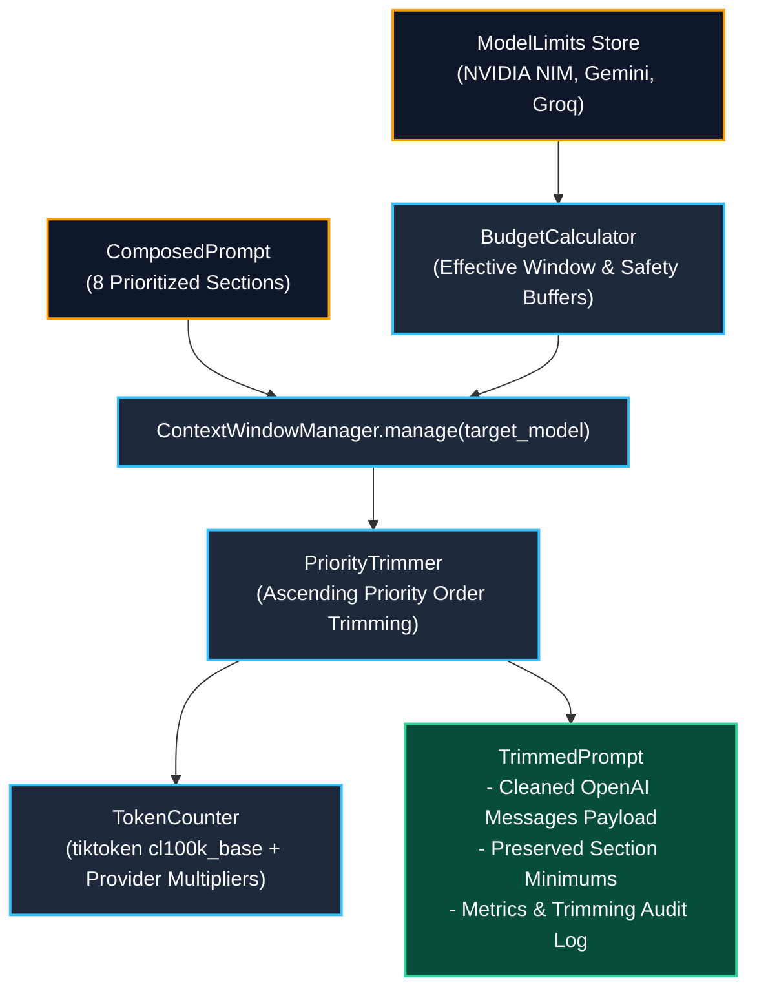

# Context Window Manager (Phase 14) Live Testing Results & Architecture

**Service**: GraphGPT LLM Service (`llm-service`)  
**Component**: Context Window Manager (`ContextWindowManager`, `TokenCounter`, `BudgetCalculator`, `PriorityTrimmer`, `TrimmedPrompt`)  
**Status**: Verified Live with Multi-Model Budget Allocation & Ascending Priority Trimming  
**Timestamp**: 2026-08-09  

---

## 1. Context Window Manager Architecture

The Context Window Manager sits immediately after prompt composition and before provider adapter generation:



---

## 2. Model Limits & Token Budget Allocation

| Target Model | Provider | Context Window | Reserved Output | 5% Safety Margin | Effective Input Budget |
| :--- | :--- | :--- | :--- | :--- | :--- |
| **`meta/llama-3.1-405b-instruct`** | NVIDIA | **131,072** tokens | 4,096 tokens | 6,554 tokens | **120,422 tokens** |
| **`meta/llama-3.1-70b-instruct`** | NVIDIA | **131,072** tokens | 4,096 tokens | 6,554 tokens | **120,422 tokens** |
| **`gemini-1.5-pro`** | Gemini | **2,097,152** tokens | 8,192 tokens | 104,858 tokens | **1,984,102 tokens** |
| **`gemini-1.5-flash`** | Gemini | **1,048,576** tokens | 8,192 tokens | 52,429 tokens | **987,955 tokens** |
| **`llama-3.3-70b-versatile`** | Groq | **131,072** tokens | 4,096 tokens | 6,554 tokens | **120,422 tokens** |

---

## 3. Priority Trimming Verification Trace

During live verification ([scripts/test_live_context_window_manager.py](file:///c:/Users/hp/Desktop/Granthan/llm-service/scripts/test_live_context_window_manager.py)), a 585-token composed prompt was submitted with a 350-token strict budget limit:

```text
Original Composed Prompt: 585 tokens across 8 sections.
Target Budget: 350 tokens (Excess = 235 tokens)

[Step 1] Priority 5 'graph_context' trimmed: 41 tokens -> 0 tokens (Fully trimmed)
[Step 2] Priority 5 'retrieval' trimmed: 231 tokens -> 37 tokens (194 tokens trimmed)
[Result] Total tokens reduced to 350 tokens. Higher priority sections (Memory, Tool Results, Draft Content, History, Query, System) preserved!
```

### Section Breakdown After Trimming

| # | Section Name | Priority | Original Tokens | Final Tokens | Status | Minimum Floor |
| :--- | :--- | :--- | :--- | :--- | :--- | :--- |
| **1** | `system` | **10 / 10** | 87 | **87** | **LOCKED** | Full |
| **2** | `long_term_memory` | **7 / 10** | 46 | **46** | **PRESERVED** | 100 tokens min |
| **3** | `retrieval` | **5 / 10** | 231 | **37** | **TRIMMED** | 0 tokens min |
| **4** | `tool_results` | **6 / 10** | 75 | **75** | **PRESERVED** | 50 tokens min |
| **5** | `draft_content` | **9 / 10** | 47 | **47** | **PRESERVED** | 200 tokens min |
| **6** | `conversation_history` | **8 / 10** | 40 | **40** | **PRESERVED** | 200 tokens min |
| **7** | `user_query` | **10 / 10** | 18 | **18** | **LOCKED** | Full |
| **Total** | — | — | **585** | **350** | **BUDGET ENFORCED** | — |

---

## 4. Context Overflow Guard

When tested against an impossible 100-token budget:
- Minimum locked sections required **288 tokens**.
- `PriorityTrimmer` correctly raised `ContextOverflowError: Cannot fit prompt within token budget (100) even after maximum trimming. Locked sections require 288 tokens.`, protecting downstream providers from malformed truncated calls.

---

## 5. Verification Summary

- **94 / 94 Unit & Integration Tests Passing** (`pytest -v`).
- **0 AST Import Boundary Violations**.
- **Full Dependency Injection & Prometheus Token Metric Tracking**.
