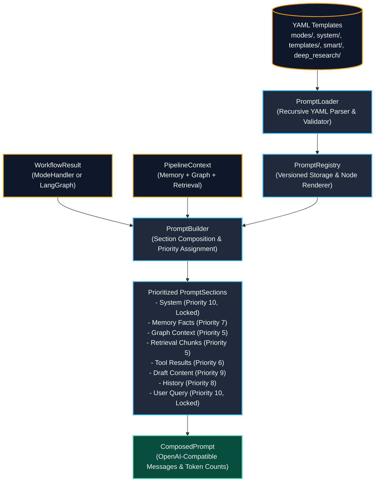

# Prompt Engine (Phase 13) Live Testing Results & Architecture

**Service**: GraphGPT LLM Service (`llm-service`)  
**Component**: Prompt Engine (`PromptLoader`, `PromptRegistry`, `PromptBuilder`, `ComposedPrompt`)  
**Status**: Verified Live with Multi-Section Prioritized Token Composition  
**Timestamp**: 2026-08-09  

---

## 1. Prompt Engine Architecture Diagram

The Prompt Engine serves as the unified prompt composition gateway for all 7 modes across both execution engines:



---

## 2. Live Verification Trace & Section Token Breakdown

During live testing ([scripts/test_live_prompt_engine.py](file:///c:/Users/hp/Desktop/Granthan/llm-service/scripts/test_live_prompt_engine.py)), `PromptBuilder` constructed a rich 8-section prompt incorporating user memory facts, knowledge graph relations, vector retrieval chunks, live tool findings, and LangGraph synthesized draft content:

### 2.1 Section Priority & Trimmability Hierarchy

| # | Section Name | Priority | Token Count | Trimmability Status | Content Description |
| :--- | :--- | :--- | :--- | :--- | :--- |
| **1** | `system` | **10 / 10** | 87 | **LOCKED (NEVER TRIMMED)** | Persona, instructions, and user identity profile |
| **2** | `long_term_memory` | **7 / 10** | 46 | **TRIMMABLE** | Extracted long-term memory facts & preferences |
| **3** | `graph_context` | **5 / 10** | 35 | **TRIMMABLE** | Knowledge graph entities & relations (`LionOptimizer --[accelerates]--> VisionTransformer`) |
| **4** | `retrieval` | **5 / 10** | 45 | **TRIMMABLE** | Retrieved document chunks (`vit_benchmarks.pdf`) |
| **5** | `tool_results` | **6 / 10** | 60 | **TRIMMABLE** | Live web search results from ArXiv paper |
| **6** | `draft_content` | **9 / 10** | 51 | **TRIMMABLE** | LangGraph agentic reasoning draft |
| **7** | `conversation_history` | **8 / 10** | 27 | **TRIMMABLE** | Multi-turn short term conversation |
| **8** | `user_query` | **10 / 10** | 20 | **LOCKED (NEVER TRIMMED)** | Current user prompt inquiry |
| **Total** | **All 8 Sections** | — | **371 Tokens** | — | **Fully Composed Payload** |

---

## 3. Final OpenAI-Compatible Payload Output

```json
{
  "messages": [
    {
      "role": "system",
      "content": "You are GraphGPT operating in Smart mode, an autonomous reasoning and agentic synthesis engine.\nYou receive synthesized multi-step findings, tool executions, and knowledge graphs to deliver comprehensive, deeply grounded solutions.\n\nDirectives:\n- Deliver exhaustive, highly accurate, and multidimensional responses.\n- Seamlessly weave together empirical data, theoretical models, code structures, and cited facts.\n- Ground conclusions in the synthesized evidence provided by the agentic loop."
    },
    {
      "role": "user",
      "content": "## What I Know About You (Long-term Facts)\n- User is a Senior Machine Learning Engineer (Confidence: 0.98)\n- Prefers PyTorch over JAX (Confidence: 0.95)\n\n## Knowledge Graph Relationships\nEntities:\n- VisionTransformer (ModelArchitecture)\n- LionOptimizer (Optimizer)\nRelationships:\n- LionOptimizer --[accelerates]--> VisionTransformer\n\n## Retrieved Document Context\n[1] (Source: vit_benchmarks.pdf) Lion optimizer achieves 0.4% higher top-1 accuracy on ViT-B/16 with 50% lower optimizer state memory.\n\n## Live Tool Execution Results\n- Tool `web_search` (1 sources retrieved):\n  * [ARXIV] [Symbolic Discovery of Optimization Algorithms](http://arxiv.org/abs/2302.06675): EvoLved Sign Momentum (Lion) discovered by program search.\n\n## Synthesized Evidence & Analysis\n### Empirical Synthesis: AdamW vs. Lion\n- Lion requires tracking only first-moment momentum, cutting memory in half.\n- Update rule uses sign(momentum), imparting strong regularization for large batch sizes.\n\n## Recent Conversation History\nUser: Can you help me optimize my deep learning model?\nAssistant: Certainly! Which architecture are you training?\n\n## Current User Message\nProvide the architectural and mathematical trade-offs of switching from AdamW to Lion."
    }
  ]
}
```

---

## 4. Verification Summary

- **89 / 89 Unit & Integration Tests Passing** (`pytest -v`).
- **0 AST Import Boundary Violations**.
- **All 7 Modes & 6 Graph Node Fragments Loaded & Registered**.
