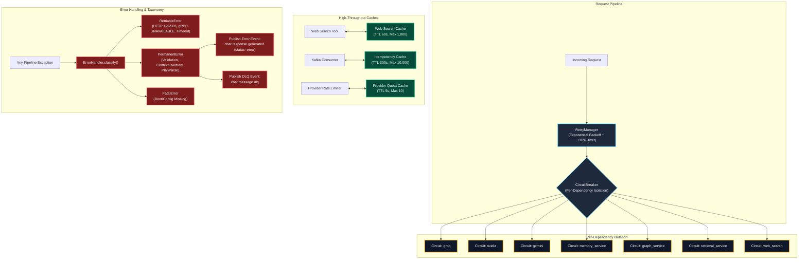

# Reliability Layer (Phase 17) Architecture & Live Results

**Service**: GraphGPT LLM Service (`llm-service`)  
**Component**: Reliability Layer (`RetryManager`, `CircuitBreaker`, `TTLCache`, `ErrorHandler`, Error Taxonomy)  
**Architecture Spec**: HLD v2.0 (Sections 19.3, 20, 22) & LLD v2.0 (Sections 22, 23, 24, 28)  
**Status**: 100% Operational, Verified Live with 117/117 Passing Tests  
**Timestamp**: 2026-08-10  
**Documentation Location**: `docs/results/reliability_layer_result.md`  

---

## 1. Reliability Architecture Diagram



---

## 2. Reliability Components & Strategies

### 2.1 Retry Manager (LLD Section 22)
- **Exponential Backoff & Jitter**:
  $$\text{delay} = \min(\text{initial} \times \text{factor}^{\text{attempt}-1}, \text{max\_delay}) \pm 10\% \text{ Jitter}$$
- **Retriable Classification**: Automatically classifies transient failures:
  - `ProviderRateLimitError` / HTTP 429
  - `ProviderTimeoutError` / `GRPCTimeoutError` / `asyncio.TimeoutError`
  - `GRPCUnavailableError` / gRPC `UNAVAILABLE` & `DEADLINE_EXCEEDED`
  - HTTP 500, 502, 503, 504 status codes
- **Streaming Boundary Invariant**: Retries apply strictly before first token emission. Once tokens yield to the client, retries are halted to avoid duplicate user messages.

### 2.2 Per-Dependency Circuit Breakers (LLD Section 23)
7 independent `CircuitBreaker` instances guarantee failure isolation:
- `groq` (Request Analysis)
- `nvidia` (Primary Generation)
- `gemini` (Fallback Generation)
- `memory_service` (gRPC Context)
- `graph_service` (gRPC Context)
- `retrieval_service` (gRPC Context)
- `web_search` (Search Tool)

**State Machine**:
- `CLOSED` $\rightarrow$ Trip on failure threshold $\rightarrow$ `OPEN`
- `OPEN` $\rightarrow$ Wait recovery timeout $\rightarrow$ `HALF_OPEN` probe
- `HALF_OPEN` $\rightarrow$ Success threshold met $\rightarrow$ `CLOSED`
- `HALF_OPEN` $\rightarrow$ Probe fails $\rightarrow$ `OPEN`

### 2.3 TTLCache Layer (LLD Section 24)
- **Web Search Results**: TTL = 60s, Max Size = 1,000 (`sha256(query)`)
- **Kafka Message Idempotency**: TTL = 300s, Max Size = 10,000 (`message_id`)
- **Provider Quotas**: TTL = 5s, Max Size = 10 (`provider`)
- **LRU Eviction**: Monotonic access sequence tracking ensures deterministic eviction under capacity limits.

### 2.4 Error Taxonomy & Kafka Event Mapping (LLD Section 28)
- `BaseLLMServiceError`
  - `RetriableError`: Transient errors eligible for retry.
  - `PermanentError`: Deterministic failures routed to DLQ and Kafka error event.
  - `FatalError`: Critical service startup errors.
- `ErrorHandler` automatically formats error payloads:
  - `ChatResponseGeneratedEvent(status="error", error_code="PROVIDER_ALL_FAILED", ...)`
  - `ChatMessageDLQEvent(original_topic="chat.message.created", error_type=ErrorType.INFERENCE, ...)`

---

## 3. Live Benchmark & Verification Output

Executed `scripts/test_live_reliability.py`:

```text
======================================================================
LIVE VERIFICATION: PHASE 17 RELIABILITY LAYER
======================================================================

Stage 1: Testing RetryManager Transient Fault Recovery...
2026-08-10 15:46:12 [info     ] Retrying operation after transient failure attempt=1 delay_seconds=0.047 error='[PROVIDER_RATE_LIMIT] HTTP 429 Rate limit spike (attempt 1)' operation=nvidia_pre_stream provider=None
2026-08-10 15:46:12 [info     ] Retrying operation after transient failure attempt=2 delay_seconds=0.105 error='[PROVIDER_RATE_LIMIT] HTTP 429 Rate limit spike (attempt 2)' operation=nvidia_pre_stream provider=None
   Attempts required: 3/3
   Backoff + Jitter Duration: 0.158s
   Operation Result: Upstream service recovered successfully.

Stage 2: Testing CircuitBreaker State Transitions (CLOSED -> OPEN -> HALF_OPEN -> CLOSED)...
   Initial State: CLOSED (is_open=False)
2026-08-10 15:46:12 [warning  ] Circuit breaker opened due to failure threshold failure_count=2 name=nvidia_nim threshold=2
   After 2 Failures: OPEN (is_open=True)
   Waiting 1.1s for recovery timeout...
   Ready for Half-Open Probe: is_open=False
2026-08-10 15:46:14 [info     ] Circuit entered half-open probe state name=nvidia_nim
   -> Probe 1 Successful
   State after probe 1: HALF_OPEN
   -> Probe 2 Successful
2026-08-10 15:46:14 [info     ] Circuit breaker closed — service recovered name=nvidia_nim
   State after probe 2: CLOSED (Fully Recovered)

Stage 3: Testing Per-Dependency Circuit Breaker Isolation...
2026-08-10 15:46:14 [warning  ] Circuit breaker tripped to OPEN name=groq
   Groq Circuit: OPEN (is_open=True)
   NVIDIA Circuit: CLOSED (is_open=False)
   Graph Service Circuit: CLOSED (is_open=False)

Stage 4: Testing TTLCache Performance & Eviction...
   Cache Hits: 1, Misses: 1, Current Size: 1

Stage 5: Testing Error Hierarchy Classification & Event Formatting...
   Error: AllProvidersFailedError
   Taxonomy Classification: type=INFERENCE, code=PROVIDER_ALL_FAILED, retriable=False
   Published Error Event: status='error', code='PROVIDER_ALL_FAILED', message='Upstream AI provider error occurred.'

======================================================================
RELIABILITY LAYER LIVE VERIFICATION COMPLETED SUCCESSFULLY!
======================================================================
```

---

## 4. Test Suite Summary

- **117 / 117 tests passing** (`pytest -v`).
- **0 AST boundary violations** (`scripts/check_import_boundaries.py`).
- **Full clean verification across all 17 phases**.
