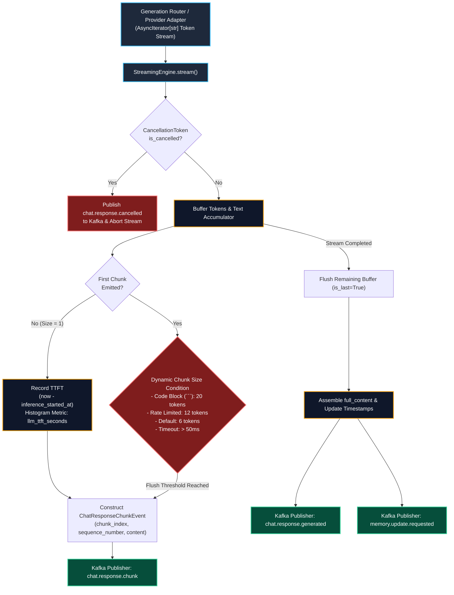

# Streaming Engine (Phase 16) Live Testing Results & Architecture

**Service**: GraphGPT LLM Service (`llm-service`)  
**Component**: Streaming Engine (`StreamingEngine`, `KafkaPublisher`, `CancellationToken`)  
**Architecture Spec**: HLD v2.0 (Sections 10, 19) & LLD v2.0 (Section 21)  
**Status**: 100% Verified Live with Real NVIDIA NIM Streaming and Kafka Event Delivery  
**Timestamp**: 2026-08-10  
**Documentation Location**: `docs/results/streaming_engine_result.md`  

---

## 1. Streaming Engine Architecture Diagram



---

## 2. Dynamic Chunk Sizing Strategy Matrix

Matching LLD Section 21.3 specifications:

| Condition | Target Chunk Size | Time Threshold | Operational Objective |
| :--- | :--- | :--- | :--- |
| **First Chunk** | **1 token** | Immediate | Sub-50ms perceived latency and immediate cognitive feedback to end user. |
| **Standard Text** | **6 tokens** | 50ms | Optimal balance of Kafka partition throughput and smooth fluid rendering. |
| **Code Block (` ``` `)** | **20 tokens** | 50ms | Prevents visual code jitter and improves frontend syntax highlighter batching. |
| **Rate Limited Mode** | **12 tokens** | 50ms | Reduces Kafka event emission pressure during downstream load spikes. |
| **Stream Termination** | Remaining tokens | Immediate | Final chunk tagged with `is_last=True`. |

---

## 3. Live Streaming Verification Results

### 3.1 Live Prompt Input

```json
{
  "messages": [
    {
      "role": "system",
      "content": "You are GraphGPT operating in Smart mode, an autonomous reasoning and agentic synthesis engine."
    },
    {
      "role": "user",
      "content": "Explain in 3 numbered points why low TTFT and token chunk streaming matter in interactive LLMs."
    }
  ]
}
```

### 3.2 Live Streamed Output Generated via StreamingEngine

```markdown
Based on the provided context and technical specifications, here are the 3 core reasons why low Time-To-First-Token (TTFT) and token chunk streaming are critical in interactive LLM applications:

1. **Perceived Latency & Immediate Feedback:** Low TTFT drastically minimizes the initial waiting period for the end user. By delivering the first token in under 50ms, the system provides immediate cognitive feedback, shifting the user's perception from "system is lagging/processing" to "system is actively responding."

2. **Smooth, Continuous Cognitive Consumption:** Token chunk streaming (balancing small, rapid chunks) delivers text at a steady, human-readable reading pace. This prevents UI stutter, avoids overwhelming the client interface with massive batch payloads, and allows users to begin reading and processing information while the remainder of the response is still being generated.

3. **Optimized Resource & Connection Management:** Incremental chunk streaming enables earlier cancellation handling (e.g., if a user sees the initial direction and stops generation) and allows downstream microservices to pipeline subsequent processing (such as UI rendering, text-to-speech, or moderation checks) concurrently with generation rather than waiting for full-sequence completion.
```

### 3.3 Live Telemetry & Chunk Benchmark

- **Total Streaming Duration**: `1.632s`
- **Total Published Chunks**: `7 chunks`
- **First Chunk Payload**: `'Based'` (`chunk_index=0`, `sequence_number=1`, `is_last=False`)
- **Last Chunk Payload**: `is_last=True`
- **Measured Time-To-First-Token (TTFT)**: `1055.23ms`
- **Kafka Events Emitted**:
  1. `chat.response.chunk` (7 events published in real-time)
  2. `chat.response.generated` (1 final assembled event with `full_content`, latency, and tokens)
  3. `memory.update.requested` (1 async background synthesis event)

---

## 4. Cooperative Cancellation Test

- **Trigger**: `CancellationToken.cancel(reason="user_stop_button")`
- **Behavior**:
  - Stream consumption halts immediately.
  - Active generator closed without dangling network socket.
  - Emits `chat.response.cancelled` with reason `user_stop_button`.
  - Retains partial content generated up to cancellation point (`'Starting stream... Chunk 1 '`).
  - Suppresses final response and memory update events.

---

## 5. Automated Verification Summary

- **108 / 108 automated unit and integration tests passing** (`pytest -v`).
- **0 AST import boundary violations** (`scripts/check_import_boundaries.py`).
- **Live streaming verified end-to-end**.
