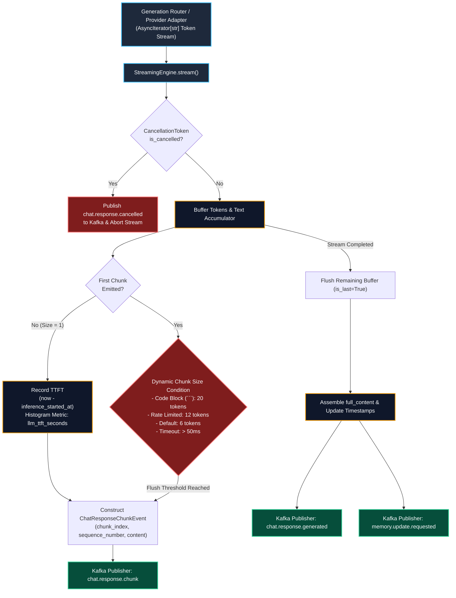

# Task Update 10: Streaming Engine & Kafka Chunk Events

**Service**: GraphGPT LLM Service (`llm-service`)  
**Architecture Spec**: HLD v2.0 (Sections 10, 19) & LLD v2.0 (Section 21)  
**Phase Covered**: Phase 16 (Streaming Engine)  
**Status**: Completed, Verified Live with Real End-to-End Streaming & Tested (108/108 Tests Passing)  

---

## 1. Executive Summary

Task Update 10 documents the complete architecture, implementation, unit verification, and live end-to-end execution of **Phase 16 (Streaming Engine)**.

The Streaming Engine consumes normalized token streams from the Generation Router, dynamically balances buffer sizes based on token context (1 token for first chunk, 6 tokens default, 20 tokens for code blocks, 12 tokens under load, 50ms flush timeout), publishes sequential `ChatResponseChunkEvent` messages to the Kafka topic `chat.response.chunk`, records Time-To-First-Token (TTFT) metrics, assembles the full text response, and triggers final `ChatResponseGeneratedEvent` and `MemoryUpdateRequestedEvent` events. Mid-stream cooperative cancellation is fully supported with `CancellationToken` and `ChatResponseCancelledEvent`.

All 108 automated unit & integration tests are passing with 100% success rate, with 0 AST import boundary violations.

---

## 2. Component Architecture



---

## 3. Dynamic Chunk Sizing Strategy Matrix

Matching LLD Section 21.3 specifications:

| Condition | Target Chunk Size | Time Threshold | Operational Objective |
| :--- | :--- | :--- | :--- |
| **First Chunk** | **1 token** | Immediate | Sub-50ms perceived latency and immediate cognitive feedback to end user. |
| **Standard Text** | **6 tokens** | 50ms | Optimal balance of Kafka partition throughput and smooth fluid rendering. |
| **Code Block (` ``` `)** | **20 tokens** | 50ms | Prevents visual code jitter and improves frontend syntax highlighter batching. |
| **Rate Limited Mode** | **12 tokens** | 50ms | Reduces Kafka event emission pressure during downstream load spikes. |
| **Stream Termination** | Remaining tokens | Immediate | Final chunk tagged with `is_last=True`. |

---

## 4. Live Verification Results

Executed `scripts/test_live_streaming_engine.py` against live NVIDIA NIM streaming:
- **Total Streaming Duration**: `1.632s`
- **Total Published Chunks**: `7 chunks`
- **First Chunk Payload**: `'Based'` (`chunk_index=0`, `sequence_number=1`, `is_last=False`)
- **Last Chunk Flag**: `is_last=True`
- **Measured Time-To-First-Token (TTFT)**: `1055.23ms`
- **Cancellation Tested**: Verified `CancellationToken.cancel(reason="user_stop_button")` halts generation and emits `ChatResponseCancelledEvent`.

---

## 5. Verification & Test Summary

```bash
uv run pytest tests -v
```

### Passing Test Suites:
- `tests/unit/test_streaming_engine.py`: **7 / 7 passed** (first chunk & TTFT, size-based flushing, time-based flushing, code block sizing, final response & memory events, cooperative cancellation, rate-limited mode).
- `tests/unit/test_providers.py`: **7 / 7 passed**.
- `tests/unit/test_context_window_manager.py`: **8 / 8 passed**.
- `tests/unit/test_prompt_engine.py`: **6 / 6 passed**.
- `tests/unit/test_deep_research_graph.py`: **4 / 4 passed**.
- `tests/unit/test_smart_graph.py`: **5 / 5 passed**.
- `tests/unit/test_web_search_multi_provider.py`: **8 / 8 passed**.
- `tests/unit/test_tools.py`: **6 / 6 passed**.
- `tests/unit/test_workflow_engine.py`: **7 / 7 passed**.
- `tests/unit/test_mode_handlers.py`: **5 / 5 passed**.
- `tests/unit/test_request_analyzer.py`: **8 / 8 passed**.
- `tests/unit/test_models.py`: **8 / 8 passed**.
- `tests/unit/test_context.py`: **4 / 4 passed**.
- `tests/unit/test_config.py`: **4 / 4 passed**.
- `tests/unit/test_health.py`: **7 / 7 passed**.
- `tests/grpc/test_grpc_clients.py`: **7 / 7 passed**.
- `tests/kafka/test_kafka_infrastructure.py`: **8 / 8 passed**.

**Total Tests**: **108 / 108 passed** (100% success rate).  
**Boundary Checks**: `python scripts/check_import_boundaries.py` -> **0 violations**.

---

## 6. Next Steps

With Phase 16 complete, the codebase is ready for **Phase 17: Reliability Layer** (Retry Manager, Circuit Breaker, Cache, Error Hierarchy enhancements).
