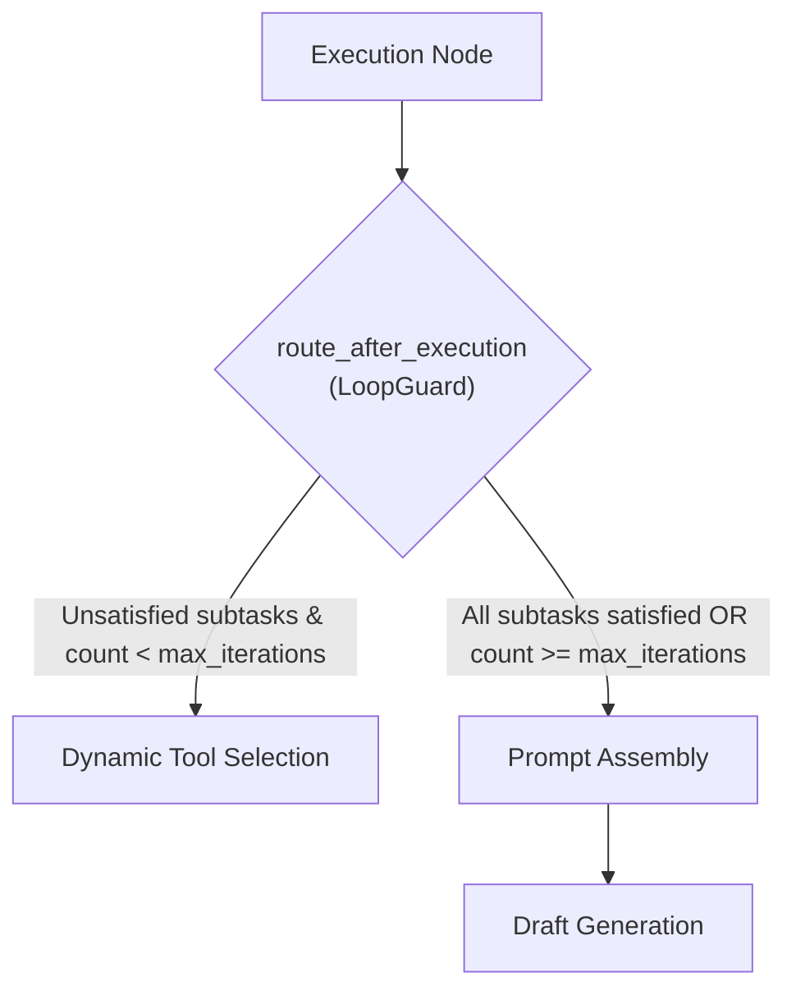

# Task Update 5: SmartGraph Agentic LangGraph Workflow Engine

**Service**: GraphGPT LLM Service (`llm-service`)  
**Architecture Spec**: HLD v2.0 (Sections 12, 14) & LLD v2.0 (Sections 13, 14)  
**Phase Covered**: Phase 11 (Smart Graph)  
**Status**: Completed, Verified Live, and Fully Tested  

---

## 1. Executive Summary

Task Update 5 documents the implementation, unit verification, and live end-to-end integration of **Phase 11 (Smart Graph)**.

SmartGraph provides the dynamic, multi-step agentic execution engine used for complex user requests in `smart` mode. Modeled after modern agentic reasoning pipelines (similar to ChatGPT Search/Smart Mode), SmartGraph autonomously decomposes high-level user inquiries into discrete sub-goals, dynamically schedules and dispatches tool calls (e.g. multi-source web search across 7 free providers), collects live grounding evidence in parallel, guards against runaway execution loops via `LoopGuard`, and synthesizes a grounded response draft.

All 79 automated tests across the service are passing, and live execution against real internet data has been successfully verified.

---

## 2. SmartGraph State & Node Architecture

SmartGraph is built using `langgraph.graph.StateGraph` in `app/workflow_engine/langgraph_workflows/smart/` and compiled into an asynchronous runnable.

### 2.1 State Schema (`SmartGraphState`)

The state schema in `app/workflow_engine/langgraph_workflows/smart/state.py` defines:
- **Identity & Context**: `conversation_id`, `user_id`, `request_id`, `mode="smart"`, `user_message`, `context_bundle`, `conversation_history`.
- **Planner Output**: `sub_tasks: list[SubTask]`, `satisfied_sub_tasks: Annotated[list[str], operator.add]`.
- **Tool Execution Accumulators**: `tool_results: Annotated[list[ToolResult], operator.add]`, `next_tool_call: ToolCall | None`.
- **Iteration Limits & Terminal Output**: `loop_iteration_count: int`, `max_iterations: int`, `draft_response: str | None`.

### 2.2 Node Responsibilities

1. **`planner` (`nodes.py`)**:
   - Analyzes incoming user messages and baseline context.
   - Dynamically decomposes complex questions into actionable `SubTask` items requiring factual lookup or deep reasoning.
   - Initializes iteration counters.

2. **`dynamic_tool_selection` (`nodes.py`)**:
   - Inspects the list of subtasks against `satisfied_sub_tasks`.
   - If unsatisfied tasks remain, generates a parameterized `ToolCall` targeting the appropriate tool (e.g. `web_search`).
   - If all subtasks are satisfied, emits `next_tool_call = None`.

3. **`execution` (`nodes.py`)**:
   - Asynchronously dispatches the tool call through `ToolDispatcher`.
   - Records execution latency and appends the new `ToolResult` to the state.
   - Marks the corresponding `sub_task_id` as satisfied and increments `loop_iteration_count`.

4. **`prompt` (`nodes.py`)**:
   - Assembles an intermediate grounded context prompt merging user query details with all accumulated tool findings.

5. **`generation` (`nodes.py`)**:
   - Synthesizes the draft grounded response and records Prometheus metric `llm_langgraph_loop_iterations`.

---

## 3. Loop Guard & Conditional Edge Routing

To prevent runaway agentic loops (HLD Section 12.2 and Section 31.2), SmartGraph employs `LoopGuard` at the `route_after_execution` conditional edge:



- **Forced Termination**: If `loop_iteration_count >= max_iterations`, `LoopGuard` logs a warning, increments the Prometheus counter `llm_langgraph_loop_capped_total`, and forces routing to `prompt` to synthesize with whatever findings were collected.
- **Normal Termination**: When all subtasks are satisfied, the graph cleanly advances to `prompt`.

---

## 4. Live Real-Situation Integration Results

Live integration testing was conducted via `scripts/test_live_smart_graph.py` with a real complex prompt:
`"What are the latest breakthrough algorithms in quantum computing?"`

### 4.1 Chronological Execution Trace
1. **Dispatch**: Routed via `ModeDispatcher` (`engine_type="langgraph"`).
2. **Planning**: Created subtask targeting quantum computing algorithms.
3. **Tool Selection**: Scheduled `web_search` tool call.
4. **Execution**: Dispatched concurrent search across 7 providers; retrieved live answers from DuckDuckGo, Wikipedia, and ArXiv papers within 2.95s.
5. **Loop Guard**: Verified task satisfaction; routed to prompt assembly.
6. **Synthesis**: Produced normalized `WorkflowResult` with draft response and 3 domain-deduplicated grounding sources.

---

## 5. Verification & Test Summary

```bash
uv run pytest tests -v
```

### Passing Test Suites:
- `tests/unit/test_smart_graph.py`: 5/5 tests passing (LoopGuard logic, route_after_execution, individual node execution, end-to-end ainvoke, and ModeDispatcher routing).
- `tests/unit/test_web_search_multi_provider.py`: 8/8 tests passing.
- `tests/unit/test_tools.py`: 6/6 tests passing.
- `tests/unit/test_workflow_engine.py`: 7/7 tests passing.
- `tests/unit/test_mode_handlers.py`: 5/5 tests passing.
- `tests/unit/test_request_analyzer.py`: 8/8 tests passing.
- `tests/unit/test_models.py`: 8/8 tests passing.
- `tests/unit/test_context.py`: 4/4 tests passing.
- `tests/unit/test_config.py`: 4/4 tests passing.
- `tests/unit/test_health.py`: 7/7 tests passing.
- `tests/grpc/test_grpc_clients.py`: 7/7 tests passing.
- `tests/kafka/test_kafka_infrastructure.py`: 8/8 tests passing.

**Total Tests**: **79 / 79 passed** (100% success rate).  
**Boundary Checks**: `python scripts/check_import_boundaries.py` -> **0 violations**.

---

## 6. Next Steps

With Phase 11 (Smart Graph) complete, the codebase is ready for **Phase 12: Deep Research Mode LangGraph** (`DeepResearchGraphBuilder`, subtask branching, recursive research loop, and structured report synthesis).
