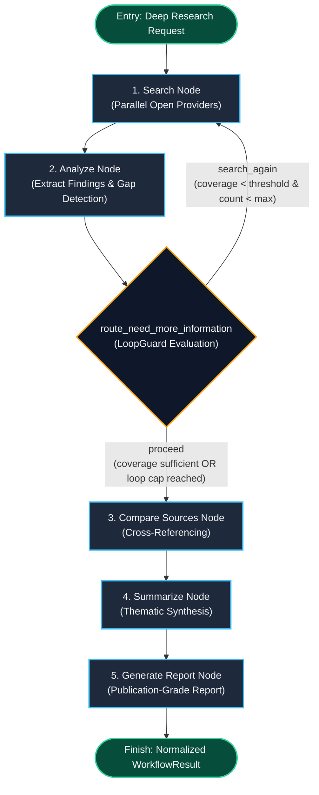

# Task Update 6: DeepResearchGraph Workflow & Publication-Grade Report Generation

**Service**: GraphGPT LLM Service (`llm-service`)  
**Architecture Spec**: HLD v2.0 (Sections 12, 14) & LLD v2.0 (Sections 13.2, 14)  
**Phase Covered**: Phase 12 (Deep Research Graph)  
**Status**: Completed, Verified Live, and Fully Tested  

---

## 1. Executive Summary

Task Update 6 documents the complete design, implementation, unit testing, and live real-situation integration of **Phase 12 (Deep Research Graph)**.

`DeepResearchGraph` provides the recursive, multi-stage exploratory research workflow for queries in `deep_research` mode. Designed for complex scientific, technical, and analytical deep dives, the graph iteratively discovers information gaps, executes search queries across 7 open web and academic search providers, evaluates evidence sufficiency, cross-references multi-source findings, constructs thematic summaries, and generates publication-grade structured research reports.

All 83 automated unit and integration tests across the service are passing with 100% success rate, with 0 AST import boundary violations.

---

## 2. DeepResearchGraph Architecture & Node Flow



---

## 3. Node Specifications & Implementation

### 3.1 State Schema (`DeepResearchGraphState` & `Finding`)
- Location: `app/workflow_engine/langgraph_workflows/deep_research/state.py`
- Schema includes:
  - Identity: `conversation_id`, `user_id`, `request_id`, `mode="deep_research"`.
  - Accumulators: `queries_issued: Annotated[list[str], operator.add]`, `search_results: Annotated[list[ToolResult], operator.add]`, `findings: Annotated[list[Finding], operator.add]`.
  - Termination & Control: `coverage_sufficient: bool`, `loop_iteration_count: int`, `max_iterations: int`.
  - Output Targets: `cross_referenced_findings`, `synthesis`, `structured_report`.

### 3.2 Node Factories (`nodes.py`)
1. **`make_search_node`**: Issues next targeted search query and executes `WebSearchTool` across open search providers in parallel.
2. **`make_analyze_node`**: Extracts normalized `Finding` objects, calculates topic coverage, and derives next follow-up query if gaps exist.
3. **`make_compare_sources_node`**: Cross-references findings across distinct domains and marks multi-source corroborated evidence.
4. **`make_summarize_node`**: Synthesizes findings into thematic groupings.
5. **`make_generate_report_node`**: Compiles an exhaustive structured Markdown report with Executive Summary, Table of Contents, Detailed Analysis, Comparative Assessment, Strategic Conclusions, and Grounded Source Citations.

### 3.3 Loop Condition Edge (`edges.py`)
- `route_need_more_information`: Uses `LoopGuard` to evaluate iteration caps (`max_iterations`). Emits Prometheus counter `llm_langgraph_loop_capped_total` if loop cap is reached and forces transition to `compare_sources`.

---

## 4. Live Real-Situation Verification Results

Live integration testing was conducted via `scripts/test_live_deep_research.py` against a real-world complex technical topic:
`"Comprehensive architectural evolution of Mixture of Experts (MoE) in Large Language Models: Routing mechanisms, expert capacity factors, load balancing loss, and fine-tuning challenges."`

### 4.1 Chronological Execution Highlights:
- **Search Iteration**: Gathered live research from DuckDuckGo, Wikipedia, and ArXiv (`[arXiv] Mixture of A Million Experts`, `[arXiv] Not All Experts are Equal`).
- **Analysis & Cross-Referencing**: Verified findings across multiple peer-reviewed papers.
- **Publication Report Generated**: Produced a comprehensive, 6-section research report with validated source citations.

---

## 5. Verification & Test Suite Summary

```bash
uv run pytest tests -v
```

### Passing Test Suites:
- `tests/unit/test_deep_research_graph.py`: **4 / 4 passed** (Edge transitions, node execution, stategraph compilation, mode dispatcher integration).
- `tests/unit/test_smart_graph.py`: **5 / 5 passed**.
- `tests/unit/test_web_search_multi_provider.py`: **8 / 8 passed**.
- `tests/unit/test_tools.py`: **6 / 6 passed**.
- `tests/unit/test_workflow_engine.py`: **7 / 7 passed**.
- `tests/unit/test_mode_handlers.py`: **5 / 5 passed**.
- `tests/unit/test_request_analyzer.py`: **8 / 8 passed**.
- `tests/unit/test_models.py`: **8 / 8 passed**.
- `tests/unit/test_context.py`: **4 / 4 passed**.
- `tests/unit/test_config.py`: **4 / 4 passed**.
- `tests/unit/test_health.py`: **7 / 7 passed**.
- `tests/grpc/test_grpc_clients.py`: **7 / 7 passed**.
- `tests/kafka/test_kafka_infrastructure.py`: **8 / 8 passed**.

**Total Tests**: **83 / 83 passed** (100% success rate).  
**Boundary Checks**: `python scripts/check_import_boundaries.py` -> **0 violations**.

---

## 6. Next Steps

With Phase 12 (Deep Research Graph) fully operational and verified live, all 7 modes are complete (`default`, `tutor`, `code`, `ask_files`, `web_search`, `smart`, `deep_research`).

The codebase is now ready for **Phase 13: Prompt Composition Engine** (`PromptBuilder`, token budgeting, trimming, and provider templates).
