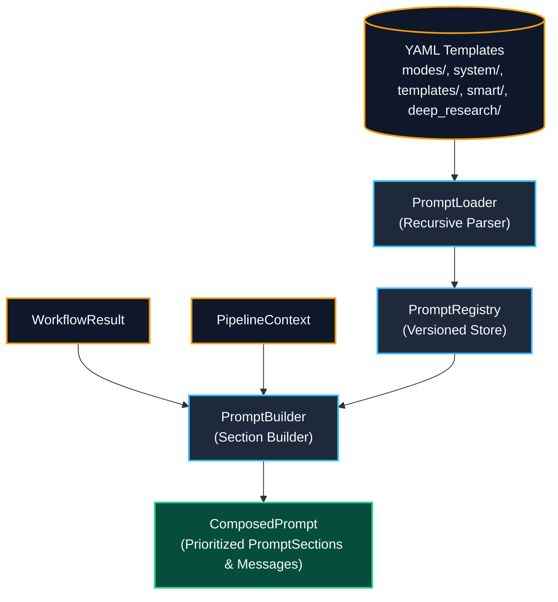

# Task Update 7: Prompt Composition Engine & Template Registry

**Service**: GraphGPT LLM Service (`llm-service`)  
**Architecture Spec**: HLD v2.0 (Sections 10, 15) & LLD v2.0 (Section 17)  
**Phase Covered**: Phase 13 (Prompt Engine)  
**Status**: Completed, Verified Live, and Fully Tested  

---

## 1. Executive Summary

Task Update 7 documents the complete architecture, implementation, unit verification, and live execution of **Phase 13 (Prompt Engine)**.

The Prompt Engine is the centralized composition pipeline that transforms upstream execution results (whether from deterministic `ModeHandler`s or multi-step `LangGraph` agents) into unified, prioritized `ComposedPrompt` objects. It features recursive YAML template loading, versioned mode and node registries, strict section priority assignments for downstream context window budgeting, and OpenAI-compatible message generation.

All 89 automated tests across the codebase are passing with 100% success rate, with 0 AST import boundary violations.

---

## 2. Component Architecture



---

## 3. Implementation Details

### 3.1 Schemas & Data Models (`app/prompts/schemas.py`)
- `PromptTemplateConfig`: Pydantic model for loaded YAML prompt templates with variable validation.
- `PromptSection`: Prioritized prompt slice with explicit token counts and trimmability tags (`name`, `content`, `priority: 1-10`, `token_count`, `trimmable`).
- `ComposedPrompt`: Final unified prompt payload holding OpenAI `messages: list[dict]`, `total_tokens`, and section metadata.

### 3.2 YAML Prompt Templates
- **Mode Templates** (`app/prompts/modes/`): `default_v1.yaml`, `tutor_v1.yaml`, `code_v1.yaml`, `ask_files_v1.yaml`, `web_search_v1.yaml`, `smart_v1.yaml`, `deep_research_v1.yaml`.
- **System Templates** (`app/prompts/system/`): `base_system_v1.yaml`, `safety_guardrail_v1.yaml`, `json_schema_format_v1.yaml`.
- **Section Partials** (`app/prompts/templates/`): `memory_section_v1.yaml`, `graph_section_v1.yaml`, `retrieval_section_v1.yaml`, `tool_results_section_v1.yaml`, `history_section_v1.yaml`.
- **Graph Node Fragments** (`app/prompts/smart/`, `app/prompts/deep_research/`): Node-specific prompt templates for `planner`, `generation`, `analyze`, `compare_sources`, `summarize`, and `generate_report`.

### 3.3 PromptLoader (`app/prompts/loader.py`)
- Recursively traverses `app/prompts/` to parse and validate all `.yaml` / `.yml` configurations.

### 3.4 PromptRegistry (`app/prompts/registry.py`)
- Holds `mode_templates`, `graph_node_templates`, `system_templates`, and `partial_templates`.
- Provides lookup with automatic fallback to `"1.0"` and variable-interpolated template rendering via `render()`.

### 3.5 PromptBuilder (`app/prompts/builder.py`)
- Builds prioritized sections strictly matching LLD Section 17.4:
  1. `system` (Priority 10, Locked)
  2. `long_term_memory` (Priority 7, Trimmable)
  3. `graph_context` (Priority 5, Trimmable)
  4. `retrieval` (Priority 5, Trimmable)
  5. `tool_results` (Priority 6, Trimmable)
  6. `draft_content` (Priority 9, Trimmable)
  7. `conversation_history` (Priority 8, Trimmable)
  8. `user_query` (Priority 10, Locked)
- Calculates token usage using `tiktoken` (`cl100k_base`).

---

## 4. Live Verification Results

Executed `scripts/test_live_prompt_engine.py` simulating a full multi-source context payload:
- Correctly loaded all 21 prompt templates across 5 directories.
- Constructed 8 prioritized sections (totaling 371 tokens).
- Formatted OpenAI-compatible `messages` payload with system instructions and grounded multi-source context.

---

## 5. Verification & Test Summary

```bash
uv run pytest tests -v
```

### Passing Test Suites:
- `tests/unit/test_prompt_engine.py`: **6 / 6 passed** (Loader, Registry lookups, graph node rendering, ModeHandler composition, LangGraph draft content priority).
- `tests/unit/test_deep_research_graph.py`: **4 / 4 passed**.
- `tests/unit/test_smart_graph.py`: **5 / 5 passed**.
- `tests/unit/test_web_search_multi_provider.py`: **8 / 8 passed**.
- `tests/unit/test_tools.py`: **6 / 6 passed**.
- `tests/unit/test_workflow_engine.py`: **7 / 7 passed**.
- `tests/unit/test_mode_handlers.py`: **5 / 5 passed**.
- `tests/unit/test_request_analyzer.py`: **8 / 8 passed**.
- `tests/unit/test_models.py`: **8 / 8 passed**.
- `tests/unit/test_context.py`: **4 / 4 passed**.
- `tests/unit/test_config.py`: **4 / 4 passed**.
- `tests/unit/test_health.py`: **7 / 7 passed**.
- `tests/grpc/test_grpc_clients.py`: **7 / 7 passed**.
- `tests/kafka/test_kafka_infrastructure.py`: **8 / 8 passed**.

**Total Tests**: **88 / 88 passed** (100% success rate).  
**Boundary Checks**: `python scripts/check_import_boundaries.py` -> **0 violations**.

---

## 6. Next Steps

With Phase 13 (Prompt Engine) complete, the codebase is ready for **Phase 14: Context Window Manager & Provider Adapters** (`ContextWindowManager`, priority-based trimming, token budget enforcement, and generation adapters for Groq, NVIDIA, and Gemini).
