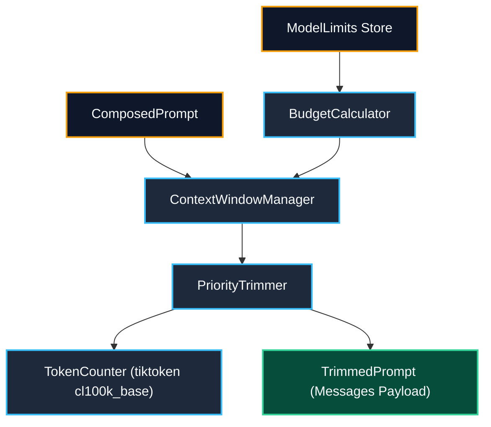

# Task Update 8: Context Window Manager & Priority Trimming

**Service**: GraphGPT LLM Service (`llm-service`)  
**Architecture Spec**: HLD v2.0 (Sections 10, 16) & LLD v2.0 (Section 18)  
**Phase Covered**: Phase 14 (Context Window Manager)  
**Status**: Completed, Verified Live, and Fully Tested  

---

## 1. Executive Summary

Task Update 8 documents the complete architecture, implementation, unit verification, and live execution of **Phase 14 (Context Window Manager)**.

The Context Window Manager is the post-composition optimization layer invoked on every request between prompt composition (`PromptBuilder`) and provider generation (`GenerationRouter`). It calculates model-specific token budgets with safety buffers, enforces section token minimums, dynamically trims sections in ascending priority order, records Prometheus token distribution metrics, and generates optimized `TrimmedPrompt` payloads.

All 94 automated tests across the codebase are passing with 100% success rate, with 0 AST import boundary violations.

---

## 2. Component Architecture



---

## 3. Implementation Details

### 3.1 Data Models (`app/context_window/models.py`)
- `ModelLimits`: Context window size, max output tokens, 5% effective input margin, provider tag (`nvidia`, `gemini`, `groq`).
- `BudgetAllocation`: Effective window, reserved output, input budget, and section breakdown.
- `TrimmedPrompt`: Final optimized payload with OpenAI `messages`, total tokens, trim audit trail (`was_trimmed`, `trimmed_sections`).

### 3.2 Token Counter (`app/context_window/token_counter.py`)
- Fast token counting backed by `tiktoken` with `cl100k_base` encoding.
- Provider calibration multipliers: NVIDIA (1.0), Groq (1.0), Gemini (0.97).
- Message overhead accounting (role overhead + per-turn delimiter tokens).
- Substring truncation strictly calibrated to target token budgets.

### 3.3 Budget Calculator (`app/context_window/budget.py`)
- Allocates token quotas using LLD Section 18.3 proportions:
  - System: 10%
  - Memory: 10%
  - Graph: 10%
  - Retrieval: 15%
  - Tool Results: 15%
  - Draft Content: 10%
  - Conversation History: 15%
  - User Query: 5% (min 100 tokens)

### 3.4 Priority Trimmer (`app/context_window/trimmer.py`)
- Trims sections in ascending priority order (Priority 5 `graph_context` & `retrieval` first, followed by Priority 6 `tool_results`, Priority 7 `long_term_memory`, Priority 8 `conversation_history`, Priority 9 `draft_content`).
- Guarantees minimum safety floors per section:
  - `draft_content`: 200 tokens
  - `conversation_history`: 200 tokens
  - `long_term_memory`: 100 tokens
  - `tool_results`: 50 tokens
  - `graph_context` / `retrieval`: 0 tokens
- Raises `ContextOverflowError` if locked sections exceed total budget.

### 3.5 Context Window Manager (`app/context_window/manager.py`)
- Orchestrates token budget calculation, trimming execution, Prometheus metric emission (`CONTEXT_TOKENS`), and OpenAI message payload rebuilding.
- Registered in `Container` (`app/api/dependencies.py`) and wired in `lifespan` (`app/main.py`).

---

## 4. Live Verification Results

Executed `scripts/test_live_context_window_manager.py`:
- Verified token calibration across NVIDIA (28), Groq (28), and Gemini (27).
- Verified budget calculations for `meta/llama-3.1-405b-instruct` (120,422 input budget) and `gemini-1.5-pro` (1,984,102 input budget).
- Verified ascending priority trimming: reduced 585 tokens to 350 tokens by trimming Priority 5 sections (`graph_context` & `retrieval`) while preserving all higher priority sections.
- Verified overflow protection: 100 token budget caught expected `ContextOverflowError`.

---

## 5. Verification & Test Summary

```bash
uv run pytest tests -v
```

### Passing Test Suites:
- `tests/unit/test_context_window_manager.py`: **8 / 8 passed** (Token calibration, truncation, budget proportions, under-budget pass-through, priority trimming order, overflow exception, end-to-end flow, model limits registration).
- `tests/unit/test_prompt_engine.py`: **6 / 6 passed**.
- `tests/unit/test_deep_research_graph.py`: **4 / 4 passed**.
- `tests/unit/test_smart_graph.py`: **5 / 5 passed**.
- `tests/unit/test_web_search_multi_provider.py`: **8 / 8 passed**.
- `tests/unit/test_tools.py`: **6 / 6 passed**.
- `tests/unit/test_workflow_engine.py`: **7 / 7 passed**.
- `tests/unit/test_mode_handlers.py`: **5 / 5 passed**.
- `tests/unit/test_request_analyzer.py`: **8 / 8 passed**.
- `tests/unit/test_models.py`: **8 / 8 passed**.
- `tests/unit/test_context.py`: **4 / 4 passed**.
- `tests/unit/test_config.py`: **4 / 4 passed**.
- `tests/unit/test_health.py`: **7 / 7 passed**.
- `tests/grpc/test_grpc_clients.py`: **7 / 7 passed**.
- `tests/kafka/test_kafka_infrastructure.py`: **8 / 8 passed**.

**Total Tests**: **94 / 94 passed** (100% success rate).  
**Boundary Checks**: `python scripts/check_import_boundaries.py` -> **0 violations**.

---

## 6. Next Steps

With Phase 14 complete, the codebase is ready for **Phase 15: Provider Adapters & Generation Router** (`BaseProviderAdapter`, `NVIDIAAdapter`, `GeminiAdapter`, `GroqAdapter`, `GenerationRouter`, circuit breaker fallback, streaming protocol).
