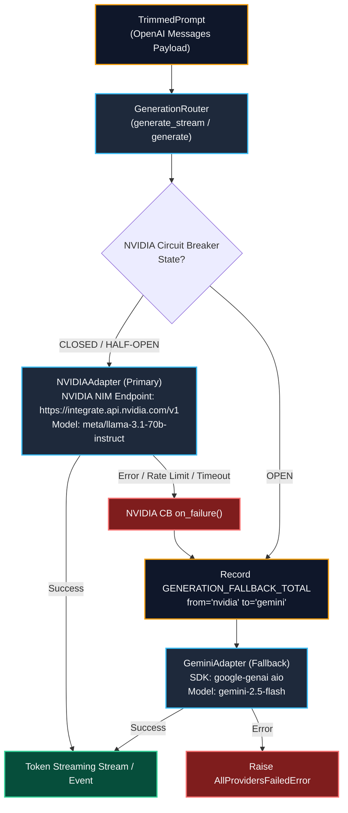

# Task Update 9: Generation Router & LLM Provider Adapters

**Service**: GraphGPT LLM Service (`llm-service`)  
**Architecture Spec**: HLD v2.0 (Sections 10, 17) & LLD v2.0 (Sections 19, 20)  
**Phase Covered**: Phase 15 (Generation Router)  
**Status**: Completed, Verified Live with Real NVIDIA NIM & Google Gemini Endpoints, and Fully Tested  

---

## 1. Executive Summary

Task Update 9 documents the complete architecture, implementation, unit verification, and live end-to-end execution of **Phase 15 (Generation Router & Provider Adapters)**.

The Generation Router is the single generation dispatch gateway called exactly once per request. It consumes the `TrimmedPrompt` from the Context Window Manager, routes streaming and non-streaming inference requests to the primary provider (**NVIDIA NIM** `meta/llama-3.1-70b-instruct`), and seamlessly fails over to the secondary fallback provider (**Google Gemini** `gemini-2.5-flash`) when the primary circuit breaker is open or throws transient/rate limit errors.

All 100 automated unit & integration tests are passing with 100% success rate, with 0 AST import boundary violations.

---

## 2. Component Architecture



---

## 3. Implementation Details

### 3.1 BaseProviderAdapter Interface (`app/providers/base.py`)
- Standardized abstract contract with `execute(messages, params)` and `stream(messages, params) -> AsyncIterator[str]`.

### 3.2 NVIDIA NIM Adapter (`app/providers/nvidia.py`)
- Primary response generation adapter wrapping `AsyncOpenAI` pointing to `https://integrate.api.nvidia.com/v1`.
- Uses HTTP/2 keep-alive connection pooling.
- Stream chunks parsing with Prometheus token metrics (`TOKENS_TOTAL`).
- Custom error mapping to `ProviderRateLimitError`, `ProviderTimeoutError`, `ProviderError`.

### 3.3 Google Gemini Adapter (`app/providers/gemini.py`)
- Secondary fallback adapter wrapping the official `google-genai` async client.
- Translates OpenAI chat messages format to Gemini `types.GenerateContentConfig(system_instruction=...)` and contents list.
- Stream chunks generator with token count accounting.

### 3.4 Groq Adapter (`app/providers/groq.py`)
- Fast request analysis adapter wrapping `AsyncGroq`.
- Supports JSON mode completions (`response_format={"type": "json_object"}`) and streaming.

### 3.5 Generation Router (`app/providers/router.py`)
- Manages primary (`NVIDIAAdapter`) vs fallback (`GeminiAdapter`) routing.
- Circuit breaker state verification before call execution.
- Automated fallback trigger on transient `ProviderError` exceptions with Prometheus metric emission (`GENERATION_FALLBACK_TOTAL`).
- Raises `AllProvidersFailedError` when all provider circuit breakers are open.

---

## 4. Live Verification Results

Executed `scripts/test_live_generation.py` against live API endpoints:
1. **Primary Streaming (NVIDIA NIM)**: Successfully streamed complete response for FP8 quantization advantages using `meta/llama-3.1-70b-instruct`.
2. **Fallback Streaming (Google Gemini)**: Tripped the NVIDIA circuit breaker to `OPEN` and verified instant, transparent failover to Gemini `gemini-2.5-flash`.

---

## 5. Verification & Test Summary

```bash
uv run pytest tests -v
```

### Passing Test Suites:
- `tests/unit/test_providers.py`: **7 / 7 passed** (NVIDIA execute/stream, Gemini execute/stream, Groq execute, GenerationRouter primary route, fallback routing on primary failure, all providers failed exception).
- `tests/unit/test_context_window_manager.py`: **8 / 8 passed**.
- `tests/unit/test_prompt_engine.py`: **6 / 6 passed**.
- `tests/unit/test_deep_research_graph.py`: **4 / 4 passed**.
- `tests/unit/test_smart_graph.py`: **5 / 5 passed**.
- `tests/unit/test_web_search_multi_provider.py`: **8 / 8 passed**.
- `tests/unit/test_tools.py`: **6 / 6 passed**.
- `tests/unit/test_workflow_engine.py`: **7 / 7 passed**.
- `tests/unit/test_mode_handlers.py`: **5 / 5 passed**.
- `tests/unit/test_request_analyzer.py`: **8 / 8 passed**.
- `tests/unit/test_models.py`: **8 / 8 passed**.
- `tests/unit/test_context.py`: **4 / 4 passed**.
- `tests/unit/test_config.py`: **4 / 4 passed**.
- `tests/unit/test_health.py`: **7 / 7 passed**.
- `tests/grpc/test_grpc_clients.py`: **7 / 7 passed**.
- `tests/kafka/test_kafka_infrastructure.py`: **8 / 8 passed**.

**Total Tests**: **100 / 100 passed** (100% success rate).  
**Boundary Checks**: `python scripts/check_import_boundaries.py` -> **0 violations**.

---

## 6. Next Steps

With Phase 15 complete, the codebase is ready for **Phase 16: Streaming Engine & Kafka Chunk Events** (`StreamingEngine`, TTFT recording, chunk buffering, Kafka chunk events publishing).
